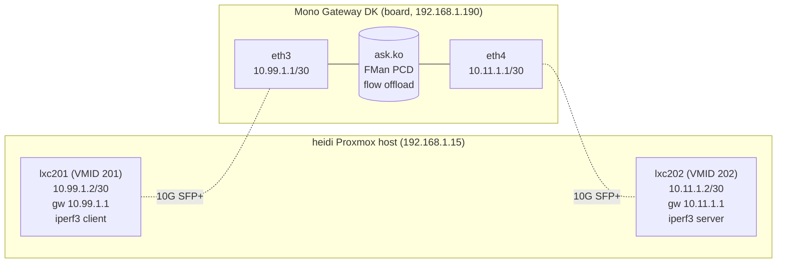

# Dev-Test Loop: Fast Iteration for VyOS LS1046A
**Version 1.0.0** · VyOS LS1046A Build · 2026-06-21 · HADS 1.0.0

---

## AI READING INSTRUCTION

Read `[SPEC]` and `[BUG]` blocks for authoritative facts about the dev-test loop topology, build times, commands, boot configuration, and kernel config requirements. Read `[NOTE]` blocks for rationale, history, and narrative explaining why the infrastructure is set up this way. `[?]` blocks are unverified — treat with lower confidence.

---

## 1. Status and Goal

**[SPEC]**
Status: WORKING (Cobalt 100 build host, verified 2026-05-14).
Goal: reduce dev-test cycle from ~60–90 min down to ~3 min (kernel) / ~30 s (DTB/config).

**[NOTE]**
Waiting an hour to test a one-line config change is not engineering.

---

## 2. Network Topology

**[SPEC]**

```
Cobalt 100 Azure ARM64 VM "arm64-runner" (Debian 12, native aarch64, 32 cores, 125 GB RAM)
  ├── /home/vyos/vyos-ls1046a-build/  ← this repo (build + edit here)
  ├── work/linux-6.18.28/             ← staged kernel tree
  ├── work/dev-tftp/                  ← local rsync staging area
  ├── native arm64 gcc + ccache
  ├── Azure NIC 10.0.0.4, Tailscale 100.125.95.22 (reaches LAN via subnet route)
  └── bin/dev-build.sh kernel|dtb|extract|iso-live → rsync → LXC 200

LXC 200 "vyos-builder" (Ubuntu 22.04, 192.168.1.137, on the LAN)
  ├── /srv/tftp/             → vmlinuz, mono-gw.dtb, initrd.img, filesystem.squashfs
  ├── tftpd-hpa on UDP/69    → serves vmlinuz/initrd/dtb to U-Boot
  └── python http.server :8080 → serves filesystem.squashfs to live-boot fetch=
     (NB: no toolchain, no kernel tree — pure serving relay)

Mono Gateway (LS1046A, 4× Cortex-A72, 8 GB DDR4)
  ├── fm1-mac5 (rightmost RJ45) → U-Boot TFTP, static IP 192.168.1.200
  ├── eth0 (left RJ45) MGMT 192.168.1.190 → SSH from the VM via Tailscale
  ├── eMMC: mmcblk0p3 = VyOS root
  └── U-Boot 2025.04: dev_boot → TFTP from 192.168.1.137 (LXC 200)
```

**[NOTE]**
All development happens on the Cobalt 100 ARM64 VM, edited locally (VS Code Remote-SSH or local CLI). Build artefacts are rsync'd to LXC 200 over Tailscale; the board only ever talks to LXC 200 on the LAN. LXC 200 has been decommissioned as a build host — it serves files and nothing else.

**[SPEC]**
Serial console to the Mono Gateway is via PuTTY/minicom (115200 8N1) from any machine with USB access. Most iteration cycles need only SSH to `vyos@192.168.1.190`.

---

## 3. Verified Iteration Times

**[SPEC]**

| Change Type | Before (CI+USB) | LXC 200 cross-build | Cobalt 100 native | Method |
|-------------|-----------------|---------------------|-------------------|--------|
| Kernel config (`CONFIG_*`) | ~60 min | ~2 min | ~30 s | Native build + rsync → TFTP |
| Full kernel rebuild | ~60 min | ~8 min | ~2–3 min | Native build + rsync → TFTP |
| DTS / DTB only | ~60 min | ~30 s | ~10 s | `bin/ci-compile-mono-dtb.sh` → rsync |
| `config.boot.default` | ~60 min | ~2 min | ~2 min | Edit + `add system image` |
| `vyos-1x` patch | ~60 min | ~25 min | use CI | `gh workflow run` (faster than local) |

---

## 4. Quick Start

### 4.1 Prereqs on Cobalt 100 (already provisioned)

**[SPEC]**
The Cobalt 100 VM ships with everything needed: `aarch64-linux-gnu-gcc`, native `gcc`, `make`, `ccache`, `dtc`, `xorriso`, `rsync`, `ssh`, `git`, `gh`, plus all VyOS-build apt deps. Workspace lives at `/home/vyos/vyos-ls1046a-build/`. `vyos-build/` is already checked out.

First-time SSH check to LXC 200:

```bash
ssh -i ~/.ssh/admin_key admin@192.168.1.137 'echo ok'
```

**[NOTE]**
`admin@192.168.1.137` has passwordless sudo; rsync uses `--rsync-path="sudo rsync"`.

### 4.2 Seed TFTP with initrd from last good ISO (one-time)

**[SPEC]**

```bash
# On Cobalt 100, in the repo root:
bin/dev-build.sh iso-live                  # downloads newest GitHub release ISO,
                                           # extracts kernel/initrd/dtb/squashfs,
                                           # rsyncs to LXC 200:/srv/tftp/
```

### 4.3 Set up U-Boot dev_boot (one-time, from serial console)

**[SPEC]**
Power on Mono Gateway, interrupt U-Boot (`Hit any key`), paste these lines:

```
setenv ethact fm1-mac5
setenv serverip 192.168.1.137
setenv ipaddr 192.168.1.200
setenv bootargs "console=ttyS0,115200 earlycon=uart8250,mmio,0x21c0500 net.ifnames=0 boot=live rootdelay=5 noautologin fsl_dpaa_fman.fsl_fm_max_frm=9600 hugepagesz=2M hugepages=512 panic=60 vyos-union=/boot/2026.03.25-0531-rolling"
setenv dev_boot 'tftp 0xa0000000 vmlinuz; tftp ${fdt_addr_r} mono-gw.dtb; tftp 0xb0000000 initrd.img; booti 0xa0000000 0xb0000000:${filesize} ${fdt_addr_r}'
saveenv
```

**[NOTE]**
`ethact fm1-mac5` forces U-Boot to use the rightmost RJ45 port for TFTP. Without this, U-Boot may default to an SFP port (fm1-mac9) which cannot do TFTP with copper SFP-10G-T modules (no U-Boot RTL8261 driver).

**[BUG] vyos-union must match installed image**
- Symptom: board boots wrong squashfs or fails to find overlay
- Cause: `vyos-union=/boot/<IMAGE>` in bootargs references a non-existent or stale image name
- Fix: check with `ls mmc 0:3 /boot/` in U-Boot or `show system image` in VyOS; update after `add system image` with `setenv bootargs "... vyos-union=/boot/NEW_IMAGE_NAME"` then `saveenv`

**[BUG] DTB address must use ${fdt_addr_r} not 0x90000000**
- Symptom: `ERROR: Did not find a cmdline Flattened Device Tree`
- Cause: DTB loaded to `0x90000000` which is `kernel_comp_addr_r` — the kernel decompression workspace. Kernel decompresses from `0xa0000000` to `0x0` using `0x90000000` as scratch, corrupting any DTB loaded there.
- Fix: use `${fdt_addr_r}` (0x88000000) for DTB.

### 4.4 Dev iteration cycle (the fast path)

**[SPEC]**

```bash
# On Cobalt 100, in the repo root:
bin/dev-build.sh kernel    # stage + native build + rsync to LXC 200 TFTP
# or:
bin/dev-build.sh dtb       # DTB only (~10 s)
```

```bash
# Trigger a reboot over SSH (no serial console needed for routine cycles):
ssh vyos sudo reboot
```

**[NOTE]**
U-Boot SPI env is pre-set to `run dev_boot` at power-on, so the board TFTPs the new vmlinuz/DTB/initrd from LXC 200 automatically. ~30–45 s wall-clock to login prompt on the new kernel.

---

## 5. TFTP Live Boot (no USB, no eMMC required)

**[SPEC]**
Status: WORKING (verified 2026-04-18).
Use when: iterating on full ISO changes (vyos-1x patches, package selection, initramfs, config defaults) without flashing USB or touching eMMC.

**[NOTE]**
`dev_boot` above mounts the squashfs from eMMC (`vyos-union=/boot/<IMAGE>`) — so it still depends on an `install image` having happened once, and you cannot test changes to the squashfs itself. `dev_boot_live` fixes that: kernel+initrd come via TFTP, the squashfs streams over HTTP into tmpfs at initrd time. Exactly the same boot path as USB live boot, but over the network.

### 5.1 Deploy the live artifacts (from Cobalt 100)

**[SPEC]**

```bash
cd /home/vyos/vyos-ls1046a-build
bin/dev-build.sh iso-live                          # auto-downloads the newest GitHub release
# or pass an explicit ISO path to use a local build:
bin/dev-build.sh iso-live /tmp/vyos-<version>-LS1046A-arm64.iso
```

**[NOTE]**
With no argument, `iso-live` queries `gh release view --repo mihakralj/vyos-ls1046a-build` for the newest `*-LS1046A-arm64.iso` asset and downloads it to `/tmp/` on the Cobalt VM (skipping if the same file is already there — matched by name). This guarantees you are testing the exact ISO that was just published to GitHub.

**[SPEC]**
It then extracts `live/filesystem.squashfs` (~515 MB), `live/vmlinuz`, `live/initrd.img`, and `/mono-gw.dtb` from the ISO into `work/dev-tftp/` on the Cobalt VM, and rsyncs them to `admin@192.168.1.137:/srv/tftp/` over Tailscale (using `--rsync-path="sudo rsync"` because /srv/tftp is root-owned).

**[NOTE]**
LXC 200 runs a Python `http.server` on port 8080 in the background, serving `/srv/tftp/filesystem.squashfs` over HTTP — live-boot's `fetch=` does not support TFTP. That HTTP server stays put across migrations; only the artefact source changes.

**[SPEC]**
Verify:

```bash
curl -sI http://192.168.1.137:8080/filesystem.squashfs | head -3
# HTTP/1.0 200 OK
# Content-Length: 539877376
```

### 5.2 Set up dev_boot_live U-Boot env (one-time, from serial console)

**[SPEC]**
The cmdline is a byte-for-byte mirror of the USB `boot.cmd` in the repo, with exactly two substitutions:

| USB (`boot.cmd`) | TFTP live (`dev_boot_live`) |
|------------------|-----------------------------|
| `usb start; fatload usb 0:2 …; usb stop` | `tftp …` (same file contents, same memory addresses) |
| *(squashfs found on the USB medium by live-boot)* | `fetch=http://192.168.1.137:8080/filesystem.squashfs` (squashfs comes from HTTP instead) |

**[NOTE]**
Everything else — `rootdelay=10`, `usbcore.autosuspend=-1`, `components noeject nopersistence noautologin nonetworking union=overlay`, `fsl_dpaa_fman.fsl_fm_max_frm=9600` — is identical so the live-boot initramfs, vyos-router, and every service run the same code path as a real USB boot. This is the whole point: you test USB boot behaviour over TFTP.

**[SPEC]**

```
setenv dev_boot_live 'tftp ${kernel_addr_r} vmlinuz; tftp ${fdt_addr_r} mono-gw.dtb; tftp ${ramdisk_addr_r} initrd.img; setenv bootargs console=ttyS0,115200 earlycon=uart8250,mmio,0x21c0500 boot=live rootdelay=10 components noeject nopersistence noautologin nonetworking union=overlay net.ifnames=0 fsl_dpaa_fman.fsl_fm_max_frm=9600 usbcore.autosuspend=-1 fetch=http://192.168.1.137:8080/filesystem.squashfs; booti ${kernel_addr_r} ${ramdisk_addr_r}:${filesize} ${fdt_addr_r}'
saveenv
```

**[NOTE]**
The three files pulled over TFTP (`vmlinuz`, `initrd.img`, `mono-gw.dtb`) and the squashfs pulled over HTTP are the exact same bytes that live on the ISO and on a `dd`'d USB stick — `bin/dev-build.sh iso-live` extracts them directly from `live/` inside the ISO via `xorriso` without modification.

**[NOTE]**
Why HTTP not TFTP for the squashfs? live-boot's `fetch=` supports only `http://`, `ftp://`, and `file:` — not TFTP. Also, TFTP is UDP block-by-block — 515 MB over 512-byte blocks would be painful. HTTP on GbE pulls the squashfs in ~5–10 s.

**[NOTE]**
Why no `panic=60`? `boot.cmd` does not set it and we want bit-identical behaviour. If your config.boot adds new MANAGED_PARAMS, add them to both `boot.cmd` and `dev_boot_live` together.

### 5.3 Boot

**[SPEC]**

```
run dev_boot_live
```

**[NOTE]**
Boot sequence (same code paths as USB, different medium):

1. U-Boot pulls `vmlinuz` (10 MB) + `mono-gw.dtb` (35 KB) + `initrd.img` (32 MB) over TFTP → ~3 s (USB `fatload` ~2 s — comparable)
2. `booti` decompresses and jumps into the kernel — same kernel binary as USB
3. Kernel mounts `initrd.img`, runs live-boot init — same initrd as USB
4. live-boot sees `fetch=` instead of a block-device medium → pulls the 515 MB squashfs over HTTP into `/run/live/medium/` → ~8 s on GbE (USB reads it lazily from sda)
5. Overlay mounts over tmpfs — same squashfs contents as USB, same `/etc`, same vyos-router, same `config.boot.default`
6. systemd reaches `multi-user.target`, login prompt on ttyS0 — same services, same timing

Anything you would see on a real USB boot you will see here: vyos-router messages, migration scripts, DPAA1 probe order, PHY/SFP detection, fan thermal binding, systemd unit failures. The only differences visible in the boot log are the early TFTP/HTTP fetch lines and the absence of `usb-storage`/`sda` probes.

**[SPEC]**
Total: similar to USB live boot (~90 s including DPAA1 init), but every iteration is:

```bash
# After CI publishes a new release (watch it with `gh run watch`):
bin/dev-build.sh iso-live
# Power-cycle the board (or `ssh vyos sudo reboot`), interrupt U-Boot:
run dev_boot_live
```

No USB flashing, no `install image`, no `add system image`, no manually downloading the ISO.

### 5.4 When to use which

**[SPEC]**

| Scenario | Use |
|----------|-----|
| Kernel / DTB / kernel config change | `dev_boot` (squashfs unchanged, boots in ~26 s + kexec) |
| ISO content change (vyos-1x patch, package list, initramfs, config.boot.default) | `dev_boot_live` (always picks up latest squashfs) |
| Post-install behaviour / `install image` / eMMC boot path | USB stick + manual `install image` |

### 5.5 Limitations

**[SPEC]**
- The Mono Gateway must reach LXC 200 at 192.168.1.137:8080 on the rightmost RJ45 (fm1-mac5) before live-boot runs. If the network cable is unplugged, `fetch=` hangs in initramfs with `wget: download timed out`.
- tmpfs uses RAM. 515 MB squashfs + overlay scratch fits comfortably in 8 GB DDR4, but don't try `apt install` of gigabytes of packages — you'll run out of tmpfs.
- `nonetworking` is set (matches USB) so vyos-router will not configure interfaces. Remove `nonetworking` from the cmdline if you need networking to come up automatically.

---

## 6. Boot Flow (TFTP dev)

**[SPEC]**

```
U-Boot
  └── run dev_boot
        ├── tftp 0xa0000000 vmlinuz      (TFTP kernel from LXC 200 /srv/tftp/)
        ├── tftp ${fdt_addr_r} mono-gw.dtb  (TFTP DTB to 0x88000000)
        ├── tftp 0xb0000000 initrd.img   (TFTP initrd, loaded LAST for ${filesize})
        └── booti 0xa0000000 0xb0000000:${filesize} ${fdt_addr_r}
              │
              ├── [T+0 → T+26s] TFTP kernel 6.18.x boots
              │   ├── eMMC probes (mmcblk0 p1 p2 p3) at T+1.8s
              │   ├── FMan MACs eth0-eth4 at T+1.5s
              │   ├── squashfs mounted via loop0 at T+7.8s
              │   ├── systemd multi-user at T+17s
              │   └── VyOS Router starts at T+26s
              │
              └── [T+26 → T+82s] Configuration + login prompt
                  ├── Full driver stack (modules available)
                  ├── "Configuration success"
                  └── VyOS login prompt
```

**[BUG] kexec reboot from bootargs mismatch**
- Symptom: board reboots ~70 s after boot with kexec
- Cause: `system_option.py` detects mismatch between U-Boot bootargs and `MANAGED_PARAMS` in config.boot.default (hugepages, panic, mitigations)
- Fix: keep U-Boot bootargs in sync with config.boot.default. If bootargs are missing `hugepagesz=2M hugepages=512 panic=60`, the mismatch triggers kexec. See `system_option.py:generate_cmdline_for_kexec()` for the full list.

---

## 7. Build Modes

**[SPEC]**
All modes run on Cobalt 100 and rsync the result to LXC 200:/srv/tftp/.

| Command | What it does | Time (Cobalt 100 native) |
|---------|-------------|------|
| `bin/dev-build.sh kernel` | Stage + build kernel Image + DTB → push to TFTP | ~30 s incr / ~2–3 min full |
| `bin/dev-build.sh dtb` | Compile `board/dtb/mono-gw.dtb` only → push to TFTP | ~10 s |
| `bin/dev-build.sh extract [iso]` | Extract vmlinuz+initrd+DTB from ISO → push to TFTP | ~10 s |
| `bin/dev-build.sh iso-live [iso]` | Extract kernel+initrd+DTB+squashfs from ISO → push | ~20 s |
| `bin/dev-build.sh push` | Re-rsync `work/dev-tftp/` to LXC 200 (no rebuild) | ~5 s |

All modes build the single flavor-neutral image. Full ISO builds remain on CI (`gh workflow run "VyOS LS1046A build (self-hosted)"`) — they only take ~7 min warm.

---

## 8. Kernel Config: Key Lessons

### 8.1 Fragment Merging (Critical)

**[SPEC]**
VyOS kernel builds require merging 7 config fragments from `vyos-build/scripts/package-build/linux-kernel/config/*.config` on top of `vyos_defconfig`. Without these fragments, SQUASHFS, OVERLAY_FS, FUSE_FS, and 200+ netfilter rules are missing.

```bash
# bin/dev-build.sh wires this automatically (via bin/ci-stage-kernel.sh +
# kernel/common/scripts/stage-kernel.sh):
cp vyos_defconfig .config
cat *.config >> .config          # Append all fragments
make olddefconfig                # Resolve conflicts
scripts/config --set-val X y     # Force LS1046A overrides
```

### 8.2 `--set-val` vs `--enable` (Critical)

**[BUG] scripts/config --enable does NOT upgrade =m to =y**
- Symptom: kernel modules not loaded during TFTP boot (no rootfs for module loading)
- Cause: `scripts/config --enable X` does NOT change `=m` to `=y`. Fragments set many configs to `=m`.
- Fix: use `scripts/config --set-val X y` to force built-in for all required subsystems

**[SPEC]**
Subsystems that MUST be `=y` for TFTP boot:

| Category | Configs |
|----------|---------|
| Filesystems | SQUASHFS, SQUASHFS_XZ, OVERLAY_FS, EXT4_FS, FUSE_FS, JBD2 |
| Block | BLK_DEV_LOOP, BLK_DEV_DM |
| eMMC | MMC, MMC_BLOCK, MMC_SDHCI, MMC_SDHCI_PLTFM, MMC_SDHCI_OF_ESDHC |
| DPAA1 | FSL_FMAN, FSL_DPAA, FSL_DPAA_ETH, FSL_BMAN, FSL_QMAN, FSL_PAMU |
| Netfilter | NF_CONNTRACK, NF_TABLES, NFT_CT, NFT_NAT, NFT_MASQ + 25 more |

### 8.3 VyOS Boot Arguments

**[SPEC]**
VyOS uses `boot=live` even on installed eMMC systems. The required bootargs:

```
console=ttyS0,115200 earlycon=uart8250,mmio,0x21c0500 net.ifnames=0
boot=live rootdelay=5 noautologin vyos-union=/boot/<IMAGE_NAME>
```

- `boot=live` — triggers live-boot initramfs scripts (NOT optional)
- `vyos-union=/boot/<IMAGE>` — points to squashfs on eMMC partition 3
- `rootdelay=5` — wait for eMMC to enumerate before mounting
- `noautologin` — don't auto-login on serial console

---

## 9. Expected Boot Messages (Ignore These)

**[SPEC]**

| Message | Meaning |
|---------|---------|
| `nfct v1.4.7: netlink error: Invalid argument` | Conntrack helper setup — cosmetic, first boot only |
| `could not generate DUID ... failed!` | No stable machine-id on live boot |
| `PCIe: no link / disabled` | No PCIe devices on board |
| `WARNING failed to get smmu node` | DTB lacks SMMU nodes |
| `binfmt_misc.mount` FAILED | No binfmt support needed on target |
| `mount: /live/persistence/ failed` | Non-persistence partitions probed and rejected |
| `sfp-xfi0: deferred probe pending` | SFP ports wait for PHY initialization |
| `can't get pinctrl, bus recovery not supported` | I2C pinctrl not in DTB — harmless |

---

## 10. Files

**[SPEC]**

| File | Purpose |
|------|---------|
| [`bin/dev-build.sh`](../bin/dev-build.sh) | Cobalt 100 dev loop: `kernel`, `dtb`, `extract`, `iso-live`, `push` modes |
| [`bin/local-build.sh`](../bin/local-build.sh) | Full ISO build orchestrator (mirrors CI) |
| [`plans/DEV-LOOP.md`](DEV-LOOP.md) | This document |

---

## 11. Constraints Preserved

**[SPEC]**
- DPAA1 `=y`: All 5 DPAA1 layers forced built-in (never `=m`)
- `booti` only: Same `booti` command, initrd loaded last for `${filesize}`
- `boot=live` + `vyos-union=`: Required in bootargs for VyOS squashfs overlay
- `auto-build.yml` unchanged: GitHub CI remains the signed release pipeline
- Static IP for U-Boot: `ipaddr=192.168.1.200`, `serverip=192.168.1.137` (no DHCP in U-Boot TFTP)

---

## 12. GitHub Actions: Still Used For

**[SPEC]**
- Production releases (signed ISO + minisig)
- Weekly automated builds (cron Friday 01:00 UTC)
- Changelog generation from upstream vyos-1x / vyos-build

**[NOTE]**
The local dev loop is a parallel fast-iteration path, not a replacement for CI. CI produces signed releases. The dev loop produces answers in two minutes.

---

## 13. ASK2 M2 Acceptance-Gate Test Rig

**[SPEC]**
Status: INFRA OPERATIONAL (rebuilt 2026-05-19).
Purpose: measure end-to-end nft-flowtable HW offload (`ask.ko` PR14g+) throughput and board CPU on a topology where the board is the ONLY possible forwarding path between the two test endpoints — no /16 ECMP ambiguity, no upstream router, no NAT.

### 13.1 Topology

**[SPEC]**



Both endpoints are unprivileged Debian 12.12 LXC containers on the heidi Proxmox host. Each /30 is its own connected subnet, so the board's kernel route lookup for the sink IP unambiguously selects the correct egress port — no ECMP, no `ip route get` surprises.

### 13.2 Why this topology

**[NOTE]**
Three previous iterations of the M2 rig failed in subtle ways that the previous "single sink on a /16" topology hid:

1. /16 ECMP ambiguity — when both eth1 (1G RJ45 MGMT) and eth4 (10G SFP+) were on 192.168.1.0/16, kernel route lookup for the sink (192.168.1.137) sometimes picked the 1G port. The flow then capped at ~0.94 Gbps.
2. Sink not reachable — earlier 10.99.2.2 sink configs targeted an IP never assigned to lxc200, so the SYN was silently dropped. M2 measurement ran on a connection that never established offload-eligible traffic.
3. NAT masquerade — earlier setups added `nat source rule N masquerade`. The translation perturbed the 5-tuple after FLOW_BLOCK_BIND so the silicon CC slot never matched the post-NAT packet. ask.ko's HW path silently fell back to SW.

The /30 + no-NAT rebuild removes all three failure modes simultaneously.

### 13.3 Reproducing the infra from scratch

**[SPEC]**

1. Create lxc202 on heidi:
   ```bash
   ssh heidi 'sudo pct create 202 local:vztmpl/debian-12-standard_12.12-1_amd64.tar.zst \
     --hostname lxc202 --cores 4 --memory 2048 --rootfs local-lvm:8 \
     --net0 name=eth0,bridge=vmbr0,ip=10.11.1.2/30,gw=10.11.1.1,hwaddr=BC:24:11:02:02:02 \
     --unprivileged 1 --features nesting=1 --start 1'
   ```

2. Add admin user (mirrors lxc201 layout):
   ```bash
   # see bin/lxc202-setup.sh (idempotent) — useradd admin, sudoers NOPASSWD,
   # echo admin pubkey > /home/admin/.ssh/authorized_keys
   ```

3. Add eth4 IP on board (one-time, persists in config.boot):
   ```bash
   # via vbash batch on the board
   set interfaces ethernet eth4 address 10.11.1.1/30
   set interfaces ethernet eth4 description 'ASK2 gate egress (M2 to lxc202)'
   commit && save
   ```

4. No NAT rules — the L3 forwarding plane carries all traffic unchanged.
5. Install iperf3 on lxc202 (no direct internet without NAT — use `pct push` of `iperf3`, `libiperf0`, `libsctp1` .debs from lxc201's apt cache).
6. `~/.ssh/config` entry on the build VM:
   ```
   Host lxc202
     HostName 10.11.1.2
     User admin
     IdentityFile ~/.ssh/admin_key
     ProxyJump vyos
   ```

### 13.4 Running the gate

**[SPEC]**

```bash
bin/m2-dut-prep.sh                  # remove VyOS notrack, enable hw-tc-offload,
                                    # install ask_offload nft table, verify route
bin/verify-ask-flow-offload.sh      # 30 s iperf3 -P 8 + mpstat → verdict
```

Defaults are baked in: `GEN_HOST=lxc201`, `SINK_HOST=lxc202`, `SINK_IP=10.11.1.2`, `IFACE_IN=eth3`, `IFACE_OUT=eth4`. Override any of them via env var.

### 13.5 M2 reading as of infra rebuild

**[SPEC]**
First clean run on the new infra (2026-05-19): 6.314 Gbps / 65.41 % CPU. Throughput is well above the 2 Gbps threshold; CPU is NOT below 5 %.

**[NOTE]**
The gate currently FAILS not because of the test rig but because the PR14y deferred-insert pending queue never drains (`defer=141, deferred-insert OK=0`) during 8-stream iperf3 cold-start. That's a real `ask.ko` bug now exposed by the working test path — see qdrant entry `ask2-m2-pr14y-broken (2026-05-19)` for the current hypothesis and next steps.
