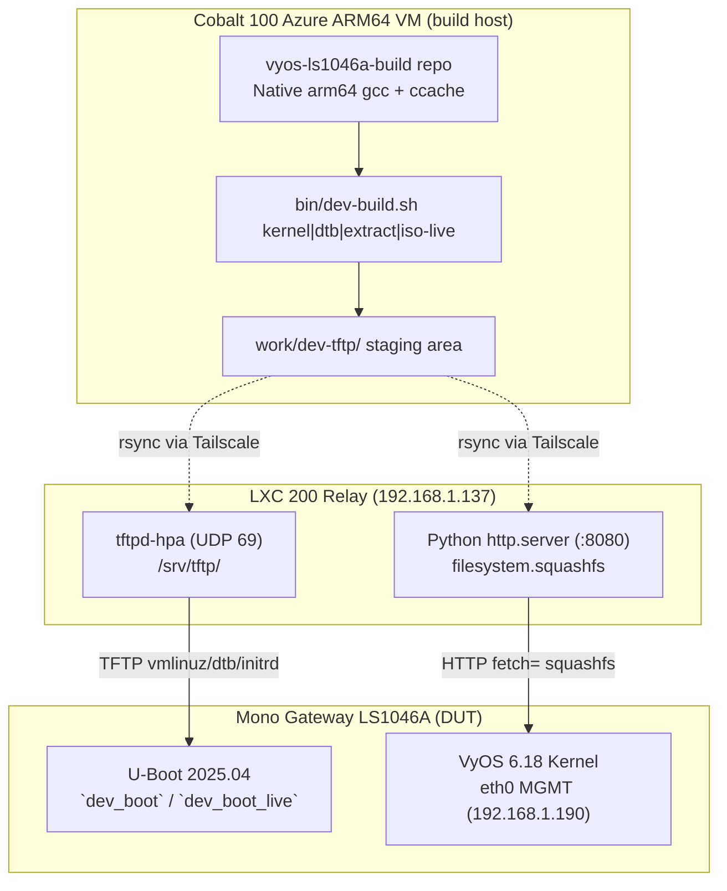

# Dev-Test Loop: Fast Iteration for VyOS LS1046A
**Version 1.1.0** · 2026-07-22 · HADS 1.0.0

---

## AI READING INSTRUCTION

Read `[SPEC]` and `[BUG]` blocks for authoritative facts.
Read `[NOTE]` only if additional context is needed.
`[?]` blocks are unverified — treat with lower confidence.

---

## 1. OVERVIEW & NETWORK TOPOLOGY

**[SPEC]**
- Reduces dev-test iteration cycle from ~60–90 min (full ISO build + flash) down to ~3 min for kernel changes and ~10–30 s for DTB or config changes.
- Development host: Cobalt 100 Azure ARM64 VM (`arm64-runner`, Debian 12, native aarch64, 32 cores, 125 GB RAM).
- Relay host: LXC 200 (`vyos-builder`, 192.168.1.137) serving TFTP/HTTP files on the local network.
- Target device: Mono Gateway DK (NXP LS1046A, 4× Cortex-A72, 8 GB DDR4).


```mermaid
flowchart TD
    subgraph VM["Cobalt 100 Azure ARM64 VM (build host)"]
        BUILD["vyos-ls1046a-build repo\nNative arm64 gcc + ccache"]
        STAGING["work/dev-tftp/ staging area"]
        SCRIPT["bin/dev-build.sh kernel|dtb|extract|iso-live"]
        BUILD --> SCRIPT --> STAGING
    end

    subgraph LXC["LXC 200 Relay (192.168.1.137)"]
        TFTP["tftpd-hpa (UDP 69)\n/srv/tftp/"]
        HTTP["Python http.server (:8080)\nfilesystem.squashfs"]
    end

    subgraph DUT["Mono Gateway LS1046A (DUT)"]
        UBOOT["U-Boot 2025.04\n`dev_boot` / `dev_boot_live`"]
        KERNEL["VyOS 6.18 Kernel\neth0 MGMT (192.168.1.190)"]
    end

    STAGING -.->|rsync via Tailscale| TFTP
    STAGING -.->|rsync via Tailscale| HTTP
    TFTP -->|TFTP vmlinuz/dtb/initrd| UBOOT
    HTTP -->|HTTP fetch= squashfs| KERNEL
```

**[NOTE]**
All development occurs natively on the Cobalt 100 ARM64 VM. Build artifacts are rsync'd to LXC 200 over Tailscale; the board fetches boot files exclusively from LXC 200 on the local GbE network.

---

## 2. ITERATION TIMINGS

**[SPEC]**

| Change Type | CI + USB Flash | LXC 200 Cross-Build | Cobalt 100 Native | Acceleration Method |
|-------------|----------------|---------------------|-------------------|---------------------|
| Kernel config (`CONFIG_*`) | ~60 min | ~2 min | **~30 s** | Native `make` + rsync → TFTP |
| Full kernel rebuild | ~60 min | ~8 min | **~2–3 min** | Native 32-core `make` + rsync → TFTP |
| DTS / DTB only | ~60 min | ~30 s | **~10 s** | `bin/dev-build.sh dtb` → rsync |
| `config.boot.default` | ~60 min | ~2 min | **~2 min** | Edit + `add system image` |
| `vyos-1x` package patch | ~60 min | ~25 min | CI workflow | `gh workflow run` |

---

## 3. QUICK START & PROVISIONING

### 3.1 Prereqs & Host Verification

**[SPEC]**
- Cobalt 100 VM includes pre-installed `aarch64-linux-gnu-gcc`, native `gcc`, `make`, `ccache`, `dtc`, `xorriso`, `rsync`, `git`, `gh`.
- SSH verification from VM to LXC 200:
  ```bash
  ssh -i ~/.ssh/admin_key admin@192.168.1.137 'echo ok'
  ```

### 3.2 Seeding TFTP Relay

**[SPEC]**
- Seed the TFTP relay with kernel and initrd from the latest published ISO:
  ```bash
  bin/dev-build.sh iso-live
  ```

### 3.3 U-Boot `dev_boot` Setup

**[SPEC]**
- Interrupt U-Boot on serial console and set environment variables:
  ```
  setenv ethact fm1-mac5
  setenv serverip 192.168.1.137
  setenv ipaddr 192.168.1.200
  setenv bootargs "console=ttyS0,115200 earlycon=uart8250,mmio,0x21c0500 net.ifnames=0 boot=live rootdelay=5 noautologin fsl_dpaa_fman.fsl_fm_max_frm=9600 hugepagesz=2M hugepages=512 panic=60 vyos-union=/boot/2026.03.25-0531-rolling"
  setenv dev_boot 'tftp 0xa0000000 vmlinuz; tftp ${fdt_addr_r} mono-gw.dtb; tftp 0xb0000000 initrd.img; booti 0xa0000000 0xb0000000:${filesize} ${fdt_addr_r}'
  saveenv
  ```

**[NOTE]**
- `ethact fm1-mac5` forces U-Boot to use the rightmost RJ45 port for TFTP. Copper SFP-10G-T modules cannot run TFTP in U-Boot (no U-Boot RTL8261 PHY driver).
- `vyos-union=/boot/<IMAGE>` must match the installed VyOS image directory on eMMC partition 3.

**[BUG] DTB address corruption causing boot failure**
- Symptom: `ERROR: Did not find a cmdline Flattened Device Tree` during U-Boot kernel boot.
- Cause: DTB loaded at `0x90000000` (`kernel_comp_addr_r`). The kernel decompression engine uses `0x90000000` as scratch space, overwriting the DTB.
- Fix: Always load DTB at `${fdt_addr_r}` = `0x88000000`.

### 3.4 Dev Iteration Execution

**[SPEC]**
```bash
# On Cobalt 100 VM:
bin/dev-build.sh kernel    # native build + rsync to LXC 200 TFTP
# or for DTB:
bin/dev-build.sh dtb       # compile DTB only + rsync (~10 s)

# Trigger reboot over SSH:
ssh vyos sudo reboot
```

---

## 4. NETWORK LIVE BOOT (`dev_boot_live`)

**[SPEC]**
- `dev_boot_live` allows testing full ISO/squashfs changes without flashing USB media or touching eMMC.
- Kernel, initrd, and DTB are pulled via TFTP; `filesystem.squashfs` streams over HTTP into tmpfs during initramfs stage.

### 4.1 Deploy Live Artifacts

**[SPEC]**
```bash
bin/dev-build.sh iso-live
# or with explicit ISO file:
bin/dev-build.sh iso-live /tmp/vyos-<version>-LS1046A-arm64.iso
```

### 4.2 U-Boot `dev_boot_live` Environment

**[SPEC]**
```
setenv dev_boot_live 'tftp ${kernel_addr_r} vmlinuz; tftp ${fdt_addr_r} mono-gw.dtb; tftp ${ramdisk_addr_r} initrd.img; setenv bootargs console=ttyS0,115200 earlycon=uart8250,mmio,0x21c0500 boot=live rootdelay=10 components noeject nopersistence noautologin nonetworking union=overlay net.ifnames=0 fsl_dpaa_fman.fsl_fm_max_frm=9600 usbcore.autosuspend=-1 fetch=http://192.168.1.137:8080/filesystem.squashfs; booti ${kernel_addr_r} ${ramdisk_addr_r}:${filesize} ${fdt_addr_r}'
saveenv
```

**[NOTE]**
Live-boot `fetch=` supports `http://`, `ftp://`, and `file:`, but NOT TFTP. HTTP on GbE transfers the ~515 MB squashfs into tmpfs in ~5–10 s.

---

## 5. BUILD MODES & SCRIPT REFERENCE

**[SPEC]**

| Command | Action | Execution Time |
|---------|--------|----------------|
| `bin/dev-build.sh kernel` | Native kernel + DTB build → rsync to TFTP | ~30 s incr / ~2–3 min full |
| `bin/dev-build.sh dtb` | Compile `mono-gw.dtb` → rsync to TFTP | ~10 s |
| `bin/dev-build.sh extract [iso]` | Extract kernel/initrd/DTB from ISO → rsync | ~10 s |
| `bin/dev-build.sh iso-live [iso]` | Extract full live artifacts + squashfs → rsync | ~20 s |
| `bin/dev-build.sh push` | Re-rsync `work/dev-tftp/` to LXC 200 without build | ~5 s |

---

## 6. KERNEL CONFIGURATION RULES

### 6.1 Fragment Merging

**[SPEC]**
- Kernel configuration requires merging 7 fragments from `vyos-build/scripts/package-build/linux-kernel/config/*.config` on top of `vyos_defconfig`.
- Wired automatically by `bin/dev-build.sh` via `stage-kernel.sh`:
  ```bash
  cp vyos_defconfig .config
  cat *.config >> .config
  make olddefconfig
  scripts/config --set-val X y
  ```

### 6.2 `scripts/config --set-val` Requirement

**[BUG] `scripts/config --enable` failing to upgrade modules**
- Symptom: Built kernel missing built-in drivers for TFTP boot.
- Cause: `scripts/config --enable` does NOT change `=m` (module) to `=y` (built-in).
- Fix: Use `scripts/config --set-val CONFIG_NAME y` for all critical drivers.

**[SPEC]**
Critical options that MUST be `=y`:
- Filesystems: `SQUASHFS`, `SQUASHFS_XZ`, `OVERLAY_FS`, `EXT4_FS`, `FUSE_FS`
- Block & eMMC: `BLK_DEV_LOOP`, `MMC`, `MMC_SDHCI`, `MMC_SDHCI_OF_ESDHC`
- DPAA1 Stack: `FSL_FMAN`, `FSL_DPAA`, `FSL_BMAN`, `FSL_QMAN`, `FSL_PAMU`
- Netfilter: `NF_CONNTRACK`, `NF_TABLES`, `NFT_CT`, `NFT_NAT`, `NFT_MASQ`

---

## 7. M2 ACCEPTANCE-GATE TEST RIG

**[SPEC]**
- Evaluates nft-flowtable hardware offload throughput and CPU utilization on an isolated /30 network topology.
- Topology: `lxc201` (10.99.1.2/30) ↔ board `eth3` (10.99.1.1/30) ↔ board `eth4` (10.11.1.1/30) ↔ `lxc202` (10.11.1.2/30).
- Gate execution command:
  ```bash
  bin/m2-dut-prep.sh
  bin/verify-ask-flow-offload.sh
  ```
