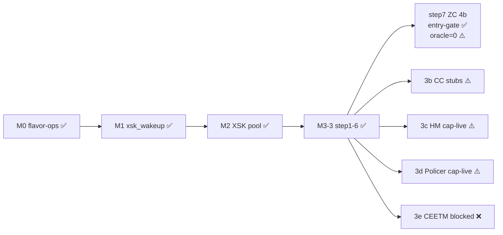
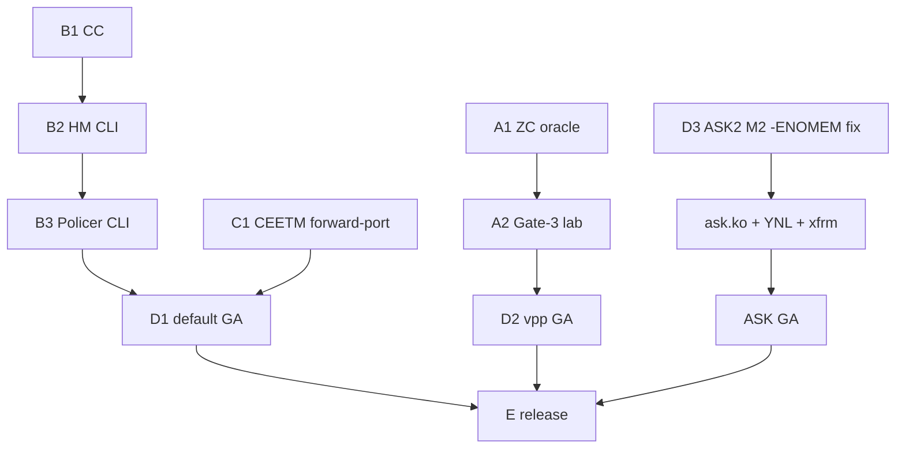

# DPAA1 Full Driver Plan — `default` + `vpp` + `ask`

This plan sequences every task, gate, and dependency required to land a **single
shared DPAA1 kernel binary** (all patches under `kernel/common/patches/board/`)
that serves all three flavors. The flavors differ **only by userspace consumer**
— `default` (kernel netdev + ethtool/tc offloads), `vpp` (AF_XDP via upstream
`af_xdp` plugin), and `ask` (ASK2 acceleration daemon). No flavor forks the
kernel.

**Baseline (already landed):**

- Patches `0068`–`0103b` in-tree, `patch-health.sh --source release` clean.
- `caps = 0x17` (CC_EXACT_MATCH | HM_NODES | POLICER_TRTCM | PARSER_SOFTSEQ) live
  on the DUT with FMan ucode 210.10.1; `HC_DISPATCH` off.
- VPP AF_XDP path ~3.5 Gbps in production, **0% driver-side drop** (the ≥7 Gbps
  gate is currently methodology-bound, not driver-bound).
- Per-`dpaa_priv` flavor-ops (`struct dpaa_pcd_ops`, `struct dpaa_qmgmt_ops`,
  RCU-protected) wired via `dpaa_register_flavor_ops`.

---

## Phase A — Close the AF_XDP datapath (VPP-critical, benefits all flavors)

### A1 — True-ZC RX oracle (0103b follow-through)

The entry-gate counters fire (`xsk_zc_eligible`/`xsk_zc_rx_armed`) but the
copy-free oracle (`xsk_zc_rx_redirect`) reads 0 — FMan is still DMAing into
non-XSK BMan chunks.

- BMI register-readback to confirm `fman_port_set_rx_bpool()` actually programmed
  the XSK buffer-pool ID into the RX port.
- Traffic-steering fix so FMan DMAs land in XSK-pool BMan chunks
  (`priv->xsk_bpid` must match the programmed pool).

**Gate Z:** under a live `XDP_ZEROCOPY` producer, `xsk_zc_rx_redirect > 0` and
`xsk-zc-check` reports copy-free RX (no fallback-copy counter increment).

### A2 — Literal ≥7 Gbps Gate-3 (lab task, no kernel code)

Current 5.57 Gbps is single-receiver-limited, not driver-limited.

- Provision a multi-process generator (multiple `iperf3` servers, or
  TRex / DPDK-pktgen) to remove the single-receiver bottleneck.

**Gate 3:** ≥7 Gbps single-stream IPv4 forward at <5% kernel-net CPU per worker.

### A3 — TX-ZC productive path (0085 v2 wired)

- Validate `xdpsock -t` and VPP `af_xdp` TX through the productive path.
- Confirm `xsk_tx_inflight` backpressure and TxConf recycle.

**Gate T:** sustained TX-ZC with no UMEM stall/deadlock.

---

## Phase B — HW offload datapath gates (cap-live → proven)

### B1 — CC exact-match tree (`fman_cc_tree_*`)

- Finish MURAM `CONT_LOOKUP` AD encoding (bodies currently return `-ENOTSUPP`).
- 5-tuple key install + per-key stats.

**Gate CC:** a 5-tuple steers to the chosen qband, confirmed via counters +
`tcpdump`.

### B2 — HM VLAN strip/insert

- `0099`+`0101` DUT-validated; `ethtool` rx-vlan-offload works.
- Land the vyos-1x CLI consumer (`set interfaces ethernet ethX hw-offload
  vlan-strip` → `ethtool -K rxvlan on`). The patch file
  `data/vyos-1x-024-hw-offload-vlan-strip.patch` already exists — needs wiring +
  validation.
- Traffic-generator gate.

**Gate HM:** `tcpdump` shows tagged-on-wire / consumer-untagged, sub-100 ns.

### B3 — Policer srTCM/trTCM (`0100` cap-confirmed)

- vyos-1x CLI consumer (`set firewall offload policer`, or a tc/nftables ingress
  backend).

**Gate POL:** a 2.5 Gbps cap on 3 Gbps offered, with red-drops visible in
counters.

---

## Phase C — CEETM (largest remaining kernel effort) — BLOCKED

CEETM is **absent from mainline 6.18** (no `qman_ceetm.c`,
`dpaa_eth_ceetm.c`, `qman_ceetm_*`, or `ndo_setup_tc`).

### C1 — CEETM forward-port

- Port SDK `qman_ceetm.c` (~2600 LOC) + `dpaa_eth_ceetm.c` (~1900 LOC) from the
  NXP LSDK to 6.18.
- Add `ndo_setup_tc` / `mqprio` (absent) and wire CEETM as a tc root qdisc.
- VyOS `set qos policy shaper hardware ceetm` consumer + per-port mutex vs the
  VPP-internal shaper (sysfs `ceetm_active` sentinel).

**Gate CEETM:** hierarchical egress shaping executed in QMan silicon, class-rate
counters validated.

---

## Phase D — Per-flavor consumer wiring

### D1 — `default`

- RPS via CC steering (`ndo_rx_flow_steer`), `NETIF_F_HW_VLAN_CTAG_*` (HM),
  tc/nftables offload (Policer), root qdisc (CEETM) — all through the Phase B/C
  CLI.

**Gate D1:** default ISO boots; skbuf RX improved by §5.2 per-CPU NAPI (OQ11
baseline needed); offload knobs functional.

### D2 — `vpp`

- Confirm `af_xdp_pool.ko` + upstream VPP `af_xdp` plugin (no VPP source
  changes).
- Wire `set vpp settings hw-offload` to the §5 primitives.

**Gate D2:** Phase A gates pass; VPP idle CPU <10%.

### D3 — `ask` (ASK2, longest pole)

- Resolve the M2 CPU gate — root-cause the 327× `fman_pcd_manip_chain_create(3
  manips) failed: -12` (`-ENOMEM`): instrument `gen_pool_size` /
  `gen_pool_avail` at 4 checkpoints; fix the MURAM / chain-byte math.
- Land `ask.ko` (~1500 LOC), the YNL `ask` family, and `xfrmdev_ops` / CAAM
  offload.

**Gate ASK-M2:** ≥2 Gbps **and** ≤5% CPU (currently 6.95 Gbps / 21.4% — FAIL).
**Gate ASK-GA:** ≥18 Gbps + <20% CPU at 17 Gbps.

---

## Phase E — Integration & release

- **E1:** single kernel binary boots clean on all 3 ISO flavors
  (`patch-health.sh --source release` + visual `grep` of patched files).
- **E2:** coexistence — per-port flavor (eth0-2 `default` + eth3-4 `vpp`),
  MURAM ≤52 KiB, BMan pool IDs ≤40/64, ucode-210 fail-soft `-ENOTSUPP`.
- **E3:** multi-flavor release — `version-{default,ask,vpp}.json` feeds +
  flavor-encoded ISO filenames; deploy the vpp ISO to lxc200 `latest-vpp.iso`.

**Gate E (GA):** all 3 flavors install via `add system image`, boot, and pass
their datapath gates.

---

## Critical path

## Summary

| Path | Phases | Effort | New kernel code |
|------|--------|--------|-----------------|
| **Shortest** | A1 → A2 → D2 (vpp) | days | none |
| **Medium** | B1/B2/B3 + CEETM → D1 (default) | weeks | CEETM forward-port dominates (~4500 LOC) |
| **Longest** | D3 (ask) | months | M2 `-ENOMEM` blocker, then ask.ko ~1500 LOC + YNL + xfrm/CAAM |