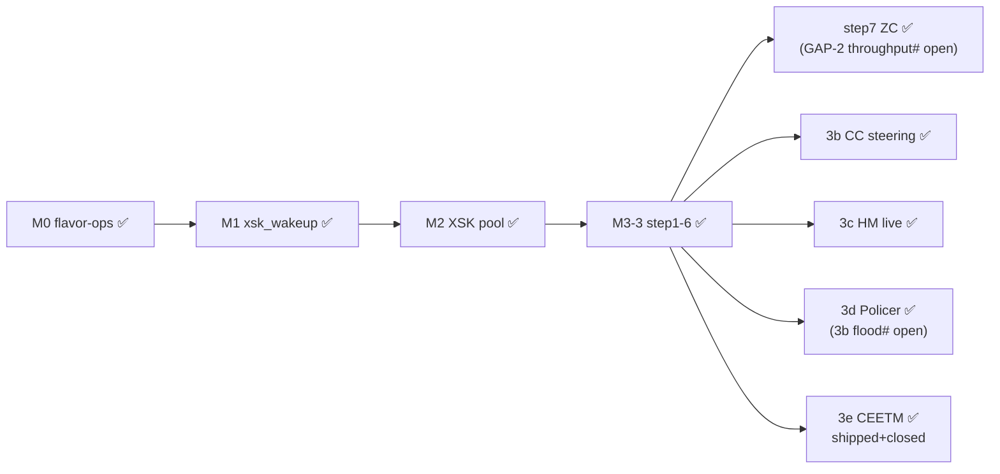
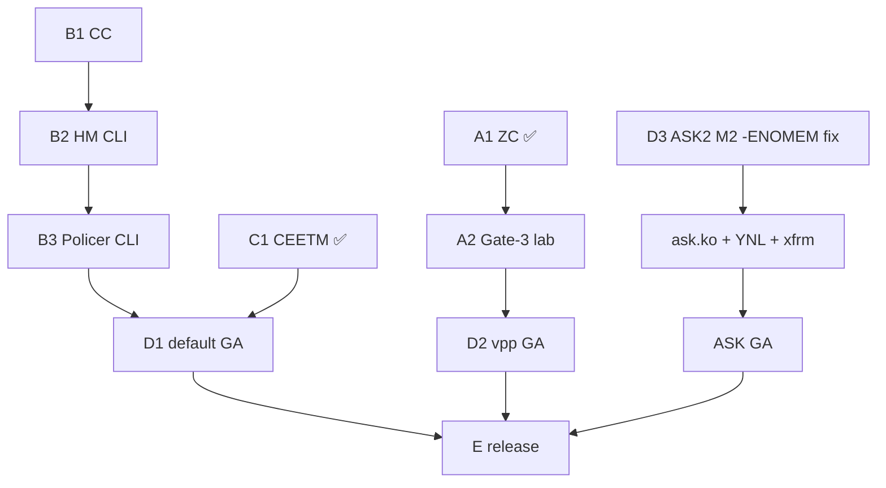

# DPAA1 Full Driver Plan — single image, `default` + `vpp` + `ask` consumer modes

This plan sequences every task, gate, and dependency required to land a **single
shared DPAA1 kernel binary** (all patches under `kernel/common/patches/board/`)
that serves all three consumer modes from **one ISO / one package**. The modes
differ **only by userspace consumer** — `default` (kernel netdev + ethtool/tc
offloads), `vpp` (AF_XDP via upstream `af_xdp` plugin), and `ask` (ASK2
acceleration). All three ship in every image and are switched at runtime; no mode
forks the kernel.

**Baseline (already landed):**

- Patches `0068`–`0103b` in-tree, `patch-health.sh --source release` clean.
- `caps = 0x17` (CC_EXACT_MATCH | HM_NODES | POLICER_TRTCM | PARSER_SOFTSEQ) live
  on the board with FMan ucode 210.10.1; `HC_DISPATCH` off.
- VPP AF_XDP path ~3.5 Gbps in production, **0% driver-side drop** (the ≥7 Gbps
  gate is currently methodology-bound, not driver-bound).
- Per-`dpaa_priv` flavor-ops (`struct dpaa_pcd_ops`, `struct dpaa_qmgmt_ops`,
  RCU-protected) wired via `dpaa_register_flavor_ops`.

---

## Phase A — AF_XDP datapath (VPP-critical, benefits all flavors)

### A1 — True-ZC RX oracle ✅ DONE (2026-06-10)

`xsk_zc_rx_redirect` fires + reproducible (ISO `2026.06.10-0124`, kernel `6.18.34-vyos`). BMI BPID flip proven (`0102b`), NULL-`xdp.rxq` crash fixed (`0103g`), NAPI-only flush (`0110`); crash-free + reversible. **Open:** GAP 2 — the literal high-rate true-ZC throughput number (needs the §8 peer-flood harness; NOT gate-3-blocking). See `plans/ZC-RX-SCOPE.md`.

### A2 — Literal ≥7 Gbps Gate-3 — lab task, no kernel code

gate-3 ≥7 Gbps PROVEN (7.41 Gbit/s @4 flows, 2026-06-12, §8 LXC201/202 harness). A literal single-stream line-rate figure still wants the deferred TRex / SR-IOV-VF upgrade.

### A3 — TX-ZC productive path (`0085` v2 wired)

Validate `xdpsock -t` / VPP `af_xdp` TX + `xsk_tx_inflight` backpressure + TxConf recycle on the §8 harness.

---

## Phase B — HW offload datapath gates

### B1 — CC exact-match tree ✅ CLOSED (2026-06-12)

Board-validated via the `0107` harness on eth3 (hwport `0x10`): install/miss/detach/idempotent all pass under 210.10.1 ucode, no STALL/RDRP. Visible-FQ-steer wire gate deferred to the §8 harness.

### B2 — HM VLAN strip/insert ✅ live (silicon-proven)

`0099`/`0101` + `vyos-1x-024` shipped + live on the board (cap `0x17`; +144 MURAM on rxvlan-on, freed off). **Open:** the wire-visible tagged/untagged gate is blocked by the lab access-port switch (drops VID≠PVID) — needs a controllable 802.1Q source.

### B3 — Policer srTCM/trTCM ✅ BUG 3a + 3b-non-revert FIXED (silicon-proven)

`0100` (FMPL block master-enable `GCR.EN|STEN`) + `0104` (release-cb scheme revert) + `vyos-1x-025` shipped. **Open:** (1) the iperf3 flood-crash half of BUG 3b (serial capture + cold power-cycle); (2) the literal 2.5 Gbps cap + red-drop number on the §8 harness (qualitative enforce-vs-bypass already PROVEN by ping).

---

## Phase C — CEETM egress shaping ✅ SHIPPED + CLOSED (2026-06-14)

Modern rewrite (NOT a verbatim forward-port): `0111` (NEW `qman_ceetm.c` object model + MC helper) + `0112` (`TC_SETUP_QDISC_HTB` offload consumer). DEFECT A (additive effective rate) FIXED + HW-validated; DEFECT B (special-default-channel blackhole) CLOSED as a documented LS1046A 8-channel CEETM dequeue-scheduler silicon limitation, product-impact NONE (`dpaa_ceetm_select_queue` reaches the special default channel ONLY for raw `tc … htb offload default 0`; VyOS always renders `htb default <minor>` → a real default leaf, immune). See spec §5.7.

---

## Phase D — Per-flavor consumer wiring

### D1 — `default`

- RPS via CC steering (`ndo_rx_flow_steer`), `NETIF_F_HW_VLAN_CTAG_*` (HM),
  tc/nftables offload (Policer), root qdisc (CEETM) — all through the Phase B/C
  CLI.

**Gate D1:** default ISO boots; skbuf RX improved by §5.2 per-CPU NAPI (OQ11
baseline needed); offload knobs functional.

### D2 — `vpp`

- Confirm `af_xdp_pool.ko` + upstream VPP `af_xdp` plugin (no VPP source
  changes).
- Wire `set vpp settings hw-offload` to the §5 primitives.

**Gate D2:** Phase A gates pass; VPP idle CPU <10%.

### D3 — `ask` (ASK2, longest pole)

- Resolve the M2 CPU gate — root-cause the 327× `fman_pcd_manip_chain_create(3
  manips) failed: -12` (`-ENOMEM`): instrument `gen_pool_size` /
  `gen_pool_avail` at 4 checkpoints; fix the MURAM / chain-byte math.
- Land `ask.ko` (~1500 LOC), the YNL `ask` family, and `xfrmdev_ops` / CAAM
  offload.

**Gate ASK-M2:** ≥2 Gbps **and** ≤5% CPU (currently 6.95 Gbps / 21.4% — FAIL).
**Gate ASK-GA:** ≥18 Gbps + <20% CPU at 17 Gbps.

---

## Phase E — Integration & release

- **E1:** single kernel binary boots clean from the single ISO
  (`patch-health.sh --source release` + visual `grep` of patched files).
- **E2:** coexistence — per-port consumer mode (eth0-2 kernel `default` + eth3-4
  `vpp`), MURAM ≤52 KiB, BMan pool IDs ≤40/64, ucode-210 fail-soft `-ENOTSUPP`.
- **E3:** single-image release — one canonical `version.json` feed (with
  `version-{default,ask,vpp}.json` kept as identical back-compat aliases) +
  flavor-neutral ISO filename; deploy to lxc200 `latest.iso`.

**Gate E (GA):** the single image installs via `add system image`, boots, and
passes the datapath gates for every consumer mode.

---

## Critical path

## Summary

| Path | Phases | Status |
|------|--------|--------|
| **Shortest** | A1 → A2 → D2 (vpp) | A1 ✅; A2 ≥7G proven (7.41 Gbit/s); D2 wants a HW benchmark run |
| **Medium** | B1/B2/B3 + CEETM → D1 (default) | CC/HM/Policer/CEETM all shipped + closed; remaining = lab wire gates + the 3b flood-crash characterization |
| **Longest** | D3 (ask) | deferred — M2 `-ENOMEM` blocker, then `ask.ko` ~1500 LOC + YNL + xfrm/CAAM |