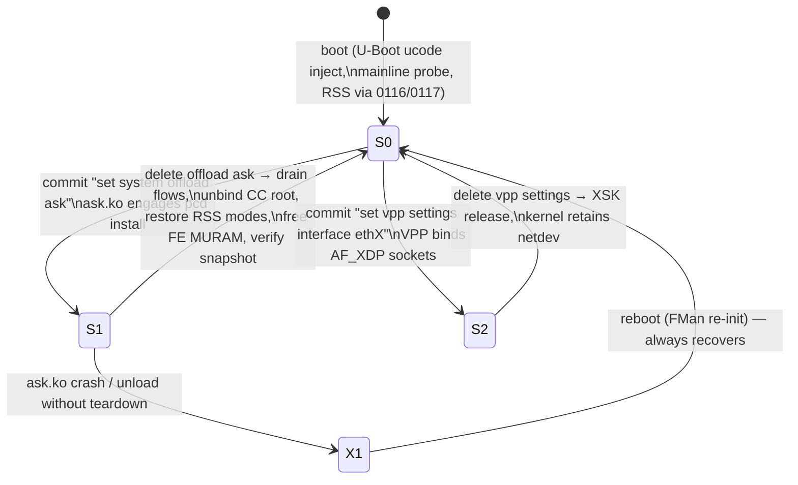
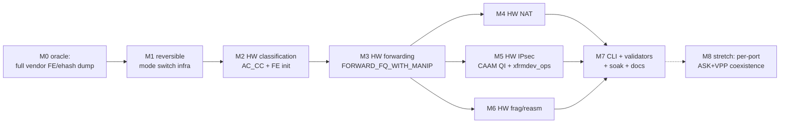

# Dual Dataplane — Full ASK Offload, Switchable to VPP

**Status:** Adopted v1.1. 2026-06-14 (single-image flavor collapse made **immediate**; supersedes Draft v1.0 2026-06-12). The `default | ask | vpp` build-flavor split is **retired** — CI ships one flavor-neutral ISO + one `version.json` feed (aliases kept for fielded installs). This is the current build/packaging model, no longer gated behind M7.
**Goal:** One installed VyOS image on the LS1046A Mono Gateway that supports the *full* NXP-ASK-equivalent FMan hardware offload (classification, FE forwarding, NAT, IPsec, frag/reassembly) **and** can disable that offload to run the VPP/AF_XDP dataplane instead — switched by VyOS config commit, no reflash.

**Authority split.** This plan does not re-specify either dataplane:

- ASK-side architecture (ask.ko, YNL family, `dpaa_flavor_ops`/`pcd_ops->install`, `FORWARD_FQ_WITH_MANIP`, nf_flow_table, xfrmdev_ops) → `specs/ask2-rewrite-spec.md` (v1.8) is authoritative.
- VPP-side architecture (AF_XDP ZC, XSK pool, per-CPU NAPI/qband, `set vpp settings`) → `specs/vpp-dpaa1-ls1046a-spec.md` + `specs/dpaa1-afxdp-modernization-spec.md` are authoritative.

What this plan adds is the **glue neither spec owns**: the silicon mode state machine, the reversibility contract that makes ASK-disable possible, the mutual-exclusion CLI semantics, and the milestone sequence that delivers full ASK parity while keeping VPP working at every step.

---

## 1. Evidence base (why this plan exists, and why now)

Live-hardware findings from the vendor-reference bring-up (2026-06-13, `files/verification-matrix.md` §G, qdrant-stored):

1. **Vendor ASK = AC_CC everywhere.** The working NXP stack programs 12 KeyGen schemes, every one `kgse_mode = 0x8X000006` (low byte `0x06` = AC_CC → coarse classification → ehash → FE). Captured read-only from live silicon (`files/vendor-kgall.txt`).
2. **Mainline 0118 = CCBS bypass.** Our current scheme mode `0x80500002` (low byte `0x02` = DONE/RSS) never enters the classifier. Confirms the iter-50 truth table: AC_CC is the real dispatch, CCBS is a placebo.
3. **The iter-50 "AC_CC stall" was missing FE init, not wrong dispatch.** The vendor cdx builds FE/ehash MURAM structures (AllocFEObjs, 32 KB FE buffer pool + exthash global mem, MUX-FE + TRANSITION-FE singletons, per-port `FmPortSetFESupport`) that mainline never creates. AC_CC without them stalls.
4. **The vendor reference is now fully reachable.** dpa_app's `-DLS1043` struct-size SIGSEGV is fixed (rc=0, FMan programmed); the complete FE/ehash MURAM oracle can be dumped on demand.
5. **Outcome parity verdict: mainline shares only ucode + RSS with ASK.** Everything else (HW classify, HW forward, HW NAT, HW IPsec, HW frag) is software today.

And one structural fact that makes the dual-dataplane cheap:

6. **All flavors already share one mainline 6.18 kernel.** The FMan PCD board patch series (0092/0097–0100/0104/0116/0117) and the AF_XDP modernization patches coexist in the same binary. The dataplane choice is purely a question of *runtime silicon programming*, not of kernel builds.

---

## 2. The core insight: ASK-off **is** the VPP-ready state

VPP/AF_XDP does not need anything *added* to the silicon — it needs the silicon in exactly the state mainline boots into: KG schemes in RSS direct-to-FQ mode, frames delivered to kernel RX FQs, `fsl_dpa` netdevs owning every port. ASK needs the *other* state: AC_CC dispatch, CC root bound at the port, FE structures live in MURAM.

Therefore "disable ASK and run VPP" reduces to one engineering requirement the vendor never had:

> **The Reversibility Contract.** Every silicon write ASK makes must have an exact, ordered inverse. `ask disable` (or `ask.ko` unload) must return the FMan to a register-identical copy of the post-boot mainline state — verified, not assumed.

The vendor stack is one-way: cdx + dpa_app program the FMan once at boot and the only "undo" is a reboot. Our ASK2 design already trends the right way (`dpaa_unregister_flavor_ops()` teardown, CC-row mutation without carrier flap), but the contract must be made explicit, test-gated, and extended to every new primitive this plan adds.

### 2.1 Silicon mode state machine



| State | KG schemes | Port dispatch | MURAM | Netdevs | Who forwards |
|---|---|---|---|---|---|
| **S0** mainline | RSS (`…0002` DONE) | BMI → KG → FQ | FIFO/IC only | `fsl_dpa` all ports | kernel |
| **S1** ASK | AC_CC (`…0006`) | BMI → KG → CC/ehash → FE | + FE objs, CC trees, flow tables | `fsl_dpa` all ports (exceptions only) | **FMan silicon** |
| **S2** VPP | RSS (same as S0) | same as S0 | same as S0 | `fsl_dpa` + XSK sockets on VPP ports | VPP workers |

Key properties:

- **S2 is a userspace overlay on S0.** No silicon delta — that's why VPP needs no inverse beyond closing sockets (already proven: removing a port from `set vpp settings` releases the XSK and the kernel keeps full control).
- **S1 ↔ S0 is the only hard transition**, and it is entirely our code. There is no S1 ↔ S2 direct edge: switching ASK→VPP always passes through S0.
- **Boot always lands in S0.** ASK engages only on config commit, never unconditionally at probe. This guarantees a wedged S1 is always recoverable by reboot, and a freshly installed image with VPP config boots straight into a working VPP without ASK ever touching the silicon.

### 2.2 What teardown must invert (the S1→S0 checklist)

Each item lands with its inverse in the same patch, and the inverse is exercised in CI/board soak before the forward path is considered done:

| # | Forward (S0→S1) | Inverse (S1→S0) |
|---|---|---|
| 1 | KG scheme rewrite RSS→AC_CC (in-place, EN-preserving, per the 0097 `kg_find_port_scheme()` reprogram precedent) | rewrite AC_CC→RSS, restore saved `kgse_*` words verbatim |
| 2 | Port→CC-root BMI bind (`fmbm_rfpne` PRE_CC + ccTreeBaseAddr) | restore saved `fmbm_rfpne` (RSS next-engine) |
| 3 | FE/ehash global init (AllocFEObjs, FE buffer pool, exthash global mem, MUX-FE/TRANSITION-FE singletons) | quiesce + free all FE MURAM allocations back to the gen_pool |
| 4 | Per-port `FmPortSetFESupport` (params-page +0x54/+0x58) | zero the params-page words |
| 5 | CC trees + flow-table rows (runtime, per nft/xfrm events) | evict all rows, destroy trees (existing `fman_cc_tree_destroy` surface) |
| 6 | NAT/IPsec/frag structures (M4–M6, TBD per milestone) | defined per milestone — **no milestone merges without its inverse** |
| 7 | FMPL policer interactions (0100 owns `FMPL_GCR`) | unchanged — policer is mode-independent, stays owned by 0100/0104 |

**Verification primitive:** a register/MURAM snapshot-diff tool (extend the existing d14 `/dev/mem` dumpers into `board/scripts/pcd-snapshot`) that captures S0 at boot, and after every S1→S0 transition asserts the live state equals the snapshot. This is the gate, not "ping still works".

---

## 3. Operator model and CLI

### 3.1 Mode selection

```
# ASK mode (full HW offload)
set system offload ask                       # global enable (engages FE init)
set system offload ask interface eth0..eth4  # ports under ASK classification

# VPP mode
set vpp settings interface eth3
set vpp settings interface eth4
```

### 3.2 Mutual exclusion (v1: global; v2: per-port)

- **v1 rule (validator-enforced):** `system offload ask` and `vpp settings interface` are mutually exclusive *globally*. Commit rejects a config containing both. Switching = delete one subtree, commit (passes through S0), set the other, commit.
- **v2 relaxation (stretch, after port-isolation soak):** per-port exclusivity only — ASK on RJ45 routing ports (eth0–eth2) while VPP runs AF_XDP on SFP+ (eth3/eth4) simultaneously. Technically plausible because KG scheme binds and `fmbm_rfpne` are per-port and FE MURAM init is inert for ports left in RSS dispatch; gated on proving no shared-resource bleed (MURAM budget, KG scheme count, parser state) on hardware.
- **Hybrid flow-level mode** (ASK fast path + memif promote-to-VPP ACL, ASK2 spec §9) remains the long-horizon v3 — explicitly out of scope here; nothing in this plan forecloses it.

### 3.3 Switch UX guarantees

| Transition | Mechanism | Reboot? |
|---|---|---|
| off → ASK | commit → ask.ko engage | no |
| ASK → off | commit → verified teardown | no (reboot = documented fallback if snapshot-diff fails) |
| off → VPP | commit → existing vyos-1x-010 path (hugepage kexec on first VPP config, as today) | one-time kexec (existing behavior) |
| VPP → off | commit → XSK release | no |
| ASK → VPP | two commits (via off) or one commit that the validator orders as teardown-then-VPP | no (plus the one-time hugepage kexec if first VPP use) |

---

## 4. Milestones

Each milestone has a hardware gate on the board and lands with its teardown inverse (§2.2). VPP regression (`set vpp settings` on eth3/eth4 still binds and passes traffic after an ASK enable/disable cycle) is part of **every** gate from M1 on.



**M0 — Complete the vendor oracle (Track-2 finish).** Boot the real (non-diag) cdx with `START_DPA_APP=1` auto-spawning the fixed dpa_app; dump the *complete* FE/ehash MURAM layout, CC root ADs, per-port BMI state (`fmbm_rfpne`/RCCB), KG schemes, and the params-page FE words. Archive as the byte-level reference for M2/M3. Also capture an S0 snapshot of the mainline image with the same tooling — the two snapshots **are** the state machine's endpoints.
*Gate:* reference dumps archived in-repo; snapshot tool (`pcd-snapshot`) runs on both vendor and mainline kernels.

> **M0 — SATISFIED (2026-06-16, by static SDK extraction).** The byte-level oracle was produced **statically from the genuine NXP SDK source** the vendor binaries were compiled from (archived `mihakralj/kernel-ls1046a-build@464df181`), cross-checked against on-hardware register/MURAM dumps — **not** by a live vendor-stack FE/ehash capture, which is both *blocked* (the resurrected vendor stack hits the same MURAM-exhaustion wall: lxc200 `ask-activate.sh` Phase 4 is skipped because `FM_PCD_CcRootBuild()` blocks in the kernel ioctl) and *redundant* (the SDK source is authoritative). Deliverable: **[`arch/fman-fe-ehash.md`](../arch/fman-fe-ehash.md)** — the complete `AllocFEObjs` (100×28 B MURAM pool) / `FmPortSetFESupport` (per-port FE buffer + params-page +0x54/+0x58 + inverse) / `ExternalHashTableSet` (DDR buckets + MURAM node) init contract, the 256 B `t_FmPcdCtrlParamsPage` layout, the two CC dispatch paths (exact-match `CONT_LOOKUP` vs external-hash `FE_ENTER`) and the **disposition fork** that ties FE/ehash to the open M3-3b defect, plus the MURAM/DDR budget and the vendor over-provisioning anti-pattern. The `pcd-snapshot` tool runs on the mainline kernel (S0/S1 endpoints captured); the vendor-kernel run is the only un-captured half, and §7 of the doc explains why a live capture is neither available nor needed. **⚠ Provenance caveat (2026-06-16, source-of-truth corrected 2026-06-15):** the archive is the **lf-6.6.y** ASK-port mirror and supplies the *allocation* contract only — the FE-VM *programming* core (`FmPcdCcBuildFE` / `FmPcdCcBuildContextByFE` / `get_indexed_hash_bucket`) is **stubbed** there. The shipping **`lf-6.12.49-2.2.0`** mono port was checked and **also stubs both FE builders** (explicit `UNUSED()` no-ops), so it is **NOT** a usable source. The **only** tree with genuine working bodies is the **lf-5.4 Layerscape SDK** (`we-are-mono/ASK` `patches/kernel/999-layerscape-ask-kernel_linux_5_4_3_00_0.patch`: `FmPcdCcBuildFE` L8883, `FmPcdCcBuildContextByFE` L8954, `get_indexed_hash_bucket` L7301) — Fork B (M2) extracts the datapath core from lf-5.4. See the doc's *Provenance caveat* and qdrant `m0-vendor-oracle-fe-ehash-provenance` / `m1-fork-b-fe-ehash-provenance-lf5.4-source-found`.

**M1 — Reversible PCD mode-switch infrastructure.** Implement §2.2 items 1–4 forward+inverse in the board FMan PCD layer (extending 0097-series primitives: scheme-mode rewrite, `fmbm_rfpne` bind/unbind, FE MURAM alloc/free, params-page set/clear), exposed to ask.ko via `<linux/fsl/fman_pcd.h>`. No classification semantics yet — just clean, snapshot-verified S0→S1→S0 cycling.
*Gate:* 100× enable/disable cycles on the board with snapshot-diff clean every cycle; VPP AF_XDP bind + iperf3 pass after the 100th teardown; kernel netdevs and management SSH unaffected throughout. **This milestone is the user's headline requirement and ships first.**

> **M1 progress (2026-06-15, control-plane reversibility HW-PROVEN).** The
> verification primitive `board/scripts/pcd-snapshot` is built, CI-green, and
> packaged into the ISO. Items **1** (KG scheme RSS↔AC_CC, board `0106`), **2**
> (BMI `fmbm_rccb` bind, `0105`), and **4** (params-page, `0116`
> `fman_pcd_port_ensure_params_page`) are HW-proven reversible: exercised
> S0→S1→S0 on **eth3 only** via the shipping `0107 cc_test` debugfs node, gated
> by pcd-snapshot. A **100× soak passed with 0 drifts**, gen_pool `used` flat at
> 256 B (zero leak), the eth0/SSH lifeline unaffected every cycle. The leak the
> gate caught is bounded/non-cumulative — a one-time 256 B per-port FM_CTL
> params page (allocate-once/reuse by design); the M1 baseline is therefore the
> warm steady-state S0′. **Caveat:** the soak engaged/disengaged *without
> data-plane traffic*, so it proves control-plane switch reversibility (M1's
> scope); the data-plane recovery (eth3 usable after a *trafficked* S1) is the
> VPP-iperf3 sub-gate and depends on item **3**. Item **3** (M2 HW classification —
> **Fork B** FE/ehash — Option B controller-arming was **refuted** at iter-49) is the
> remaining blocker — it does not yet exist (`0118` is a CCBS placebo) and is
> entangled with the open **M3-3b CC-disposition defect** (the CC walk executes
> but the frame's terminal enqueue/discard never fires; iter-49 refuted the arming
> theory → the missing **FE opcode VM** is the disposition mechanism, [`arch/fman-fe-ehash.md`](../arch/fman-fe-ehash.md) §1/§8.3). The
> ask.ko engage-wiring (§3.1 `set system offload ask`) waits on item 3 because
> AC_CC stalls the port under load until disposition works.

**M2 — HW classification (the parity keystone).** Engage the classifier and make a classified frame reach its egress FQ, deleting the `0118` CCBS placebo (which *bypasses* classification rather than enabling it). **Fork decision RESOLVED (2026-06-16): Fork B.** Option B (the missing-controller-arming theory) is **exhausted & refuted** — iter-49 (`ccexp47_rfne.py`) tested the strongest untested lead, the SDK `rfne`-last detach/re-arm discipline, byte-perfectly and the port **still stalled** (`FMFP_PS[STL]=0x80800000` at rfrc=+2, identical to baseline); with gmask/exit-NIA/leaf-AD/extraction/RCMNE/params-page/ucode all previously exonerated, **classic exact-match (Fork A) cannot flow on 210.10.1** (qdrant `m3-3b-option-b-rfne-last-REFUTED-forkB-decision`). This confirms the M0 oracle ([`arch/fman-fe-ehash.md`](../arch/fman-fe-ehash.md) §1/§8.3): bare AC_CC `CONTRL_FLOW` has no terminal BMI-FIFO disposition without the **FE opcode VM**. **The path is therefore Fork B** — reproduce the vendor external-hash/FE init contract (doc §3–§5: `AllocFEObjs` MURAM pool + per-port `FmPortSetFESupport` + `ExternalHashTableSet` DDR buckets, each with its inverse), the **only** config proven to flow on this silicon and the eventual substrate for NAT/frag/stats. **⚠ Source-of-truth (corrected 2026-06-15):** the doc §3–§5 *allocation* skeleton is genuine lf-6.6.y archive source, but the FE-VM *programming* core (`FmPcdCcBuildFE` / `FmPcdCcBuildContextByFE` / `get_indexed_hash_bucket`) is **stubbed** in that archive **and in the shipping `lf-6.12.49-2.2.0` mono port** (both no-op `UNUSED()`) — Fork B must extract those three from the **lf-5.4 Layerscape SDK** (`we-are-mono/ASK` `999-…patch`: `FmPcdCcBuildFE` L8883, `FmPcdCcBuildContextByFE` L8954, `get_indexed_hash_bucket` L7301), the only tree with working bodies. The `106.4.18` ucode swap is **ruled out** (iter-42: identical handler code; ccexp12: parks identically). Fork B lands its inverse in the same patch (§3.5 reversibility). First packet of a flow → exception to kernel; subsequent packets classified in silicon.
*Gate:* D14-class evidence — KG scheme hit counters advance, CC lookup resolves, classified flow's frames stop appearing in kernel softirq **and the port stays alive under sustained traffic** (the M3-3b disposition criterion); teardown still snapshot-clean.

> **M2 status — Fork B executed on silicon, parks (VERDICT D); documented clean boundary (2026-06-17).**
> The full Fork-B FE-VM substrate (board patches `0122`–`0133`) was built, armed, and trafficked on the board
> (192.168.1.190, image `2026.06.17-1954-rolling`, kernel `6.18.34-vyos`, CI `27715693384`, eth3 port `0x10`).
> **(1)** The chain now **builds on-board for the first time** — the `FMAN_PCD_FE_POOL_COUNT 100→32` fix
> (`b83cee7`/`56a3e10`, per-object 256 B gen_pool chunk-waste; arena `32+131+35+1=199<256` chunks) makes
> `fe_pool`/`fe_ehash`/`fe_port`/`fe_singletons`/`fe_hashfe`/`fe_enq`/`fe_enter` all return `ok`, MURAM pristine.
> **(2)** The per-port FE buffer (`fe_port`/`FmPortSetFESupport`) is **necessary-not-sufficient**: `fe_arm engage`
> still **parks the port immediately** (`FMFP_PS=0x80800000` STL, `rfrc=+21`) with **VERDICT D — zero fault
> latched** (`fmdmsr=0`, `fmfp_ee` unchanged, `decceh=0`), identical to bare iter-26–50 / `0133`. **The precise
> remaining gap is the FE working-store context population** (`FmPcdCcBuildContextByFE`, lf-5.4-only stub): the FE
> VM's MUX reads its next-FE pointer from a per-task working-store context (`0xd0xx`) that nothing populates, so the
> frame WAITs forever and never reaches the `t_ExtHashFe` terminal dealloc. See [`arch/fman-fe-ehash.md`](../arch/fman-fe-ehash.md) §8.7.
> **Clean boundary:** the FE-VM scaffold is complete, **dormant, byte-verified, and fully reversible** (M1 HW-proven,
> `pcd-snapshot` clean); M2 functional-close is blocked solely on the inaccessible lf-5.4 working-store body (a
> **source-availability wall, not an effort gap** — 50+ clean-room iterations). The shipping datapath is **AF_XDP**
> (~3.5 Gbps, already on `main`); the scaffold ships dormant and re-activates the instant the working-store body
> becomes available. This is the M2 stopping point at which `dpaa1` merges to `main`.

**M3 — HW forwarding.** CC match → `FORWARD_FQ_WITH_MANIP` (L2 rewrite + TTL/cksum in the CC-action atom, no OH-port detour) → egress FQ. ask.ko populates flows from `nf_flow_table` EST events per the ASK2 spec.
*Gate:* IPv4 routed flow forwarded entirely in silicon; perf per ASK2 §11.1 (≥ multi-Gbps with kernel-net CPU ≤ 5%, vs 21.4% at PR14z21); MURAM accounting instrumented (the PR14z21 `-ENOMEM` lesson).

**M4 — HW NAT.** SNAT/DNAT field-update manips in the forward chain, driven from conntrack NAT bindings.
*Gate:* NATed flow in silicon, correct translation on the wire, conntrack teardown evicts the row.

**M5 — HW IPsec.** CAAM QI descriptor sharing (`caam_qi_ext_consumer_register`, landed PR10) + `xfrmdev_ops` packet-mode offload; FMan-targeted FQs dequeue into SEC without core involvement.
*Gate:* ESP tunnel throughput ≥ vendor-class with near-zero CPU; SA delete tears down cleanly.

**M6 — HW frag/reassembly.** FMan reassembly contexts for inbound frags on offloaded flows; fragmentation on egress where MTU demands.
*Gate:* fragmented offloaded flow reassembled in silicon; teardown inverse verified.

**M7 — Productization.** VyOS CLI (`set system offload ask …`) + the §3.2 mutual-exclusion validator + op-mode (`show offload ask flows` via YNL) + `ask-check` board script (sfp-check/fan-check style) + INSTALL/AGENTS docs + 24 h soak alternating ASK and VPP modes hourly.
*Gate:* soak clean; a single image demonstrably runs full-ASK Monday and full-VPP Tuesday with two commits.

**M8 — Stretch: per-port coexistence (§3.2 v2).** Only after M7 soak; gated on MURAM/scheme-budget audit and a dedicated bleed-hunt soak.

---

## 5. Repo deliverables map

| Deliverable | Where | Notes |
|---|---|---|
| Mode-switch + FE/AC_CC primitives | `kernel/common/patches/board/` 0119+ series | extends 0097/0116/0117; **every patch must be wired in `bin/ci-setup-kernel.sh` in the same commit** (stranded-patch lesson, 2026-06-07) |
| ask.ko control plane | `kernel/flavors/ask/oot-modules/ask/` per ASK2 spec §10.1 | signed post-build (`MODULE_SIG_FORCE`), `LOCALVERSION=-vyos`; with the single-image decision the module builds into **every** image (CI wires it unconditionally, not behind `FLAVOR=ask`) — dormant until `set system offload ask` |
| Snapshot tool | `board/scripts/pcd-snapshot` (+ `ask-check`) | productized d14 dumpers; used by CI gates and field diagnostics |
| VyOS CLI + validator | `data/vyos-1x-0NN-*.patch` | offload subtree + ASK/VPP mutual exclusion; follows vyos-1x-010 precedent |
| Image strategy | `auto-build.yml` | **ADOPTED (flavor split retired 2026-06-14): single dual-dataplane image.** One ISO ships ask.ko *and* VPP; the dataplane choice is config-only. The `FLAVOR=ask\|vpp\|default` axis is collapsed: CI builds one flavor-neutral artifact (`vyos-<version>-LS1046A-arm64.iso`) and publishes one `version.json`, copied verbatim to `version-{default,ask,vpp}.json` aliases so existing field installs on all three update streams converge onto it (the legacy-alias precedent of `version.json`). |
| Oracle archives | `files/` session + summarized into `specs/ask2-rewrite-spec.md` §12 | M0 dumps fold protocol facts back into the spec per its §0 rule |

---

## 6. Risks

| # | Risk | Likelihood | Mitigation (defensive-coding rules in **bold**) |
|---|---|---|---|
| 1 | Some silicon state proves non-invertible without FMan reset (parser RAM, ucode-internal state) | Medium | M1 discovers this *first*, before any classification work; fallback = "reboot to leave ASK mode" (still satisfies the requirement, degraded UX), documented honestly. **Every forward register/MURAM write ships with its verified inverse in the same patch — no orphan mutations.** |
| 2 | **FE-VM core re-implementation infidelity** — the opcode-VM glue (`FmPcdCcBuildFE` / `FmPcdCcBuildContextByFE` / `get_indexed_hash_bucket`) must be lifted from the **lf-5.4 LSDK** (the lf-6.6.y archive *and* the shipping lf-6.12.49 mono port both **stub** it); a wrong FE-struct/bucket image stalls the port with **zero fault latched** (the M3-3b signature — undebuggable by traffic alone) | Medium-High (largest unknown) | Port byte-for-byte from `we-are-mono/ASK` 999-patch (L8883 / L8954 / L7301); **validate the programmed MURAM image against the M0 oracle via `pcd-snapshot` diff BEFORE flowing any traffic**; scaffold-first incremental landing (§3 pool `0122` → §4 port → §5 table → FE-VM core), each on-board reversibility-gated |
| 3 | MURAM exhaustion (384 KB; ~96 KB usable ≈ 750 flows; PR14z21 327× `-ENOMEM`; the vendor `external='yes'` fall-to-MURAM wall, oracle §6) | High (already observed) | **ehash buckets live in DDR (`kmalloc`/`dma`), never MURAM**; gen_pool instrumentation lands in M1; flow-count cap + eviction policy in M3. **Every MURAM alloc checks `gen_pool_avail()` first and unwinds cleanly on any failure — no partial-alloc leak.** |
| 4 | Teardown races live traffic (flows in flight during S1→S0) | Medium | ordered drain: stop new-flow inserts → evict rows → quiesce port (EN-preserving) → rewrite dispatch; test with active iperf3 during disable. **Refcounted FE-pool get/put so a pristine S0 always returns gen_pool to its baseline (the `0122` pattern).** |
| 5 | VPP regression sneaks in via shared PCD primitives | Medium | VPP bind+traffic check in every milestone gate from M1 |
| 6 | Validator gaps let ASK+VPP both claim a port | Low | v1 global mutex is trivially checkable; per-port logic deferred to M8 |
| 7 | Watchdog reset under flood during policer/FE tests | Known | discipline stands: ping/small-UDP only until the traffic harness exists; never flood-test new silicon paths |
| 8 | **MURAM is iomem, not cacheable RAM** — a plain `memset`/`memcpy`/struct-field assignment on an FE-object or bucket pointer faults under KASAN or silently corrupts the AD | Known | **MURAM access exclusively via `memset_io`/`memcpy_toio`/`writel`/`readl`; never plain memset/memcpy/`->field =`. gen_pool does not zero on alloc → every alloc is followed by `memset_io(.., 0, size)` (the `0122` scaffold establishes the pattern).** |
| 9 | FE-pool / ehash **refcount or lock-order bug** under concurrent engage↔disengage leaks MURAM or leaves a stale AD pointer live across S1→S0 | Medium | **Fixed lock order `fe_lock → pcd->lock`; refcount via atomics with `WARN_ON` on underflow; bring-up driven by a single-writer debugfs node only; MURAM-leak check in the `pcd-snapshot` teardown diff.** |

---

## 7. Decisions

1. **Image packaging — ADOPTED (flavor split retired 2026-06-14): single dual-dataplane image.** One ISO carries ask.ko + VPP; the flavor split is retired per §5. All update feeds converge on the same artifact.

Open (to confirm before M1 code):

2. **ASK default-on or default-off in shipped config:** recommend default-off (S0 boot, operator opts in) — matches the state-machine safety argument and VyOS convention.
3. **v1 mutual-exclusion scope:** confirm global (not per-port) is acceptable for first ship.
4. **M4/M5/M6 ordering:** parallel after M3 as drawn, or serialized by review bandwidth.
