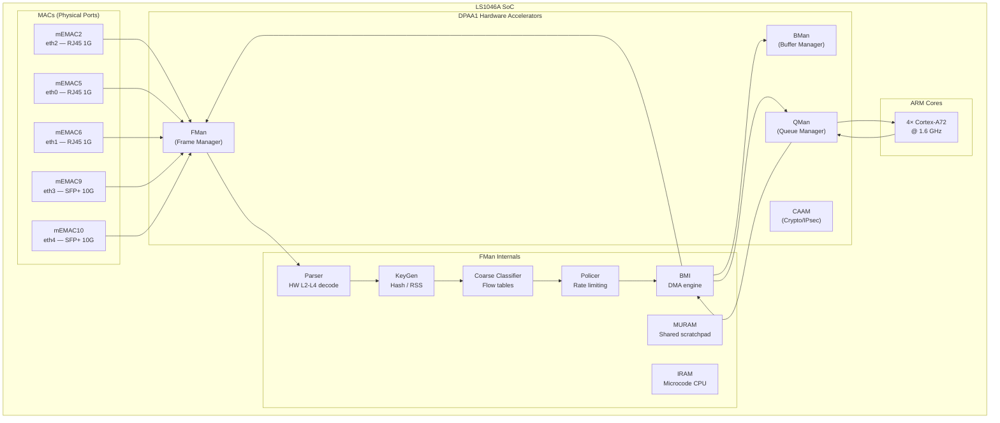
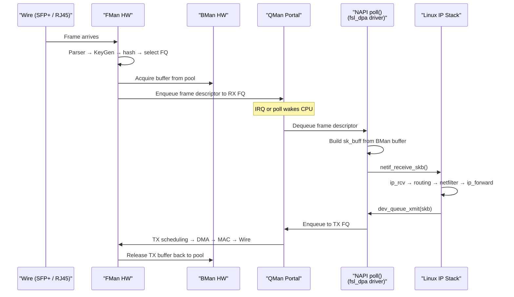
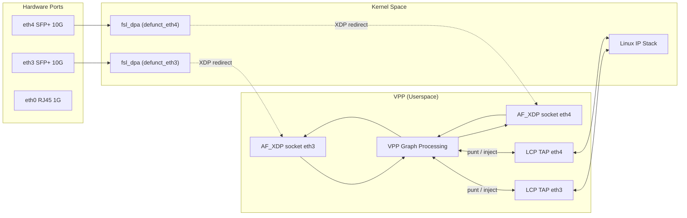
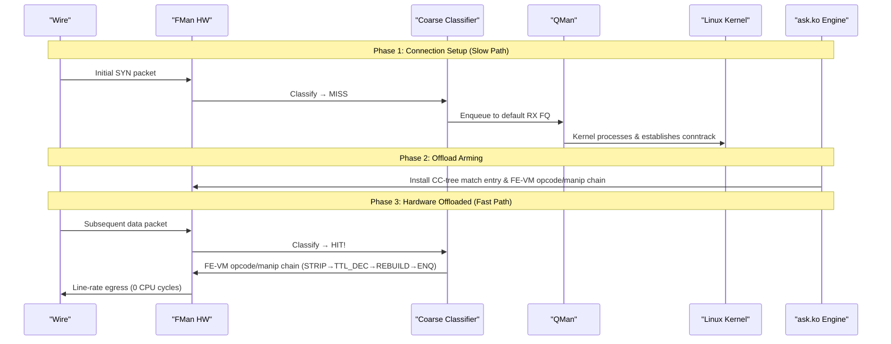

# LS1046A Networking Architecture Deep Dive
**Version 2.0.0** · 2026-08-01 · HADS 1.0.0

---

## AI READING INSTRUCTION

Read `[SPEC]` and `[BUG]` blocks for authoritative facts.
Read `[NOTE]` only if additional context is needed.
`[?]` blocks are unverified — treat with lower confidence.

---

## 1. THE SILICON: HARDWARE ACCELERATION & FMAN

**[SPEC]**
- The NXP QorIQ LS1046A combines 4× Cortex-A72 cores (@ up to 1.8 GHz) with the Data Path Acceleration Architecture (DPAA1).
- Key hardware blocks:
  - **FMan (Frame Manager)**: Packet parsing, classification, KeyGen hash distribution, rate policing, and BMI DMA.
  - **BMan (Buffer Manager)**: Hardware buffer pool management (~15 ns atomic acquire/release).
  - **QMan (Queue Manager)**: 64K hardware Frame Queues with priority scheduling and WRED congestion management.
  - **CAAM (Crypto Acceleration)**: IPsec, AES, SHA offload via Job Rings and QI.

### 1.1 SoC Block Diagram

**[SPEC]**


### 1.2 Function Execution Matrix

**[SPEC]**

| Function | Execution Location | Operation Details |
|----------|-------------------|-------------------|
| **Ethernet MAC** | mEMAC Silicon | SerDes, PHY interface, CRC, flow control, pause frames. |
| **Frame Parser** | FMan Microcode (IRAM) | Walks L2→L3→L4 headers; generates Parse Result array. |
| **KeyGen (RSS)** | FMan Hardware | Computes hash over Parse Result fields; selects 1 of 128 HW Frame Queues. |
| **Coarse Classifier** | FMan Hardware | CONT_LOOKUP group table with match entries; TCAM-style flow classification. |
| **Policer** | FMan Hardware | Dual-rate token-bucket per-flow rate limiting (srTCM/trTCM). |
| **BMI (DMA)** | FMan Hardware | Transfers frame data between DRAM and FMan FIFO via BMan pools. |
| **BMan** | Dedicated HW Block | Manages 64 hardware buffer pools (~15 ns atomic acquire/release). |
| **QMan** | Dedicated HW Block | 64K Frame Queues with priority scheduling and WRED congestion avoidance. |
| **QMan Portals** | MMIO Registers | Per-CPU cache-inhibited portal regions for low-latency doorbells. |
| **CAAM** | Dedicated Engine | Crypto acceleration (AES, SHA, IPsec ESP/AH) via hardware Job Rings. |

### 1.3 FMan Microcode Variants

**[SPEC]**
- Microcode is loaded from SPI flash (`mtd3` `fman-ucode` @ `0x400000`) and injected into the device tree by U-Boot.
- Open-Source Baseline (`106.4.18`): Performs L2–L4 classification and KeyGen RSS distribution; always enqueues to QMan.
- Proprietary Production Microcode (`v210.10.1`): Adds Coarse Classifier CONT_LOOKUP group-table support and FE-VM opcode/manip chain execution (STRIP_ETH_HDR, TTL_DECREMENT, ETH_HEADER_REBUILD, ENQUEUE_PKT).

---

## 2. KERNEL DATAPLANE & DPAA1 DRIVER

### 2.1 Kernel Frame Path

**[SPEC]**


### 2.2 Per-Packet Cost Analysis

**[SPEC]**

| Processing Step | Estimated CPU Overhead | Cache & Memory Impact |
|-----------------|------------------------|-----------------------|
| QMan portal dequeue | ~50 ns | Cache-inhibited MMIO read |
| `sk_buff` allocation & setup | ~80 ns | L1/L2 cache allocation |
| `netif_receive_skb()` / GRO | ~100 ns | Protocol demux & NAPI bookkeeping |
| Netfilter / conntrack | ~200–500 ns | Connection tracking hash walk |
| IP routing lookup (FIB) | ~50–100 ns | Radix tree traversal |
| `ip_forward` + TTL / checksum | ~30 ns | Header modification |
| `dev_queue_xmit()` / qdisc | ~100 ns | Queue discipline processing |
| QMan portal enqueue | ~50 ns | Cache-inhibited MMIO write |
| BMan buffer release | ~15 ns | Hardware command execution |
| **Total Per-Packet** | **~700–1100 ns** | **Heavy L2 cache churn** |

---

## 3. VPP & AF_XDP INTEGRATION

### 3.1 Architecture Overview

**[SPEC]**
- VPP operates as a vector-based userspace forwarding engine processing batches of up to 256 packets.
- Interfaces hand off from kernel `fsl_dpa` to VPP via AF_XDP sockets using shared UMEM rings.
- Linux Control Plane (LCP) TAP interfaces mirror control packets (ARP, BGP, SSH) back to Linux.



### 3.2 Performance Metrics on Mono Gateway

**[SPEC]**

| Metric | Measured Parameter | Hardware Value |
|--------|-------------------|----------------|
| **AF_XDP RX/TX** | Functional state | Verified working (0% loss, 0.5ms RTT) |
| **Throughput** | Maximum single-core rate | ~3.5 Gbps |
| **CPU Utilization** | Core allocation | 1 core @ 100% (polling mode) |
| **Memory Footprint** | Reserved pages | ~512 MB hugepages (2M pages) |
| **Thermal Budget** | Steady-state requirement | Requires `poll-sleep-usec 100` to prevent thermal shutdown |
| **Maximum MTU** | XDP hardware cap | 3290 bytes (DPAA1 XDP hardware limit) |

---

## 4. ASK2 HARDWARE OFFLOAD ENGINE

### 4.1 Shipping Architecture: CC-tree + SW Flowtable

**[SPEC — 2026-08-01, SUPERSEDED 2026-08-05]** ~~The shipping HW-offload architecture is **CC-tree classification (top-N flows) + kernel SW flowtable (tail) + hardware manip-chain forwarding**.~~ **(2026-08-05: never implemented in `ask.ko` (CR-007); `cc_test` harness architecturally broken (F-159–F-162); FE-VM ehash un-retired (F-163); no confirmed HIT on any path — see `plans/ASK2-MASTER-PLAN.md` top banners.)** This is the Linux flow-offload model: a TCAM-style classifier table for hot flows, software for the long tail.

**[SPEC]** Silicon-proven performance data:
- **M2 CC pass-through** (CONT_LOOKUP numKeys=0 → miss-AD → kernel FQ): 7.37 Gbps @ 0.16% CPU (2026-07-07)
- **M5 CC-tree + SW flowtable** (CC match → FE-VM opcode/manip → ENQ): 10.259 Gbps @ 0.16% CPU (2026-07-24)
- **NXP cdx.ko** (vendor production stack, opcode/manip chain): 8.58 Gbps

**[SPEC]** CC-tree scaling:
- Hardware supports **255 keys per node** (RM §8.7.4)
- Software caps `FMAN_CC_MAX_STATIC_KEYS=32` and `FMAN_PCD_CC_HW_MAX_KEYS=32` are **software struct limits**, not silicon limits
- MURAM arena 64 KiB → ~8 nodes → **~2000+ HW-offloaded flows**, zero per-frame DDR access
- Long tail flows handled by kernel SW flowtable (`nf_flowtable`)

### 4.2 Offload Flow Architecture

**[SPEC]**


### 4.3 CC Comparator: KG-Emitted Composite

**[SPEC]** The CC comparator reads **KG-emitted bytes**, not a re-extracted canonical composite. Patch 0108 (`kernel/common/patches/board/0108-fman-pcd-cc-pack-key-kg-emitted-composite.patch`) rewrote `cc_pack_key()` to the silicon-truth KG-emitted composite:

```
[SIP(4)|DIP(4)|SPI(4)=0|SPORT(2)|DPORT(2)] = 16 bytes
```

The old 0098 layout (`[ETYPE|PROTO|FLAGS|SRCIP|DSTIP|SPORT|DPORT]`) "could NEVER match" because the CC comparator sees what KG emitted, not a software-reconstructed canonical form.

**[SPEC]** EKFC extraction order is MSB-first/descending-bit: PORT_ID, SIP, DIP, PROTO, SPORT, DPORT (14 bytes, EKFC=0x801C0006). Settled 2026-08-06/07/08 by hardware CRC-64 match (184,320-candidate brute force, 16-candidate batch test, independent re-confirmation). PORT_ID = `0x00` for eth4/port 0x11. The old 13-byte `0x001C0006` (2026-07-13) is superseded. The CC comparator's 16-byte compare window uses the KG-emitted composite (patch 0108), which includes a zero-filled SPI slot — a structurally different layout from the 14-byte EKFC extraction.

### 4.4 FE-VM ehash (EXT_HASH DDR Lookup) — retired 08-01, UN-RETIRED 08-05

**[NOTE — updated 2026-08-05]** The FE-VM ehash HIT path (Fork-B: EXT_HASH → DDR bucket table → MUX → ENQ) was declared a **dead end** on 2026-08-01 on the four grounds below; ground 3 is **refuted** and ground 5 is **weakened** as of 2026-08-05:

1. **Per-frame DDR hash lookup** (~50–100 ns) imposes a ~1.5 Gbps ceiling — fundamentally unscalable for line-rate forwarding *(theoretical bound, never measured against real vendor traffic)*
2. **Per-frame ALLOCATE/DEALLOCATE churn** in the FE-VM workspace pool adds overhead on every frame
3. ~~**Not the vendor architecture**: NXP's production `cdx.ko` uses a hardware opcode/manip chain, not a per-frame DDR hash~~ **REFUTED (F-163, 2026-08-05):** the deployed vendor `cdx.ko` classifies every accelerated flow via `insert_entry_in_classif_table()` → `fill_key_info()` → `ExternalHashTableAddKey()` — external-hash IS the vendor's production classification; the opcode/manip chain executes from inside each DDR ehash entry
4. **Not the Linux flow-offload model**: `TC Flower`/`nf_flowtable` offload is a TCAM-classifier-table abstraction (i.e. CC-tree), not a per-frame hash lookup
5. **F-156/F-157/F-158 proved the scaffold byte-perfect** (H1 mask CLOSED, H2 padding CLOSED) but the CC engine still does not dispatch to the FE-VM — **weakened (F-165, 2026-08-05):** every prior arm test ran through the F-091 scaffold-overwrite bug, so the port was pointed at an empty scaffold match table, never at the built chain; the corrected chain (14-byte PORT_ID key, `EKFC 0x801C0006`, F-163) has never been genuinely exercised. Retest = T-M3-R
6. **M3/M5 "HIT gate PASSED" claims were false positives** (FQID 0x200 ambiguity): the FE-VM ENQ and the CC miss-AD both targeted kernel FQID `0x200`, so HIT and MISS were indistinguishable by every instrument in use. Only real HIT was RCCB→FE_ENTER direct (2026-07-04, keysize=8 ICMP).

**[NOTE — updated 2026-08-05]** The FE-VM **opcode execution** claim ("shipping, 10.259 Gbps, M5") is itself under mechanism-retraction review — M5 most likely measured kernel `nf_flowtable` (qdrant tag `no-confirmed-hw-hit-ever`), and the opcode chain only executes after a HIT, which no path has produced. The ehash *matching* sub-mechanism is un-retired and under re-validation; the CC-tree scale-out path (multi-node allocation) is arithmetic-only until its own harness is rebuilt (`cc_test` condemned, F-159–F-162).

---

## 5. ARCHITECTURAL COMPARISON MATRIX

**[SPEC]**

| Dimension | Linux Kernel | VPP (AF_XDP) | ASK2 (`ask.ko`) |
|-----------|--------------|--------------|-----------------|
| **Forwarding Engine** | CPU (kernel IP stack) | CPU (VPP graph) | FMan Silicon (CC-tree + FE-VM opcode/manip) |
| **Per-Packet CPU Cost** | ~700–1100 ns | ~250–400 ns | **0 ns** (offloaded) |
| **10G Throughput (1500B)** | ~3.6 Gbps | ~3.5 Gbps | **~10.3 Gbps** (line rate) |
| **10G Throughput (64B)** | ~650 Mbps | ~1.5 Gbps | **~10.3 Gbps** (line rate) |
| **Dedicated CPU Cores** | 0 (interrupts) | 1 (poll-mode) | **0** |
| **Thermal Overhead** | Low | High (requires sleep tuning) | **Low** (same as idle) |
| **Memory Footprint** | ~0 extra | ~512 MB hugepages | ~20 MB |
| **VyOS CLI Status** | Native | `set vpp` | `set interfaces ethX offload ask` |
| **HW Flow Capacity** | N/A | N/A | ~2000+ (CC-tree), tail via SW flowtable |
| **Offload Model** | N/A | N/A | Linux flow-offload (TCAM classifier + SW tail) |