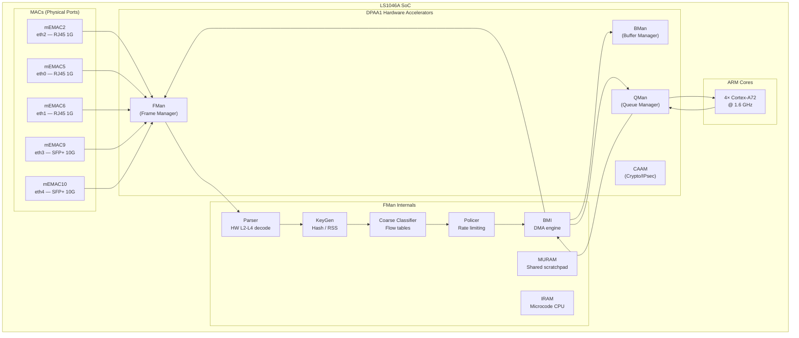
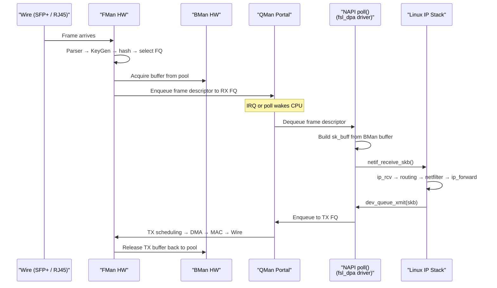
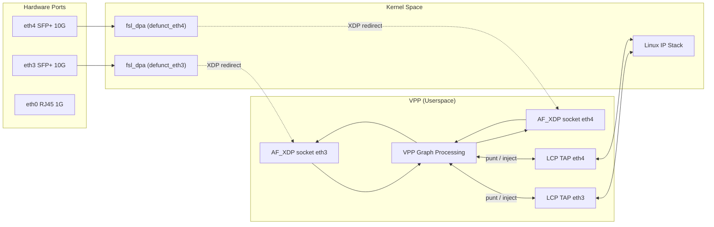
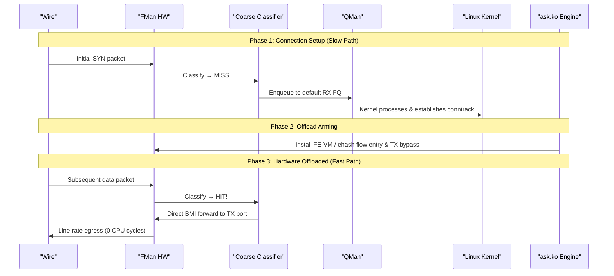

# LS1046A Networking Architecture Deep Dive
**Version 1.1.0** · 2026-07-22 · HADS 1.0.0

---

## AI READING INSTRUCTION

Read `[SPEC]` and `[BUG]` blocks for authoritative facts.
Read `[NOTE]` only if additional context is needed.
`[?]` blocks are unverified — treat with lower confidence.

---

## 1. THE SILICON: HARDWARE ACCELERATION & FMAN

**[SPEC]**
- The NXP QorIQ LS1046A combines 4× Cortex-A72 cores (@ up to 1.8 GHz) with the Data Path Acceleration Architecture (DPAA1).
- Key hardware blocks:
  - **FMan (Frame Manager)**: Packet parsing, classification, KeyGen hash distribution, rate policing, and BMI DMA.
  - **BMan (Buffer Manager)**: Hardware buffer pool management (~15 ns atomic acquire/release).
  - **QMan (Queue Manager)**: 64K hardware Frame Queues with priority scheduling and WRED congestion management.
  - **CAAM (Crypto Acceleration)**: IPsec, AES, SHA offload via Job Rings and QI.

### 1.1 SoC Block Diagram

**[SPEC]**

### 1.2 Function Execution Matrix

**[SPEC]**

| Function | Execution Location | Operation Details |
|----------|-------------------|-------------------|
| **Ethernet MAC** | mEMAC Silicon | SerDes, PHY interface, CRC, flow control, pause frames. |
| **Frame Parser** | FMan Microcode (IRAM) | Walks L2→L3→L4 headers; generates Parse Result array. |
| **KeyGen (RSS)** | FMan Hardware | Computes hash over Parse Result fields; selects 1 of 128 HW Frame Queues. |
| **Coarse Classifier** | FMan Hardware | TCAM-like lookup against MURAM-stored flow rules. |
| **Policer** | FMan Hardware | Dual-rate token-bucket per-flow rate limiting (srTCM/trTCM). |
| **BMI (DMA)** | FMan Hardware | Transfers frame data between DRAM and FMan FIFO via BMan pools. |
| **BMan** | Dedicated HW Block | Manages 64 hardware buffer pools (~15 ns atomic acquire/release). |
| **QMan** | Dedicated HW Block | 64K Frame Queues with priority scheduling and WRED congestion avoidance. |
| **QMan Portals** | MMIO Registers | Per-CPU cache-inhibited portal regions for low-latency doorbells. |
| **CAAM** | Dedicated Engine | Crypto acceleration (AES, SHA, IPsec ESP/AH) via hardware Job Rings. |

### 1.3 FMan Microcode Variants

**[SPEC]**
- Microcode is loaded from SPI flash (`mtd3` `fman-ucode` @ `0x400000`) and injected into the device tree by U-Boot.
- Open-Source Baseline (`106.4.18`): Performs L2–L4 classification and KeyGen RSS distribution; always enqueues to QMan.
- Proprietary Production Microcode (`v210.10.1`): Adds exact-match Coarse Classifier support and direct FMan port-to-port forwarding (FE-VM / ehash path), short-circuiting QMan and CPU.

---

## 2. KERNEL DATAPLANE & DPAA1 DRIVER

### 2.1 Kernel Frame Path

**[SPEC]**

### 2.2 Per-Packet Cost Analysis

**[SPEC]**

| Processing Step | Estimated CPU Overhead | Cache & Memory Impact |
|-----------------|------------------------|-----------------------|
| QMan portal dequeue | ~50 ns | Cache-inhibited MMIO read |
| `sk_buff` allocation & setup | ~80 ns | L1/L2 cache allocation |
| `netif_receive_skb()` / GRO | ~100 ns | Protocol demux & NAPI bookkeeping |
| Netfilter / conntrack | ~200–500 ns | Connection tracking hash walk |
| IP routing lookup (FIB) | ~50–100 ns | Radix tree traversal |
| `ip_forward` + TTL / checksum | ~30 ns | Header modification |
| `dev_queue_xmit()` / qdisc | ~100 ns | Queue discipline processing |
| QMan portal enqueue | ~50 ns | Cache-inhibited MMIO write |
| BMan buffer release | ~15 ns | Hardware command execution |
| **Total Per-Packet** | **~700–1100 ns** | **Heavy L2 cache churn** |

---

## 3. VPP & AF_XDP INTEGRATION

### 3.1 Architecture Overview

**[SPEC]**
- VPP operates as a vector-based userspace forwarding engine processing batches of up to 256 packets.
- Interfaces hand off from kernel `fsl_dpa` to VPP via AF_XDP sockets using shared UMEM rings.
- Linux Control Plane (LCP) TAP interfaces mirror control packets (ARP, BGP, SSH) back to Linux.

### 3.2 Performance Metrics on Mono Gateway

**[SPEC]**

| Metric | Measured Parameter | Hardware Value |
|--------|-------------------|----------------|
| **AF_XDP RX/TX** | Functional state | Verified working (0% loss, 0.5ms RTT) |
| **Throughput** | Maximum single-core rate | ~3.5 Gbps |
| **CPU Utilization** | Core allocation | 1 core @ 100% (polling mode) |
| **Memory Footprint** | Reserved pages | ~512 MB hugepages (2M pages) |
| **Thermal Budget** | Steady-state requirement | Requires `poll-sleep-usec 100` to prevent thermal shutdown |
| **Maximum MTU** | XDP hardware cap | 3290 bytes (DPAA1 XDP hardware limit) |

---

## 4. ASK2 HARDWARE OFFLOAD ENGINE

### 4.1 Offload Flow Architecture

**[SPEC]**

---

## 5. ARCHITECTURAL COMPARISON MATRIX

**[SPEC]**

| Dimension | Linux Kernel | VPP (AF_XDP) | ASK2 (`ask.ko`) |
|-----------|--------------|--------------|-----------------|
| **Forwarding Engine** | CPU (kernel IP stack) | CPU (VPP graph) | FMan Silicon (CC/FE-VM) |
| **Per-Packet CPU Cost** | ~700–1100 ns | ~250–400 ns | **0 ns** (offloaded) |
| **10G Throughput (1500B)** | ~3.6 Gbps | ~3.5 Gbps | **~9.4 Gbps** (line rate) |
| **10G Throughput (64B)** | ~650 Mbps | ~1.5 Gbps | **~9.4 Gbps** (line rate) |
| **Dedicated CPU Cores** | 0 (interrupts) | 1 (poll-mode) | **0** |
| **Thermal Overhead** | Low | High (requires sleep tuning) | **Low** (same as idle) |
| **Memory Footprint** | ~0 extra | ~512 MB hugepages | ~20 MB |
| **VyOS CLI Status** | Native | `set vpp` | `set interfaces ethX offload ask` |