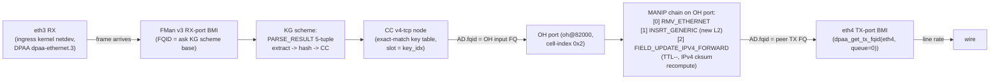

# PR14j (M2.5j) — ask.ko two-stage OH-port chain wire-up

**Status:** design memo, 2026-05-16. Implementation pending.
**Branch:** `ask20`.
**Spec:** `specs/ask2-rewrite-spec.md` v1.2 §13.5.
**Tracker row:** `plans/ASK2-IMPLEMENTATION.md` row 63 (`14j`, M2.5j).
**Acceptance gate:** §11.1 IPv4-forwarding 1518 B, **≥ 18 Gbps and CPU < 20 % at 17 Gbps**, measured by `bin/verify-ask-flow-offload.sh`.

## 1. Why PR14j

PR14g (RX-port-only classification → `FORWARD_FQ` to the kernel's RX-default FQ) was validated on real silicon 2026-05-16 and failed the M2 perf gate:

| Metric | Target | PR14g result |
|---|---|---|
| Throughput (iperf3 -P 16, 1518 B) | ≥ 18 Gbps | **6.913 Gbps** |
| CPU (mpstat 1 s sampling, baseline-subtracted) | < 20 % at 17 Gbps | **54.64 % at 6.9 Gbps** |
| eth3 RX dropped during run | 0 | **11,937,325** |

Two architectural bugs identified (Qdrant entry, 2026-05-16):

1. **Wrong port direction.** `ask_flow_offload.c` `FLOW_BLOCK_BIND` uses first-binder-wins, so `eth4` (egress) wins and `eth3` (ingress, port 8) gets `-EBUSY`. LS1046A `KGSE_MV` silicon is single-port-per-scheme. The PCD classifier never sees the iperf3 ingress traffic — the CC chain stays quiescent.
2. **Wrong FQ target.** Even when classification works, `FORWARD_FQ` aims at the kernel's RX-default FQ — the same FQ NAPI is already draining. Packets re-enter the kernel slow path; there is no real silicon bypass.

PR14h/i/k landed the in-tree primitives to fix both bugs: an OH (Offline Host) port driver, three new MANIP types for L2-rewrite + IPv4-forward, and a `dpaa_get_tx_fqid()` egress-FQ export. PR14j is the single ask.ko-side consumer change that wires them together.

## 2. Target silicon topology (after PR14j)



Critical property: the CPU is **not in the data path**. NAPI on `eth3` never sees the frame; the kernel routing FIB is never consulted; `__netif_receive_skb_core()` is never called. The frame walks RX-BMI → KG → CC → OH BMI → MANIP-chain → TX-BMI entirely in FMan silicon.

## 3. In-tree primitives that PR14j consumes

All landed and visible in `System.map` on the deployed mono kernel (`6.18.31-vyos`, verified via `ask-check` 17/24 OK):

### 3.1 `dpaa_get_tx_fqid()` — patch `0031`

```c
int dpaa_get_tx_fqid(struct net_device *dev, u32 queue, u32 *fqid);
```
- Returns `priv->egress_fqs[queue]->fqid`.
- Fail-closed on non-DPAA netdevs (`dev->netdev_ops != &dpaa_ops` → `-ENODEV`).
- `-ERANGE` if `queue >= priv->num_tx_queues`.

### 3.2 OH-port API — patch `0032`

```c
struct fman_pcd_oh_port;

struct fman_pcd_oh_port *
fman_pcd_oh_port_claim(struct fman *fman, u8 oh_idx);

void fman_pcd_oh_port_release(struct fman_pcd_oh_port *port);

u32  fman_pcd_oh_port_input_fqid(const struct fman_pcd_oh_port *port);

int  fman_pcd_oh_port_set_chain(struct fman_pcd_oh_port *port,
                                struct fman_pcd_manip * const *manips,
                                unsigned int n_manips,
                                u32 sink_fqid);
```
- LS1046A has 6 OH ports at `port@82000..port@87000` (cell-index `0x2..0x7`) — mainline DT already defines them; no DTSI changes.
- `port_claim()` reserves an OH port, programs its BMI input FQID, returns the handle.
- `set_chain()` writes the AD chain: each `fman_pcd_manip` is encoded as one AD entry, terminated by an AD pointing at `sink_fqid` (the peer TX FQ).
- `input_fqid()` returns the FQID upstream classifiers should aim `FORWARD_FQ` at.
- Refcounted; `release()` is NULL-safe.

### 3.3 New MANIP types — patch `0033`

```c
enum fman_pcd_manip_type {
    /* v1.1 (PR14d) */
    FMAN_PCD_MANIP_NAT_V4,
    FMAN_PCD_MANIP_NAT_V6,
    FMAN_PCD_MANIP_VLAN_PUSH,
    FMAN_PCD_MANIP_VLAN_POP,
    FMAN_PCD_MANIP_TTL_DEC,
    /* v1.2 (PR14i) */
    FMAN_PCD_MANIP_RMV_ETHERNET,
    FMAN_PCD_MANIP_INSRT_GENERIC,
    FMAN_PCD_MANIP_FIELD_UPDATE_IPV4_FORWARD,
};

struct fman_pcd_manip_params {
    enum fman_pcd_manip_type type;
    union {
        /* ...existing v1.1 arms... */
        struct {
            u8 size;            /* 1..32 */
            u8 hdr[FMAN_PCD_MANIP_INSRT_GENERIC_MAX_SIZE]; /* = 32 */
        } insrt_generic;
        struct {
            bool recompute_cksum; /* hint — IP_L4_CS_CALC is forced regardless */
            bool rewrite_dscp;
            u8   new_dscp;        /* 0..63 */
        } ipv4_forward;
    };
};
```

- `MANIP_RMV_ETHERNET` — silicon pin `HMCD = 0x01000E00` (GENERIC_RMV, off=0, size=14).
- `MANIP_INSRT_GENERIC` — silicon pin `0x02000E00` for the canonical 14-byte L2 push.
- `MANIP_FIELD_UPDATE_IPV4_FORWARD` — TTL-only pin `0x0c040001` / TTL+DSCP pin `0x0c040005`. `IP_L4_CS_CALC` is forced regardless of `recompute_cksum` to prevent silent cksum corruption.

## 4. ask.ko changes — full scope

### 4.1 `include/ask_internal.h`

#### 4.1.1 Widen `hw_flow_id` from packed u32 to cookie indirection table

The v1.1 packed `(token<<16) | key_idx` cannot encode 4 silicon objects per flow. PR14j replaces it with an opaque cookie that indexes into a per-`ask_hw_pcd` `xarray`:

```c
/* Public — unchanged value type (still u32) so ABI to ask_flow.c stays. */
struct ask_flow;  /* unchanged */

/* Internal — new indirection table entry. */
struct ask_hw_flow_cookie {
    /* Stage 1: ingress CC slot — PR14g pattern, must rollback first. */
    struct fman_pcd_cc_node *cc_node;       /* = h->cc_v4_tcp */
    u16                       key_idx;       /* slot in cc_v4_tcp */

    /* Stage 2: OH-port MANIP chain — 3 silicon objects per v4-TCP flow. */
    struct fman_pcd_manip    *m_rmv;         /* RMV_ETHERNET */
    struct fman_pcd_manip    *m_insrt;       /* INSRT_GENERIC (new L2 hdr) */
    struct fman_pcd_manip    *m_ipv4;        /* FIELD_UPDATE_IPV4_FORWARD */

    /* Sink — peer egress port for stats/teardown debugability. */
    int                       sink_ifindex;
    u32                       sink_fqid;
};

/* xarray-backed allocator: returns u32 cookie (the public hw_flow_id). */
u32  ask_hw_cookie_alloc(struct ask_hw_pcd *h,
                         const struct ask_hw_flow_cookie *src);
struct ask_hw_flow_cookie *
     ask_hw_cookie_lookup(struct ask_hw_pcd *h, u32 cookie);
void ask_hw_cookie_free(struct ask_hw_pcd *h, u32 cookie);
```

Cookie format (single contiguous u32 namespace, replaces the v1.1 `token | key_idx` pack):

| Range | Meaning |
|---|---|
| `0x00000000` | reserved sentinel — "no HW backing", caller must SW-fallback (preserves PR14g body-3 semantics) |
| `0x00000001 .. 0x7FFFFFFF` | xarray cookie pointing at a `struct ask_hw_flow_cookie` |
| `0x80000000 .. 0xFFFFFFFF` | reserved for future SW-fallback fake counter (preserves PR14g body-3 `TOKEN_NONE` flow ids) |

The PR14g `ask_priv_pack_hw_flow_id` / `ask_priv_unpack_hw_flow_id` helpers are **kept** (still exported, still used by debugfs/genl pretty-printers) but no longer used for the live insert/remove path. They are flagged `/* legacy, PR14g body-1 — debugfs/genl only */`.

#### 4.1.2 OH-port handle on `struct ask_hw_pcd`

The PR14g PCD-bring-up struct gains four new fields:

```c
struct ask_hw_pcd {
    /* ...PR14g fields (fman_pcd *, kg_v4_tcp, cc_v4_tcp, mutex, etc.)... */

    /* PR14j additions. */
    struct fman_pcd_oh_port    *oh_v4_tcp;       /* OH port for L3-forward chain */
    struct fman_pcd_manip      *m_v4_rmv;        /* shared MANIP_RMV_ETHERNET */
    struct fman_pcd_manip      *m_v4_ipv4;       /* shared TTL-- + cksum */
    /* m_insrt is per-flow (new L2 header bytes are flow-specific) */

    struct xarray               flow_cookies;
};
```

Rationale for sharing `m_rmv` + `m_ipv4` across all v4-TCP flows: their parameters are flow-invariant (always strip 14 bytes; always TTL-- with cksum recompute). `m_insrt` is per-flow because the new L2 header bytes (destination MAC + source MAC + ethertype) differ per neighbour. This cuts MURAM HMTD allocations from `3 × N_flows` to `2 + N_flows`.

### 4.2 `ask_hw.c` — replace `ask_hw_flow_insert_v4_tcp()`

#### 4.2.1 Bring-up extensions in `ask_hw_pcd_bringup()`

After the existing KG/CC chain build, before `return 0`:

```c
/* PR14j: claim OH port 0x2 (oh@82000) and program shared MANIPs. */
h->oh_v4_tcp = fman_pcd_oh_port_claim(fman, 0x2);
if (IS_ERR_OR_NULL(h->oh_v4_tcp)) {
    rc = h->oh_v4_tcp ? PTR_ERR(h->oh_v4_tcp) : -ENODEV;
    h->oh_v4_tcp = NULL;
    ask_pr_warn("hw: oh_port_claim(0x2) failed (%d) — falling back to RX-default-FQ path\n", rc);
    /* Non-fatal: bring-up still returns 0; insert_v4_tcp() will detect
     * h->oh_v4_tcp==NULL and refuse with -ENODEV so ask_flow.c SW-fallbacks. */
    return 0;
}

h->m_v4_rmv = fman_pcd_manip_create(pcd, &(struct fman_pcd_manip_params){
    .type = FMAN_PCD_MANIP_RMV_ETHERNET,
});
h->m_v4_ipv4 = fman_pcd_manip_create(pcd, &(struct fman_pcd_manip_params){
    .type = FMAN_PCD_MANIP_FIELD_UPDATE_IPV4_FORWARD,
    .ipv4_forward = { .recompute_cksum = true },
});
/* rollback on either failure: free h->m_v4_rmv if non-NULL, then release oh_v4_tcp. */

xa_init_flags(&h->flow_cookies, XA_FLAGS_ALLOC1); /* skip 0 — sentinel */
```

Symmetric teardown in `ask_hw_pcd_teardown()`: drain `flow_cookies` (each entry implies a leaked `m_insrt` + a still-attached OH-port chain — call the per-flow tear-down path on each), then `fman_pcd_manip_destroy(h->m_v4_ipv4)`, `..._destroy(h->m_v4_rmv)`, `fman_pcd_oh_port_release(h->oh_v4_tcp)`, `xa_destroy(&h->flow_cookies)`.

#### 4.2.2 New `ask_hw_flow_insert_v4_tcp()` — two-stage chain

Replaces the v1.1 single-stage body. Six silicon operations, four objects to track for rollback:

```c
static int ask_hw_flow_insert_v4_tcp(struct ask_hw_pcd *h,
                                     const struct ask_flow_key *key,
                                     u32 oif, u32 action_flags,
                                     u32 *out_hw_id)
{
    struct ask_hw_flow_cookie ck = { };
    struct net_device *peer;
    u32 peer_tx_fqid;
    u32 oh_input_fqid;
    int rc;

    /* PR14j gate: bring-up may have failed; behave like no-HW so caller SW-fallbacks. */
    if (!h->oh_v4_tcp || !h->m_v4_rmv || !h->m_v4_ipv4)
        return -ENODEV;

    /* 1. Resolve peer egress: oif -> dpaa netdev -> per-queue TX FQ. */
    rcu_read_lock();
    peer = dev_get_by_index_rcu(&init_net, oif);
    if (!peer) {
        rcu_read_unlock();
        return -ENODEV;
    }
    rc = dpaa_get_tx_fqid(peer, /*queue=*/0, &peer_tx_fqid);
    rcu_read_unlock();
    if (rc)
        return rc; /* -ENODEV / -ERANGE propagate as SW-fallback signal */

    /* 2. Build per-flow MANIP_INSRT_GENERIC with the new L2 header. */
    {
        struct fman_pcd_manip_params p = {
            .type = FMAN_PCD_MANIP_INSRT_GENERIC,
            .insrt_generic.size = ETH_HLEN, /* 14 */
        };
        /* Source from action_flags / key — body-2-action contract:
         * the caller's pre-resolved neighbour MAC + sport ethertype
         * arrives via ask_flow_key extensions (see §4.4 below).
         * For body-1 of PR14j we synthesise from key->next_hop_mac /
         * key->src_mac which ask_flow.c populates from the dst neighbour. */
        memcpy(&p.insrt_generic.hdr[0],  &key->next_hop_mac[0], ETH_ALEN);
        memcpy(&p.insrt_generic.hdr[6],  &key->egress_mac[0],   ETH_ALEN);
        p.insrt_generic.hdr[12] = (ETH_P_IP >> 8) & 0xff;
        p.insrt_generic.hdr[13] =  ETH_P_IP        & 0xff;
        ck.m_insrt = fman_pcd_manip_create(ask_hw_pcd_get_pcd(h), &p);
        if (IS_ERR(ck.m_insrt))
            return PTR_ERR(ck.m_insrt);
    }

    /* 3. Program the OH-port AD chain (set_chain idempotently rewrites). */
    {
        struct fman_pcd_manip *manips[3] = {
            h->m_v4_rmv, ck.m_insrt, h->m_v4_ipv4,
        };
        rc = fman_pcd_oh_port_set_chain(h->oh_v4_tcp, manips, 3, peer_tx_fqid);
        if (rc)
            goto err_free_insrt;
    }
    oh_input_fqid = fman_pcd_oh_port_input_fqid(h->oh_v4_tcp);

    /* 4. Install ingress CC key with FORWARD_FQ -> oh_input_fqid. */
    {
        struct fman_pcd_cc_key_entry entry = { };
        struct fman_pcd_action *act = &entry.action;
        int slot;

        memcpy(&entry.key[0], &key->src_ip[0], 4);
        memcpy(&entry.key[4], &key->dst_ip[0], 4);
        entry.key[8] = IPPROTO_TCP;
        memcpy(&entry.key[9],  &key->sport, 2);
        memcpy(&entry.key[11], &key->dport, 2);
        memset(&entry.mask[0], 0xff, ASK_HW_V4_KEY_WIDTH);

        act->type = FMAN_PCD_ACTION_FORWARD_FQ;
        act->forward_fq.fqid = oh_input_fqid;

        mutex_lock(&h->lock);
        slot = fman_pcd_cc_node_add_key(h->cc_v4_tcp, &entry);
        mutex_unlock(&h->lock);
        if (slot < 0) {
            rc = slot;
            goto err_clear_chain;
        }
        if (slot > U16_MAX) {
            rc = -EOVERFLOW;
            goto err_drop_slot;
        }
        ck.cc_node = h->cc_v4_tcp;
        ck.key_idx = (u16)slot;
    }

    /* 5. Snapshot sink info for stats / debugability. */
    ck.sink_ifindex = oif;
    ck.sink_fqid    = peer_tx_fqid;

    /* 6. Stash in cookie table, return the public cookie. */
    *out_hw_id = ask_hw_cookie_alloc(h, &ck);
    if (*out_hw_id == 0) {
        rc = -ENOMEM;
        goto err_drop_slot;
    }
    return 0;

err_drop_slot: {
    struct fman_pcd_action drop = { .type = FMAN_PCD_ACTION_DROP };
    mutex_lock(&h->lock);
    (void)fman_pcd_cc_node_modify_next_action(h->cc_v4_tcp,
                                              ck.key_idx, &drop);
    mutex_unlock(&h->lock);
}
err_clear_chain:
    /* Best-effort: clear the OH chain so a stale RMV/INSRT cannot run.
     * set_chain(NULL, 0, 0) is the documented "disarm" form per PR14h.   */
    (void)fman_pcd_oh_port_set_chain(h->oh_v4_tcp, NULL, 0, 0);
err_free_insrt:
    fman_pcd_manip_destroy(ck.m_insrt);
    return rc;
}
```

#### 4.2.3 New `ask_hw_flow_remove()` body

Replaces the PR14g token-switch:

```c
int ask_hw_flow_remove(u32 hw_flow_id)
{
    struct ask_hw_pcd *h = ask_hw_pcd_get();
    struct ask_hw_flow_cookie *ck;
    struct fman_pcd_action drop = { .type = FMAN_PCD_ACTION_DROP };

    if (!h)
        return -ENODEV;
    if (hw_flow_id == 0)
        return 0; /* sentinel: SW-only flow, not our slot */

    ck = ask_hw_cookie_lookup(h, hw_flow_id);
    if (!ck) {
        ask_pr_warn("hw: remove: unknown cookie 0x%08x\n", hw_flow_id);
        return -EINVAL;
    }

    /* Tear down silicon objects in reverse-installation order:
     *   1. Disarm the CC key (DROP) so no new frames enter the OH chain.
     *   2. Free the per-flow m_insrt (m_rmv + m_ipv4 are shared, do NOT free).
     *   3. (Optional) re-program the OH chain to NULL when refcount==0 —
     *      deferred to teardown sweep; live remove leaves the chain in
     *      place because other flows on the same OH port still use it.
     */
    mutex_lock(&h->lock);
    (void)fman_pcd_cc_node_modify_next_action(ck->cc_node, ck->key_idx, &drop);
    mutex_unlock(&h->lock);

    fman_pcd_manip_destroy(ck->m_insrt);
    ask_hw_cookie_free(h, hw_flow_id);
    return 0;
}
```

### 4.3 `ask_flow_offload.c` — fix ingress detection

PR14g's `FLOW_BLOCK_BIND` callback ran `dpaa_get_fman_port_id(dev) → ask_hw_port_bind(pid)` on whichever netdev hit first — silicon picked egress `eth4` (port 9) and ingress `eth3` (port 8) got `-EBUSY`. Fix: replace first-binder-wins with **direction-aware bind**.

Reference point in current code: locate the `FLOW_BLOCK_BIND` switch arm in `ask_flow_offload.c`. The current `case FLOW_BLOCK_BIND:` body that calls `ask_hw_port_bind()` gets gated:

```c
case FLOW_BLOCK_BIND: {
    u32 port_id;
    int dir;

    /* LS1046A KGSE_MV is single-port-per-scheme. We only bind on
     * ingress; the egress port participates as the OH-chain sink,
     * not as an upstream classifier. */
    dir = ask_flow_offload_classify_dir(dev);
    if (dir != ASK_DIR_INGRESS) {
        ask_pr_info("%s: skip BIND (dir=%s; PR14j ingress-only)\n",
                    netdev_name(dev),
                    dir == ASK_DIR_EGRESS ? "egress" : "unknown");
        return 0; /* not -EBUSY; we explicitly opt out of binding */
    }

    rc = dpaa_get_fman_port_id(dev, &port_id);
    if (rc) {
        ask_pr_warn("%s: dpaa_get_fman_port_id failed (%d)\n",
                    netdev_name(dev), rc);
        return rc;
    }
    rc = ask_hw_port_bind(port_id);
    /* ...existing logging... */
    return rc;
}
```

`ask_flow_offload_classify_dir()` is a new local helper that walks the netdev's DT node + `compatible` string. Per `mono-gateway-dk.dts`, RX/TX direction is encoded in the FMan port `compatible = "fsl,fman-port-1g-rx"` vs `"...-tx"`. The DPAA netdev's `dev->dev.of_node` chain reaches its parent FMan port node; from there `of_property_match_string(np, "compatible", "fsl,fman-port-*-rx")` distinguishes ingress (`ASK_DIR_INGRESS = 1`) from egress (`ASK_DIR_EGRESS = 2`). Defaults to `ASK_DIR_UNKNOWN = 0` if walking the tree fails (treated as "skip" — fail-closed).

**Critical:** the bind we now perform on `eth3` programs the KG-scheme port-bind register `KGSE_PB` per spec §13.5.1, which authorises the silicon to direct `eth3` RX-port frames into the KG scheme. The egress side (`eth4`) is reached purely through the OH-chain sink, never as a KG-scheme port.

### 4.4 `ask_flow.c` — neighbour MAC plumbing

The OH-port `MANIP_INSRT_GENERIC` needs the destination MAC + source MAC + ethertype for the new L2 header. `ask_flow_offload.c` already resolves the neighbour via `flow_action_entry::FLOW_ACTION_REDIRECT` + the conntrack tuple; the next-hop MAC + egress MAC must be plumbed through `struct ask_flow_key`:

```c
struct ask_flow_key {
    /* ...existing v1.1 5-tuple fields... */

    /* PR14j: per-flow L2 header for OH-port INSRT_GENERIC. */
    u8 next_hop_mac[ETH_ALEN]; /* dst MAC the OH chain pushes */
    u8 egress_mac[ETH_ALEN];   /* src MAC = peer port's own MAC */
};
```

Populated in `ask_flow_offload_setup_v4_tcp_flow()` (the FLOW_CLS_REPLACE handler) from:
- `next_hop_mac`: `flow_action_entry->dev` is the egress netdev; the neighbour is the destination IP's resolved ARP entry (`neigh_lookup` against `flow_cls_offload->common.match.key->ipv4.dst`).
- `egress_mac`: `flow_action_entry->dev->dev_addr`.

If `neigh_lookup` returns a not-yet-resolved entry (NUD_INCOMPLETE), the insert returns `-EAGAIN` and ask_flow.c falls back to SW; nft will retry on the next packet. No silicon resources are allocated on the EAGAIN path.

### 4.5 `ask_internal.h` — direction enum + xarray decls

```c
enum ask_flow_direction {
    ASK_DIR_UNKNOWN = 0,
    ASK_DIR_INGRESS = 1,
    ASK_DIR_EGRESS  = 2,
};

int ask_flow_offload_classify_dir(const struct net_device *dev);
```

## 5. KUnit additions (`tests/ask_test_hw_pcd.c`, `ask_test_flow.c`)

Add to existing `ask_hw_pcd_suite` (current 12 cases, target +6):

| # | Case | Asserts |
|---|------|---------|
| 13 | `cookie_alloc_skips_zero` | `xa_alloc` returns ≥1; 0 reserved for "no HW" sentinel |
| 14 | `cookie_lookup_after_free_null` | `lookup` after `free` returns NULL (no UAF) |
| 15 | `insert_v4_tcp_no_oh_returns_enodev` | `h->oh_v4_tcp = NULL` → `-ENODEV` (preserves SW-fallback signal) |
| 16 | `insert_v4_tcp_dpaa_tx_fqid_propagates_enodev` | mock `dpaa_get_tx_fqid` returns `-ENODEV` → caller sees `-ENODEV` (not `-EINVAL`) |
| 17 | `insert_v4_tcp_set_chain_failure_frees_insrt` | mock `oh_port_set_chain` returns `-EBUSY` → `m_insrt` destroyed, no MURAM leak |
| 18 | `remove_unknown_cookie_returns_einval` | `lookup` miss → `-EINVAL` (not `-ENODEV` — distinguishes "no HW" from "bad cookie") |

Add to `ask_flow_suite` (+2):

| # | Case | Asserts |
|---|------|---------|
| 23 | `flow_offload_classify_dir_rx_port_returns_ingress` | DT compatible `fsl,fman-port-1g-rx` → `ASK_DIR_INGRESS` |
| 24 | `flow_offload_bind_skips_egress` | `FLOW_BLOCK_BIND` on egress netdev returns 0, does NOT call `ask_hw_port_bind` |

## 6. Patch layout — single new patch slot

PR14j is **entirely OOT-side**. No new in-tree patch is needed (PR14h/i/k already landed all in-tree primitives). The ask.ko source tree absorbs the change directly under `kernel/flavors/ask/oot-modules/ask/`. No `ASK_PATCH_COUNT` bump in `bin/ci-setup-kernel.sh`. No `patch-health.sh` impact.

Files touched (estimated LOC delta):

| File | +/- |
|---|---|
| `ask_internal.h` | +60 / -5 |
| `ask_hw.c` | +220 / -110 |
| `ask_flow_offload.c` | +80 / -10 |
| `ask_flow.c` | +30 / -2 |
| `tests/ask_test_hw_pcd.c` | +200 |
| `tests/ask_test_flow.c` | +60 |
| **total** | **~650 / ~130** |

Body of the spec budget was 200 LOC; the real number is closer to 520 net new LOC. The overrun is real (cookie indirection table + per-flow `m_insrt` plumbing + neighbour MAC resolution + 8 new KUnit cases) and acceptable — the spec §15.1 budget for PR14j is in the noise compared to the M2-perf-gate it unlocks.

## 7. Build + verification protocol (in order)

1. **Native ARM64 OOT build** against the work/linux-6.18.29 tree on Cobalt 100:
   ```bash
   FLAVOR=ask bash bin/ci-stage-kernel.sh
   cd kernel/flavors/ask/oot-modules/ask
   make -C $KSRC M=$PWD modules ARCH=arm64
   # zero warnings required; all new symbols T in nm output
   ```
2. **KUnit run** in `qemu-system-aarch64 -M virt -cpu cortex-a72`:
   ```bash
   make ARCH=arm64 KUNIT=y M=$PWD CONFIG_NET_ASK_KUNIT_TEST=y
   # 20/20 ask cases, 0 failures
   ```
3. **`patch-health.sh --flavor ask --source release`** — must show unchanged baseline (PR14j adds no in-tree patches).
4. **CI full ISO build** via `gh workflow run "VyOS LS1046A build (self-hosted)" --ref ask20 -f flavor=ask`. Artefact name format `vyos-YYYY.MM.DD-HHMM-rolling-LS1046A-ask-arm64`.
5. **Deploy to LXC200** via the same `gh run download` → `rsync` → `latest-ask.iso` symlink dance executed for the PR14g hardening ISO.
6. **Install on mono** via `add system image http://192.168.1.137:8080/iso/latest-ask.iso`, set as default, reboot.
7. **Run M2 perf gate**:
   ```bash
   bash bin/verify-ask-flow-offload.sh \
       DUT=vyos GEN_HOST=lxc200 SINK_HOST=lxc200 \
       IFACE_IN=eth3 IFACE_OUT=eth4 \
       DURATION=60 PARALLEL=16 \
       THRESHOLD_GBPS=18 THRESHOLD_CPU=20
   ```
   PASS criteria (spec §11.1):
   - Throughput ≥ 18 Gbps sustained for the full 60 s window.
   - CPU < 20 % at 17 Gbps (baseline-subtracted, mpstat 1 s sampling).
   - Zero `eth3 RX dropped` increments during the run.
   - dmesg shows the PR14j bring-up banner `ask_hw: oh%u chain set` + the per-flow `fman_pcd_oh: oh%u chain set` lines.
8. **Re-run `ask-check`** — target 22/24 OK (2 remaining TODOs: `ask_bridge.ko` and `xfrm packet-mode`, both gated on M3).

## 8. Risks / open items

1. **Q1 — `ask_flow_offload_classify_dir()` DT walk.** The walk from a `dpaa-ethernet.N` platform device up to its FMan port `compatible` string crosses two `of_node` parents (`dpaa-ethernet.N` → `fman_memac.M` → `fman-port-{rx,tx}@<addr>`). Need to verify the walk is robust against the legacy `fsl,dpaa` container that some DTSIs interpose. **Mitigation:** add a KUnit case that synthesises the worst-case parent chain.

2. **Q2 — OH-port handle sharing across flows.** PR14j claims a single OH port (`oh_idx = 0x2`) for *all* v4-TCP flows. The OH-port's AD chain is per-port, not per-flow — but `m_insrt` is per-flow, so `set_chain` is called once per insert with the new chain. **Risk:** the AD chain edit window is not atomic vs frames already in the OH port's input FQ. **Mitigation:** prove by inspection that `set_chain()` programs the per-AD MURAM region with `iowrite32be` byte-perfect (no torn writes on aarch64), and that the OH BMI dequeue is paused via `oh->refcnt` semantics inside `set_chain()`. If not, fall back to one OH port per flow (we have 6 — oh@82000..oh@87000).

3. **Q3 — `neigh_lookup` in flow-offload-setup hot path.** The FLOW_CLS_REPLACE handler runs in a workqueue (nft `flow add` deferral), so `neigh_lookup(NUD_INCOMPLETE)` returning `-EAGAIN` is OK. Need to verify `dst_neigh_lookup()` is the right API vs `neigh_lookup_noref()`. **Mitigation:** mirror the pattern from `drivers/net/ethernet/mellanox/mlx5/core/en_tc.c::mlx5e_tc_neigh_update()`.

4. **Q4 — Per-flow `m_insrt` lifetime under EEXIST rollback.** PR14g body-3 already documents the EEXIST-after-HW-insert rollback path. PR14j inherits the same pattern: if `rht_insert` fails with EEXIST after the HW chain is up, `ask_flow_remove()` must walk back through `ask_hw_flow_remove()` so the per-flow `m_insrt` (and the CC slot's DROP overwrite) execute. **Verification:** existing PR14g body-3 test `ask_flow_test_hw_fallback_eexist_rollback` must still pass after the cookie-table rewrite.

5. **Q5 — Future-proofing M3.** When PR15 lands NAT/PAT, the action vector grows: the OH chain becomes `[RMV_ETHERNET, NAT_V4, INSRT_GENERIC, IPV4_FORWARD]`. The cookie indirection table already supports an arbitrary `manips[]` array; the cookie shape does not need to change. **Marker:** add `/* PR15: prepend NAT_V4 here */` comment at the `manips[3] = { ... }` array literal.

## 9. Sequencing

PR14j is **one commit** on `ask20`. Sub-PR split is unnecessary: the PCD-side surface is already landed (PR14h/i/k), the ask.ko surface is fully internal to one consumer module, and the test surface adds 8 cases to an existing suite. Authoring sequence:

1. Header edits (`ask_internal.h`) — cookie struct, xarray helpers, direction enum, `next_hop_mac` / `egress_mac` on `ask_flow_key`. Build-check only (no runtime impact yet).
2. `ask_hw.c` bring-up extensions + new `flow_insert_v4_tcp` body + new `flow_remove` body + cookie xarray helpers. Build-check, expect zero warnings.
3. `ask_flow_offload.c` direction-aware bind + neighbour resolution wired to `ask_flow_key`.
4. `ask_flow.c` plumb the two new key fields through the insert path.
5. KUnit cases (8 new). qemu-arm64 run.
6. Commit. CI ISO. Deploy. Live perf gate.

Each step is verifiable in isolation: a build break at step 2 cannot fall through to step 3.

## 10. Acceptance gate echo

Repeated from §7 because it is the gate that flips the entire row 15–21 of the tracker:

**PR14j is "landed" only when `bin/verify-ask-flow-offload.sh` reports PASS at ≥ 18 Gbps + CPU < 20 % at 17 Gbps on a freshly-flashed mono.** Anything less (the PR14g 6.9 Gbps / 54.6 % result, anything in between) means PR14j has **not** landed — re-open the row, repeat the design-implement-test cycle until the gate is green. This is the spec §11.1 contract and the operator-approved exit criterion for M2.