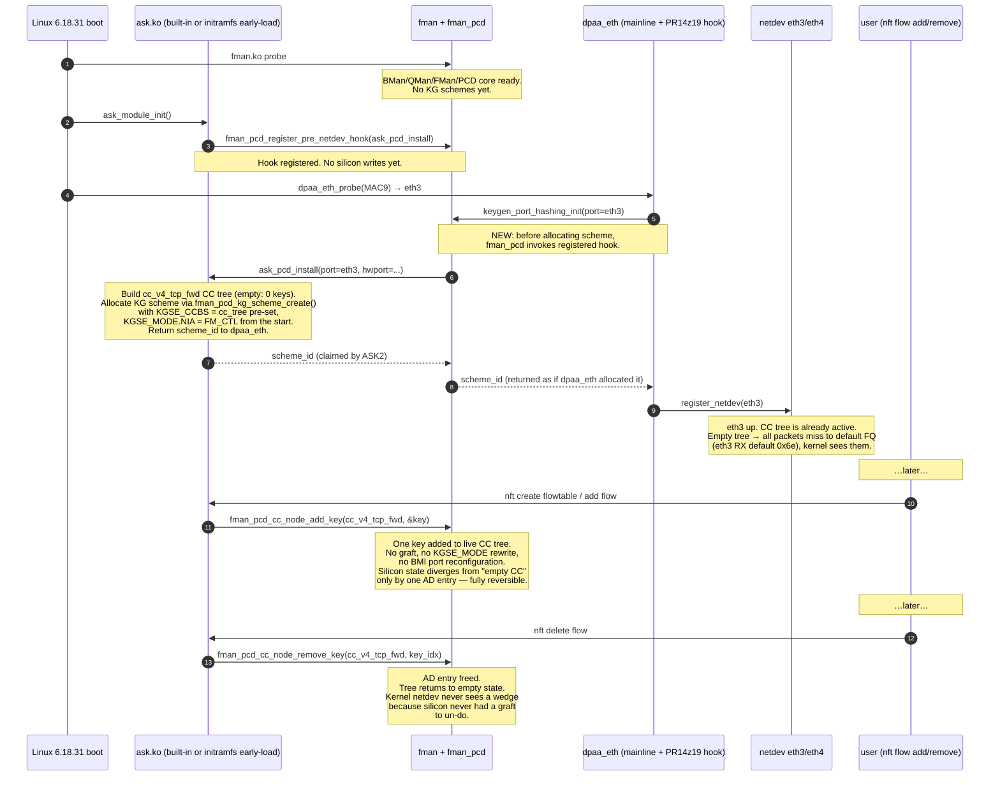

# PR14z19 — Path A: Pre-netdev PCD installation with debugging hooks

**Date:** 2026-05-23
**Branch:** `ask20`
**Status:** Design draft — implementation begins after operator review
**Supersedes:** PR14z13/z15/z18 graft model (to be dropped)
**Authoritative reasoning:** `plans/ASK-VS-ASK2-COMPARATIVE-REVIEW.md`

---

## 1. Goal

Pass the ASK2 M2 acceptance gate (≥7 Gbps at <5% kernel-net CPU) on LS1046A eth3↔eth4 forwarding by installing the ASK2 CC tree on KG schemes 3/4 **before** mainline `dpaa_eth` registers the netdev, so that the kernel netdev comes up downstream of an already-active PCD chain (matching original NXP ASK's ordering) and runtime traffic shaping never has to mutate live silicon.

## 2. Architecture



Compared to the wedge model: the silicon transition is from `KGSE_CCBS=cc_empty` → `KGSE_CCBS=cc_with_N_keys` → `KGSE_CCBS=cc_with_N-1_keys` → `KGSE_CCBS=cc_empty`. The `KGSE_MODE.NIA = FM_CTL` and BMI port `FMBM_RFPNE` are configured **once** during scheme creation and **never change**, eliminating the residual-state problem.

## 3. Patches required (in landing order)

### 3.1 In-tree kernel patches (added to `kernel/flavors/ask/patches/`)

| Slot | Name | LOC | Purpose |
|---|---|---|---|
| 0044 | `0044-fman-pcd-pre-netdev-hook.patch` | ~40 | Add `fman_pcd_register_pre_netdev_hook()` + `_unregister_*` + invocation point in `keygen_port_hashing_init()` in `dpaa_eth.c`. Single hook per FM instance. Hook signature: `int (*hook)(struct fman_pcd *pcd, u32 hwport, struct net_device *ndev, u8 *scheme_id, u32 *base_fqid)`. Returns 0 = hook handled scheme alloc; -ENOENT = no hook for this port, fall through to default mainline path. |
| 0045 | `0045-fman-pcd-cc-node-add-remove-key.patch` | ~120 | Expose `fman_pcd_cc_node_add_key()` / `_remove_key()` as `EXPORT_SYMBOL_GPL` if not already (PR14c-body-4 may have only `attach_cc`). Adds debugfs `cc_node_dump` showing all keys + AD entries per node. |
| 0046 | `0046-fman-pcd-debug-regdump.patch` | ~200 | New `/sys/kernel/debug/fman_pcd/` tree exposing: per-KG-scheme registers (KGSE_MODE/CCBS/FQB/MV/EKFC/SPC), per-BMI-port registers (FMBM_RFPNE/RFQID/RFCA), `fmkg_pe_sp` port↔scheme bindings, MURAM allocation map (offset/size/owner), and live CC tree topology. Read-only. Each register read is timestamped + sampled into a small ring buffer so we can correlate against `nft` events post-hoc. |

### 3.2 Out-of-tree module changes (`kernel/flavors/ask/oot-modules/ask/`)

| File | Action | Notes |
|---|---|---|
| `ask_hw.c` | Rewrite `ask_hw_bind()` / `ask_hw_unbind()` to be **no-ops** after first call. CC tree allocation moves to new `ask_pcd_install_hook()` callback. | Delete ~600 LOC of graft logic. Keep `ask_hw_add_flow()` / `_del_flow()` — those map directly to `cc_node_add_key` / `_remove_key`. |
| `ask_main.c` | Register pre-netdev hook at `module_init`. Unregister at `module_exit`. Add module param `ask_debug_level={0,1,2,3}` for tracepoint verbosity. | The hook must be registered **before** `dpaa_eth` probes, which means `ask.ko` must be built-in (`bool` in Kconfig) OR loaded from initramfs before `dpaa_eth.ko`. Default: built-in. |
| `ask_debugfs.c` | Add `/sys/kernel/debug/ask/` entries: `pipeline_status`, `cc_tree_dump`, `hook_install_log`, `flow_add_remove_history`, `silicon_regdump` (reads through to fman_pcd debugfs). Add per-pipeline counters: `keys_installed`, `keys_removed`, `add_failures`, `remove_failures`, `node_create_failures`, `cc_tree_full_events`, `silicon_state_diff_events`. | Always-on (build with `CONFIG_ASK_DEBUGFS=y`). Operator-friendly text format. |
| `ask_trace.h` | Add tracepoints: `ask_pcd_install_enter/exit`, `ask_pcd_install_kgse_write`, `ask_pcd_install_bmi_write`, `ask_pcd_install_muram_alloc`, `ask_flow_add_pre_silicon/post_silicon`, `ask_flow_remove_pre_silicon/post_silicon`, `ask_cc_node_state_change`. Each carries `pipeline_id`, `port_id`, `scheme_id`, `cc_tree_handle`, `key_count_before/after`, and timestamp. | Trace-via-perf or `trace-cmd record -e ask`. |
| `ask_hw.c` | Wrap **every** `readl/writel/iowrite/ioread` of fman_pcd silicon in a `ask_silicon_io_log()` macro that captures register address + value + caller `__func__` + timestamp to a 4 KiB ring buffer mapped at `/sys/kernel/debug/ask/silicon_io_log`. | This is the inspection point the operator explicitly asked for — every silicon write goes into the log. |

### 3.3 Patches to DROP (PR14z13/z15/z18 graft model)

- `0042-fman-pcd-kg-graft-cc.patch` — replaced by `0044` pre-netdev hook
- `0043-fman-pcd-kg-graft-mode-nia.patch` — no longer needed, NIA set once at scheme create
- Any subsequent z-suffixed patches that touched `fman_pcd_kg_graft_cc()` / `_ungraft_cc()` paths

These should be moved to `kernel/flavors/ask/patches/archived/` with a one-line note ("superseded by PR14z19 Path A, see plans/PR14z19-PATH-A-DESIGN.md") so the patch numbers stay reserved and the audit trail remains.

## 4. Debugging / inspection hooks (the operator's explicit ask)

This is the verification surface. **Every** suspected silicon mutation point gets an inspection hook. If the M2 retest fails on path A, these are what tell us where.

### 4.1 In-tree (kernel/fman_pcd subsystem)

| Location | Hook | What it captures |
|---|---|---|
| `keygen_port_hashing_init()` entry | `trace_fman_pcd_kg_port_init_enter` | port_id, hwport, fm_id, caller |
| `keygen_port_hashing_init()` post-hook-call | `trace_fman_pcd_kg_port_init_hook_returned` | hook return code, scheme_id assigned |
| `fman_pcd_kg_scheme_create()` entry/exit | `trace_fman_pcd_kg_scheme_create_{enter,exit}` | scheme params (use_hash, default_fqid, base_fqid, hash_mask), scheme_id, KGSE_MODE/CCBS/FQB written values |
| `fman_pcd_kg_scheme_destroy()` | `trace_fman_pcd_kg_scheme_destroy` | scheme_id, KGSE register state before clear |
| `fman_pcd_cc_node_create()` entry/exit | `trace_fman_pcd_cc_node_{create_enter,create_exit}` | tree_handle, n_keys (always 0 on path A install), MURAM offset+size, BMI port writes if any |
| `fman_pcd_cc_node_add_key()` | `trace_fman_pcd_cc_add_key_{enter,exit}` | tree_handle, key bytes, key_index returned, MURAM AD offset, KGSE_SPC counter snapshot |
| `fman_pcd_cc_node_remove_key()` | `trace_fman_pcd_cc_remove_key_{enter,exit}` | tree_handle, key_index, MURAM AD offset freed, KGSE_SPC counter snapshot |
| **Every** BMI port reg write in fman_pcd_*.c | `trace_fman_pcd_bmi_write` | port_id, offset (RFPNE/RFQID/RFCA/etc.), old value (read first), new value, caller `__func__` |
| **Every** KGSE_* reg write in fman_pcd_kg.c | `trace_fman_pcd_kgse_write` | scheme_id, kgse field (MODE/CCBS/FQB/MV/EKFC/SPC), old, new, caller |
| **Every** `fmkg_pe_sp` reg write | `trace_fman_pcd_fmkg_pe_sp_write` | port_id, old vec, new vec, caller |
| MURAM alloc/free | `trace_fman_muram_{alloc,free}` | offset, size, alignment, caller, allocation tag (kg_scheme / cc_node / cc_ad / hmct / other) |

### 4.2 Out-of-tree (ask.ko)

| Location | Hook | What it captures |
|---|---|---|
| `ask_pcd_install_hook()` entry | `trace_ask_pcd_install_enter` | port_id, hwport, ndev->name, pipeline_id |
| `ask_pcd_install_hook()` per step | `trace_ask_pcd_install_step` | step name (cc_tree_create / scheme_alloc / cc_install / done), rc |
| `ask_pcd_install_hook()` exit | `trace_ask_pcd_install_exit` | rc, final scheme_id, base_fqid, elapsed_ns |
| `ask_hw_add_flow()` | `trace_ask_flow_add_{pre,post}_silicon` | pipeline_id, 5-tuple, key_index_assigned, cc_tree_keys_before/after |
| `ask_hw_del_flow()` | `trace_ask_flow_del_{pre,post}_silicon` | pipeline_id, 5-tuple, key_index_freed, cc_tree_keys_before/after |
| nft offload event dispatch | `trace_ask_nft_event` | event_type (add/del), 5-tuple, ask handler return code |
| Periodic silicon-state sampler | `trace_ask_silicon_sample` | per-pipeline: KGSE_SPC, KGSE_MODE, KGSE_CCBS, BMI FMBM_RFPNE, MURAM free bytes — sampled every 1 s by a dedicated kthread; ring-buffered for the last 600 samples (10 min) |
| `ask_silicon_io_log()` macro | `trace_ask_silicon_write` | reg_addr, old, new, caller; also written to 4 KiB ring buffer in debugfs |

### 4.3 Debugfs view (operator-readable)

```text
/sys/kernel/debug/ask/
├── pipeline_status        # per-pipeline: scheme_id, cc_tree handle, keys installed, last_state_change
├── cc_tree_dump           # JSON dump of all CC nodes + AD entries (offline-parseable)
├── hook_install_log       # ordered log of every pre-netdev hook invocation
├── flow_add_remove_history # last 1000 flow events with timestamps + 5-tuple
├── silicon_regdump        # one-shot snapshot of all relevant KGSE/BMI/fmkg_pe_sp regs
├── silicon_io_log         # 4 KiB ring buffer of every silicon write (newest first)
├── silicon_sample_history # 600-entry sampler ring (per-second snapshots)
└── counters
    ├── hook_invocations
    ├── hook_failures
    ├── keys_installed
    ├── keys_removed
    ├── add_failures
    ├── remove_failures
    ├── node_create_failures
    ├── cc_tree_full_events
    └── silicon_state_diff_events
```

`bin/ask-pcd-regdump.py` will be extended to read `silicon_io_log` and `silicon_sample_history` so a single `ask-pcd-regdump --history` invocation gives a full forensic timeline.

## 5. Verification plan

After patches land, before claiming M2 pass, run these in order on the live DUT (`vyos`):

1. **Cold boot.** Verify `cat /sys/kernel/debug/ask/pipeline_status` shows two pipelines with `scheme_id={3,4}`, `cc_tree=valid`, `keys=0`, and `cc_tree_active=yes`.
2. **Idle baseline.** `cat /sys/kernel/debug/ask/silicon_sample_history` — confirm KGSE_SPC on schemes 3/4 increments at the rate of ARP/LLDP background traffic (i.e. silicon is seeing packets, not wedged).
3. **SW-only baseline.** `bin/verify-ask-flow-offload.sh --skip-offload`. Expect ~6.96 Gbps with notrack, ~19% softirq CPU (matches pre-graft baseline from 2026-05-22).
4. **Cold add flow.** Single iperf3 flow, no nft flowtable yet. Verify counters increment in the kernel netdev path. Confirm `silicon_sample_history` shows KGSE_SPC growing on the matching scheme.
5. **nft flowtable add.** `bin/m2-dut-prep.sh` installs `inet ask_offload` table + flowtable `ft1`. Watch `silicon_io_log` for one `cc_node_add_key` event per offloaded flow. Confirm `keys=N` in `pipeline_status`.
6. **M2 measurement.** `bin/verify-ask-flow-offload.sh` with default 8-parallel unrated. Target: **≥7 Gbps, <5% kernel-net CPU**. Capture `silicon_sample_history` during the run.
7. **nft delete table.** Watch `silicon_io_log` for matching `cc_node_remove_key` events. Confirm `keys=0` returns to baseline. Re-measure SW-only to confirm no wedge (this is the test PR14z18 failed).
8. **Reboot stress.** Repeat steps 4–7 ten times without rebooting the DUT. If silicon is truly stateless across flow add/remove, all ten cycles should pass identically. **This is the formal M2 gate.**

## 6. Risk register

| # | Risk | Mitigation |
|---|---|---|
| 1 | Pre-netdev hook conflicts with upstream dpaa_eth direction (clean-up trend is to *remove* hooks, not add them) | Keep hook narrow: single function pointer, single FM instance, no global state. Gated by Kconfig `CONFIG_FSL_DPAA_PCD_PRE_NETDEV_HOOK`. Default n. Submit upstream only after M2 passes and we have data showing the cost. |
| 2 | `ask.ko` not loaded early enough to register hook before `dpaa_eth` probe | Build ASK as `bool` (built-in) in `kernel/flavors/ask/oot-modules/ask/Kconfig`. Confirm load order with `dmesg | grep -E "(ask_module_init|dpaa_eth probe)"`. |
| 3 | Empty CC tree costs measurable idle CPU (FM_CTL walks even with 0 keys) | Step 4 of verification measures this. If positive, add a fast-path "empty tree → fallthrough to KGSE_FQB base" via the existing miss-action AD; original ASK does this. |
| 4 | Silicon debug ring buffer overflow under heavy nft churn | 4 KiB ring × ~16 bytes/entry = 256 entries. Per-CPU lockless ring (RCU). Verify no measurable cost in step 6 — disable via `ask_debug_level=0` if needed. |
| 5 | MURAM exhaustion on long-running nft churn (cf. ASK 1.x failure mode) | `silicon_sample_history` tracks MURAM free bytes. If trending down, we have a leak; debug via `trace_fman_muram_alloc/free` comparison. |
| 6 | Test apparatus (lxc201/lxc202) caches ARP from prior wedged sessions, masks real failures | Add ARP-table-flush step to `bin/m2-dut-prep.sh` and `bin/verify-ask-flow-offload.sh`. |

## 7. Workspace deltas

| File | Action |
|---|---|
| `kernel/flavors/ask/patches/0044-fman-pcd-pre-netdev-hook.patch` | Create |
| `kernel/flavors/ask/patches/0045-fman-pcd-cc-node-add-remove-key.patch` | Create |
| `kernel/flavors/ask/patches/0046-fman-pcd-debug-regdump.patch` | Create |
| `kernel/flavors/ask/patches/0042-…graft-cc.patch` | Move to `archived/` |
| `kernel/flavors/ask/patches/0043-…graft-mode-nia.patch` | Move to `archived/` |
| `kernel/flavors/ask/oot-modules/ask/ask_hw.c` | Rewrite `ask_hw_bind`/`unbind` as no-ops; new `ask_pcd_install_hook` (~300 LOC net delete) |
| `kernel/flavors/ask/oot-modules/ask/ask_main.c` | Register/unregister hook at init/exit (~20 LOC) |
| `kernel/flavors/ask/oot-modules/ask/ask_debugfs.c` | Add all `/sys/kernel/debug/ask/` entries listed in §4.3 |
| `kernel/flavors/ask/oot-modules/ask/ask_trace.h` | New tracepoints per §4.1 + §4.2 |
| `kernel/flavors/ask/oot-modules/ask/Kconfig` | `tristate "ASK offload" → bool "ASK offload"` (force built-in) |
| `bin/ci-setup-kernel.sh` | `ASK_PATCH_COUNT 43 → 46`, glob extension, `0044/0045/0046 → 1044/1045/1046` rename clauses |
| `bin/ask-pcd-regdump.py` | Add `--history` flag reading `/sys/kernel/debug/ask/silicon_sample_history` |
| `bin/m2-dut-prep.sh` | ARP-flush step + verify `pipeline_status` shows `cc_tree_active=yes` before proceeding |
| `bin/verify-ask-flow-offload.sh` | Capture `silicon_sample_history` + `silicon_io_log` during measurement, save to `/tmp/ask-m2-evidence-<timestamp>/` |
| `specs/ask2-rewrite-spec.md` | v1.1 → v1.2: amend §3.2 to permit "pre-netdev CC tree install via published in-tree hook" (narrow exception, not a full SDK fork) |
| `plans/ASK2-IMPLEMENTATION.md` | Update status tracker, mark PR14z13/z15/z18 as superseded, add PR14z19 row |

## 8. Estimated effort

- 3 in-tree patches: ~1 day each = 3 days
- ask.ko rewrite + debugfs + tracepoints: 2 days
- Spec amendment + CI wiring + bin/ updates: 0.5 day
- M2 verification on DUT (10-cycle stress): 1 day
- Total: **~6.5 days** wall-clock, single operator

## 9. Open questions (operator decision before code)

1. **Built-in vs initramfs early-load for `ask.ko`.** Built-in is simpler but requires re-flashing the kernel for any ask-only fix. Initramfs early-load preserves modularity but adds an initramfs hook. Recommend **built-in** for M2 because we're going to iterate the in-tree patches anyway.
2. **Should `0046-fman-pcd-debug-regdump.patch` be merged into PR14z19 baseline or stay as a debug-only patch dropped post-M2?** Recommend keep — the regdump surface is small (~200 LOC) and operationally valuable for future field debugging.
3. **ASK2 spec amendment scope.** Minimal text change: §3.2 final sentence "No fork of the SDK overlay is permitted" → "No fork of the SDK overlay is permitted; a pre-netdev CC tree install hook in mainline `dpaa_eth` is permitted as a single, well-defined exception." Operator approval needed.
4. **Drop archived graft patches now, or after M2 passes?** Recommend **after** — keep them in `archived/` for one release cycle so a regression can be bisected.

---

## 10. Next steps (gated on operator approval of this design)

1. Operator confirms Path A + this design.
2. Author `0044-fman-pcd-pre-netdev-hook.patch` against `work/linux-6.18.31/drivers/net/ethernet/freescale/fman/fman_keygen.c` and `…/dpaa/dpaa_eth.c`.
3. Author `0046-fman-pcd-debug-regdump.patch` (debug surface first — we need the inspection points to exist before we can verify 0044 works).
4. Rewrite `ask_hw.c` to delete graft logic and add `ask_pcd_install_hook()`.
5. Add debugfs + tracepoints.
6. Drop `0042` and `0043` to `archived/`. Bump `bin/ci-setup-kernel.sh` patch count.
7. CI build via self-hosted runner.
8. Deploy to DUT, run §5 verification plan.
9. If M2 passes 10 cycles → update spec to v1.2, mark PR14z19 landed in `ASK2-IMPLEMENTATION.md`, store passing result + telemetry summary to Qdrant.
10. If M2 fails → consult `silicon_io_log` + `silicon_sample_history` from the failing cycle, identify the new mutation point, add it to §4.1/§4.2 trace surface, iterate.