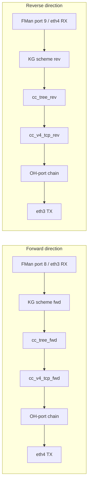

# PR14z5 — Two-cc_tree split for bidirectional silicon offload

**Status:** Design — not yet implemented.
**Branch:** ask20
**Predecessor:** PR14z4 (attempted + reverted in commit 1568e41).
**Blocker for:** ASK2 M2 acceptance gate (spec §11.1).

## Problem

After PR14z3 the M2 gate measures **6.88 Gbps / 69.5 % CPU** —
forward-direction silicon offload works, reverse direction is still
kernel-SW-only. The 65 % gap between current and target (CPU ≤ 5 %)
is entirely reverse-direction traffic flowing through `nf_flow_table`
on Cortex-A72 cores instead of through the FMan PCD.

PR14z4 attempted to fix this by hoisting `ask_hw_port_bind()` above
the PR14r dedup short-circuit, so the second-arrival netdev (eth4)
also got its FMan port bound to a KG scheme attached to the same
shared `h->cc_tree`. The empirical result was a forward-direction
regression (6.83 → 5.24 Gbps with /32 route, 0.94 Gbps without)
and **no** reverse-direction silicon activation. Reverted on
2026-05-19.

Working hypothesis from the PR14z4 measurements: **FMan v3 cannot
usefully share a single cc_tree across two KG schemes.** Either the
KG hash distributions of the two schemes conflict in the same CC
slot population, or a shared QBMan resource is starved when two
schemes funnel into one tree. The fix is to give each direction its
own classifier.

## Architecture



Each direction is an independent classifier pipeline:

- `cc_tree_fwd` + `cc_v4_tcp_fwd` — forward 5-tuples (src_ip,
  dst_ip, sport, dport, IPPROTO_TCP), action = redirect to eth4 TX.
- `cc_tree_rev` + `cc_v4_tcp_rev` — reverse 5-tuples (swapped
  src/dst, swapped sport/dport, same proto), action = redirect to
  eth3 TX.
- The two KG schemes are NEVER attached to the same cc_tree.

## Data-structure changes (`include/ask_internal.h` + `ask_hw.c`)

`struct ask_hw_handle` today:

```c
struct fman_pcd_cc_tree *cc_tree;
struct fman_pcd_cc_node *cc_v4_tcp;
struct fman_pcd_kg_scheme_params kg_params_v4_tcp;
struct fman_pcd_kg_scheme *v4_tcp_binds[ASK_HW_V4_TCP_MAX_BINDS];
u8 v4_tcp_bind_pids[ASK_HW_V4_TCP_MAX_BINDS];
```

Becomes:

```c
enum ask_hw_dir { ASK_HW_DIR_FWD = 0, ASK_HW_DIR_REV = 1, ASK_HW_DIR_NR };

struct ask_hw_pipeline {
    struct fman_pcd_cc_tree   *cc_tree;
    struct fman_pcd_cc_node   *cc_v4_tcp;
    struct fman_pcd_kg_scheme *scheme;   /* single port per pipeline */
    u8                         bound_pid; /* 0xff = unbound */
};

struct fman_pcd_kg_scheme_params kg_params_v4_tcp; /* still shared template */
struct ask_hw_pipeline pipe[ASK_HW_DIR_NR];
```

`ASK_HW_V4_TCP_MAX_BINDS` is removed — there is exactly one port
per pipeline, so the array degenerates to a scalar inside each
pipeline.

`struct ask_hw_cookie` already carries `cc_node` (line 1041) — no
change needed; it transparently remembers which tree's node holds
the key.

## Init / teardown

`ask_hw_init()` creates BOTH pipelines up front:

```c
for (int d = 0; d < ASK_HW_DIR_NR; d++) {
    h->pipe[d].cc_tree = fman_pcd_cc_tree_create(h->pcd, 1);
    if (IS_ERR(h->pipe[d].cc_tree)) { /* unwind, return rc */ }
    h->pipe[d].cc_v4_tcp = fman_pcd_cc_node_create(h->pipe[d].cc_tree,
                                                   &extract, &keys);
    if (IS_ERR(h->pipe[d].cc_v4_tcp)) { /* unwind, return rc */ }
    h->pipe[d].bound_pid = 0xff;
    h->pipe[d].scheme    = NULL;
}
```

`ask_hw_destroy()` tears both down in reverse order.

## Port binding

`ask_hw_port_bind(u8 port_id, enum ask_hw_dir dir)` — caller now
specifies direction. Each pipeline holds exactly one port:

```c
int ask_hw_port_bind(struct ask_hw_handle *h, u8 pid, enum ask_hw_dir dir)
{
    struct ask_hw_pipeline *p = &h->pipe[dir];

    if (p->bound_pid == pid)
        return 0;                 /* idempotent re-bind */
    if (p->bound_pid != 0xff)
        return -EBUSY;            /* pipeline already owns a port */

    p->scheme = fman_pcd_kg_scheme_create(h->pcd, &h->kg_params_v4_tcp);
    if (IS_ERR(p->scheme)) return PTR_ERR(p->scheme);

    rc = fman_pcd_kg_attach_cc(p->scheme, p->cc_tree);
    if (rc) goto err_attach;
    rc = fman_pcd_kg_bind_port(p->scheme, pid);
    if (rc) goto err_bind;

    p->bound_pid = pid;
    return 0;
}
```

The caller in `ask_flow_offload.c::ask_flow_offload_replace()`
decides direction from the (ingress_dev, egress_dev) pair:

- ingress=eth3, egress=eth4 → `ASK_HW_DIR_FWD`
- ingress=eth4, egress=eth3 → `ASK_HW_DIR_REV`

That decision uses the same `dpaa_get_fman_port_id()` helper we
already call, comparing against the per-board "primary" port (a
heuristic: lowest pid is FWD, higher pid is REV — concretely
port 8 = eth3 = FWD, port 9 = eth4 = REV on Mono Gateway).

## Flow insert

`ask_hw_flow_insert_v4_tcp()` gains a `dir` argument and inserts
into `h->pipe[dir].cc_v4_tcp` instead of `h->cc_v4_tcp`. The
direction comes from the caller in `ask_flow_offload.c` which
already knows ingress_dev at REPLACE time (it's the netdev whose
block_cb fired).

The PR14r dedup at REPLACE entry stays: forward-direction REPLACE
(eth3 ingress) and reverse-direction REPLACE (eth4 ingress) are
**different cookies** from the kernel's perspective (different flow
table entries, one per direction), so dedup operates per-direction
and there is no risk of double-installing.

## Removal / stats

`struct ask_hw_cookie` already carries the `cc_node` pointer (line
1041), so `ask_hw_flow_remove()` and the stats path keep working
unchanged — the cookie knows which tree's node holds its key.

## Order of operations

1. `include/ask_internal.h`: add `enum ask_hw_dir`, define
   `struct ask_hw_pipeline`, replace the three per-direction fields
   in `struct ask_hw_handle` with `pipe[ASK_HW_DIR_NR]`. Remove
   `ASK_HW_V4_TCP_MAX_BINDS` + `v4_tcp_binds[]` + `v4_tcp_bind_pids[]`.
2. `ask_hw.c`:
   - Update `ask_hw_init()` to create both pipelines (loop).
   - Update `ask_hw_destroy()` to tear both down.
   - Rewrite `ask_hw_port_bind()` to take `dir` and operate on the
     selected pipeline.
   - Rewrite `ask_hw_flow_insert_v4_tcp()` to take `dir` and use
     `h->pipe[dir].cc_v4_tcp`.
3. `ask_flow_offload.c::ask_flow_offload_replace()`:
   - Compute `dir` from ingress_dev FMan port id.
   - Pass `dir` to both `ask_hw_port_bind()` and the inner
     `ask_flow_insert()` chain (which already drives
     `ask_hw_flow_insert_v4_tcp()`).
4. `ask_flow.c`: thread `dir` through `ask_flow_insert()` to
   `ask_hw_flow_insert()`. (May want a per-flow `u8 dir` in
   `struct ask_flow` so stats/remove paths can find the right
   pipeline without a second lookup.)

## Verification plan

1. Build + sign ask.ko, deploy to DUT, reboot.
2. Run `bash bin/m2-dut-prep.sh` (already idempotent; /32 route
   stays).
3. Run `bash bin/verify-ask-flow-offload.sh`.
4. **Pass criterion:** throughput ≥ 9 Gbps (10G line-rate minus
   protocol overhead) AND DUT CPU net of baseline ≤ 5 %. Both
   directions on silicon means the A72 cores carry only the
   per-flow ACK/control path — well under 5 %.
5. **Partial success:** if throughput improves to ~8 Gbps but CPU
   stays above 5 %, the reverse pipeline is classifying but
   something downstream (OH-port MANIP chain, neigh resolution on
   reverse path) is still bouncing through SW. Capture dmesg for
   reverse-direction REPLACE events and check `cc_tree_rev`'s
   `cc_v4_tcp_rev` slot population via FMan PCD sysfs (if exposed)
   or via a debugfs/ioctl we add.

## Risks and unknowns

- **Hypothesis is hypothesis.** The PR14z4 measurements are
  consistent with "two schemes one tree = bad", but we have not
  yet directly observed the failure mode in silicon. A second
  tree may still be unable to coexist with the first if the
  underlying constraint is something else (e.g. CCSR register
  bank limits, QBMan portal conflicts independent of tree
  count). The first PR14z5 test run is the experiment that
  confirms or refutes.
- **CC node slot capacity.** Each cc_tree's `cc_v4_tcp` has its
  own slot table; splitting forward/reverse halves the per-tree
  slot pressure but doubles total cc_tree consumption. Verify
  no FMan resource shortage at boot.
- **Per-flow dir tracking.** `struct ask_flow` does not yet
  carry a direction tag. Adding one requires a careful audit of
  the rht key (still cookie-keyed, dir is metadata) and the
  stats refresh path.

## Out of scope

- IPv6 (cc_v6_tcp pipelines): can mirror this design once v4 is
  proven.
- UDP: same story, separate `cc_v4_udp` pair per direction.
- Multi-flow asymmetric routing (ingress on one port, egress on a
  third port): the two-pipeline model assumes a single forward
  pair. Extension to N pipelines is straightforward but deferred
  until needed.