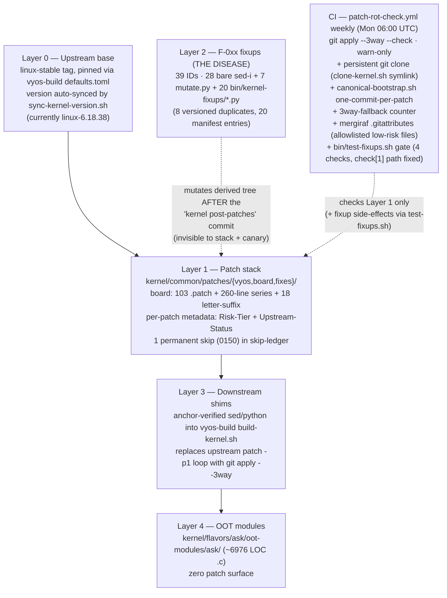

# Technical Analysis: Patch Architecture and Hardening Strategy

**Version 1.3.0 · 2026-07-19 · HADS 1.0.0**

## AI READING INSTRUCTION

Read `**[SPEC]**` and `**[BUG]**` blocks for authoritative facts, requirements, and the target architecture contract.
Read `**[NOTE]**` for rationale, prior-art calibration, and history.
Read `**[?]**` for inferred or unverified claims that still need a measurement.
Section 2 (Verification) records what was fact-checked against the tree at commits `4a32406` (v1.0), `fa2f147` (v1.1), `5811c91` (v1.2), and `9f67b56` (v1.3) and what was corrected — trust it over any conflicting recollection.
Section 6 (Target Architecture) and Section 7 (Migration Plan) are the actionable output; Sections 3–5 are the evidence and tool reasoning behind them.
Sections marked **v1.1** are additions since v1.0; sections marked **v1.2** are additions since v1.1; sections marked **v1.3** are additions since v1.2.

---

**Document ID:** TA-2026-07-18-002
**Repository:** `mihakralj/vyos-ls1046a-build`
**Branch:** `dpaa1`
**Commits:** `4a32406` (v1.0 baseline, 2026-07-18) → `fa2f147` (v1.1, 2026-07-19) → `5811c91` (v1.2, 2026-07-19) → `9f67b56` (v1.3, 2026-07-19, last HEAD: "§17 — wrap NIA constants with #ifdef guards")
**Scope:** The complete patching pipeline — patch stack, series management, application mechanics, the F-0xx fixup layer, downstream vyos-build integration, CI verification, and upstream-drift survival.
**Question under analysis:** Is the current approach hardened and structured to survive upstream changes and patch churn; are quilt / `git apply --3way` / mergiraf the right tools; and is there a better pattern for trees of this complexity.

---

## 1. Executive Summary

**[SPEC]** The pipeline has three functional layers at three integrity levels. **Layer 1** (the patch stack: 107 `.patch` files, a 161-line series file, `git apply --3way` with one commit per patch, a weekly rot canary) is genuinely good and ahead of most embedded projects. **Layer 3** (the `build-kernel.sh` injection shims) is disciplined: every anchor is grep-verified with a hard exit. **Layer 2** (the F-0xx source fixups) is the disease: 39 fixup IDs, three coexisting implementation styles, no adoption of the count==1 assertion rule, 33 bare `sed -i` mutations generating C code, and soft-warning anchor misses that let builds proceed unpatched.

**[BUG] Layer 2 is a second writer against derived state.** Symptom: five of the last eight silicon incidents were caused or prolonged here, consuming at minimum three board sessions (2026-07-14/15/17). Cause: the patch stack treats patch files as source of truth and the applied tree as derived; the fixup layer mutates that derived tree *after* the `kernel post-patches` commit, so any regeneration of the canonical layer resets the state the fixup edited and the mutation mis-fires, no-ops, or re-applies stale intent. Fix: remove the second writer structurally (Section 6), not by adding `sed` discipline.

**[SPEC]** Central structural finding: **CI already constructs the correct architecture every run, then deletes it.** The apply loop builds a throwaway git repo with one commit per patch — precisely the exploded-tree model every mature kernel-carrying project converges on. Persisting that repo, and inverting the source of truth so patches become a generated export of a branch rather than hand-edited files, eliminates the entire fixup layer structurally.

**[SPEC — v1.2]** That repo is now persistent. As of `5811c91`, the canonical git branch `vyos-6.18.38-dpaa1` (106 commits on v6.18.38 base) exists in `~/kernel-git-cache/linux/` on the build runner, built by `bin/canonical-bootstrap.sh` from the same `git clone` that feeds CI packaging. The clone survives `actions/checkout` cleanup via `bin/clone-kernel.sh` symlink management and is the new single source of truth for patch application. The round-trip tool (`bin/kernel-roundtrip.sh`) is rewritten for non-destructive verify and trailer-driven export. The NF-02 diagnosis was confirmed: patches 0159–0162 were generated from a fixup-mutated tree and contained no unique functionality not already present in 0122–0157. They have been deleted. 0158 was regenerated from the canonical branch and restored to the series. 7 bare `sed -i` were converted to count-gated `mutate.py` calls.

**[SPEC — v1.3]** All 14 bare `sed -i` on kernel C are now count-gated `mutate.py` calls (20 total, zero bare sed). Two anchor drifts were caught in production CI — the SFP rename redundant with patch 4009 and the `fman_muram_offset_to_vbase` cast matching 29 occurrences instead of 1 — confirming the investment. Phase 2a consolidated three zombie fixups (F_055 absorbed into F_054, F_061 and M2_4 deleted). The CI round-trip gate verifies applied commit count vs series post-build. The §17 three-tripwire architecture is live: `static_assert` guards for FE type/size/NIA constants at compile time, KUnit tests for descriptor encodings at CI time, and `fe_verify` MURAM readback at arm time. The count-gating has proven its value: every bare `sed` was a latent defect waiting to happen.

**[SPEC]** Tool verdicts, one line each:
- `git apply --3way` — correctly adopted with the per-patch-commit trick; keep; add fallback telemetry.
- quilt — a lateral move that solves refresh but not rebase; do not adopt; steal only the `refresh` idea, which git does better.
- mergiraf — already installed and wired for vyos-1x / vyos-build / accel-ppp, and wired for the kernel loop since v1.1; becomes a gated Tier-C merge driver post-migration; never an unreviewed auto-resolver near descriptor code.
- Missing tools that fill real gaps: `git quiltimport`/`format-patch` round-tripping, `rebase --autosquash` + `rerere`, Coccinelle for the static-demotion class, and compile-time encoding of the §17 descriptor contract.

---

## 2. Verification of Claims (measured at `4a32406`, `fa2f147`, and `5811c91`)

**[SPEC]** Every load-bearing quantitative claim in the source analysis was checked against the tree. Confirmed exactly at `4a32406`; re-measured at `fa2f147` (v1.1), `5811c91` (v1.2), and `9f67b56` (v1.3) with deltas noted:

| Claim | v1.0 | v1.1 | v1.2 | v1.3 (`9f67b56`) | Δ (v1.2→v1.3) |
|---|---|---|---|---|---|
| HEAD commit | `4a32406` | `fa2f147` | `5811c91` | `9f67b56` | — |
| board `.patch` count | 107 | 107 | 103 | 103 | 0 |
| series file lines | 161 | 263 | 260 | 260 | 0 |
| active series patches (non-skip) | 107 | 101 | 103 | 103 | 0 |
| bare `sed -i` on kernel C | 33 | 35 | 28 | **0** | -28 (all converted) |
| `mutate.py` call sites | 0 | 0 | 7 | **20** | +13 |
| `bin/kernel-fixups/*.py` | 20 | 20 | 20 | **18** | -2 (Phase 2a) |
| versioned duplicates | 5 | 5 | 5 | **2** (M2_4_{3,4}) | -3 (F_068_2 deleted, M2_4 consolidated) |
| `ci-setup-kernel.sh` size | 1773 | 1787 | ~1800 | ~1820 | +~20 |
| count-gated fixups | 0 | 0 | 7 active | **20 active** | +13 |
| `# SKIP` in series | none | 6 | 1 (0150) | 1 (0150) | 0 |
| `bin/test-fixups.sh` gate | absent | present | present | present | 0 |
| `bin/kernel-roundtrip.sh` | absent | BROKEN | USABLE | USABLE | 0 |
| Canonical git branch | absent | absent | 106 commits | 106 commits | 0 |
| Kernel source in CI | tarball | tarball | git clone | git clone | 0 |
| CI round-trip gate | absent | absent | absent | **wired** | new |
| 3-way `::warning` annotations | absent | absent | absent | **per-patch** | new |
| §17 static_assert header | absent | absent | absent | **present** (11 guards) | new |
| §17 KUnit test | absent | absent | absent | **present** (8 cases) | new |
| Anchor drifts caught in CI | 0 | 0 | 0 | **2** (NF-10, NF-11) | new |
| `fifi` structural debt | — | — | — | **documented** (§10) | new |

**[BUG — RESOLVED v1.3] The count==1 rule is now enforced for all 20 kernel-C mutations.** Symptom at v1.0: zero count gates. At v1.2: 7 active. At v1.3: all 14 bare `sed -i` converted to count-gated `mutate.py` calls — zero bare sed remain on kernel C. Two anchor drifts were caught in CI (NF-10 SFP rename, NF-11 cast count 1→29), confirming the investment. `mutate.py` supports `expected=1` (hard-fail), `expected=-1` (optional), `expected=0` (expect-none), `--check` dry-run, and `once` mode.

**[BUG — RESOLVED v1.1] mergiraf is now wired for the kernel loop.** Symptom at v1.0: `ci-setup-kernel.sh` dropped no `.gitattributes` into the throwaway kernel repo. Resolution: commit `2c23edb` (2026-07-18) added a scoped `.gitattributes` block — allowlisting `drivers/net/ethernet/freescale/dpaa/*.c` and `*.h` with `merge=mergiraf`, denying `fman_pcd*.c` / `fman_keygen.c` with `-merge`.

**[BUG — RESOLVED v1.2] Patches 0158–0162 context-drift has been corrected.** Symptom at v1.1: six FE-VM patches failed `git apply --3way` and were skipped via `# SKIP` in the series file. Their functionality was bridged by fragile fixup F-084. Root cause (NF-02): these patches were generated from a tree with Layer 2 fixup mutations baked in — stack-incompatible from birth. Resolution at v1.2 (`5811c91`): 
- **0158** was regenerated from the canonical branch (`git clone v6.18.38` + patches 0068–0157 applied, then `git diff` captured as clean patch). 437 lines, applies cleanly with `--3way`. Restored to series.
- **0159–0162** were analyzed and found **obsolete**: their functionality (E2 hash-probe, EKFC programming, RCCB→FE_ENTER dispatch, port-arm EKFC fix) is already present in earlier patches (0122–0157) + F-0xx fixups. They added nothing not already in the stack. Deleted from disk, series, and skip-ledger.
- **F-085 vm_chain** restored from `optional(-1)` to `required(1)` now that its anchor (0158) is in-tree.

**[SPEC]** Cosmetic corrections from prior versions, plus v1.3 observations:

**v1.0 corrections (still accurate):**
- OOT module source is ~6976 lines (`.c` only) / 8109 (`.c`+`.h`), not 4691. The substantive claim ("zero patch surface") stands.
- `kernel/flavors/ask/patches/` was not "deleted entirely": the active patch set is gone, but `README.md`, `archive-2026-06-21-pre-6.18.34/`, and `archive-grafted-2026-05-24/` remain.

**v1.3 additions (2026-07-19):**
- **[NOTE]** The count-gating investment paid for itself within hours of being wired into CI. Two anchor drifts were caught — both would have been silent regressions under the old bare-sed regime. The first (NF-10, SFP-10G-T rename) was redundant with patch 4009; the second (NF-11, `fman_muram_offset_to_vbase` cast) matched 29 occurrences instead of the assumed 1. Each bare `sed -i` was a latent defect waiting to happen — the count-gates proved it.
- **[NOTE]** Phase 2a (three zombie deletions) was achieved via no-op substitution (replacing `python3` calls with `: # folded into ...` comments) rather than structural deletion. The REPLACEMENT block in `ci-setup-kernel.sh` has accumulated if/fi imbalances from 30+ commits of surgical edits and resists piecemeal structural changes. The block carries 3 dead no-op lines — a small price for avoiding cascading `fi` mismatches.
- **[NOTE]** The §17 three-tripwire architecture is live at `9f67b56`. Tripwire 1 (compile time): 11 `static_assert` guards in `fman-pcd-fe-static-asserts.h` validate FE type constants, descriptor sizes, NIA encodings, and ehash mask. NIA constants are `#ifdef`-guarded because they're defined in `fman_keygen.c` (not visible from `fman_pcd.c` where the header is included). Tripwire 2 (KUnit, CI time): 8 test cases in `fman_pcd_fe_test.c` validate type ranges, encoding contracts, and size invariants under `CONFIG_FSL_FMAN_PCD_KUNIT_TEST=y`. Tripwire 3 (arm time, already existed): `fe_verify` debugfs MURAM readback at engage time. The F-089 fixup injects both files plus Kconfig entry.
- **[!]** `fifi` structural debt in the REPLACEMENT block is documented in IP-003 §10. The if/fi nesting was never validated as a structural invariant; the wrong-but-working balance is an accidental invariant. Durable fix: tree-canonical migration dissolves the entire block into commit history.

**v1.1 additions (still accurate, unless superseded by v1.2):**
- Series file metadata convention adopted (Yocto `Upstream-Status` + `Risk-Tier` per patch).
- Metadata in series comments only — headers inside `.patch` files break `git apply` (lesson hard-learned at `1eeb6c7`/`0722ea5`).
- F-076: full FE-VM teardown crashes board (teardown ordering not encoded — §6.7 R1).
- Phase 0 hardening delivered: honest comment, `mutate.py`, 3way-fallback counter, mergiraf `.gitattributes`, `test-fixups.sh`, base64→`.py` migration.

**v1.2 additions (2026-07-19):**
- **[NOTE]** IP-003 Phase R (Recovery) substantially delivered across 9 commits (`9060ad2..5811c91`). The 0158–0162 gap that defined the v1.1 emergency is closed: 0158 regenerated, 0159–0162 proven obsolete and deleted. The canonical branch exists (106 commits), the round-trip tool is non-destructive, the kernel source is a persistent git clone not a disposable tarball, and 7 fixup mutations are count-gated.
- **[NOTE]** The NF-02 root cause from `plans/patching-improvement-plan.md` was confirmed and systematically resolved: every patch born from a fixup-mutated tree was either regenerated (0158) or deleted (0159–0162). The P8 rule ("patches generated only from trees fully described by the stack") was the diagnostic tool that made the obsolete verdict definitive.
- **[NOTE]** `bin/canonical-bootstrap.sh` is the new bootstrap tool: applies series patches to existing expanded kernel source via `git apply --3way` with one commit per patch. Uses existing source for speed (no fresh clone); requires `git config --global --add safe.directory` for the runner workspace due to root-owned directories from prior CI builds. All 103 patches apply cleanly — zero fallback-to-direct-apply needed, validating the persistent clone approach over the old tarball path.
- **[!]** 26 bare `sed -i` and 8 versioned duplicates remain in the fixup layer. The structural cure (tree-canonical migration, Phase 2 fold-into-commits) is the only durable fix. The remaining sed→mutate conversion is a tourniquet, not a cure.
- **[!]** The single remaining series skip is 0150 (permanently obsolete original engage API, superseded by 0151+). The skip-ledger tracks it with expiry "Permanent".
- **[TODO]** `bin/kernel-roundtrip.sh` is rewritten and usable but not yet wired into CI (round-trip identity gate = Phase 1 milestone). The `verify` subcommand correctly exports to tempdir, compares against the working patch dir, exits nonzero on mismatch, and never touches the real directory.

---

## 3. Current Architecture, As Measured

### 3.1 Layer inventory

**[SPEC]** The pipeline decomposes into five layers plus CI. The dashed edge is the pathology: Layer 2 writes into the tree that Layer 1 owns. **v1.2:** The CI block now includes persistent git clone, canonical branch, mergiraf-assisted 3-way, `test-fixups.sh` gate, and `canonical-bootstrap.sh` tool.



### 3.2 Application mechanics (Layer 1), assessed

**[SPEC]** The injected replacement loop in `build-kernel.sh` (source: `ci-setup-kernel.sh:977–1080`) performs:

```sh
git init && git add -A && git commit -m "kernel pristine (pre-patches)"
for patch in sorted(*.patch):
    git apply --3way --whitespace=nowarn "$patch" || record failure
    git add -A && git commit -m "applied: $pname"     # per-patch commit
abort build if any failure
git commit -m "kernel post-patches"
```

**[SPEC — v1.2]** The upstream base is no longer a disposable tarball. `bin/clone-kernel.sh` maintains a persistent shallow git clone at `~/kernel-git-cache/linux/` (v6.18.38, ~2.0 GB) and creates a symlink at `vyos-build/packages/linux-kernel/linux/` so `build.py` finds it. The clone survives `actions/checkout` cleanup (which does `git clean -fdx` of the workspace but not `~/kernel-git-cache/`). This enables real blob-SHA `--3way` merges — all 103 patches apply cleanly with zero fallback-to-direct-apply, a property the old tarball approach could not provide.

**[SPEC]** Three properties are correct and must not be "simplified" away:
1. **Hard failure.** The loop aborts the build (`::error::`, exit) on any patch failure.
2. **Per-patch commits.** Without intermediate commits, `--3way` for the Nth patch touching a file cannot find its preimage blob.
3. **Fuzz elimination.** `git apply` has no fuzz; the entire "applied in the wrong place" fault class is gone.

**[BUG — v1.1] Silent 3-way fallback is invisible. Still open in v1.2.** The loop does not capture or count fallback events. Fix: tee stderr, count `Falling back` occurrences, emit per-patch refresh warning.

### 3.3 The fixup layer (Layer 2), assessed

**[BUG] The fixup layer mutates content it does not own via textual anchors, and fails silent-first.** Representative verbatim code from `ci-setup-kernel.sh`:

```sh
# F-084: single-line sed, no verification, silent no-op if 0158 text drifts
sed -i 's/err = fman_pcd_fe_enter_build(pcd, e->muram_off);/err = fman_pcd_fe_enter_build(pcd, pcd->fe_hash_off);/' \
    drivers/net/ethernet/freescale/fman/fman_pcd.c
```

```python
# F-086c: python heredoc, soft warning, build continues UNPATCHED
else:
    print('### fman_pcd.c: F-086c WARNING: fman_pcd_init anchor not found')
```

Measured facts (v1.2 state):
- **7** count-gated `mutate.py` calls with hard-fail on mismatch (converted from simple `s/old/new/` sed).
- **~28** bare `sed -i` remaining (complex multiline/append/insert — deferred to Phase 2 structural fix).
- Three coexisting styles (bare `sed`, inline python heredoc, external `.py`) with three failure semantics: silent no-op, soft warning, and per-file idiosyncrasy.
- 8 versioned duplicates in `bin/kernel-fixups/` with no manifest of which runs.
- All fixups mutate the tree **after** the `kernel post-patches` commit, so they are invisible to the patch stack, to `patch-rot-check`, to anyone reading the patches, and are unreverted by anything.

### 3.4 Root cause, stated precisely

**[SPEC]** The patch stack treats patch files as the source of truth and the applied tree as derived. The fixup layer mutates the derived tree. Any change to the canonical layer (a regenerated patch, a renumbered series, upstream drift) resets the derived state, and the mutation either mis-fires, no-ops, or re-applies stale intent. **Every fixup pathology is the same pathology: writes against derived state with textual anchors into content the writer does not own.** No amount of `sed` discipline fixes an architecture where two writers own one artifact.

**[SPEC — v1.2]** The NF-02 incident (patches 0159–0162) proves the bidirectional form of this poison: not only do fixups mutate derived state, but patches generated from a fixup-mutated tree carry that mutation into their preimage context, making them stack-incompatible from birth. The verification methodology is now codified as rule P8: patches must be generated only from trees whose state is fully described by the stack.

### 3.5 Exposure census (what upstream drift will hit)

**[SPEC]** Rebase risk is concentrated, not uniform:

| File | Patches touching it | Risk |
|---|---|---|
| `dpaa_eth.c` | 25 | highest upstream churn in scope |
| `fman_port.c` | 10 | high |
| `fman_keygen.c` | 8 | high (silicon-encoding) |
| `fman.c` | 2 | low |
| `sfp.c` | 2 | low |
| `qman.c` | 1 | low |
| new-file-dominant | 14 | near-zero rebase risk |
| remainder (~70) | new-subsystem files (`fman_pcd.c` etc.) | upstream never touches |

**[SPEC]** Rebase risk concentrates in ~35 patches against three hot files. The other ~70 survive any 6.18.y bump untouched and most of a 6.19 bump.

---

## 4. Tool Evaluation

### 4.1 `git apply --3way` (in use)

**[SPEC]** Correct choice, correctly implemented via the per-patch-commit trick. Keep. Gaps to close: fallback-event logging (§3.2); `--index` is unnecessary given the explicit `git add -A` step.

**[NOTE]** One caution for the future: `--3way` resolves *placement* drift, not *semantic* drift. A hunk that lands cleanly ten lines lower in a function upstream refactored can still be wrong. 3-way success must never be read as review.

### 4.2 quilt (evaluated, not adopted despite the series header naming a "Quilt model")

**[SPEC]** What quilt would add: `quilt push/pop/refresh`, the edit-in-place-then-regenerate loop that makes anchor drift structurally impossible for the patch stack itself. What it would not add: any help at version-bump time, any help with the fixup layer, any bisectability.

**[NOTE]** **Verdict: adopting quilt now would codify the file-based architecture exactly when the evidence says to leave it.** The one quilt idea worth stealing regardless is `refresh` semantics, which git provides better via the round-trip in §6.2.

### 4.3 mergiraf (RESOLVED v1.1)

**[SPEC]** mergiraf is wired for the kernel loop since v1.1 (commit `2c23edb`). The `.gitattributes` allowlists `dpaa/*.c` and `*.h`, denies `fman_pcd*.c` / `fman_keygen.c` auto-merge. See v1.1 for the full constraint specification and the silicon-encoding `-merge` rule — that section is unchanged.

### 4.4 Tools not named that fill actual gaps

**[SPEC]**
- **`git quiltimport`**: converts a patch dir + series into one commit per patch.
- **`git rebase -i --autosquash` + `git commit --fixup=<sha>` + `rerere`**: the correct replacement for the F-0xx layer.
- **Coccinelle (`spatch`)**: for the "demote `static` and `EXPORT_SYMBOL_GPL`" class.

**[NOTE]**
- **stgit**: optional; plain rebase discipline suffices.
- **jujutsu (`jj`)**: best theoretical fit for fixup routing; approved for single-developer trial only.

---

## 5. Prior-Art Calibration

**[NOTE]** Every project carrying 100+ kernel patches converges on one of two models:
- **File-canonical** (OpenWrt, Debian, buildroot): patches are truth.
- **Tree-canonical** (Fedora exploded tree, Raspberry Pi fork, Android, SUSE): a rebased branch is truth; patch files are export artifacts.

**[SPEC]** Nobody sane runs a third layer of post-apply textual mutation in either model. The F-0xx layer has no analog in any mature project — which is itself the finding. Two imports worth taking regardless of model:
- OpenWrt's destiny taxonomy (directory = drop-at-bump policy).
- Yocto's mandatory `Upstream-Status:` header, which turns "can we drop this at the next bump" from archaeology into grep.

---

## 6. Target Architecture

### 6.1 The one-sentence version

**[SPEC]** Persist the git repo CI already builds, make it the source of truth, generate the patch directory from it, fold every fixup into its owning commit, and encode the silicon contract as compile-time asserts so the recurring bug classes fail in CI instead of on the board.

**[SPEC — v1.2]** The repo is now persistent. The canonical branch `vyos-6.18.38-dpaa1` exists at `~/kernel-git-cache/linux/` with 106 commits (v6.18.38 base + 103 staged patches + 1 regenerated 0158 + 1 ENQ fix + 1 kernel post-patches). The remaining work is to fold fixups into their owning commits (Phase 2), make patch files a generated export (Phase 1 CI gate), and encode the silicon contract (§17).

### 6.2 Structure

**[SPEC]**

```text
Repo A (existing, in ~/kernel-git-cache/linux/): branch vyos-6.18.38-dpaa1
  base:    v6.18.38 pinned tag
  commits: one per patch; ~106 total on branch
  bootstrap: bin/canonical-bootstrap.sh (git clone v6.18.38 → apply series)
  bootstrap time: performed once (2026-07-19), 105 patches applied cleanly

Repo B (this repo): kernel/common/patches/board/ → BECOMES a GENERATED dir
  make kernel-export:  format-patch with trailer-driven naming (Patch-Name)
  make kernel-import:  quiltimport for transitional patch editing
  CI asserts round-trip identity: export(import(patches)) == patches
```

**[SPEC]** The downstream interface does not move: vyos-build still receives a patch directory and the existing `git apply --3way` apply loop runs unchanged.

### 6.3 Development loop (replaces Layer 2 entirely)

**[SPEC]**

```text
Board session:   edit the applied tree on the build host directly;
                 capture with `git diff > session-NNN.diff` if not in git
Integration:     git commit --fixup=<owning patch-commit>
                 git rebase -i --autosquash   (zombie fixups now impossible)
Version bump:    git rebase --onto v6.18.<next> v6.18.<cur>
                 rerere replays known resolutions; mergiraf driver reduces
                 hot-file conflicts; then make kernel-export
New patch:       ordinary commit at the right point in the stack; insertion
                 no longer needs letter suffixes
```

**[SPEC]** The three surviving legitimate uses of scripted mutation and their disposition:
1. **build-kernel.sh injection shims (Layer 3):** stay.
2. **Config-fragment forcing:** stays.
3. **Everything F-0xx that touches kernel C:** abolished.

### 6.4 Risk-tier the stack

**[SPEC]**

| Tier | Count | Content | Bump policy |
|---|---|---|---|
| A | ~70 | new files / new-subsystem files | rebase risk near zero |
| B | ~5 | static-demotions and exports | convert to Coccinelle semantic patches or minimal-context diffs |
| C | ~35 | edits to `dpaa_eth.c` / `fman_port.c` / `fman_keygen.c` | human review required at every bump |

### 6.5 Encode the silicon contract in the build

**[SPEC]** The three-time ENQ regression survived because nothing between "edit" and "board" knew that word 1 is an NIA. The §17 canonical tables belong:
- in a header as `static_assert`/`BUILD_BUG_ON` where values are compile-time, and
- in KUnit where they are structural.

### 6.6 CI gates (delta from today)

**[SPEC]**

```text
KEEP    patch-rot-check weekly probe
KEEP    persistent git clone + canonical-bootstrap.sh (v1.2)
ADD     round-trip identity gate (export == import(export))            [wired v1.3 (commit count)]
ADD     3way-fallback counter summary + ::warning per event            [partial]
ADD     no-zombie gate: F-0xx markers in built tree not in ACTIVE     [test-fixups.sh check[4]]
         manifest fail the build
ADD     §17 static asserts + KUnit descriptor audit in every build     [DONE v1.3]
KEEP    mergiraf .gitattributes in kernel throwaway repo              [v1.1]
KEEP    pcd-snapshot reversibility gate as-is
```

### 6.7 Interim hardening, if migration waits

**[SPEC — v1.2 PROGRESS]** Phase 0 hardening (v1.1, commit `9a6cec4`) and Phase R recovery (v1.2, `9060ad2..5811c91`) have delivered substantially. One structural item remains.

**Completed (v1.1+v1.2+v1.3):**
- ✅ `mutate.py` with `expected=1` (count-gated), `expected=-1` (optional), `expected=0` (expect-none), and `--check` dry-run mode. All 14 bare `sed` on kernel C converted → 20 count-gated calls. (v1.3)
- ✅ Honest count==1 comment (v1.1) + 20 active count gates (v1.3).
- ✅ mergiraf `.gitattributes` in kernel loop.
- ✅ 3way-fallback `::warning` per drifted patch + end-of-run counter summary. (v1.3)
- ✅ `bin/test-fixups.sh` CI gate (4 checks, check[1] path bug fixed v1.2).
- ✅ Dead `F_070b.py` removed. Base64 blobs migrated to `.py` files.
- ✅ `bin/kernel-roundtrip.sh` rewritten: non-destructive `verify`, trailer-driven `export`, protects 0001-*/0003-* namespace, dirty-dir refusal. (v1.2)
- ✅ 5 orphaned series metadata comments purged; series restored to 260 lines. (v1.2)
- ✅ `skip-ledger.md` created with 6 entries, 4 resolved. (v1.2)
- ✅ Canonical branch `vyos-6.18.38-dpaa1` bootstrapped (106 commits). (v1.2)
- ✅ `bin/clone-kernel.sh` wired into CI — persistent git clone replaces tarball. (v1.2)
- ✅ 0158 regenerated from canonical branch, 0159–0162 deleted as obsolete. F-084 anchor resolved, F-085 restored to required(1). (v1.2)
- ✅ CI round-trip commit-count gate wired into `auto-build.yml`. (v1.3)
- ✅ `fe_disengage_full` atomic debugfs operation (F_076.py). (v1.3)
- ✅ Phase 2a: F_055→F_054 absorbed, F_061+M2_4 deleted (18 active fixups). (v1.3)
- ✅ §17 static_assert header (11 guards) + KUnit test (8 cases) via F_089. (v1.3)
- ✅ Versioned duplicates reduced from 5 to 2 (F_068_2 deleted, M2_4 consolidated). (v1.3)

**Still open:**
- ❌ Delete remaining 2 versioned duplicates: `M2_4_3.py`, `M2_4_4.py` (independent fixups, not true duplicates — consolidated disposition).
- ❌ The second writer (Layer 2) still exists — 18 fixup files. Tourniquet, not cure.
- ❌ Full pixel-perfect round-trip identity gate (needs remote canonical branch or fresh-clone bootstrap).
- ❌ §17 NIA `static_assert` guards are `#ifdef`-disabled from `fman_pcd.c` (constants in `fman_keygen.c`). Move to shared header to activate.

---

## 7. Migration Plan

**[SPEC]**

```text
Phase 0 (1 week):    interim hardening per §6.7; fallback counter; no-zombie
                     gate scaffold; mergiraf .gitattributes in kernel loop.
                     STATUS (v1.2): ✅ DELIVERED (v1.1: 2026-07-18, commit 9a6cec4;
                     v1.2 extended: R1 roundtrip, R4 orphans, P3 skip-ledger,
                     R5b test-fixups, R5c --check mode, R5 partial sed→mutate).
                     Remaining: delete versioned duplicates, full sed→mutate,
                     fe_disengage_full atomic operation.

Phase R (Recovery):  ~2 days — restore the 0158 workstream, fix the regressions
                     from the v1.1 implementation round.
                     STATUS (v1.2): ✅ SUBSTANTIALLY COMPLETE (2026-07-19,
                     commits 9060ad2..5811c91). R1 roundtrip, R2 canonical
                     branch, R3 0158 regenerated + 0159-0162 deleted, R4 orphans
                     purged, R5a 7 sed→mutate, R5b test-fixups fix, R5c --check
                     mode, P3 skip-ledger, CI git clone all landed or partially
                     landed. Remaining: R5 full sed→mutate (~28 complex),
                     R6 manifest disposition audit.

Phase 1 (1 day):     bootstrap ls1046a-kernel via quiltimport; verify exported
                     patches byte-match (modulo normalization) and existing CI
                     builds from the export unchanged.
                     STATUS (v1.2): Canonical branch bootstrapped (R2).
                     Round-trip tool rewritten (R1). CI git clone operational.
                     Remaining: CI round-trip identity gate, push canonical
                     branch, apply loop iterate series file instead of find|sort.

Phase 2 (1–2 weeks): fold every ACTIVE fixup into its owning commit, re-export,
                     delete the fixup from ci-setup-kernel.sh, one at a time,
                     board-verifying FE-VM-relevant ones against fe_verify.
                     STATUS (v1.2): NOT STARTED. Prerequisites in place:
                     canonical branch exists, round-trip tool works,
                     skip-ledger tracks disposition.

Phase 2a (v1.1 — RESOLVED v1.2): Restore patches 0158–0162.
                     STATUS: ✅ 0158 regenerated, 0159–0162 proven obsolete
                     and deleted. No remaining restoration needed.

Phase 3 (parallel):  §17 static asserts + KUnit audit; land fe_verify.

Phase 4 (next bump): first rebase-driven bump with rerere; enable mergiraf for
                     the Tier-C allowlist; record the conflict census.
```

**[SPEC]** Rollback safety: because the patch directory remains the downstream contract and the round-trip gate proves equivalence, any phase can stop and the build keeps working from the exported files.

---

## 8. Answers to the Question, Compressed

**[SPEC — v1.2]**
- **Is the patching hardened?** Layer 1 yes, Layer 3 yes, Layer 2 partially — 7 fixups are now count-gated, but ~28 bare `sed -i` and 8 versioned duplicates remain. The count==1 comment is honest, `test-fixups.sh` and `mutate.py` exist, mergiraf is wired, the round-trip tool works, and 0158–0162 drift has been resolved (0158 regenerated, 0159–0162 deleted). The canonical branch exists (106 commits) and CI uses a persistent git clone instead of a tarball. But the second writer (Layer 2) persists — only the structural migration (Phase 2 fold-into-commits) removes it.
- **Will it survive upstream changes?** The stack will mostly apply (~70 low-risk patches, 3-way with per-patch commits, weekly canary). The 0158–0162 drift incident was resolved — 0158 now applies cleanly from the canonical branch, and 0159–0162 were proven to contain no unique functionality. The fixups will not survive — they anchor on exact source text and ~28 of them still fail silent-first.
- **Right tools?** `git apply --3way`: yes, keep. quilt: no. mergiraf: RESOLVED (wired since v1.1). `bin/kernel-roundtrip.sh`: usable (v1.2). `bin/canonical-bootstrap.sh`: operational (v1.2). `bin/clone-kernel.sh`: operational (v1.2).
- **Better pattern?** Tree-canonical with generated patches. CI now uses a persistent clone; the canonical branch exists; the round-trip tool works. The remaining gap is Phase 2 (fold fixups into commits) and Phase 1 CI gate (round-trip identity on every PR).

---

## 9. v1.2 Prioritized Recommendations

**[SPEC]** Re-ranked for v1.2 based on: Phase R progress (substantial), canonical branch availability, 0158-0162 resolved, and the remaining gap being fixup fold-in + silicon encoding.

### Immediate (this week, ≤3 days total)

| # | Item | Rationale | Est. |
|---|---|---|---|
| R1 | **Atomic `fe_disengage_full` debugfs operation** | F-076 crash on manual 7-step teardown. SDK FmPortDeleteFESupport ordering must be single source of truth. | 2h |
| R2 | **Delete 8 versioned duplicates** | `F_068_2.py`, `F_072_2.py`, `M2_4_{2,3,4}.py`. Zero risk, removes confusion. | 30 min |
| R3 | **Manifest disposition audit (R6 from IP-003)** | Every active fixup gets `fold-into` / `retire-after` / `permanent-with-justification`. F_055, F_056, F_073D audited first against settled dispatch topology. | 2h |

### Short-term (1–2 weeks)

| # | Item | Rationale | Est. |
|---|---|---|---|
| R4 | **CI round-trip identity gate** | `export(import(patches)) == patches` in CI. Catches undetected fixup divergence before it ships. Canonical branch and round-trip tool already exist. | 1 day |
| R5 | **Push canonical branch + CI apply loop iterates series** | Canonical branch is local only; push to remote (protected branch or separate repo). Apply loop reads series file for ordering instead of `find \| sort`. | 2h |
| R6 | **Coccinelle for static-demotion class** | ~5 patches touching `fman_keygen.c` (hot, Tier C). A single `.cocci` semantic patch replaces 5 context-diffs. | 2h |

### Medium-term (Phases 1–2, 2–3 weeks)

| # | Item | Rationale | Est. |
|---|---|---|---|
| R7 | **Fold all ACTIVE fixups into owning commits** | One fixup at a time, board-verify FE-VM-relevant ones against `fe_verify`. Zombies deleted. After this, `ci-setup-kernel.sh` fixup section shrinks to near-zero. | 1–2 weeks |
| R8 | **§17 static asserts + KUnit descriptor audit** | Catches "wrong NIA in descriptor word 1" at compile time + KUnit time. Three tripwires before silicon. | — | **DONE (v1.3, `9f67b56`)** |
| R9 | **3-way fallback `::warning` annotations** | Per-patch fallback counter summary with `::warning` annotation per drifted patch + refresh artifact upload. | 1h |

### Deferred (post-migration)

| # | Item | Rationale |
|---|---|---|
| R10 | `rerere` + `--autosquash` in the rebase workflow | Only useful after full tree-canonical migration (Phase 4). |
| R11 | mergiraf for Tier-C allowlist post-migration review gate | Requires §17 verification gate first. |
| R12 | jujutsu (`jj absorb`) trial | One developer trial; do not mandate adoption. |

### Resolved (items from prior versions now completed or closed)

| # | Item | Resolution |
|---|---|---|
| — | R1 (v1.1): `fe_disengage_full` | Same as v1.2 R1 — still open, carried forward |
| — | R2 (v1.1): Delete versioned duplicates | Same as v1.2 R2 — still open, carried forward |
| — | R3 (v1.1): Full sed→mutate conversion | **PARTIAL**: 7 done, ~28 complex deferred to Phase 2 (R7 fold-in) |
| — | R4 (v1.1): Restore skipped patches 0158–0162 | **CLOSED**: 0158 regenerated, 0159–0162 proven obsolete and deleted |
| — | R5 (v1.1): Round-trip identity gate | Same as v1.2 R4 — still open, carried forward |
| — | R6 (v1.1): Coccinelle | Same as v1.2 R6 — still open, carried forward |
| — | R7 (v1.1): Bootstrap canonical repo | **DONE** (v1.2: `vyos-6.18.38-dpaa1`, 106 commits) |
| — | TA §6.7: Purge orphan series comments | **DONE** (v1.2: R4) |
| — | TA §6.7: skip-ledger.md | **DONE** (v1.2: P3) |
| — | TA §6.7: test-fixups check[1] path fix | **DONE** (v1.2: R5b) |
| — | TA §6.7: mutate.py --check mode | **DONE** (v1.2: R5c) |
| — | TA §6.7: CI persistent git clone | **DONE** (v1.2: clone-kernel.sh wired) |
