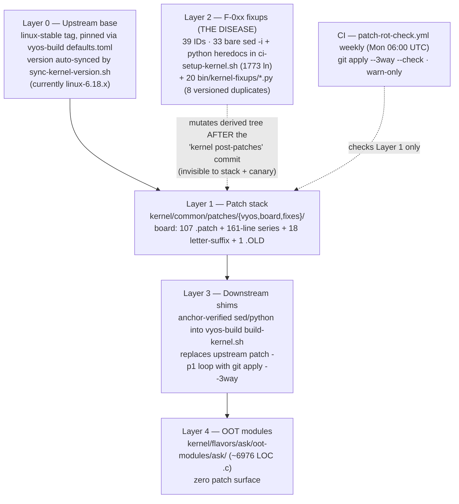

# Technical Analysis: Patch Architecture and Hardening Strategy

**Version 1.0.0 · 2026-07-18 · HADS 1.0.0**

## AI READING INSTRUCTION

Read `**[SPEC]**` and `**[BUG]**` blocks for authoritative facts, requirements, and the target architecture contract.
Read `**[NOTE]**` for rationale, prior-art calibration, and history.
Read `**[?]**` for inferred or unverified claims that still need a measurement.
Section 2 (Verification) records what was fact-checked against the tree at commit `4a32406` and what was corrected — trust it over any conflicting recollection.
Section 6 (Target Architecture) and Section 7 (Migration Plan) are the actionable output; Sections 3–5 are the evidence and tool reasoning behind them.

---

**Document ID:** TA-2026-07-18-002
**Repository:** `mihakralj/vyos-ls1046a-build`
**Branch:** `dpaa1`
**Commit:** `4a32406` ("fix: REPLACEMENT comment had literal backslash-n — the exact bug it warned about"), verified HEAD 2026-07-18
**Scope:** The complete patching pipeline — patch stack, series management, application mechanics, the F-0xx fixup layer, downstream vyos-build integration, CI verification, and upstream-drift survival.
**Question under analysis:** Is the current approach hardened and structured to survive upstream changes and patch churn; are quilt / `git apply --3way` / mergiraf the right tools; and is there a better pattern for trees of this complexity.

---

## 1. Executive Summary

**[SPEC]** The pipeline has three functional layers at three integrity levels. **Layer 1** (the patch stack: 107 `.patch` files, a 161-line series file, `git apply --3way` with one commit per patch, a weekly rot canary) is genuinely good and ahead of most embedded projects. **Layer 3** (the `build-kernel.sh` injection shims) is disciplined: every anchor is grep-verified with a hard exit. **Layer 2** (the F-0xx source fixups) is the disease: 39 fixup IDs, three coexisting implementation styles, no adoption of the count==1 assertion rule, 33 bare `sed -i` mutations generating C code, and soft-warning anchor misses that let builds proceed unpatched.

**[BUG] Layer 2 is a second writer against derived state.** Symptom: five of the last eight silicon incidents were caused or prolonged here, consuming at minimum three board sessions (2026-07-14/15/17). Cause: the patch stack treats patch files as source of truth and the applied tree as derived; the fixup layer mutates that derived tree *after* the `kernel post-patches` commit, so any regeneration of the canonical layer resets the state the fixup edited and the mutation mis-fires, no-ops, or re-applies stale intent. Fix: remove the second writer structurally (Section 6), not by adding `sed` discipline.

**[SPEC]** Central structural finding: **CI already constructs the correct architecture every run, then deletes it.** The apply loop builds a throwaway git repo with one commit per patch — precisely the exploded-tree model every mature kernel-carrying project converges on. Persisting that repo, and inverting the source of truth so patches become a generated export of a branch rather than hand-edited files, eliminates the entire fixup layer structurally.

**[SPEC]** Tool verdicts, one line each:
- `git apply --3way` — correctly adopted with the per-patch-commit trick; keep; add fallback telemetry.
- quilt — a lateral move that solves refresh but not rebase; do not adopt; steal only the `refresh` idea, which git does better.
- mergiraf — already installed and wired for vyos-1x / vyos-build / accel-ppp, but **not** for the kernel loop; wiring it into the kernel `--3way` fallback is a cheap near-term win, and it becomes a gated Tier-C merge driver post-migration; never an unreviewed auto-resolver near descriptor code.
- Missing tools that fill real gaps: `git quiltimport`/`format-patch` round-tripping, `rebase --autosquash` + `rerere`, Coccinelle for the static-demotion class, and compile-time encoding of the §17 descriptor contract.

---

## 2. Verification of Claims (measured at `4a32406`)

**[SPEC]** Every load-bearing quantitative claim in the source analysis was checked against the tree. Confirmed exactly:

| Claim | Measured | Verdict |
|---|---|---|
| HEAD commit | `4a32406` | ✓ |
| board `.patch` count | 107 | ✓ |
| series file | 161 lines, 6238 bytes | ✓ |
| letter-suffix insertions | 18 | ✓ |
| dead `.OLD` file | `0150-fman-pcd-fe-engage-api.patch.OLD` | ✓ |
| unique F-0xx markers in `ci-setup-kernel.sh` | 39 | ✓ |
| bare `sed -i` in `ci-setup-kernel.sh` | 33 | ✓ |
| `bin/kernel-fixups/*.py` files | 20 (incl. `__pycache__` excluded) | ✓ |
| versioned duplicates | `F_068`+`F_068_2`, `F_072`+`F_072_2`, `M2_4`{,`_2`,`_3`,`_4`} | ✓ |
| `ci-setup-kernel.sh` size | 1773 lines (source said "1682+") | ✓ |
| exposure: `dpaa_eth.c` | 25 patches | ✓ |
| exposure: `fman_port.c` | 10 patches | ✓ |
| exposure: `fman_keygen.c` | 8 patches | ✓ |
| exposure: `fman.c` / `sfp.c` / `qman.c` | 2 / 2 / 1 | ✓ |
| new-file-dominant patches | 14 | ✓ |
| apply loop: `git init` + per-patch commit + `git apply --3way --whitespace=nowarn` + hard-fail abort + `kernel post-patches` commit | lines 1044–1078 | ✓ |
| fixups run AFTER `post-patches` commit | commit at 1078, F-054 at 1298, F-072b at 1357 | ✓ |
| `patch-rot-check.yml` | weekly Mon 06:00 UTC cron, `--3way --check`, `continue-on-error` warn-only | ✓ |

**[BUG] The count==1 rule is not merely absent — a comment falsely asserts it is enforced.** Symptom: `ci-setup-kernel.sh:1197` reads `# Every fixup asserts count()==1 or the build fails loudly`. Cause: zero code implements it — a grep for `grep -c` / `-eq 1` / `!= 1` / `-ne 1` across the 1773-line script returns nothing. Fix: treat this comment as a liability, delete or make it true; a documented-but-unimplemented safety rule invites trust the code has not earned. This *strengthens* the source analysis's §2.3 point rather than contradicting it.

**[BUG] mergiraf is installed and wired everywhere except the kernel loop.** Symptom: the source analysis concluded "mergiraf has nothing to attach to under the current file-based architecture … useless today." Cause of the discrepancy: `bin/ci-install-deps.sh` installs a pinned `/usr/local/bin/mergiraf`, and `bin/ci-build-accel-ppp.sh`, `bin/ci-setup-vyos-build.sh`, `bin/ci-setup-vyos1x.sh` each drop `*.c *.h *.py *.json *.yml *.yaml *.toml *.xml merge=mergiraf` `.gitattributes` into their source trees — so mergiraf *does* assist `git apply --3way` for those three trees today. But `bin/ci-setup-kernel.sh` drops **no** `.gitattributes` into the throwaway kernel repo, so the highest-patch-density, hottest-conflict loop runs plain git 3-way with no AST assist. Fix (near-term): drop a scoped `.gitattributes` into the kernel throwaway repo (see §4.3), which converts silent conflict-marker fallback into mergiraf-assisted resolution for the low-risk file classes while excluding `fman_pcd*.c` / `fman_keygen.c` from auto-merge.

**[SPEC]** Two cosmetic corrections that do not change any conclusion:
- OOT module source is ~6976 lines (`.c` only) / 8109 (`.c`+`.h`), not 4691. The substantive claim ("zero patch surface") stands.
- `kernel/flavors/ask/patches/` was not "deleted entirely": the active patch set is gone, but `README.md`, `archive-2026-06-21-pre-6.18.34/`, and `archive-grafted-2026-05-24/` remain (matches the AGENTS.md "scaffold only" description).

---

## 3. Current Architecture, As Measured

### 3.1 Layer inventory

**[SPEC]** The pipeline decomposes into five layers plus CI. The dashed edge is the pathology: Layer 2 writes into the tree that Layer 1 owns.



### 3.2 Application mechanics (Layer 1), assessed

**[SPEC]** The injected replacement loop in `build-kernel.sh` (source: `ci-setup-kernel.sh:977–1080`) performs:

```sh
git init && git add -A && git commit -m "kernel pristine (pre-patches)"
for patch in sorted(*.patch):
    git apply --3way --whitespace=nowarn "$patch" || record failure
    git add -A && git commit -m "applied: $pname"     # per-patch commit
abort build if any failure
git commit -m "kernel post-patches"
```

**[SPEC]** Three properties are correct and must not be "simplified" away:
1. **Hard failure.** The loop aborts the build (`::error::`, exit) on any patch failure. Legacy `patch -p1` continued silently; the 2026-05-11 incident (stale runner patches, silent second-apply failure, corrupted anchors, shipped `vmlinuz` missing the SFP-10G-T quirk, field failure) is the cost of unchecked `patch(1)`.
2. **Per-patch commits.** Without intermediate commits, `--3way` for the Nth patch touching a file cannot find its preimage blob and degrades to exact-context apply. The commit-per-patch step is what makes 3-way real for a stacked series.
3. **Fuzz elimination.** `git apply` has no fuzz; the entire "applied in the wrong place" fault class that `patch(1)` `fuzz=2` permits is gone.

**[BUG] Silent 3-way fallback is invisible.** Symptom: when `git apply --3way` succeeds via an actual 3-way merge rather than exact apply, the patch landed with drifted context and nobody is told; the stderr line `Falling back to three-way merge` scrolls past. Cause: the loop does not capture or count fallback events. Fix: tee stderr, count `Falling back` occurrences, and emit a per-patch refresh warning when nonzero — a nonzero count is the canonical "this patch is stale relative to its neighbors" signal.

**[NOTE]** Ordering has two sources of truth: the series file governs which patches are staged, while the apply loop's `find | sort` governs order. The 18 letter-suffix insertions (`0069a`, `0086b`, `0103a–f`, …) exist because renumbering under filename-sort is unpayable. Under the target architecture (Section 6) ordering becomes commit order and this dissolves; until then the apply loop should iterate the series file directly.

### 3.3 The fixup layer (Layer 2), assessed

**[BUG] The fixup layer mutates content it does not own via textual anchors, and fails silent-first.** Representative verbatim code from `ci-setup-kernel.sh`:

```sh
# F-084: single-line sed, no verification, silent no-op if 0158 text drifts
sed -i 's/err = fman_pcd_fe_enter_build(pcd, e->muram_off);/err = fman_pcd_fe_enter_build(pcd, pcd->fe_hash_off);/' \
    drivers/net/ethernet/freescale/fman/fman_pcd.c
```

```python
# F-086c: python heredoc, soft warning, build continues UNPATCHED
else:
    print('### fman_pcd.c: F-086c WARNING: fman_pcd_init anchor not found')
```

Measured facts:
- **Zero** genuine count==1 assertions across the 1773-line script (a *comment* at line 1197 falsely claims otherwise — §2).
- Three coexisting styles (bare `sed`, inline python heredoc, external `.py`) with three failure semantics: silent no-op, soft warning, and per-file idiosyncrasy.
- 8 versioned duplicates in `bin/kernel-fixups/` with no manifest of which runs (`F_068`/`F_068_2`, `F_072`/`F_072_2`, `M2_4`{,`_2`,`_3`,`_4`}) — the `.OLD` anti-pattern applied to executable code.
- All fixups mutate the tree **after** the `kernel post-patches` commit (line 1078; first fixup F-054 at 1298), so they are invisible to the patch stack, to `patch-rot-check`, to anyone reading the patches, and are unreverted by anything.

**[NOTE]** The failure ledger this layer produced, from the program's own records: F-062a (display-only sed that claimed to reverse F-059 and reversed nothing), F-069b (pattern matched zero lines, silent), F-058/F-059/F-060 (zombie mutations stomping live descriptors months after their purpose expired), F-070 v2/v3/v4 (the same FQID-in-NIA bug shipped three times because the fixup edited derived state each patch iteration reset), F-086 heredoc marker collision (the meta-tooling had its own bug), and HEAD `4a32406` itself ("REPLACEMENT comment had literal backslash-n, the exact bug it warned about"). Three consecutive July board sessions tested downstream of descriptor words these mutations corrupted.

### 3.4 Root cause, stated precisely

**[SPEC]** The patch stack treats patch files as the source of truth and the applied tree as derived. The fixup layer mutates the derived tree. Any change to the canonical layer (a regenerated patch, a renumbered series, upstream drift) resets the derived state, and the mutation either mis-fires, no-ops, or re-applies stale intent. **Every fixup pathology is the same pathology: writes against derived state with textual anchors into content the writer does not own.** No amount of `sed` discipline fixes an architecture where two writers own one artifact. The count==1 rule, even if adopted, only converts silent failure into loud failure; it does not remove the second writer.

### 3.5 Exposure census (what upstream drift will hit)

**[SPEC]** Rebase risk is concentrated, not uniform:

| File | Patches touching it | Risk |
|---|---|---|
| `dpaa_eth.c` | 25 | highest upstream churn in scope |
| `fman_port.c` | 10 | high |
| `fman_keygen.c` | 8 | high (silicon-encoding) |
| `fman.c` | 2 | low |
| `sfp.c` | 2 | low |
| `qman.c` | 1 | low |
| new-file-dominant | 14 | near-zero rebase risk |
| remainder (~70) | new-subsystem files (`fman_pcd.c` etc.) | upstream never touches |

**[SPEC]** Rebase risk concentrates in ~35 patches against three hot files. The other ~70 survive any 6.18.y bump untouched and most of a 6.19 bump. This asymmetry drives structure (§6.4): risk-tier the series; do not treat 107 patches as one undifferentiated pile.

---

## 4. Tool Evaluation

### 4.1 `git apply --3way` (in use)

**[SPEC]** Correct choice, correctly implemented via the per-patch-commit trick. Keep. Gaps to close: fallback-event logging (§3.2); `--index` is unnecessary given the explicit `git add -A` step.

**[NOTE]** One caution for the future: `--3way` resolves *placement* drift, not *semantic* drift. A hunk that lands cleanly ten lines lower in a function upstream refactored can still be wrong. 3-way success must never be read as review.

### 4.2 quilt (evaluated, not adopted despite the series header naming a "Quilt model")

**[SPEC]** What quilt would add: `quilt push/pop/refresh`, the edit-in-place-then-regenerate loop that makes anchor drift structurally impossible for the patch stack itself, plus a series file as the single ordering truth. What it would not add: any help at version-bump time (`quilt push` on conflict dumps `.rej` and walks away — no 3-way, no rename detection, no memory of prior resolutions), any help with the fixup layer, any bisectability.

**[NOTE]** OpenWrt runs thousands of patches on quilt but pays with a dedicated refresh workflow (`make target/linux/refresh`) and heavy maintainer muscle memory. **Verdict: adopting quilt now would codify the file-based architecture exactly when the evidence says to leave it.** The one quilt idea worth stealing regardless is `refresh` semantics, which git provides better via the round-trip in §6.2.

### 4.3 mergiraf (named in the question)

**[SPEC]** mergiraf is a tree-sitter-based structured merge driver (C supported) that resolves conflicts textual merge cannot: adjacent additions inside one function, reordered declarations, brace-level moves. It installs as a git merge driver and offers `mergiraf solve` for existing conflict markers.

**[BUG] It is wired for three trees but conspicuously absent from the kernel loop.** Symptom: the hottest-conflict `git apply --3way` loop (kernel, 35 hot-file patches) gets no AST assist and falls back to plain conflict markers. Cause: `bin/ci-install-deps.sh` installs a pinned mergiraf and `ci-build-accel-ppp.sh` / `ci-setup-vyos-build.sh` / `ci-setup-vyos1x.sh` drop `merge=mergiraf` `.gitattributes` into their trees, but `ci-setup-kernel.sh` drops none into the throwaway kernel repo. Fix (near-term, cheap): drop a scoped `.gitattributes` into the kernel throwaway repo right after `git init`, allowlisting low-risk classes and **excluding** silicon-encoding files:

```gitattributes
# low-risk: let mergiraf reduce placement conflicts
drivers/net/ethernet/freescale/dpaa/*.c   merge=mergiraf
*.h                                        merge=mergiraf
# silicon-encoding: NEVER auto-merge — human review + verify gate required
drivers/net/ethernet/freescale/fman/fman_pcd*.c    -merge
drivers/net/ethernet/freescale/fman/fman_keygen.c  -merge
```

**[SPEC]** Hard constraints wherever mergiraf is enabled:
- **Never for silicon-encoding files without a verify gate.** A structurally valid merge that reorders two `iowrite32be()` calls in a descriptor builder is a hardware bug that compiles. mergiraf is syntax-aware, not semantics-aware; it does not know an NIA from a FQID. Every mergiraf-assisted resolution in `fman_pcd*.c` / `fman_keygen.c` must pass the compile-time §17 asserts (§6.5), KUnit, and `fe_verify` before it counts as resolved.
- Opt-in per path via `.gitattributes`, never global auto-merge of descriptor code.
- Log every conflict it resolved (it reports these) into the bump record.

**[NOTE] Verdict:** valuable now as a near-term conflict-reducer for the low-risk kernel file classes (a `.gitattributes` drop away), a gated Tier-C merge driver post-migration, and dangerous as an unreviewed auto-resolver near descriptor code.

### 4.4 Tools not named that fill actual gaps

**[SPEC]**
- **`git quiltimport`**: converts a patch dir + series into one commit per patch — the one-command bridge from the current layout to the exploded tree. Its inverse, `git format-patch`, closes the loop.
- **`git rebase -i --autosquash` + `git commit --fixup=<sha>` + `rerere`**: the correct replacement for the F-0xx layer. A board-session fix becomes a `--fixup` targeted at the owning patch-commit; autosquash folds it; the zombie category ceases to exist because there is nowhere outside the stack for a live mutation to persist. `rerere` records each conflict resolution once and replays it on every subsequent rebase, making repeated 6.18.y bumps cheap.
- **Coccinelle (`spatch`)**: for the "demote `static` and `EXPORT_SYMBOL_GPL`" class (the `keygen_*` demotions). A semantic patch expressing "make `keygen_bind_port_to_schemes` non-static and exported" survives upstream reformatting, argument renames, and line movement that kills a context diff. ~4–6 patches, but they touch `fman_keygen.c` (hot). Cheap insurance.

**[NOTE]**
- **stgit**: quilt semantics on top of git commits (`stg push/pop/refresh`, patch names preserved). A fit if the team wants explicit patch identity rather than raw rebase. Optional; plain rebase discipline suffices.
- **jujutsu (`jj`)**: `jj absorb` solves the exact fixup-routing problem (route each working-copy hunk into the commit that owns those lines; descendants auto-rebase). Theoretically the best fit, practically the riskiest adoption (tooling maturity, CI unfamiliarity). Reasonable to trial for one developer, not to mandate.

---

## 5. Prior-Art Calibration

**[NOTE]** Every project carrying 100+ kernel patches converges on one of two models:
- **File-canonical** (OpenWrt, Debian, buildroot): patches are truth, applied by quilt or scripts, refreshed via a dedicated round-trip target. Survives because of taxonomy (`backport-*/pending-*/hack-*` directories, so bumps begin by deleting `backport/`) and mandatory refresh discipline.
- **Tree-canonical** (Fedora exploded tree, Raspberry Pi fork, Android, SUSE's git-backed `kernel-source`): a rebased branch is truth; patch files, where they exist, are export artifacts. Survives because git carries the merge machinery.

**[SPEC]** Nobody sane runs a third layer of post-apply textual mutation in either model. The F-0xx layer has no analog in any mature project — which is itself the finding. Two imports worth taking regardless of model:
- OpenWrt's destiny taxonomy (directory = drop-at-bump policy).
- Yocto's mandatory `Upstream-Status:` header (`Pending | Submitted <link> | Backport <commit> | Inappropriate <reason>`) on every patch, which turns "can we drop this at the next bump" from archaeology into grep.

---

## 6. Target Architecture

### 6.1 The one-sentence version

**[SPEC]** Persist the git repo CI already builds, make it the source of truth, generate the patch directory from it, fold every fixup into its owning commit, and encode the silicon contract as compile-time asserts so the recurring bug classes fail in CI instead of on the board.

### 6.2 Structure

**[SPEC]**

```text
Repo A (new): ls1046a-kernel, branch vyos-6.18.y-dpaa1
  base:    v6.18.x pinned tag, synced from defaults.toml as today
  commits: one per patch; subject carries patch identity
           ("board 0131: fman-pcd-fe-hash-object"); trailers carry
           Risk-Tier: A|B|C and Upstream-Status: per Yocto convention
  bootstrap: git clone stable; git quiltimport --series .../board/series
             (one afternoon; letter suffixes become ordinary commit order)

Repo B (this repo): kernel/common/patches/board/ becomes a GENERATED dir
  make kernel-export:  format-patch v6.18.x..HEAD with normalization
                       (--zero-commit, --no-signature, no-numbered, strip
                       stat noise) so exports are diff-stable
  make kernel-import:  quiltimport for anyone editing patch files directly
                       during transition
  CI asserts round-trip identity: export(import(patches)) == patches
```

**[SPEC]** The downstream interface does not move: vyos-build still receives a patch directory and the existing `git apply --3way` apply loop (Layer 1/3) runs unchanged. Only the authoring side changes. The round-trip identity gate makes the two representations provably equivalent, so the vyos-build staging contract survives completely.

### 6.3 Development loop (replaces Layer 2 entirely)

**[SPEC]**

```text
Board session:   edit the applied tree on the build host directly;
                 capture with `git diff > session-NNN.diff` if not in git
Integration:     git commit --fixup=<owning patch-commit>
                 git rebase -i --autosquash   (zombie fixups now impossible)
Version bump:    git rebase --onto v6.18.<next> v6.18.<cur>
                 rerere replays known resolutions; mergiraf driver reduces
                 hot-file conflicts; every 3way/mergiraf event logged into
                 the bump record; then make kernel-export
New patch:       ordinary commit at the right point in the stack; insertion
                 no longer needs letter suffixes
```

**[SPEC]** The three surviving legitimate uses of scripted mutation and their disposition:
1. **build-kernel.sh injection shims (Layer 3):** stay — they mutate a repo you do not own and already carry hard-fail anchor checks. Long-term, upstream a pluggable apply-hook to vyos-build so the shim shrinks.
2. **Config-fragment forcing:** stays — it is config, not code.
3. **Everything F-0xx that touches kernel C:** abolished. Each live fixup folds into its owning commit during migration; each dead one is deleted; the no-zombie CI gate (§6.6) enforces the invariant afterward.

### 6.4 Risk-tier the stack

**[SPEC]**

| Tier | Count | Content | Bump policy |
|---|---|---|---|
| A | ~70 | new files / new-subsystem files | rebase risk near zero |
| B | ~5 | static-demotions and exports | convert to Coccinelle semantic patches or keep as minimal-context diffs |
| C | ~35 | edits to `dpaa_eth.c` / `fman_port.c` / `fman_keygen.c` | human review required at every bump; minimize size aggressively; primary upstreaming candidates (every accepted hunk is a hunk you stop carrying — M8 milestone) |

Record the tier as a commit trailer so bump tooling can gate review by tier.

### 6.5 Encode the silicon contract in the build

**[SPEC]** The three-time ENQ regression survived because nothing between "edit" and "board" knew that word 1 is an NIA. The §17 canonical tables from `arch/fman-pcd-api-reference.md` belong:
- in a header as `static_assert`/`BUILD_BUG_ON` where values are compile-time (`FMAN_NIA_BMI_ENQ == 0x00500002`, `FE_ENQ_WS_OFFSET == 8`, MPPN excluded from legal ENQ flags), and
- in KUnit where they are structural (descriptor-word audits against built objects).

Combined with `fman_pcd_fe_verify` at arm time (TF-2026-07-18-001 Priority 1), the pipeline gains three tripwires — compile, KUnit, arm — so a fixup, a bad merge, or a mergiraf reorder that reintroduces any catalogued defect class fails in CI minutes, not in a board session.

### 6.6 CI gates (delta from today)

**[SPEC]**

```text
KEEP    patch-rot-check weekly probe
        (extend: also rebase the branch onto linux-6.18.y latest and report
         conflicts per commit, per tier)
ADD     round-trip identity gate (export == import(export))
ADD     3way-fallback counter in the apply loop; nonzero emits a refresh
        warning naming each patch
ADD     no-zombie gate: any F-0xx marker string in the built tree that is
        not in an ACTIVE manifest fails the build
ADD     §17 static asserts + KUnit descriptor audit in every kernel build
ADD     mergiraf .gitattributes in the kernel throwaway repo (allowlist
        low-risk classes; deny fman_pcd*.c / fman_keygen.c auto-merge)
KEEP    pcd-snapshot reversibility gate as-is
```

### 6.7 Interim hardening, if migration waits

**[SPEC]** If nothing else lands this cycle, land this — a tourniquet, not a cure (§3.4 still holds; the second writer still exists):
- A single `mutate(file, pattern, replacement, expected_count)` helper that hard-fails on count mismatch, and a mechanical conversion of every bare `sed -i` and soft-warning heredoc to it.
- One manifest listing ACTIVE fixups with SHA-verified effects.
- Deletion of `F_068_2.py` / `F_072_2.py` / `M2_4_{2,3,4}.py` duplicates and `0150-*.patch.OLD`.
- Delete or make-true the false count==1 comment at `ci-setup-kernel.sh:1197`.

This is roughly a week and converts silent failure to loud failure.

---

## 7. Migration Plan

**[SPEC]**

```text
Phase 0 (1 week):    interim hardening per §6.7; fallback counter; no-zombie
                     gate scaffold; mergiraf .gitattributes in kernel loop.
                     Zero architectural risk.
Phase 1 (1 day):     bootstrap ls1046a-kernel via quiltimport; verify exported
                     patches byte-match (modulo normalization) and existing CI
                     builds from the export unchanged.
Phase 2 (1–2 weeks): fold every ACTIVE fixup into its owning commit, re-export,
                     delete the fixup from ci-setup-kernel.sh, one at a time,
                     board-verifying FE-VM-relevant ones against fe_verify.
                     This is also the audit that retires the F-058/F-059/F-060
                     class residue for good.
Phase 3 (parallel):  §17 static asserts + KUnit audit; land fe_verify
                     (Priority 1 in TF-2026-07-18-001).
Phase 4 (next bump): first rebase-driven bump with rerere; enable mergiraf for
                     the Tier-C allowlist; record the conflict census; use it
                     to pick the first upstreaming batch.
```

**[SPEC]** Rollback safety: because the patch directory remains the downstream contract and the round-trip gate proves equivalence, any phase can stop and the build keeps working from the exported files.

**[NOTE]** Sequencing note relative to open work: TF-2026-07-18-001's P1–P3 closure was reset off `dpaa1` after a CI escaping cascade (see that document's §1.2). Migration Phase 0's `bin/test-fixups.sh` gate and Phase 2's fold-into-owning-commit discipline are the structural fix for exactly that failure mode — the fixup re-land should ride the migration, not precede it as another round of injected `sed`/heredoc edits.

---

## 8. Answers to the Question, Compressed

**[SPEC]**
- **Is the patching hardened?** Layer 1 yes, Layer 3 yes, Layer 2 no — and Layer 2 is where the incidents live. The count==1 rule has zero implementations and a false comment claiming it is enforced.
- **Will it survive upstream changes?** The stack will mostly apply (~70 low-risk patches, 3-way with per-patch commits, weekly canary). The fixups will not — they anchor on exact source text and fail silent-first. Survival today is a property of the good layer minus the bad layer.
- **Right tools?** `git apply --3way`: yes, keep, add fallback telemetry. quilt: no, lateral move; steal only `refresh`, which git does better. mergiraf: installed and wired for three trees but missing from the kernel loop — wire it there now (allowlisted), gate it near descriptor code, never let it auto-resolve `fman_pcd*.c`.
- **Better pattern?** Tree-canonical with generated patches: `quiltimport` in, `format-patch` out, fixups as `--fixup` commits folded by autosquash, `rerere` + tiering + Coccinelle for bumps, and the silicon contract compiled into the build. CI already builds this tree every run — the recommendation is to stop throwing it away.
