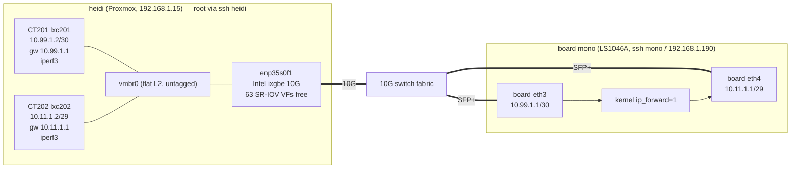

# Traffic Harness — board SFP+ acceptance-gate generator
**Version 1.0.0** · 2026-06-09 · HADS 1.0.0

---

## AI READING INSTRUCTION

Read `[SPEC]` and `[BUG]` blocks for authoritative facts.
Read `[NOTE]` only if additional context is needed.
`[?]` blocks are unverified — treat with lower confidence.

---

## 1. STATUS

**[SPEC]**
- Date: 2026-06-08.
- Live and validated. Supersedes the "10.99.1.2 undocumented / not SSH-able" note in `plans/COMPLETION-PLAN.md` §6.

**[NOTE]**
This is the controllable traffic generator that unblocks every remaining functional acceptance gate (DPAA1 M3-3b/3c/3d/3e wire tests, gate-3 ≥7 Gbps, VPP HW benchmark, ASK2 M2 ≥7 Gbps @ ≤5% CPU). It already exists.

**[SPEC]**
- Two purpose-built Proxmox LXCs on heidi, one per board SFP+ subnet, with the board as their L3 gateway.

---

## 2. TOPOLOGY

**[SPEC]**


**[SPEC]**
- Both LXCs share one flat untagged bridge (`vmbr0` → `enp35s0f1`, 10G, jumbo to MTU 9000).
- CT201 and CT202 are in different /30 subnets whose gateway is the board, so all CT201↔CT202 traffic is forced through the board as a router (eth3 → ip_forward → eth4).
- Verified: `ping` shows `TTL=63` (one hop) and 0% loss.

---

## 3. ACCESS

**[SPEC]**

| Node | How | Notes |
|---|---|---|
| heidi host | `ssh heidi` (admin, `~/.ssh/admin_key`), `sudo` OK | Proxmox VE 8, kernel 6.8 |
| CT201 (eth3 peer) | `ssh heidi 'sudo pct exec 201 -- <cmd>'` | Debian 12, iperf3 preinstalled |
| CT202 (eth4 peer) | `ssh heidi 'sudo pct exec 202 -- <cmd>'` | Debian 12, iperf3 preinstalled |
| Board | `ssh mono` (vyos, `~/.ssh/vyos_vanity`) | eth3=10.99.1.1, eth4=10.11.1.1 |

---

## 4. QUICK START — ROUTED FORWARDING TEST (eth3 → board → eth4)

**[SPEC]**
```bash
# Start iperf3 server on the eth4 peer
ssh heidi 'sudo pct exec 202 -- sh -c "pkill iperf3; iperf3 -s -D"'

# Drive load from the eth3 peer (8 TCP streams, through the board)
ssh heidi 'sudo pct exec 201 -- iperf3 -c 10.11.1.2 -P 8 -t 30'

# UDP at a target rate (for policer-cap / red-drop and clean throughput)
ssh heidi 'sudo pct exec 201 -- iperf3 -c 10.11.1.2 -u -b 9G -l 1400 -t 30'
```

**[SPEC]**
- Baseline measured 2026-06-08 (default-flavor image, plain kernel L3 forwarding, no offload): 4.14 Gbit/s @ 8 TCP streams.

**[NOTE]**
That 4.14 Gbit/s is the software-routing floor; the offloaded flavors (ASK2 M2, DPAA1 CC/CEETM) are measured against the ≥7 Gbps gate from there.

---

## 5. CAPABILITY PER GATE

**[SPEC]**

| Gate | Method on this harness |
|---|---|
| Gate-3 ≥7 Gbps literal | multi-stream iperf3 (`-P`), or UDP `-b`; for true wire-rate use TRex on an SR-IOV VF (below) |
| M3-3d policer throughput cap | UDP `iperf3 -u -b 9G` offered into a policed flow; watch board red-drop counters |
| ASK2 M2 (≥7 Gbps @ ≤5% CPU) | CT201→board→CT202 forwarding load while sampling board kernel-net CPU |
| VPP flavor benchmark | same forwarding path with eth3/eth4 assigned to VPP (MTU ≤3290 on AF_XDP) |
| M3-3c HM 802.1Q strip/insert | **needs tagged frames** — bridge is untagged; use `scapy`/`trafgen`/TRex to push 802.1Q (iperf3 cannot tag) |

---

## 6. WIRE-RATE / 802.1Q UPGRADE PATH (DEFERRED, NOT YET BUILT)

**[SPEC]**
- For a clean ≥7–10 Gbps stateless source and precise 802.1Q generation, `enp35s0f1` exposes 63 SR-IOV VFs (`sriov_totalvfs=63`, currently `0`).
- Plan when needed:
  1. `echo N | sudo tee /sys/class/net/enp35s0f1/device/sriov_numvfs` (N≥1).
  2. Optionally pin a VLAN: `sudo ip link set enp35s0f1 vf 0 vlan <id>`.
  3. Pass the VF into a dedicated LXC/VM (`hostpci`/`pct` device passthrough), bind to `vfio-pci`, set up hugepages, run TRex or DPDK-pktgen.

**[BUG] Binding the whole PF to DPDK drops the harness**
- Symptom: vmbr0 (and the CT201/CT202 + host fabric) goes down, taking the harness offline.
- Cause: binding the entire `enp35s0f1` PF to DPDK removes the kernel netdev that backs vmbr0.
- Fix: keep the PF on the kernel; pass only SR-IOV VFs into the DPDK/TRex generator — never bind the whole PF.

---

## 7. DO-NOT-DISTURB

**[SPEC]**
- `main` (192.168.1.2) is the production LAN/WAN gateway — never use it as a generator; its 10G ports carry live `192.168.1.0/16` + WAN.
- `backup` (192.168.1.3) has a 10G leg (`eth1`, 10.11.1.3) on the eth4 subnet and a free SFP+ cage (`eth3`, down) — usable as an optional second endpoint, but single-CPU iperf3 won't reach line rate alone.