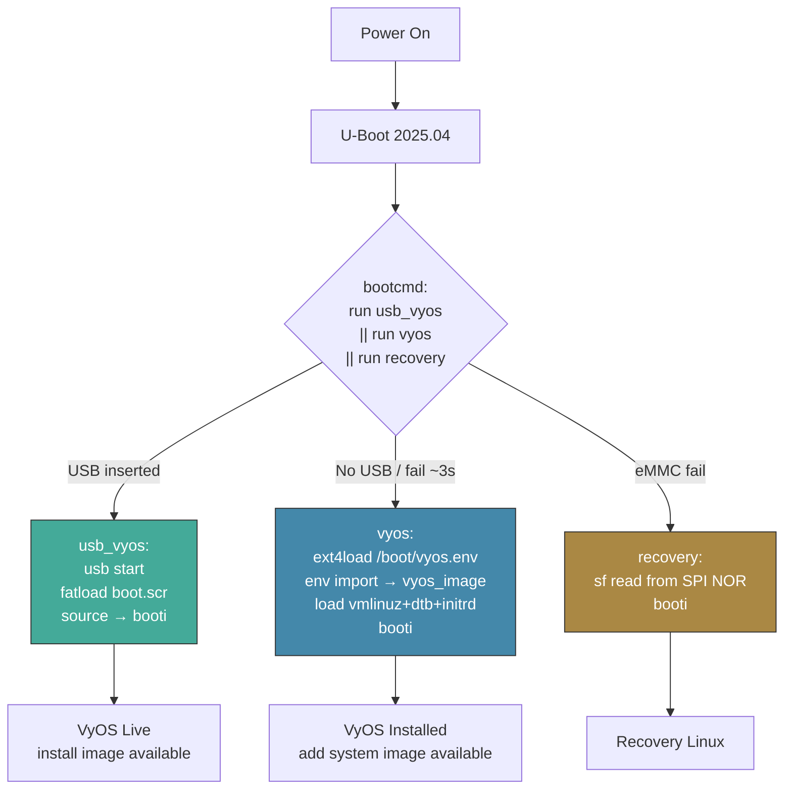

# U-Boot Reference: Mono Gateway LS1046A
**Version 1.0.0** · Updated 2026-04-17 · 2026-06-09 · HADS 1.0.0

---

## AI READING INSTRUCTION

Read `[SPEC]` and `[BUG]` blocks for authoritative facts.
Read `[NOTE]` only if additional context is needed.
`[?]` blocks are unverified — treat with lower confidence.

---

## 1. SCOPE

**[SPEC]**
- Low-level U-Boot reference and seamless-boot specification.
- For boot architecture and kernel config rationale, see `PORTING.md`. For install instructions, see `INSTALL.md`.

**[NOTE]**
This is the stuff you need when you're staring at a serial console at 115200 baud wondering why nothing happened.

---

## 2. SEAMLESS BOOT ARCHITECTURE

### 2.1 Design: `/boot/vyos.env` replaces `fw_setenv`

**[NOTE]**
The old approach wrote the image name into U-Boot's SPI flash via `fw_setenv` on every install and upgrade — four moving parts (`libubootenv-tool`, `/dev/mtd2`, a QSPI driver, a helper script) for a one-line config change.

**[SPEC]**
- Current approach: U-Boot reads the default image name from a text file on the eMMC ext4 partition. VyOS writes this file as part of normal image management; no SPI flash writes after initial setup.

```
eMMC partition 3 (ext4):
  /boot/vyos.env                               ← "vyos_image=2026.03.24-0338-rolling"
  /boot/2026.03.24-0338-rolling/
      vmlinuz
      initrd.img
      mono-gw.dtb
      2026.03.24-0338-rolling.squashfs
```

- U-Boot loads `/boot/vyos.env`, imports it via `env import -t`, and uses `${vyos_image}` to construct all paths. The `vyos` command is static: it never needs `fw_setenv` updates. Set once, boot forever.

### 2.2 Boot chain

**[SPEC]**


### 2.3 When `fw_setenv` is used

**[SPEC]**
- Only during `install image` from USB live boot (forced every time via `vyos-postinstall --root`). It sets:
  - `bootcmd` = `run usb_vyos || run vyos || run recovery`
  - `vyos` = single combined variable: reads `/boot/vyos.env`, loads kernel/dtb/initrd, sets bootargs, calls `booti`
  - `usb_vyos` = delegates to `boot.scr` on USB FAT32 (`usb start; if fatload usb 0:2 ${load_addr} boot.scr; then source ${load_addr}; fi`)
- After this, all future installs and upgrades only write `/boot/vyos.env` — no SPI flash writes, no `fw_setenv`.
- `boot.scr` does NOT write any U-Boot env vars; all SPI flash writes are done by `vyos-postinstall` Phase 1 via `fw_setenv`.

### 2.4 User experience

**[SPEC]**

| Operation | User Action | Automated |
|-----------|------------|-----------|
| First USB boot (factory board) | Interrupt U-Boot, paste ONE line | — |
| `install image` | Run command, accept defaults | Writes `vyos.env` + one-time `fw_setenv` |
| Reboot after install | Remove USB, reboot | U-Boot reads `vyos.env`, boots from eMMC |
| `add system image URL` | Run command | Writes `vyos.env` (no `fw_setenv`) |
| Reboot after upgrade | Reboot | U-Boot reads `vyos.env`, boots new image |
| USB re-install | Insert USB, power cycle | U-Boot auto-detects USB |
| `set system image default-boot` | Run command | Updates `vyos.env` |

---

## 3. U-BOOT ENVIRONMENT (TARGET STATE)

**[SPEC]**
- Set once during first `install image` by `vyos-postinstall` Phase 1 via `fw_setenv`. Re-written (forced) on every subsequent `install image`. Never modified by `boot.scr`.
- Only 3 variables are written to SPI flash:

```bash
# Boot priority: USB → eMMC → SPI recovery
bootcmd=run usb_vyos || run vyos || run recovery

# USB live boot — delegates to boot.scr on FAT32 partition 2
# boot.scr handles all file loading, bootargs, and booti.
# If no USB or no boot.scr, the 'if fatload' fails cleanly and
# || in bootcmd falls through to 'run vyos'.
usb_vyos=usb start; if fatload usb 0:2 ${load_addr} boot.scr; then source ${load_addr}; fi

# eMMC boot — single combined variable: load vyos.env, import image name,
# load kernel/dtb/initrd, set bootargs, booti. Initrd loaded LAST so
# ${filesize} captures its size for the ramdisk addr:size format.
vyos=ext4load mmc 0:3 ${load_addr} /boot/vyos.env; env import -t ${load_addr} ${filesize}; ext4load mmc 0:3 ${kernel_addr_r} /boot/${vyos_image}/vmlinuz; ext4load mmc 0:3 ${fdt_addr_r} /boot/${vyos_image}/mono-gw.dtb; ext4load mmc 0:3 ${ramdisk_addr_r} /boot/${vyos_image}/initrd.img; setenv bootargs BOOT_IMAGE=/boot/${vyos_image}/vmlinuz console=ttyS0,115200 loglevel=4 systemd.show_status=true net.ifnames=0 boot=live rootdelay=5 noautologin nopersistence fsl_dpaa_fman.fsl_fm_max_frm=9600 panic=60 sysctl.net.core.default_qdisc=fq usbcore.autosuspend=-1 vyos-union=/boot/${vyos_image}; booti ${kernel_addr_r} ${ramdisk_addr_r}:${filesize} ${fdt_addr_r}

# SPI flash recovery (factory, always available)
recovery=sf probe 0:0; sf read ${kernel_addr_r} ${kernel_addr} ${kernel_size}; sf read ${fdt_addr_r} ${fdt_addr} ${fdt_size}; booti ${kernel_addr_r} - ${fdt_addr_r}
```

**[SPEC]**
- Hugepages are NOT in default bootargs — added dynamically when VPP is configured via `set vpp settings`, which triggers a one-time kexec to apply `hugepagesz=2M hugepages=512`.
- No `earlycon=` — stock VyOS does not use it; it adds uart8250 spam to the pre-userspace log. `quiet` limits kernel console to KERN_WARNING+ (loglevel 4), matching stock VyOS on amd64.

### 3.1 `/boot/vyos.env` format

**[SPEC]**
Single line, U-Boot `env import -t` compatible (written by VyOS's image installer after every `install image` / `add system image`):
```
vyos_image=2026.03.24-0338-rolling
```

---

## 4. REFERENCE: U-BOOT VERSION

**[SPEC]**
```
U-Boot 2025.04-g9f13d11658f6 (Feb 06 2026 - 09:41:56 +0000)
aarch64-oe-linux-gcc (GCC) 14.3.0
GNU ld (GNU Binutils) 2.44.0.20250715
```

---

## 5. MEMORY MAP

**[SPEC]**

| Variable | Address | Notes |
|----------|---------|-------|
| `kernel_addr_r` | `0x82000000` | Kernel load address |
| `fdt_addr_r` | `0x88000000` | Device tree load address |
| `ramdisk_addr_r` | `0x88080000` | Initrd load address (512KB after FDT) |
| `kernel_comp_addr_r` | `0x90000000` | Compressed kernel decompress area |
| `fdt_size` | `0x100000` | 1 MB reserved for FDT |
| `load_addr` | `0xa0000000` | Generic load address |

- DRAM: 8 GB total.
  - Bank 0: `0x80000000` – `0xfbdfffff` (1982 MB)
  - Bank 1: `0x880000000` – `0x9ffffffff` (6144 MB)

---

## 6. BOOT COMMANDS (DEPLOYED — vyos.env ARCHITECTURE)

**[SPEC]**
- Set automatically by `vyos-postinstall` Phase 1 via `fw_setenv` during every `install image`. Manual paste is only needed for recovery if `fw_setenv` failed. Each `setenv` line stays under 500 chars.

```bash
# 1. eMMC boot — single variable: reads vyos.env, loads kernel+dtb+initrd, sets bootargs, boots.
#    Initrd loaded LAST so ${filesize} captures its size.
setenv vyos 'ext4load mmc 0:3 ${load_addr} /boot/vyos.env; env import -t ${load_addr} ${filesize}; ext4load mmc 0:3 ${kernel_addr_r} /boot/${vyos_image}/vmlinuz; ext4load mmc 0:3 ${fdt_addr_r} /boot/${vyos_image}/mono-gw.dtb; ext4load mmc 0:3 ${ramdisk_addr_r} /boot/${vyos_image}/initrd.img; setenv bootargs BOOT_IMAGE=/boot/${vyos_image}/vmlinuz console=ttyS0,115200 loglevel=4 systemd.show_status=true net.ifnames=0 boot=live rootdelay=5 noautologin nopersistence fsl_dpaa_fman.fsl_fm_max_frm=9600 panic=60 sysctl.net.core.default_qdisc=fq usbcore.autosuspend=-1 vyos-union=/boot/${vyos_image}; booti ${kernel_addr_r} ${ramdisk_addr_r}:${filesize} ${fdt_addr_r}'

# 2. USB live boot — delegates to boot.scr which handles all file loading and bootargs.
#    If no USB or no boot.scr, 'if fatload' fails cleanly → falls through via || in bootcmd.
setenv usb_vyos 'usb start; if fatload usb 0:2 ${load_addr} boot.scr; then source ${load_addr}; fi'

# 3. Boot priority: USB → eMMC → SPI recovery
setenv bootcmd 'run usb_vyos || run vyos || run recovery'

# 4. Save to SPI flash (one-time, never needs changing after install image)
saveenv
```

- After `saveenv`, the board auto-boots from eMMC via `/boot/vyos.env` on every power cycle; inserting a USB with `boot.scr` boots from USB instead (live mode). Future `add system image` upgrades only update `/boot/vyos.env`.

**[SPEC]**
Quoting note: `setenv bootargs` does NOT need double quotes around the value. U-Boot's `setenv` treats everything after the variable name as the value; removing `"..."` avoids nested quote parsing issues in the hush shell.

**[SPEC]**
Critical bootargs (get any wrong and the boot fails silently):
- `BOOT_IMAGE=/boot/${vyos_image}/vmlinuz` — must be FIRST arg; VyOS `is_live_boot()` regex requires it (U-Boot's `booti` does not set it like GRUB does).
- `boot=live` — initramfs uses live-boot mode.
- `vyos-union=/boot/${vyos_image}` — squashfs overlay dir on p3 (also the `is_live_boot()` fallback for U-Boot boards).
- `fsl_dpaa_fman.fsl_fm_max_frm=9600` — enables jumbo frames (max MTU 9578). Module name is `fsl_dpaa_fman`, NOT `fman`; the wrong name silently has no effect.
- `panic=60` — MUST match config.boot.default or `system_option.py` triggers a kexec reboot.
- `usbcore.autosuspend=-1` — required on LS1046A DWC3 xHCI to prevent USB autosuspend stalls.

**[BUG] Missing `boot=live` or `vyos-union=` drops to BusyBox**
- Symptom: boot lands in an initramfs BusyBox shell with no explanation.
- Cause: `boot=live` or `vyos-union=` absent from bootargs — the live-boot initramfs has nothing to mount.
- Fix: ensure both `boot=live` and `vyos-union=/boot/${vyos_image}` are present.

**[SPEC]**
Critical load order: initrd must be loaded LAST so `${filesize}` captures the initrd size; the ramdisk arg MUST be `${ramdisk_addr_r}:${filesize}` (colon+size format).

---

## 7. BOOT FROM USB (FOR INITIAL INSTALL)

**[SPEC]**
- The USB is a hybrid ISO written via `dd`: partition 1 is ISO9660 (squashfs), partition 2 is FAT32 (boot files). One-liner via `boot.scr`:

```bash
usb start; fatload usb 0:2 ${load_addr} boot.scr; source ${load_addr}
```

- `boot.scr` loads vmlinuz, DTB, and initrd from the FAT32 partition, sets bootargs (including `usbcore.autosuspend=-1` for DWC3 xHCI stability), and calls `booti`. Full source: `data/scripts/boot.cmd`.

**[BUG] `usb 0:0` auto-detection fails on the hybrid MBR**
- Symptom: USB boot fails when using `usb 0:0`.
- Cause: LS1046A U-Boot auto-detection (`usb 0:0`) fails on the hybrid MBR.
- Fix: always use `usb 0:2`.

**[BUG] `fatload` says "File not found"**
- Symptom: `fatload` cannot find the kernel/initrd.
- Cause: the kernel has a version suffix (e.g. `vmlinuz-6.6.128-vyos`).
- Fix: run `fatls usb 0:2 live` and use the full name.

---

## 8. FACTORY BOOT COMMANDS (OpenWrt — PRE-INSTALL)

**[SPEC]**
```bash
# Factory default: try eMMC OpenWrt, then SPI recovery
bootcmd=run emmc || run recovery

# eMMC (OpenWrt on partition 1) — destroyed after install image
emmc=setenv bootargs "${bootargs_console} root=/dev/mmcblk0p1 rw rootwait rootfstype=ext4";
    ext4load mmc 0:1 ${kernel_addr_r} /boot/Image.gz &&
    ext4load mmc 0:1 ${fdt_addr_r} /boot/mono-gateway-dk-sdk.dtb &&
    booti ${kernel_addr_r} - ${fdt_addr_r}

# SPI flash recovery (always available)
recovery=sf probe 0:0; sf read ${kernel_addr_r} ${kernel_addr} ${kernel_size};
    sf read ${fdt_addr_r} ${fdt_addr} ${fdt_size};
    booti ${kernel_addr_r} - ${fdt_addr_r}
```

---

## 9. EFI/GRUB: NOT AVAILABLE

**[SPEC]**
- U-Boot on this board was compiled without EFI support (`CONFIG_CMD_EFIDEBUG` disabled). Confirmed 2026-04-17:

```
=> efidebug devices
Unknown command 'efidebug' - try 'help'
```

- `bootefi` is listed in `help` (command stub exists) but cannot function without the EFI runtime. Even if EFI were compiled in, GRUB would OOM due to DPAA1 `reserved-memory` nodes consuming the EFI memory pool.
- Use `booti` via `boot.scr` as the permanent boot method.

---

## 10. FAILED BOOT ATTEMPTS (REFERENCE)

**[BUG] `booti` without `:${filesize}` on ramdisk**
- Symptom: "Wrong Ramdisk Image Format / Ramdisk image is corrupt or invalid" from `booti ${kernel_addr_r} ${ramdisk_addr_r} ${fdt_addr_r}`.
- Cause: `booti` needs the ramdisk in `addr:size` format.
- Fix: use `${ramdisk_addr_r}:${filesize}`.

**[BUG] `booti` kernel-only (no initrd, stale bootargs)**
- Symptom: kernel boots (all 5 FMan MACs probe) but hangs at "Waiting for root device /dev/mmcblk0p1...".
- Cause: bootargs still `root=/dev/mmcblk0p1` from the factory env, and no initrd means no live-boot initramfs to mount the squashfs.
- Fix: load the initrd and set the live-boot bootargs (`boot=live` + `vyos-union=`).

---

## 11. ETHERNET INTERFACES

**[SPEC]**

| Physical Position | DT Node | MAC Address | PHY Addr | VyOS Name | Type |
|-------------------|---------|-------------|----------|-----------|------|
| Port 1 (leftmost RJ45) | `1ae8000.ethernet` | `E8:F6:D7:00:15:FF` | MDIO :00 | **eth0** | SGMII |
| Port 2 (center RJ45) | `1aea000.ethernet` | `E8:F6:D7:00:16:00` | MDIO :01 | **eth1** | SGMII |
| Port 3 (right RJ45) | `1ae2000.ethernet` | `E8:F6:D7:00:16:01` | MDIO :02 | **eth2** | SGMII |
| SFP1 | `1af0000.ethernet` | `E8:F6:D7:00:16:02` | fixed-link | **eth3** | XGMII 10GBase-R |
| SFP2 | `1af2000.ethernet` | `E8:F6:D7:00:16:03` | fixed-link | **eth4** | XGMII 10GBase-R |

**[SPEC]**
- Physical RJ45 port order differs from DT node address order. Port remapping is handled by udev rule `10-fman-port-order.rules`, which calls `fman-port-name` to map FMan MAC DT address → physical port name. On installed systems, VyOS `vyos_net_name` (hw-id matching) takes precedence.

### 11.1 MAC addresses (from U-Boot env)

**[SPEC]**

| Variable | Address | Interface |
|----------|---------|-----------|
| `ethaddr` | `E8:F6:D7:00:15:FF` | eth0 |
| `eth1addr` | `E8:F6:D7:00:16:00` | eth1 |
| `eth2addr` | `E8:F6:D7:00:16:01` | eth2 |
| `eth3addr` | `E8:F6:D7:00:16:02` | eth3 |
| `eth4addr` | `E8:F6:D7:00:16:03` | eth4 |

- MAC addresses are unique per board; yours will differ.

---

## 12. CLOCK TREE & CPU FREQUENCY

**[SPEC]**
- sysclk: 100 MHz (oscillator).

| Clock | Rate | Source | Notes |
|-------|------|--------|-------|
| `cg-pll1-div1` | 1600 MHz | PLL1 | Max CPU frequency |
| `cg-pll1-div2` | 800 MHz | PLL1 | |
| `cg-pll1-div3` | 533 MHz | PLL1 | |
| `cg-pll1-div4` | 400 MHz | PLL1 | |
| `cg-pll2-div1` | 1400 MHz | PLL2 | HWACCEL1 |
| `cg-pll2-div2` | 700 MHz | PLL2 | Minimum CPU clock |
| `cg-pll2-div3` | 466 MHz | PLL2 | |
| `cg-pll2-div4` | 350 MHz | PLL2 | |
| `cg-cmux0` | 1600 MHz | PLL1-div1 | **CPU clock mux (all 4 cores)** ✅ |
| `cg-hwaccel0` | 700 MHz | PLL2-div2 | FMan clock |
| `cg-pll0-div2` | 300 MHz | PLL0 | SPI (DSPI controller) |

**[BUG] CPU stuck at 700 MHz if CPUFREQ is a module**
- Symptom: CPU runs at 700 MHz instead of 1800 MHz (raid6 neonx8 ~2056 MB/s vs ~4816 MB/s — not subtle).
- Cause: `CONFIG_QORIQ_CPUFREQ=m` loads after `clk: Disabling unused clocks` (T+12s) releases the PLL clock parents.
- Fix: `CONFIG_QORIQ_CPUFREQ=y` (built-in) claims PLL clock parents before the unused-clock disable runs.

---

## 13. SPI FLASH (MTD) LAYOUT

**[SPEC]**
```
1550000.spi (accessed via U-Boot sf commands only):
  1M(rcw-bl2)          — Reset Config Word + BL2
  2M(uboot)            — U-Boot
  1M(uboot-env)        — U-Boot environment (saveenv / fw_setenv target)
  1M(fman-ucode)       — FMan microcode (injected to DTB at boot)
  1M(recovery-dtb)     — Recovery device tree
  4M(unallocated)
 22M(kernel-initramfs) — Recovery kernel + initramfs
```

**[BUG] `/proc/mtd` empty and `fw_setenv` fails without `CONFIG_SPI_FSL_QSPI=y`**
- Symptom: `/proc/mtd` is empty and `fw_setenv` fails with "Configuration file wrong or corrupted."
- Cause: `CONFIG_SPI_FSL_QSPI` not built-in, so the QSPI controller (hence MTD partitions) never appears.
- Fix: set `CONFIG_SPI_FSL_QSPI=y`; MTD partitions then appear (`/dev/mtd0`–`/dev/mtdN`). `fw_setenv` uses `/dev/mtd2` (uboot-env). VyOS ships `libubootenv-tool` (not classic `u-boot-tools`), which requires its own `/etc/fw_env.config` format (`/dev/mtd2 0x0 0x2000 0x1000`).

---

## 14. USB DEVICE DETECTION

**[SPEC]**
```
SanDisk 3.2Gen1 (USB 2.10 mode on XHCI)
VID:PID = 0x0781:0x5581
Hybrid ISO: Partition 1 = ISO9660, Partition 2 = FAT32 (boot files)
Access via: fatload usb 0:2 (auto-detection 0:0 fails on hybrid MBR)
```

### 14.1 USB contents (from `fatls usb 0:2`)

**[SPEC]**
```
boot.scr                     (U-Boot boot script)
live/vmlinuz                  (~10 MB, gzip-compressed Image.gz)
live/initrd.img               (~33 MB)
live/filesystem.squashfs      (~526 MB)
mono-gw.dtb                   (94 KB)
```

---

## 15. LIVE SYSTEM STATE (2026-03-24, eMMC INSTALLED)

**[SPEC]**
- Version: 2026.03.24-0338-rolling
- Kernel: 6.6.128-vyos `#1 SMP PREEMPT_DYNAMIC`
- FRRouting: 10.5.2
- Boot source: eMMC installed (`vyos` booti from mmcblk0p3)

| Resource | Value |
|----------|-------|
| CPU frequency | 1800 MHz ✅ |
| CPU governor | performance |
| Memory total | 7.8 GB |
| Memory used | ~800 MB (10%) |
| Temperature | 42°C |
| Boot time | ~82s to login (single boot, no kexec) |