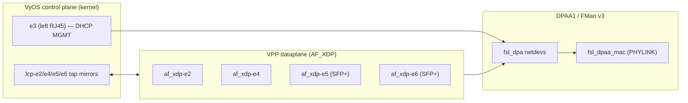

# VyOS + VPP on the LS1046A Mono Gateway (`FLAVOR=vpp`)

Current-state reference for the `vpp` build flavor. Mainline Linux 6.18.x (pinned via [vyos-build/data/defaults.toml](../vyos-build/data/defaults.toml) `kernel_version = "6.18.31"`), VPP from upstream VyOS arm64 packages, AF_XDP datapath on DPAA1 FMan via the in-tree `fsl_dpa` driver. Status: **plumbed and shipping in CI; not benchmarked on hardware after the patch-022 AF_XDP cutover.**

## What this flavor is



- **Kernel keeps every interface bound to `fsl_dpa`** — there is no DPAA unbind/rebind. VPP opens AF_XDP sockets *on top of* the live kernel netdev. Patch `vyos-1x-022` removes the legacy `_dpaa_unbind_ifaces()` path entirely.
- **`fsl_dpa` is routed to AF_XDP**, not DPDK — see [data/vyos-1x-022-vpp-af-xdp-no-dpaa-rebind.patch](../data/vyos-1x-022-vpp-af-xdp-no-dpaa-rebind.patch).
- **LCP (Linux Control Plane)** creates tap mirrors. After VPP starts, the original kernel netdevs are renamed `defunct_e2`, `defunct_e4`, … and `e2`, `e4`, … become the tap interfaces VyOS configures.

## Interface naming (this is not what older docs said)

LS1046A FMan MACs probe in DT unit-address order, not physical-port order. Combined with `vyos_net_name` hw-id matching on installed systems, the visible names on the **vpp flavor** are `e2..e6`, not `eth0..eth4`:

| Visible name | Physical port      | Role on vpp ISO            |
|--------------|--------------------|----------------------------|
| `e3`         | left RJ45          | DHCP management (kernel)   |
| `e2`         | center RJ45        | VPP AF_XDP                 |
| `e4`         | right RJ45         | VPP AF_XDP                 |
| `e5`         | left SFP+ (10G)    | VPP AF_XDP                 |
| `e6`         | right SFP+ (10G)   | VPP AF_XDP                 |

Source of truth: [board/vyos-config/config.boot.vpp](../board/vyos-config/config.boot.vpp).

## Baked-in defaults (vpp flavor ISO ships VPP **on**)

Unlike the `default` and `ask` flavors, the vpp flavor's `config.boot.default` is `config.boot.vpp`, which contains:

```
system {
    option {
        kernel {
            memory {
                hugepage-count 512        # 512 × 2M = 1024 MiB
                hugepage-size 2M
            }
        }
        performance network-latency
        reboot-on-panic
    }
}
vpp {
    settings {
        allow-unsupported-nics            # required for fsl_dpa (no PCI ID)
        interface e2 { }
        interface e4 { }
        interface e5 { }
        interface e6 { }
        poll-sleep-usec 100               # thermal-mandatory; see below
        resource-allocation {
            cpu-cores 1                   # main thread only, no workers
            memory { main-heap-size 256M }
        }
    }
}
```

Hugepages are pre-allocated in U-Boot bootargs (no `set vpp` first-commit kexec dance). Update-check feed is rewritten by [bin/ci-setup-vyos-build.sh](../bin/ci-setup-vyos-build.sh) to `version-vpp.json`.

## The patches that make it work

| Patch                                                                                                | What it does                                                                                                                                                       |
|------------------------------------------------------------------------------------------------------|--------------------------------------------------------------------------------------------------------------------------------------------------------------------|
| [vyos-1x-010-vpp-platform-bus.patch](../data/vyos-1x-010-vpp-platform-bus.patch)                     | Adds `fsl_dpa` to `SUPPORTED_DRIVERS` and `not_pci_drv`; enables `af_xdp_plugin`; lowers minimums to 2 CPUs / 256 MiB heap so ARM64 SoCs pass `verify_*`.           |
| [vyos-1x-022-vpp-af-xdp-no-dpaa-rebind.patch](../data/vyos-1x-022-vpp-af-xdp-no-dpaa-rebind.patch)   | Removes `_dpaa_find_platform_dev` / `_dpaa_unbind_ifaces` and the apply()-time unbind. Comment on `fsl_dpa` becomes `(platform bus, AF_XDP)`.                       |
| [board/scripts/vpp-post-start.sh](../board/scripts/vpp-post-start.sh) + drop-in                       | After LCP rename: raise `defunct_*` hw MTU to **3290** (DPAA XDP ceiling, max headroom) and set VPP internal MTU on each `af_xdp-*` to **1500** (TCP MSS sanity). |

Patch 010 still ships some DPDK template branches in `startup.conf.j2`; on the vpp flavor those branches are now dead code because every `fsl_dpa` interface routes to AF_XDP. Cleaning that up is a follow-up — it doesn't affect behaviour.

## Kernel pieces (already in `kernel/common/`)

VPP needs `BPF_SYSCALL`, `BPF_JIT`, `XDP_SOCKETS`, `XDP_SOCKETS_DIAG`, `HUGETLBFS`, `FSL_FMAN`, `FSL_DPAA_ETH`. All of these are already on in the default arm64 kernel config — the per-flavor file [kernel/flavors/vpp/kernel-config/00-vpp-af-xdp.config](../kernel/flavors/vpp/kernel-config/00-vpp-af-xdp.config) is effectively a documentation stub today, not a fragment that flips any new symbols.

Two kernel-side fixes also have to land on the vpp flavor (they're in `kernel/common/` already, applied for every flavor):

- **DPAA1 XDP `queue_index` patch** ([data/kernel-patches/patch-dpaa-xdp-queue-index.py](../data/kernel-patches/patch-dpaa-xdp-queue-index.py) → converted to a real patch file under `kernel/common/patches/board/`). Rewrites `xdp_rxq_info_reg(... dpaa_fq->fqid ...)` to use `queue_index = 0`. Without this, `bpf_redirect_map(&xsks_map, ctx->rx_queue_index, ...)` falls off the end of XSKMAP (FQID ≥ 32768, max_entries=1024) and AF_XDP RX gets zero packets.
- **MTU ≤ 3290 invariant**. `fsl_dpaa_mac` rejects AF_XDP socket creation on any interface whose MTU exceeds 3290. `vpp-post-start.sh` enforces this on the `defunct_*` side; user-facing tap MTU defaults to 1500.

## Thermal — not optional

- `poll-sleep-usec 100` is **mandatory**. Without it, polling drives `thermal_zone0` (DDR) and `thermal_zone3` (core-cluster) past 87 °C in ~30 min on a passively-cooled board → hardware-protection reboot.
- `cpu-cores 1` (main thread only). VPP worker threads are not enabled by default. AF_XDP on DPAA1 does not support adaptive rx-mode (`set interface rx-mode` returns "unable to set"), so the only way to keep heat down is to avoid creating workers.
- The fan is driven by **[board/scripts/fan-pid](../board/scripts/fan-pid)** — a Python multi-zone PI controller installed at `/usr/local/bin/fan-pid` (`fan-pid.service`). It writes EMC2305 register 0x30 directly over `/dev/i2c-7` because the kernel 6.18 `emc2305` sysfs PWM driver is broken (writes of `0 < N < 255` silently revert; only `0` or `255` reach the chip).
- The lm-sensors `fancontrol` package is **not** installed; `fancontrol.service` is defensively masked by [data/hooks/98-fancontrol.chroot](../data/hooks/98-fancontrol.chroot) so two PWM writers can never race.
- **Do not** `echo 51 > /sys/class/hwmon/hwmonN/pwm1` — it appears to succeed for ~1 s then reverts to 255. Use `fan-check` (`/usr/local/bin/fan-check`) for status; let `fan-pid` own the PWM.

## How it's built

`FLAVOR=vpp` flows through the standard CI pipeline:

1. [bin/ci-setup-kernel.sh](../bin/ci-setup-kernel.sh) — same kernel as `default` (mainline 6.18.x), no flavor-specific patches.
2. [bin/ci-setup-vyos1x.sh](../bin/ci-setup-vyos1x.sh) — applies every `data/vyos-1x-*.patch` (010 + 022 + the rest).
3. [bin/ci-setup-vyos-build.sh](../bin/ci-setup-vyos-build.sh) — selects `config.boot.vpp` as the active default; rewrites the update-check URL to `version-vpp.json`; stages `vpp-post-start.sh` + its systemd drop-in into the chroot.
4. [bin/ci-build-packages.sh](../bin/ci-build-packages.sh) — builds vyos-1x .deb, kernel .deb, accel-ppp-ng .deb.
5. [bin/ci-build-iso.sh](../bin/ci-build-iso.sh) — produces `vyos-<v>-LS1046A-vpp-arm64.iso`.
6. [bin/ci-verify-vpp-iso.sh](../bin/ci-verify-vpp-iso.sh) — fails the build if the staged config or chroot is missing required VPP bits.

Dispatch a release build with:

```bash
gh workflow run "VyOS LS1046A build (self-hosted)" --ref main -f flavor=vpp
```

## Known issues (today)

1. **No hardware throughput numbers** for the post-022 AF_XDP path. Last published figure under the patch-010-only build was ~3.5 Gbps on a single 10G SFP+ link (kernel-bound) — see AGENTS.md "DPAA1 kernel↔VPP handoff (AF_XDP)" entry. Re-benchmark on a real `FLAVOR=vpp` ISO.
2. **AF_XDP zero-copy is unavailable.** `fsl_dpaa_mac` lacks `ndo_xsk_wakeup`, so VPP runs copy-mode AF_XDP (~1.3 % overhead at 1500 B). XDP attach mode is native (`XDP_ATTACHED_DRV`); libxdp's dispatcher `EACCES` is cosmetic and falls back to `xsk_def_prog`.
3. **DPDK DPAA1 PMD is not a path.** The mixed-mode `dpaa_bus` probe initializes BMan pools and QMan FQs globally and corrupts kernel-owned interfaces (RC#31, confirmed 2026-04-03 / 2026-03-29). The historical NXP-fork stack (`lf-6.6.*` kernel + NXP DPDK + NXP VPP + fmlib + fmc) was deleted on 2026-04-28; we run mainline 6.18.x now. AF_XDP is the only viable mixed kernel + VPP datapath on this SoC.
4. **DPAA1 jumbo frames + VPP are incompatible.** AF_XDP MTU ceiling is 3290; kernel-only ports (`e3`) retain full 9578 jumbo.

## Day-1 verification on the board

After installing a `LS1046A-vpp` ISO and rebooting:

```bash
# VPP service up
systemctl is-active vpp
sudo vppctl show version

# AF_XDP interfaces present
sudo vppctl show interface | grep af_xdp-
sudo vppctl show interface addr

# LCP tap mirrors created
sudo vppctl show lcp
ip -br link show | grep -E '(^|defunct_)e[2-6]'

# MTUs sane (defunct=3290, taps=1500)
for i in e2 e4 e5 e6; do ip link show "$i"; ip link show "defunct_$i"; done

# Thermal headroom
fan-check
for z in /sys/class/thermal/thermal_zone*/temp; do echo "$z: $(($(cat $z)/1000))°C"; done
```

If any `af_xdp-*` interface is missing, check `journalctl -u vpp.service` for `xsk_socket__create` failures — almost always either MTU > 3290 or hugepage shortage.

## Roadmap

Order of work, smallest first:

1. **Boot a vpp ISO on hardware**, capture `show interface` / `show runtime` / `fan-check` / thermal-zone temps under idle and under iperf3 load. Record the real throughput per direction on a single 10G SFP+ link, then on both.
2. **Strip the dead DPDK branches** out of patch 010's `startup.conf.j2` block now that 022 makes them unreachable on the vpp flavor.
3. **Enable a single VPP worker thread** (`cpu-cores 2`, worker on core 1) once fan-pid has been validated under sustained 10G load, and re-benchmark.
4. **CAAM crypto via VPP** — load `crypto_native` / `crypto_openssl` plugins on the vpp flavor and benchmark IPsec AES-GCM through the in-kernel CAAM driver (`/dev/crypto` or AF_ALG path). CAAM is already enabled (see AGENTS.md "CAAM hardware crypto").
5. **L3 forwarding + NAT44** via VPP, with FRR on the control plane talking over the LCP taps.

Hardware-level FMan offload (parse/classify/policer steering into per-worker FQs) is **not** in scope — it requires either NXP's USDPAA path (deleted) or a from-scratch native VPP DPAA1 plugin (see [specs/vpp-dpaa1-ls1046a-spec.md](../specs/vpp-dpaa1-ls1046a-spec.md), v0.1 draft, ~12 kLOC). Treat that spec as research; the production path is AF_XDP.

## See also

- [AGENTS.md](../AGENTS.md) — the authoritative day-to-day reference (interface naming, MTU rules, thermal, kexec, patch discipline).
- [specs/vpp-dpaa1-ls1046a-spec.md](../specs/vpp-dpaa1-ls1046a-spec.md) — the hardware-offload native plugin design, not built.
- [plans/MULTI-FLAVOR-RELEASE.md](MULTI-FLAVOR-RELEASE.md) — how `default | ask | vpp` ISOs and `version-*.json` feeds coexist.
- [plans/NETWORKING-DEEP-DIVE.md](NETWORKING-DEEP-DIVE.md) — DPAA1 / FMan / QBMan architecture background.
