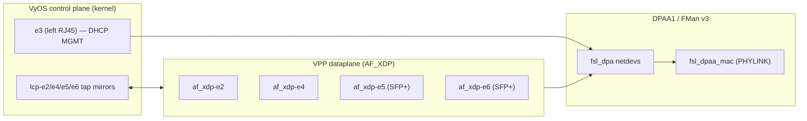

# VyOS + VPP on the LS1046A Mono Gateway (single-image AF_XDP dataplane)
**Version 1.0.0** · 2026-06-09 · HADS 1.0.0

---

## AI READING INSTRUCTION

Read `[SPEC]` and `[BUG]` blocks for authoritative facts.
Read `[NOTE]` only if additional context is needed.
`[?]` blocks are unverified — treat with lower confidence.

---

## 1. STATUS & SCOPE

**[SPEC]**
- Current-state reference for the `vpp` build flavor.
- Mainline Linux 6.18.x (pinned via `vyos-build/data/defaults.toml` `kernel_version = "6.18.31"`), VPP from upstream VyOS arm64 packages, AF_XDP datapath on DPAA1 FMan via the in-tree `fsl_dpa` driver.
- Status: plumbed and shipping in CI; not benchmarked on hardware after the patch-022 AF_XDP cutover.

---

## 2. WHAT THIS FLAVOR IS

**[SPEC]**


**[SPEC]**
- The kernel keeps every interface bound to `fsl_dpa` — there is no DPAA unbind/rebind. VPP opens AF_XDP sockets on top of the live kernel netdev. Patch `vyos-1x-022` removes the legacy `_dpaa_unbind_ifaces()` path entirely.
- `fsl_dpa` is routed to AF_XDP, not DPDK (see `data/vyos-1x-022-vpp-af-xdp-no-dpaa-rebind.patch`).
- LCP (Linux Control Plane) creates tap mirrors. After VPP starts, the original kernel netdevs are renamed `defunct_e2`, `defunct_e4`, … and `e2`, `e4`, … become the tap interfaces VyOS configures.

---

## 3. INTERFACE NAMING

**[SPEC]**
- LS1046A FMan MACs probe in DT unit-address order, not physical-port order. Combined with `vyos_net_name` hw-id matching on installed systems, the visible names on the vpp flavor are `e2..e6`, not `eth0..eth4`.

| Visible name | Physical port      | Role on vpp ISO            |
|--------------|--------------------|----------------------------|
| `e3`         | left RJ45          | DHCP management (kernel)   |
| `e2`         | center RJ45        | VPP AF_XDP                 |
| `e4`         | right RJ45         | VPP AF_XDP                 |
| `e5`         | left SFP+ (10G)    | VPP AF_XDP                 |
| `e6`         | right SFP+ (10G)   | VPP AF_XDP                 |

- Source of truth: `board/vyos-config/config.boot.vpp`.

---

## 4. BAKED-IN DEFAULTS (vpp flavor ISO ships VPP ON)

**[SPEC]**
- Unlike `default` and `ask`, the vpp flavor's `config.boot.default` is `config.boot.vpp`:

```
system {
    option {
        kernel {
            memory {
                hugepage-count 512        # 512 × 2M = 1024 MiB
                hugepage-size 2M
            }
        }
        performance network-latency
        reboot-on-panic
    }
}
vpp {
    settings {
        allow-unsupported-nics            # required for fsl_dpa (no PCI ID)
        interface e2 { }
        interface e4 { }
        interface e5 { }
        interface e6 { }
        poll-sleep-usec 100               # thermal-mandatory; see below
        resource-allocation {
            cpu-cores 1                   # main thread only, no workers
            memory { main-heap-size 256M }
        }
    }
}
```

- Hugepages are pre-allocated in U-Boot bootargs (no `set vpp` first-commit kexec dance).

---

## 5. THE PATCHES THAT MAKE IT WORK

**[SPEC]**

| Patch | What it does |
|-------|--------------|
| `data/vyos-1x-010-vpp-platform-bus.patch` | Adds `fsl_dpa` to `SUPPORTED_DRIVERS` and `not_pci_drv`; enables `af_xdp_plugin`; lowers minimums to 2 CPUs / 256 MiB heap so ARM64 SoCs pass `verify_*`. |
| `data/vyos-1x-022-vpp-af-xdp-no-dpaa-rebind.patch` | Removes `_dpaa_find_platform_dev` / `_dpaa_unbind_ifaces` and the apply()-time unbind. Comment on `fsl_dpa` becomes `(platform bus, AF_XDP)`. |
| `board/scripts/vpp-post-start.sh` + drop-in | After LCP rename: raise `defunct_*` hw MTU to 3290 (DPAA XDP ceiling, max headroom) and set VPP internal MTU on each `af_xdp-*` to 1500 (TCP MSS sanity). |

**[NOTE]**
Patch 010 still ships some DPDK template branches in `startup.conf.j2`; in the single image those branches are dead code because every `fsl_dpa` interface routes to AF_XDP. Cleaning that up is a follow-up — it doesn't affect behaviour.

---

## 6. KERNEL PIECES (ALREADY IN `kernel/common/`)

**[SPEC]**
- VPP needs `BPF_SYSCALL`, `BPF_JIT`, `XDP_SOCKETS`, `XDP_SOCKETS_DIAG`, `HUGETLBFS`, `FSL_FMAN`, `FSL_DPAA_ETH` — all already on in the default arm64 kernel config.
- The legacy `kernel/flavors/vpp/kernel-config/00-vpp-af-xdp.config` was only ever a documentation stub (it flipped no new symbols); under the single-image model there is no vpp flavor tree.
- Two kernel-side fixes land in `kernel/common/` (applied unconditionally to the single image): the DPAA1 XDP `queue_index` patch and the MTU ≤ 3290 invariant.

**[BUG] AF_XDP RX gets zero packets without the queue_index=0 patch**
- Symptom: AF_XDP RX receives zero packets on DPAA1 interfaces.
- Cause: `xdp_rxq_info_reg(... dpaa_fq->fqid ...)` uses the raw FQID (≥ 32768), so `bpf_redirect_map(&xsks_map, ctx->rx_queue_index, ...)` falls off the end of XSKMAP (max_entries = 1024).
- Fix: the DPAA1 XDP `queue_index` patch (`data/kernel-patches/patch-dpaa-xdp-queue-index.py` → real patch under `kernel/common/patches/board/`) rewrites `queue_index = 0`.

**[BUG] AF_XDP socket creation rejected when MTU > 3290**
- Symptom: `xsk_socket__create` / AF_XDP socket creation fails on an interface.
- Cause: `fsl_dpaa_mac` rejects AF_XDP socket creation on any interface whose MTU exceeds 3290.
- Fix: `vpp-post-start.sh` enforces MTU ≤ 3290 on the `defunct_*` side; user-facing tap MTU defaults to 1500.

---

## 7. THERMAL — NOT OPTIONAL

**[SPEC]**
- `cpu-cores 1` (main thread only). VPP worker threads are not enabled by default. AF_XDP on DPAA1 does not support adaptive rx-mode (`set interface rx-mode` returns "unable to set"), so avoiding workers is the only way to keep heat down.
- The fan is driven by `board/scripts/fan-pid` — a Python multi-zone PI controller installed at `/usr/local/bin/fan-pid` (`fan-pid.service`).
- The lm-sensors `fancontrol` package is NOT installed; `fancontrol.service` is defensively masked by `data/hooks/98-fancontrol.chroot` so two PWM writers can never race.
- Use `fan-check` (`/usr/local/bin/fan-check`) for status; let `fan-pid` own the PWM.

**[BUG] Passively-cooled board thermal-reboots without `poll-sleep-usec 100`**
- Symptom: hardware-protection reboot ~30 min into operation.
- Cause: unthrottled polling drives `thermal_zone0` (DDR) and `thermal_zone3` (core-cluster) past 87 °C on a passively-cooled board.
- Fix: `poll-sleep-usec 100` is mandatory in the VPP settings.

**[BUG] EMC2305 sysfs PWM writes silently revert (kernel 6.18)**
- Symptom: writing `0 < N < 255` to `/sys/class/hwmon/hwmonN/pwm1` appears to succeed for ~1 s then reverts to 255; only `0` or `255` reach the chip.
- Cause: the kernel 6.18 `emc2305` sysfs PWM driver is broken.
- Fix: `fan-pid` writes EMC2305 register 0x30 directly over `/dev/i2c-7`; do NOT `echo 51 > /sys/class/hwmon/hwmonN/pwm1`.

---

## 8. HOW IT'S BUILT

**[SPEC]**
VPP ships in the single image; its bits flow through the standard CI pipeline:
1. `bin/ci-setup-kernel.sh` — mainline 6.18.x kernel, no VPP-specific patches.
2. `bin/ci-setup-vyos1x.sh` — applies every `data/vyos-1x-*.patch` (010 + 022 + the rest).
3. `bin/ci-setup-vyos-build.sh` — stages `vpp-post-start.sh` + its systemd drop-in into the chroot (VPP is present but dormant until `set vpp settings`).
4. `bin/ci-build-packages.sh` — builds vyos-1x .deb, kernel .deb, accel-ppp-ng .deb.
5. `bin/ci-build-iso.sh` — produces the single `vyos-<v>-LS1046A-arm64.iso`.
6. `bin/ci-verify-vpp-iso.sh` — fails the build if the staged chroot is missing required VPP bits.

**[SPEC]**
Dispatch a release build with:
```bash
gh workflow run "VyOS LS1046A build (self-hosted)" --ref main
```

---

## 9. KNOWN ISSUES (TODAY)

**[SPEC]**
- No hardware throughput numbers for the post-022 AF_XDP path. Last published figure under the patch-010-only build was ~3.5 Gbps on a single 10G SFP+ link (kernel-bound). Re-benchmark on a current single-image ISO.
- DPAA1 jumbo frames + VPP are incompatible: AF_XDP MTU ceiling is 3290; kernel-only ports (`e3`) retain full 9578 jumbo.

**[SPEC]**
AF_XDP zero-copy is unavailable: `fsl_dpaa_mac` lacks `ndo_xsk_wakeup`, so VPP runs copy-mode AF_XDP (~1.3 % overhead at 1500 B). XDP attach mode is native (`XDP_ATTACHED_DRV`); libxdp's dispatcher `EACCES` is cosmetic and falls back to `xsk_def_prog`.

**[BUG] DPDK DPAA1 PMD corrupts kernel-owned interfaces**
- Symptom: kernel-owned interfaces are corrupted when the DPDK DPAA1 PMD path is used.
- Cause: the mixed-mode `dpaa_bus` probe initializes BMan pools and QMan FQs globally (RC#31, confirmed 2026-04-03 / 2026-03-29).
- Fix: do not use the DPDK DPAA1 PMD; AF_XDP is the only viable mixed kernel + VPP datapath on this SoC. The historical NXP-fork stack (`lf-6.6.*` kernel + NXP DPDK + NXP VPP + fmlib + fmc) was deleted 2026-04-28; mainline 6.18.x is used now.

---

## 10. DAY-1 VERIFICATION ON THE BOARD

**[SPEC]**
After installing the single-image ISO, configuring VPP (`set vpp settings …`), and rebooting:
```bash
# VPP service up
systemctl is-active vpp
sudo vppctl show version

# AF_XDP interfaces present
sudo vppctl show interface | grep af_xdp-
sudo vppctl show interface addr

# LCP tap mirrors created
sudo vppctl show lcp
ip -br link show | grep -E '(^|defunct_)e[2-6]'

# MTUs sane (defunct=3290, taps=1500)
for i in e2 e4 e5 e6; do ip link show "$i"; ip link show "defunct_$i"; done

# Thermal headroom
fan-check
for z in /sys/class/thermal/thermal_zone*/temp; do echo "$z: $(($(cat $z)/1000))°C"; done
```

**[BUG] Missing `af_xdp-*` interface after boot**
- Symptom: an `af_xdp-*` interface is absent from `show interface`.
- Cause: `xsk_socket__create` failed — almost always either MTU > 3290 or a hugepage shortage.
- Fix: check `journalctl -u vpp.service` for `xsk_socket__create` failures; correct the MTU (≤ 3290) or hugepage allocation.

---

## 11. ROADMAP

**[SPEC]**
Order of work, smallest first:
1. Boot a vpp ISO on hardware; capture `show interface` / `show runtime` / `fan-check` / thermal-zone temps under idle and under iperf3 load. Record real throughput per direction on a single 10G SFP+ link, then on both.
2. Strip the dead DPDK branches out of patch 010's `startup.conf.j2` block now that 022 makes them unreachable on the vpp flavor.
3. Enable a single VPP worker thread (`cpu-cores 2`, worker on core 1) once fan-pid is validated under sustained 10G load, and re-benchmark.
4. CAAM crypto via VPP — load `crypto_native` / `crypto_openssl` plugins and benchmark IPsec AES-GCM through the in-kernel CAAM driver (`/dev/crypto` or AF_ALG path). CAAM is already enabled.
5. L3 forwarding + NAT44 via VPP, with FRR on the control plane talking over the LCP taps.

**[SPEC]**
- Hardware-level FMan offload (parse/classify/policer steering into per-worker FQs) is NOT in scope — it requires either NXP's USDPAA path (deleted) or a from-scratch native VPP DPAA1 plugin (`specs/vpp-dpaa1-ls1046a-spec.md`, v0.1 draft, ~12 kLOC). The production path is AF_XDP.

---

## 12. SEE ALSO

**[SPEC]**
- `AGENTS.md` — authoritative day-to-day reference (interface naming, MTU rules, thermal, kexec, patch discipline).
- `specs/vpp-dpaa1-ls1046a-spec.md` — the hardware-offload native plugin design, not built.
- `plans/MULTI-FLAVOR-RELEASE.md` — how `default | ask | vpp` ISOs and `version-*.json` feeds coexist.
- `plans/NETWORKING-DEEP-DIVE.md` — DPAA1 / FMan / QBMan architecture background.