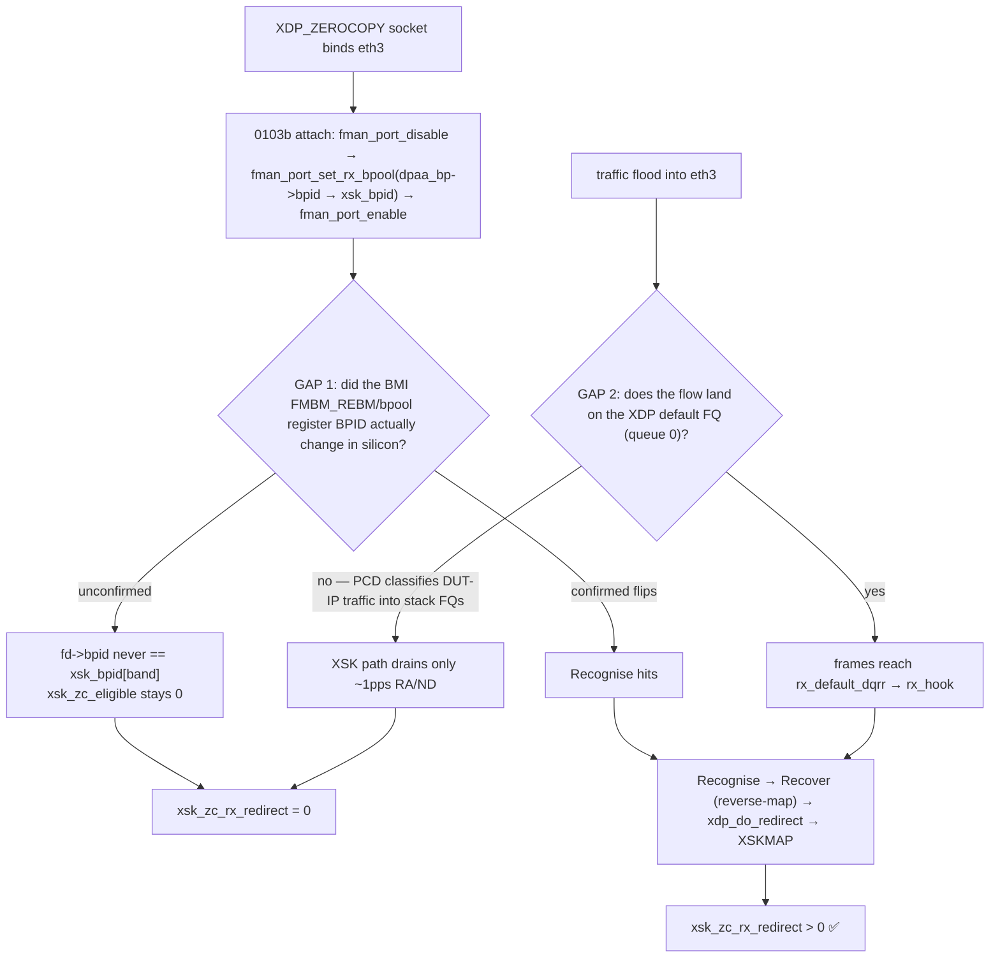

# Scope brief — Drive the DPAA1 true-ZC AF_XDP RX productive oracle (`xsk_zc_rx_redirect > 0`)

**Status:** ✅ **FUNCTIONALLY RESOLVED 2026-06-10** — true-ZC RX is HW-validated: oracle `xsk_zc_rx_redirect` 0→7→8 reproducible (ISO `2026.06.10-0124-rolling`, kernel `6.18.34-vyos`, DUT `192.168.1.190`). GAP 1 closed (`0102b` BMI readback: `FMBM_EBMPI[0]` bpid 3→5 in silicon), GAP 1b closed (`0103g` NULL-`xdp.rxq` crash fixed, i40e `MEM_TYPE_XSK_BUFF_POOL` rxq registration), dispatch-placement fixed (`0103f`). Crash-free + reversible (serial-capture clean). **Only optimization remains:** GAP 2 = bulk-flow steering onto the XSK default FQ for a *high-rate* ZC throughput number (not gate-3-blocking — copy-mode already meets capacity). See spec §6.1.18. Original brief preserved below for the GAP-2 follow-up.
**Owner:** (assign)
**Branch:** `dpaa1` (do **not** disrupt `main`).
**Authoritative spec:** `specs/dpaa1-afxdp-modernization-spec.md` §6.1.10–§6.1.17 (M3-3 step 7). This brief is a self-contained pointer; the spec is the source of truth. Cross-ref `plans/COMPLETION-PLAN.md` §4.3.

---

## 1. One-paragraph goal

Make the FMan RX BMI DMA ingress frames **directly into the XSK UMEM's BMan buffer pool**, so the driver can recognise those frames, recover the owning `xdp_buff`, and `xdp_do_redirect()` them into the XSKMAP — i.e. **true zero-copy RX**. The single success oracle is the ethtool counter **`xsk_zc_rx_redirect`**. It now fires (resolved 2026-06-10, ISO `2026.06.10-0124`); the only remaining item is **GAP 2** — driving a *high-rate* steered flow onto the XSK default FQ to put a throughput number on true-ZC RX (NOT gate-3-blocking).

This is **NOT gate-3 (capacity) blocking** — copy-mode AF_XDP already meets the ~3.5 Gbps capacity target (§6.1.8a/§6.1.8b). This task closes the *true-ZC* optimisation, the last item of M3-3 step 7.

---

## 2. What is already DONE (do not redo)

All patches are in-tree and CI-built. Mechanism split (Recognise / Recover / reProgram) per §6.1.10–§6.1.17:

| Patch | Role | State |
|-------|------|-------|
| `0093`–`0096` | Diagnostic counters `xsk_zc_eligible` / `xsk_zc_rx_armed` / `xsk_fill_guard_block` / `xsk_zc_rx_recovered` (read-side of all 3 mechanisms) | DUT-validated dormant |
| `0102` | Exported WRITE primitive `fman_port_set_rx_bpool(port, old_bpid, new_bpid)` (mechanism 3 reProgram). v2 operates on persistent `port->ext_buf_pools` (NOT the freed `port->cfg`) | landed; attach-time `-EINVAL` resolved |
| `0103a` | Recover sw-ring reverse-map: `dpaa_xsk_chunk_record/lookup`, sorted `dma_addr_t → head-index` `bsearch` array, 21st counter `xsk_zc_recover_lookup`. Needed because **kernel 6.18.31+ has NO `xsk_buff_recv()` retrieve-by-DMA primitive** | landed dormant |
| `0103b` | Productive coupled reprogram-WRITE (attach) + Recover-redirect hook (`af_xdp_pool_rx_hook` via `priv->qmgmt_ops->rx_hook`), 22nd counter `xsk_zc_rx_redirect` | landed; **DUT entry-gate-validated, oracle still 0** |

**Proven on hardware:** entry gate §6.1.12 preconditions **(1)+(2) MET** (`xsk_zc_rx_armed=2`, `xsk_fill_guard_block=0` under load); the reprogram-WRITE fires **crash-free and fully reversible** across attach/detach (eth3 recovers IP reachability, zero dmesg crash hits). The dangerous part (live FMan RX-port BPID reprogram) works safely — GAP 2 (a high-rate steered flow) is all that remains.

---

## 3. The two gaps to close (the actual work)

### GAP 1 — BMI re-commit effective ✅ CLOSED (2026-06-09)

`0102b` register-readback proved the live port's external-bpool BPID flips `priv->dpaa_bp->bpid → priv->xsk_bpid[band]` across the `disable → write → enable` bracket and reverts on detach. See the Addendum.

### GAP 2 — steer real traffic onto the XDP default FQ (queue 0)
The bulk flood used in §6.1.17 targeted the DUT IP `10.99.1.1` and was **PCD-classified into the normal stack FQs**, not the default FQ that the XDP/XSK path drains. Only ~1 pps background IPv6 RA/ND reached the XSK socket. So even with GAP 1 closed, `fd->bpid` is only set to the XSK BPID for frames the FMan steers to the reprogrammed pool — you must get a high-rate flow to that pool/FQ.

**Task:** make a high-rate flow reach the XSK default FQ. Two viable routes (pick one):
1. **PCD steering rule** — install an FMan PCD classification/KeyGen rule that routes the test 5-tuple into the default RX FQ (queue 0). The PCD subsystem is now in-tree (`fman_pcd_*`, §6.1.13) — this is the same substrate the policer/HM use.
2. **Peer-initiated flood independent of the DUT IP stack** — generate L2/non-terminating traffic from the peer (`10.99.1.2`, directly-connected 10G) that the FMan delivers to the default FQ rather than punting up the stack. (e.g. traffic not addressed to a DUT-terminated socket.)

### Test-harness constraint (must design around)
A **DRV-mode XDP redirect prog on eth3 hijacks the entire RX path**, so an `iperf3` source running *on the same eth3* dies the instant the probe attaches (`delta_pps 190206 → 1`). The traffic generator and the XSK consumer **cannot coexist on one interface** with the current probe. Use a **peer-initiated** flow (from `10.99.1.2`), or a second interface, or combine with the GAP-2 PCD steer.

---

## 4. Acceptance criteria

1. **GAP 1 closed:** a documented register readback shows eth3 RX BMI port `0x10` external-bpool BPID changing `priv->dpaa_bp->bpid → priv->xsk_bpid[band]` across a ZC bind, and reverting on unbind.
2. **Oracle fires:** under a sustained ZC bind + steered flow, `ethtool -S eth3 | grep xsk_zc_rx_redirect` climbs > 0, and `xsk_zc_eligible` + `xsk_zc_recover_lookup` also climb (per-FD recognise + reverse-map hit). `/usr/local/bin/xsk-zc-check` renders the productive-ZC verdict.
3. **Safety preserved:** dmesg crash grep stays zero across bind/unbind; eth3 recovers IP reachability after detach (the §6.1.17 reversibility result must not regress).
4. **No regression** to copy-mode capacity (§6.1.8a/b) on `default`/`vpp`.

---

## 5. Build / deploy / test loop

- **Build:** `bin/dev-build.sh kernel` (native arm64, fastest) or full CI ISO via the `build-image` skill (`gh workflow run "VyOS LS1046A build (self-hosted)" --ref dpaa1`). **CRITICAL:** `dev-build.sh kernel` does `rm -rf $KSRC` + fresh re-extract of `linux-6.18.34` + re-applies **all** board patches every run — kernel-source edits in the work tree are wiped; **the `kernel/common/patches/board/*.patch` files are the only durable source of truth.** Every kernel build path MUST pass `LOCALVERSION=-vyos` (vermagic `6.18.34-vyos`).
- **Deploy to DUT:** `add system image <url>` (never `install image`). For ZC iteration the `vpp` flavor is the validated vehicle (`xsk_*` counters exercised under VPP AF_XDP); `default` also carries the counters.
- **DUT access:** mgmt SSH `ssh -i ~/.ssh/vyos_key vyos@192.168.1.190`; raw `ethtool`/`tc`/`ping`/`python3 /dev/mem` need `sudo` (key NOPASSWD). Serial relay `telnet 192.168.1.16:5555` for boot/recovery.
- **Probe tools (already in repo / on DUT):**
  - `bin/dpaa1-xsk-bind-probe.py eth3 0 4096 --hold N --xskmap` — bind an `XDP_ZEROCOPY` socket + install the XSKMAP redirect prog.
  - `/usr/local/bin/xsk-zc-check` — reads the `xsk_*` suite, renders the §6.1.12/§6.1.17 verdict (dormant / armed / productive / fault). Exit 0/1/2.
  - `bin/dpaa1-xdp-rxcap.py` — XDP_DROP driver-only RX capacity reference.
- **Lab:** peer is `10.99.1.2` (directly-connected 10G, lxc201). eth3 = left SFP+ = MAC9/f0000, BMI hw port id `0x10`; eth4 = `0x11`.

---

## 6. Guard-rails

- Specs (`specs/dpaa1-afxdp-modernization-spec.md`) > `plans/`. Update §6.1.17 (and §6.1.15) with findings; record root cause + register evidence in **qdrant** (`qdrant-find` first, `qdrant-store` after).
- **Do not guess register bits** — extract exact encodings from `fman_port.c` + the LS1046A RM / NXP SDK refs (`/tmp/kilo/sdk_*`, `fsl_fman_kg.h`).
- No auto-commit/push without explicit user request — stage for review.
- This is debug, not a forward-port: if you find yourself adding a new `fman_pcd_*` accessor, stop — the accessor (`0102`) and its caller (`0103b`) already exist; the gap is BMI-effectiveness + steering, not missing API.

---

## Addendum — GAP 1 + crash fixes RESOLVED (2026-06-09/10)

GAP 1 (BMI re-commit), the dispatch-placement defect (`0103f`), the `FMBM_EBMPI` readback (`0102b`), and the NULL-`xdp.rxq` first-recovered-frame crash (`0103g`, i40e `MEM_TYPE_XSK_BUFF_POOL` rxq registration + NAPI-only flush `0110`) are all fixed + HW-validated. Full trail (serial-capture crash traces, register evidence): Qdrant `topic=dpaa1-afxdp-spec-milestone-archive`. Only GAP 2 (high-rate steered flow → throughput number) remains.
