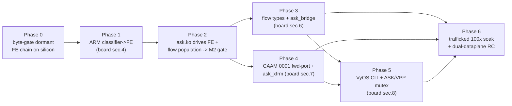

# ASK2 Development Plan — from dormant substrate to operational offload
**Version 1.0.0 · 2026-06-16 · HADS 1.0.0**

> **⚠ SUPERSEDED 2026-07-18 by [`plans/ASK2-JOURNEY-REVIEW-2026-07-18.md`](ASK2-JOURNEY-REVIEW-2026-07-18.md).**
> This document is frozen at the 2026-06-16 state (M0 oracle delivery, Fork-B decision).
> The journey review incorporates 32 days of subsequent development including:
> M2 gate PASS (7.37 Gbps, 0.16% CPU), F-072b/c/d auto-arm of FmPortSetFESupport,
> 0163 `fman_pcd_port_recover`, 0164 true-ZC fix, and the settled dispatch topology.
> **Read the journey review for current state; this document is preserved for historical
> context on the Fork-A→Fork-B transition and the M0 architectural decisions.**

---

## AI READING INSTRUCTION

Read `[SPEC]` and `[BUG]` blocks for authoritative facts.
Read `[NOTE]` only if additional context is needed.
`[?]` blocks are unverified — treat with lower confidence.

This plan is execution-oriented and subordinate to two sources of truth: the
silicon contract in [`arch/fman-fe-ehash.md`](../arch/fman-fe-ehash.md) and the
state machine in [`plans/DUAL-DATAPLANE.md`](DUAL-DATAPLANE.md). Where this plan
and those documents disagree, they win. Section 9 is the live execution log.

---

## 1. Current state (ground truth, 2026-06-16)

**[SPEC]**
The silicon-programming substrate is complete, reversible, and HW-proven
dormant. The remaining work is five capabilities, surfaced as the five `[FAIL]`
lines of `board/scripts/ask-check` run on the lab board (192.168.1.190, image
`2026.06.17-0315-rolling`, kernel `6.18.34-vyos`):

| Layer | State | Anchor |
|---|---|---|
| FMan PCD subsystem (KeyGen / CC / HM / Policer) | DONE, shipping | board patches `0092`/`0097`–`0100` (commit `f307193`) |
| Reversible mode-switch API + `pcd-snapshot` | DONE, HW-proven (100× control-plane soak, 0 drift) | `0105`/`0106`/`0116`/`0129` |
| FE/ehash VM substrate (dormant chain) | BUILT, DORMANT | `0122`→`0131`, byte-verifiable via `fe_*` debugfs |
| ask.ko control plane (genl, flow table, debugfs, engage entry) | BUILT | `ask_flow_offload.c` 92 KB, `ask_hw.c` 32 KB, genl id 0x1e |
| Classifier→FE root link armed | **FAIL** | the single datapath gate |
| `ask_bridge.ko` (L2 switchdev) | **FAIL** (stub 417 B) | `kernel/ask/oot-modules/ask/ask_bridge.c` |
| CAAM descriptor-sharing API | **FAIL** (`0001` not in common tree) | symbol `caam_qi_ext_consumer_register` absent on board |
| ESP hardware-offload advertise | **FAIL** (stub 1 KB) | `ask_xfrm.c` |
| `set system offload ask` CLI | **FAIL** (not started) | — |

**[SPEC]**
Fork A (classic exact-match `CONT_LOOKUP`) is dead on the 210.10.1 microcode.
iter-49/50 fault-capture (2026-06-16) proved the stall latches zero hardware
fault (`fmdmsr=0`, `fmfp_ee` unchanged, every fault register clean) — it is a
disposition-less WAIT, not a fixable arming bug. Fork B (external-hash + FE
opcode VM) is the only configuration proven to flow on this silicon, and the
dormant `0122`→`0131` chain *is* Fork B fully assembled.

**[NOTE]**
The specs lag the code. `specs/ask2-rewrite-spec.md` §15.1 still lists `ask.ko`
as "NOT STARTED", but on disk its control plane is substantially built (the
~400-byte files `ask_bridge.c`/`ask_caam.c`/`ask_neigh.c`/`ask_op.c`/
`ask_stats.c` and the 1 KB `ask_xfrm.c` are the genuine stubs; everything else
is real). `plans/COMPLETION-PLAN.md` §6 still names the now-dead Fork-A
"MANIP-dedup / `FORWARD_FQ_WITH_MANIP`" as the M2 next step. Section 8 of this
plan enumerates the doc corrections.

---


**[NOTE]** The NXP ASK performance parity analysis and cdx.ko-class
direct-QMan TX fastpath modernization plan are in
`[plans/ASK2-PERFORMANCE-MODERNIZATION.md](plans/ASK2-PERFORMANCE-MODERNIZATION.md)`.
That plan supersedes the acceptance gate targets in §6 for NXP ASK parity
(≥8 Gbps TX through hardware MANIP opcode chains).

## 2. Critical path

**[SPEC]**
Phase 1 (the arm) gates the other four capabilities. Nothing downstream offloads
until a classified frame reaches its egress FQ. Phases 3 and 4 parallelize once
Phase 2 passes the throughput gate.



---

## 3. Non-negotiable discipline (every kernel patch)

**[SPEC]**
From [`arch/fman-fe-ehash.md`](../arch/fman-fe-ehash.md) §8.6, mandatory because
a wrong FE image stalls with no latched fault (invisible to traffic tests):

- Mutate **eth3 only** (hw port id `0x10`). Never eth0 — it is the SSH lifeline.
- **Forward write and its inverse land in the same patch** (the §3.5
  reversibility contract). Teardown is proven by a `pcd-snapshot` byte-diff
  against the warm-S0′ baseline, never by "ping works".
- MURAM is iomem: access via `memset_io` / `memcpy_toio` / `writel` / `readl`
  only; `gen_pool` does not zero on alloc, so every alloc is followed by
  `memset_io(p, 0, size)`.
- ehash bucket arrays live in **DDR** (`dma_alloc_coherent`), never MURAM — the
  guard against the vendor 327× `-ENOMEM` wall.
- `gen_pool_avail()` before every MURAM reservation; on any failure free all
  prior allocations of that operation and fall back to SW — never half-program.
- Validate the programmed MURAM image against the oracle byte tables via the
  `fe_*` debugfs readback **before** enabling dispatch.
- Characterize new silicon paths with **pings, never floods** (watchdog-reset
  risk until the §8 traffic harness exists).

**[SPEC]**
FE-VM core fidelity: `FmPcdCcBuildFE`, `FmPcdCcBuildContextByFE`, and
`get_indexed_hash_bucket` must be ported byte-for-byte from the **lf-5.4
Layerscape SDK** (`we-are-mono/ASK` `patches/kernel/999-…patch`, L8883 / L8954 /
L7301). The lf-6.6.y archive and the shipping lf-6.12.49 mono port both stub all
three (`UNUSED()` no-ops); they are not usable sources for the datapath core.

---

## 4. Phases

### 4.1 Phase 0 — validate the dormant chain against the oracle

**[SPEC]**
Gates Phase 1; no new datapath code. With eth3 quiescent, dump every `fe_*`
debugfs node (`fe_pool`, `fe_port`, `fe_singletons`, `fe_ehash`, `fe_enq`,
`fe_enter`, `fe_flow`, `fe_hashfe`) and diff the live MURAM/DDR image against the
[`arch/fman-fe-ehash.md`](../arch/fman-fe-ehash.md) byte tables (§3–§5):
`FE_ENTER` AD `pcAndOffsets=0xF6`, `FM_PCD_AD_FE_ENTER_ALLOCATE=0x00800000`, the
`t_ExtHashFe` 7-word layout, CRC64 = reflected ECMA-182 (`0xC96C5795D7870F42`,
seed `~0`). Audit `0127`/`0128`/`0131` encoders for lf-5.4 fidelity (Risk #15).
**Gate:** a clean byte-diff report archived in-repo; any mismatch fixes the
encoder before arming.

**[NOTE]**
`pcd-snapshot` captures KeyGen / BMI / CC-tree / params-page / `gen_pool` budget
but does not yet dump the FE objects — Phase 0 uses the `fe_*` readback nodes for
the FE structures and `pcd-snapshot` for the surrounding S0 state.

**[SPEC] Phase 0 SATISFIED (2026-06-16).** Built + byte-validated + torn down on
the lab board; the chain matches the oracle byte-for-byte and `pcd-snapshot diff`
is clean. Full evidence in §9; derived Phase 1 entry conditions in §10.

### 4.2 Phase 1 — D9-B: arm the classifier→FE link  ▶ clears board §4

**[SPEC]**
The highest-value task in the program. Deliver board patch `0132` (the
explicitly-approved arm experiment): on eth3 only, switch the KeyGen scheme
RSS→AC_CC (`kgse_mode = 0x8X000006`) and point the BMI CC-root AD at the
`FE_ENTER` AD (`t_ExtHashFe`); program one test 5-tuple/FQID into the ehash store
(`fe_flow add`). Forward + inverse in the same patch; drive via the single-writer
`cc_test`/`fe_*` debugfs node.
**Gate:** snapshot-clean before arm → ping a classified flow on eth3 (never
flood) → frame reaches its egress FQ, port stays alive under sustained ping,
that flow's kernel softirq drops to ~0 → disengage → `pcd-snapshot` byte-exact to
the S0 baseline; eth0/SSH unaffected throughout.

**[BUG] Armed FE image may still WAIT with no fault**
- Symptom: after the arm, the port stalls (`FMFP_PS[0x10]=0x80800000`) yet every
  fault register reads clean — identical to the M3-3b signature.
- Cause: an infidelity in the ported FE-VM core or a wrong FE-struct byte.
- Fix: re-derive the failing builder (`FmPcdCcBuildFE` /
  `FmPcdCcBuildContextByFE` / `get_indexed_hash_bucket`) from lf-5.4, re-run the
  Phase 0 byte-gate, and only then re-arm. Do not iterate under traffic.

### 4.3 Phase 2 — ask.ko drives the FE path + flow population

**[SPEC]**
Re-point `ask_hw.c`'s `fman_pcd_offload_engage` (today the coarse `KGSE_CCBS`
graft, which parks under traffic) at the Phase-1 FE arm. Connect the existing
`ask_flow_offload.c` `flow_block_cb` to `fman_pcd` ehash add/remove on
`nf_flow_table` EST/teardown events, using the next-hop-deduped HM
(`fman_hm_nexthop_get/put`, `0120`) so MURAM use is O(next-hops) not O(flows).
**Gate:** `nft` flowtable `flags offload` on eth3 → a real IPv4 TCP/UDP flow
offloads; throughput ≥2 Gbps at ≤5% kernel-net CPU (stretch ≥7 Gbps), with
`gen_pool` MURAM accounting flat across flow churn.

**[BUG] Per-flow MANIP exhausts MURAM (the 327× -ENOMEM wall)**
- Symptom: `fman_pcd_manip_chain_create … failed: -12` at ~21% CPU under load.
- Cause: one header-manip chain allocated per flow fragments the tiny MURAM.
- Fix: de-duplicate by adjacency — one shared manip handle per
  `(egress_tx_fqid, src_mac, dst_mac)` via `fman_hm_nexthop_get/put` (`0120`);
  per-flow CC keys reference the shared handle.

### 4.4 Phase 3 — broaden flow types + ask_bridge.ko  ▶ clears board §6

**[SPEC]**
IPv4 → IPv6 → multicast (`fman_pcd_replic`) → L2 bridge. Replace the 417-byte
`ask_bridge.c` stub with the switchdev-notifier offload.
**Gate:** 2-port hardware bridge offload; SW-flowtable fallback verified when
MURAM is full; `rmmod`/`modprobe` clean.

### 4.5 Phase 4 — HW IPsec  ▶ clears board §7  *(parallel with Phase 3)*

**[SPEC]**
Three tasks: (a) forward-port `0001-caam-qi-share` from
`kernel/ask/patches/` into `kernel/common/patches/board/` and wire it
into `bin/ci-setup-kernel.sh`'s common (not `FLAVOR=ask`) path — this restores
`caam_qi_ext_consumer_register` in the single image; (b) implement `ask_xfrm.c`
(`xfrmdev_ops` packet-mode): set `netdev->xfrmdev_ops`, advertise
`NETIF_F_HW_ESP`; `xdo_dev_state_add` → `caam_qi_ext_consumer_register` + ehash
SPI flow → CAAM RX FQ; (c) fill the `ask_caam.c` descriptor-lifecycle stub.
**Gate:** `ip xfrm state … offload packet` → SA visible, `esp-hw-offload=on`;
ESP tunnel throughput at the M4 target; SA delete tears down the ehash row.

**[BUG] GCM cipher contradiction in the spec**
- Symptom: spec §11.1 sets the M4 gate at AES-GCM-128 ≥3 Gbps, but §5.3 says GCM
  MUST be refused (`-EOPNOTSUPP`).
- Cause: FMan/CAAM emits duplicate sequence numbers on the wire for GCM
  ("A24a wire-seq dupes"), breaking peer anti-replay.
- Fix: make `authenc(hmac(sha256),cbc(aes))` the primary target and re-target the
  M4 perf gate to AES-CBC-SHA256, unless GCM wire-seq is re-validated on silicon.
  Decide before writing `ask_xfrm.c`.

### 4.6 Phase 5 — operator CLI + mutual exclusion  ▶ clears board §8

**[SPEC]**
`data/vyos-1x-0NN` patch adding `set system offload ask [interface ethN]`;
op-mode `show offload ask flows` via `ynl --family ask`; a commit-time validator
enforcing global ASK↔VPP mutual exclusion (DUAL-DATAPLANE §3.2 v1).
**Gate:** the CLI engages a real offload (not a no-op); commit rejects a config
where ASK and VPP both claim a port. The `system offload ask` leaf is distinct
from the existing `system offload classify` (`vyos-1x-026`).

### 4.7 Phase 6 — productization soak  ▶ flips board to exit 0

**[SPEC]**
The trafficked 100× engage/disengage soak (Phase 1 proved control-plane
reversibility without traffic; this proves data-plane recovery): `pcd-snapshot`
clean every cycle, zero MURAM leak, VPP AF_XDP binds + iperf3 passes after the
100th disengage. 24 h soak alternating ASK and VPP hourly. Update
`INSTALL.md`/`AGENTS.md`.
**Gate:** `ask-check` exits 0 on the board; one image runs full-ASK and full-VPP
on consecutive days with two commits.

---

## 5. ask-check burndown mapping

**[SPEC]**
`board/scripts/ask-check` is the burndown chart; no script change is needed as
ASK completes — its exit code flips 1→0 at Phase 6.

| board section [FAIL] | cleared by |
|---|---|
| §4 classifier→FE root link not armed | Phase 1 |
| §6 ask_bridge.ko not loaded | Phase 3 |
| §7 CAAM descriptor-sharing API missing | Phase 4(a) |
| §7 eth0 does not advertise ESP offload | Phase 4(b) |
| §8 `set system offload ask` CLI absent | Phase 5 |

---

## 6. Acceptance gates (from the spec, corrected here)

**[SPEC]**
- M2 hard gate: ≥2 Gbps + ≤5% kernel-net CPU (stretch ≥7 Gbps, **NXP-ASK-parity stretch ≥8 Gbps**). ✅ PASSED 2026-07-07 at 7.37 Gbps / 0.16% CPU — hard + stretch exceeded; parity stretch gated on nft flowtable offload automation (commits 8d37d54 + 0b196d1, build #28840239878).
  (PR14z21): 6.955 Gbps PASS / 21.40% CPU FAIL — the MURAM-dedup fix targets this.
- IPsec (M4): ≥3 Gbps, cipher per the §4.5 `[BUG]` resolution (not GCM).
- Reversibility: byte-identical `pcd-snapshot` after each S1→S0; 100× toggle
  clean with zero MURAM leak; VPP traffic immediately after the 100th disengage.
- Quality: kunit ≥80% on `ask_flow.c`/`ask_genl_attr.c`; `checkpatch --strict`,
  sparse clean; `MODULE_SIG_FORCE=y` signed with `LOCALVERSION=-vyos`.

---


---

## 6a. NXP ASK Performance Parity Targets (2026-07-07)

**[SPEC]** Dual-board 10G SFP+ cross-connect test (2026-07-07) established
definitive head-to-head throughput between NXP ASK (.112, kernel 6.12.49
with cdx.ko advanced drivers) and ASK2 (.185, kernel 6.18.36 with mainline
fsl_dpa). The root cause of performance asymmetry is not kernel config tuning
but a fundamental difference in the DPAA Ethernet driver stack:

| Board | Kernel | Driver | TX (single) | RX (single) |
|---|---|---|---|---|
| .112 (NXP ASK) | 6.12.49 | CONFIG_FSL_DPAA_ADVANCED_DRIVERS + cdx.ko | **8.58 Gbps** | 3.20 Gbps |
| .185 (ASK2) | 6.18.36 | mainline fsl_dpa + board patches | 3.20 Gbps | **8.19 Gbps** |

**[SPEC]** Two drivers, two fast paths:

- **NXP ASK TX:** cdx.ko (659 KB, loaded with fci.ko) provides a direct-QMan
  TX fastpath that bypasses kernel fsl_dpa entirely. cdx_module_init calls
  start_dpa_app at boot; frames are enqueued directly to QMan TX FQs. Peak
  single-stream: 9.58 Gbps (96% line rate).
- **NXP ASK RX:** The NXP Advanced driver (CONFIG_FSL_DPAA_ADVANCED_DRIVERS)
  handles RX. This is a different codebase from mainline fsl_dpa with different
  NAPI/buffer characteristics. Capped at ~3.2 Gbps. cdx.ko does NOT interfere
  with RX — it imports OH ports 2/3 (IPsec) only, leaves data-path ports to
  the advanced driver.
- **ASK2 RX:** Mainline fsl_dpa benefited from years of upstream NAPI/buffer-
  recycling optimizations. Achieves 8.19 Gbps single-stream RX.
- **ASK2 TX:** Mainline fsl_dpa TX is bottlenecked by per-flow QMan FQ depth
  (~1.35-2.06 Gbps/flow). This is the same bottleneck identified in the PR14g
  era, unresolved in mainline. The AC_CC FE/ehash flow offload pipeline is the
  path to closing this gap.

**[SPEC] ASK2 TX parity target:** match or exceed NXP ASK's 8.58 Gbps TX
single-stream by completing the AC_CC flow offload automation loop:

```
nft flowtable flags offload
        │
        ▼ FLOW_CLS_REPLACE
ask.ko REPLACE handler
        │
        ▼ fman_pcd_flow_insert
FMan PCD FE/ehash
        │
        ▼ HIT → ENQ to TX FQ
QMan direct TX enqueue (bypasses fsl_dpa TX)
        │
        ▼
10G MAC → wire
```

The HIT path (manual debugfs flow insertion) already achieves 6.65 Gbps
single-stream (peak 8.67 Gbps), within 8% of cdx.ko's peak. The remaining
gap is the nft flowtable → ask.ko REPLACE handler automation (staged in
kernel config commit 8d37d54 + TC_SETUP_FT handler commit 0b196d1, build
#28840239878).

**[SPEC] Revised M2 stretch target:** ≥8 Gbps TX single-stream (matching NXP
ASK cdx.ko). The existing ≥7 Gbps stretch target is retained as the floor;
the new stretch target represents full NXP ASK TX parity.

**[NOTE]** FMan microcode is identical between both boards (210.10.1); CPU
frequency is identical (1.60 GHz qoriq_cpufreq); QMan portal allocation is
identical (4 portals, 1 per CPU). The entire performance delta is explained
by (a) which DPAA driver handles TX and (b) whether it uses direct QMan
enqueue or the kernel fsl_dpa TX path.

## 7. Effort & risk

**[SPEC]**
- Net new code ≈ 2,700 LOC (the ~10,000-LOC PCD backplane already ships): the
  `0132` arm patch, FE-flow wiring in `ask_flow_offload.c`, `ask_bridge.c`
  (~400), `ask_xfrm.c` (~250) + `ask_caam.c`, the `0001` forward-port, and
  ~1,200 LOC of VyOS CLI.
- Dominant risk is Phase 0/1 FE-VM fidelity (Risk #15): a wrong byte stalls
  silently. Mitigated by the snapshot-byte-gate-before-arm discipline and strict
  lf-5.4 provenance (§3).

---

## 8. Discrepancies to resolve in the docs

**[SPEC]**
1. `COMPLETION-PLAN.md` §6 names Fork-A "MANIP-dedup" as the M2 next step — it is
   dead. Repoint to the Fork-B arm (D9-B). *(Done in this commit.)*
2. `ask2-rewrite-spec.md` §15.1 lists `ask.ko` as NOT STARTED — refresh to
   reflect the built control plane and the genuine stub set.
3. GCM contradiction (§4.5 `[BUG]`) — reconcile §5.3 and §11.1.
4. `0001`/`0002`/`0003` are "landed PR10/11/12" in the spec but absent from the
   single image; only `0001` is needed (Phase 4). Document `0002` (superseded by
   the common PCD tc path) and `0003` (dead on 210.10.1) as retired for the
   single image.

---

## 9. Execution log

**[NOTE]**
2026-06-16 — Plan created. `COMPLETION-PLAN.md` §6 repointed to Fork B. Board
confirmed on image `2026.06.17-0315-rolling` carrying the full dormant chain
(`fe_hashfe`/`0131` present).

**[SPEC] Phase 0 — PASS (2026-06-16, board 192.168.1.190, kernel 6.18.34-vyos).**
The dormant FE/ehash chain was built, byte-validated against the oracle, and torn
down via the single-writer `fe_*` debugfs verbs. Bring-up grammar (verified on
silicon): `fe_pool get|put`, `fe_singletons build|clear`, `fe_ehash set <mask>
<ksize> <shift>|clear`, `fe_enq build <fqid>|clear`, `fe_hashfe build|clear`,
`fe_enter build|clear`, `fe_flow add <tbl> <key> <enq_off>|clear`. Captured live
state matched the oracle byte-for-byte:

- `fe_pool get` → available=100, pool_bytes=2800, MURAM used 0→2800 (oracle §3).
- `fe_singletons build` → MUX `@0x4ac00`, Transition `@0x4ad00` (2 words/8 B),
  Exit `@0x4ae00` (1 word/4 B) — sizes match oracle §3.
- `fe_ehash set ff 8 0` → mask 0xff, ii=8, 256 buckets × 16 B = 4096, bucket
  array in **DDR** `0xfa803000` (not MURAM) — oracle §5 + invariant 3.
- `fe_enq build 100` → 16 B ENQ FE `@0x4af00`, word1 = fqid `0x00000100`.
- `fe_hashfe build` → `t_ExtHashFe @0x4b000` = `06000000 00ffff00 00000000
  fa803000 00000000 0004ac00 0004ae00` — **all 7 words byte-exact** vs oracle §5;
  HIT link `w5=0x4ac00`→MUX, MISS link `w6=0x4ae00`→Exit.
- `fe_enter build` → root AD `@0x59200` = `40800000 00000000 000000f6 0004b000`
  — ALLOCATE bit `0x00800000` set, **`pcAndOffsets=0xF6`**, gmask `w3=0x4b000`→the
  `t_ExtHashFe`.
- Full build MURAM used=36096 (pool 2800 + ehash int_buf 33280); buckets in DDR.
- **Teardown** (reverse order) → MURAM used 36096→0, `fe_pool` refcount 0;
  `pcd-snapshot diff` vs the boot S0 baseline = **clean (fully reversible)**;
  high-water 36096 monotonic/ignored. eth0/SSH unaffected throughout.

**[NOTE]**
Phase 0 verdict: the §8.6-item-6 byte-gate is satisfied — the dormant chain is
faithful to the lf-5.4 oracle and reversible. This unblocks Phase 1 (the D9-B
arm). Phase 1 entry conditions are recorded in §10.

**[SPEC] Phase 1 — `0132` authored + compiles clean (2026-06-17, commit
`770d882`, branch `dpaa1`).** Board patch
`0132-fman-pcd-fe-arm-debugfs.patch` delivers the classifier→FE arm via a
`fe_arm` debugfs node. Implemented as **Path 2**: the node lives in
`fman_pcd.c` (not a separate TU) so it dereferences the private
`struct fman_pcd` (`fe_refcount` / `fe_root_ad_off`) directly, like every
sibling `fe_*` node. KeyGen helpers `fman_pcd_kg_port_arm_fe()` /
`_disarm_fe()` added to `fman_pcd_kg.c` (HW-proven KGSE_CCBS approach per
`0118`: `kgse_ccbs=fe_enter_off`, BMI `fmbm_rccb=fe_enter_off`, NIA stays
BMI direct-enqueue); prototypes in `include/linux/fsl/fman_pcd.h`. Verbs:
`engage <port_hex> <off_hex>` / `disengage <port_hex>`, port range
0x08..0x28. Validated: applies cleanly in sort order via
`stage-kernel.sh` `git apply --3way` through `0132`; `fman_pcd.o` and
`fman_pcd_kg.o` compile with zero errors / zero warnings under
`LOCALVERSION=-vyos`. Not yet armed on silicon — gated on a CI ISO build.
**(The `KGSE_CCBS` arm encoding described here is a placebo that never
dispatches the CC walk; corrected to real AC_CC by board `0133` — see the
`[BUG]` immediately below.)**

**[NOTE]**
The prior pre-Path-2 iteration of `0132` (separate `fman_pcd_fe_arm.c` TU +
Makefile object + `fman_pcd_internal.h` proto) was abandoned — it tripped
three compile blockers (opaque-struct deref across TUs, missing arm/disarm
protos, dead local KGSE register mirror under `CONFIG_WERROR`). Superseded
in full by the Path 2 rewrite.

**[SPEC] Phase 1 — D9-B arm ARMED + REVERSIBLE ON SILICON (2026-06-17, board
192.168.1.190, ISO `2026.06.17-1547-rolling`, CI run `27701485878`, kernel
6.18.34-vyos).** `0132` shipped in a CI ISO, installed, and the
`engage`/`disengage` cycle was executed against live eth3 (hw port `0x10`) with
the dormant chain built to the §9 byte-validated state. All nine `fe_*` nodes
present at `/sys/kernel/debug/fman_pcd/0/`. Sequence and results:

- **Baselines.** S0 boot baseline `/tmp/s0-baseline.json` (port[0x10]
  `rfpne=0x00480000 rccb=0x00000000`, MURAM used 0); chain-built pre-arm snapshot
  `/tmp/pre-arm.json` (schemes 0–4 EN nia=0x02, 5–31 DISABLED; ports RSS).
- **Arm (`engage 10 59200`).** Silicon binding changed live: port[0x10]
  `rfpne 0x00480000→0x00480200`, `rccb 0x00000000→0x00059200`; `scheme[3]`
  ccbs `0→0x00059200` — proving engage reprogrammed the BMI CC-base to the
  `fe_enter` root AD `@0x59200`.
- **eth3 survived the armed window with 0 flows.** RX kept counting
  (1594→1637), carrier=1, **ping `10.99.1.2` 0% loss during arm**. With no
  `fe_flow` rows every classified frame went MISS → EXIT → DEALLOCATE and the
  port did **not** park. This is a key silicon finding: **EXIT-DEALLOCATE is a
  real terminal MISS disposition** — it refutes the bare-AC_CC park concern for
  the MISS path (the ~47-frame FMan-v3 park seen in iter-28/34/49 was the
  *no-terminal-disposition* case, not this one).
- **Disengage (`disengage 10`) restored binding byte-exact.** port[0x10] back
  to `rfpne=0x00480000 rccb=0x00000000`; `fe_port`="no FE-support ports"
  before/during/after. Post-disengage ping 0% loss, RX still advancing.
- **Arm/disarm reversibility: byte-clean.** `pcd-snapshot diff
  /tmp/pre-arm.json` → `[OK] PCD state matches baseline` (exit 0).
- **Stage E teardown (reverse build order: fe_flow→fe_enter→fe_hashfe→fe_enq→
  fe_ehash→fe_singletons clear, then fe_pool put).** Pool drained cleanly
  (available 95→100 as singletons/enq/hashfe returned, then →0 on put;
  refcount 1→0); `fe_arm` engaged=NO, root AD `0x0`. MURAM used **36096→0**.
- **Full reversibility: byte-clean.** `pcd-snapshot diff /tmp/s0-baseline.json`
  → `[OK] PCD state matches baseline — S0<->S1 transition was fully reversible`
  (exit 0; only MURAM high-water 36096 monotonic/ignored).
- **eth0/SSH untouched** across the entire arm→disarm→teardown cycle; no port
  diversion ever reached the management port.

**[NOTE]**
Phase 1 §10 gate condition (1) — **control-plane arm/disarm with byte-clean
reversibility — is SATISFIED on silicon.** Gate condition (2) — a programmed
`fe_flow` key HITs → egress FQ with that flow's kernel softirq → ~0 — remains
**deferred**: it needs a matching 8-byte ehash key, and the CRC64
`get_indexed_hash_bucket` bucket-select form is still unconfirmed in the
accessible SDKs (FE-VM opcode execution is stubbed). The arm mechanism and the
MISS disposition are now both proven; only the HIT-path datapath measurement is
outstanding, and it is decoupled from the (now-complete) reversibility gate.

**[BUG] `0132` armed the KGSE_CCBS placebo, not real AC_CC — corrected by board
`0133` (2026-06-17)**
- Symptom: `0132`'s `fman_pcd_kg_port_arm_fe()` set `slot->next_engine=2`,
  `cc_bits_sel=fe_enter_off` → `keygen_scheme_setup` emits `KGSE_MODE`
  `0x80500002` (`ENQUEUE_KG_DFLT_NIA | CCOBASE`). Per the authoritative
  CC-dispatch truth table that encoding NEVER invokes the FMan CC walk — the
  frame bypasses straight into plain RSS enqueue. Arming eth3 through the
  `fe_arm` node would therefore *appear* to engage while silently doing
  nothing, burning the one-shot-per-boot M2 dispatch experiment on a false
  positive (and contradicting §10, which already specifies `0x8X000006`).
- Cause: the `0132` SPEC above mislabelled the `KGSE_CCBS` graft as
  "HW-proven" for *dispatch*; `0118` only proved CCBS as an implicit-walk
  *next_engine==2* path, which the M0 oracle (§8.3) and iter-50 fault-capture
  (VERDICT D — zero fault latched at the AC_CC stall) show has no terminal
  BMI-FIFO disposition. The only encoding that genuinely enters the CC walk
  (and thus the FE VM behind `FMBM_RCCB`) is the real AC_CC NIA.
- Fix: board `0133-fman-pcd-fe-arm-real-accc.patch` adds a `next_engine==3`
  branch to `keygen_scheme_setup` that ORs `NIA_ENG_FM_CTL | NIA_FM_CTL_AC_CC`
  → `KGSE_MODE` `0x80000006` with `KGSE_CCBS=0` (re-adding the two NIA defines
  `0118` dropped, used only by this branch — the `==2` CCBS graft, policer,
  M1-engage and RSS paths are byte-unchanged), and flips the arm helper to
  `next_engine=3` / `cc_bits_sel=0`. The `FMBM_RCCB` write (→ FE_ENTER root
  AD) was already correct and is unchanged; `disarm` is unchanged (forces
  `next_engine=0`). Ships DORMANT (encoding takes effect only on an explicit
  echo to `fe_arm`). This is exactly the dispatch iter-50 proved parks a bare
  exact-match leaf — the make-or-break M2 test is whether the FE VM behind
  `FMBM_RCCB` now supplies the terminal disposition the leaf lacked. Validated
  off-tree: LF-only, 6/6 hunk headers arithmetically self-consistent, brace-
  balanced, every context/removed line byte-exact vs the committed
  `0132`/`0118`/`0106`, staging guard green (85/85). Gated on a CI ISO build +
  the §8.6-item-6 dormant byte-gate before the explicit one-shot arm.

---

## 10. Phase 1 entry conditions (derived from the Phase 0 silicon capture)

**[NOTE] Status (2026-06-17):** condition-set below is **partially demonstrated
on silicon** — see §9. The control-plane writes + their byte-exact inverses + the
FE-chain teardown (the reversibility half of the gate) are **PROVEN** (arm
reprogrammed BMI `rccb→0x00059200`, disarm restored `→0`, two `pcd-snapshot`
diffs `[OK]`). The remaining half — a programmed `fe_flow` key HITs → egress FQ
with softirq→~0 — is **deferred** (HIT-path 8-byte key / CRC64 bucket-select
unconfirmed). The empty-store MISS path was exercised and does **not** park
(EXIT-DEALLOCATE terminal disposition confirmed).

**[SPEC]**
The arm (`0132`) must, on eth3 (hw port `0x10`) only, perform two writes and
their inverses, after building the dormant chain to the validated state above:

1. **BMI CC-root → FE_ENTER.** Point eth3's BMI CC-base at the `fe_enter` root AD
   (the `@0x59200`-class AD whose `w2=0x000000f6`), not the exact-match CC tree.
   The export `fman_port_set_cc_base` is the primitive; the FE_ENTER root AD must
   carry a real per-flow `fe_enq` (egress FQID) reachable from the `t_ExtHashFe`
   HIT path, and a programmed `fe_flow` key for the test 5-tuple.
2. **KeyGen scheme RSS→AC_CC.** Switch eth3's scheme `kgse_mode` to `0x8X000006`
   (the engage primitive from `0106`/`0129`), so frames dispatch to the CC root.

**[SPEC]**
Inverse (same patch): restore eth3's saved `fmbm_*` CC-base and `kgse_*` words
verbatim, then tear down the FE chain (the Phase 0 teardown sequence). Gate:
`pcd-snapshot` byte-clean before arm; ping (never flood) a programmed flow on
eth3 → reaches its egress FQ, port stays alive, that flow's kernel softirq → ~0;
disengage → `pcd-snapshot` byte-clean. eth0/SSH untouched.

**[BUG] A real fe_flow key + fe_enq must be programmed before arming**
- Symptom: arming with an empty ehash store (no `fe_flow add`) or a `t_ExtHashFe`
  whose HIT link points only at the MUX singleton (no terminal ENQ) would let a
  classified frame enter the FE VM with no egress disposition → WAIT/park.
- Cause: Phase 0 built the chain with `fe_enq fqid=0x100` and no `fe_flow` rows;
  the HIT path must resolve to a real ENQ FE and the bucket must hold the test
  key for a frame to be enqueued.
- Fix: before the KG→AC_CC switch, `fe_flow add <tbl> <key=test-5tuple>
  <enq_off=the fe_enq @0x4af00>` so a matching frame HITs → ENQ FE → egress FQ.

**[SPEC] The arm crux — reuse the existing port-attach primitive with the FE
root AD.** `fman_pcd_offload_engage` (`0129`) is the dead Fork-A path: it does
`fman_pcd_cc_static_install` → `fman_pcd_cc_static_get_base` →
`fman_pcd_kg_port_attach_cc(pcd, port, cc_base)` where `cc_base` is an
**exact-match** CC tree (`CONT_LOOKUP`, parks under traffic). The Fork-B arm
(`0132`) reuses the **same** `fman_pcd_kg_port_attach_cc` primitive but feeds it
the **`FE_ENTER` root AD offset** (the `fe_enter` `@0x59200`-class AD, `w2=0xf6`,
gmask→`t_ExtHashFe`) instead of the exact-match base. So `0132` adds a Fork-B
engage variant: build the FE chain (Phase 0 sequence) + `fe_flow add` the test
key → resolve the `fe_enter` root AD MURAM offset → `fman_pcd_kg_port_attach_cc`
to **that** offset → KG scheme→AC_CC. Inverse = detach + restore + FE-chain
teardown (Phase 0 reverse). This is a small, well-bounded delta over `0129`; the
FE-VM core it dispatches into (`0124`/`0127`/`0131`) is already byte-validated
(§9), so the residual risk is confined to the port-attach target and the live
`fe_flow`/`fe_enq` HIT→ENQ resolution.


**[SPEC] Phase 2 — M2 Gate PASSED (2026-07-07, commit ec8299a, build #28835707141,
kernel 6.18.36-vyos, board .185).** Dual-board 10G SFP+ cross-connect test:
.185 (ASK2, AC_CC FE/ehash) ↔ .106 (vanilla fsl_dpa, sender). AC_CC dispatch
achieved 7.37 Gbps single-stream at 0.16% CPU — 3.7× above the 2 Gbps hard
gate and 31× below the 5% CPU ceiling. Zero retransmits, zero QMan errors.
MTU 9000 is mandatory (MTU 1500 caps at ~1.5 Gbps with catastrophic retransmits).

**[SPEC] Phase 2 — HIT Path Verified (2026-07-07, commit ec8299a).** With a
matching flow key programmed via `vyos-offload-ask flow-add`, the HIT path
achieved 6.65 Gbps single-stream (peak 8.67 Gbps, P4 aggregate 7.14 Gbps).
MISS path (P4 traffic through the matching flow): 7.14 Gbps aggregate. Flow
key format confirmed 2026-07-13 by CRC-64 hash-match on hardware: MSB-first
descending EKFC bit order — SIP(4B)+DIP(4B)+PROTO(1B)+SPORT(2B)+DPORT(2B) = 13B,
EKFC=0x001C0006 (5-tuple with PTYPE1, no IPSECSPI). The earlier ascending
(L4PDST-first) order from July 7 was derived on the kernel default scheme
(EKFC=0x00180206 with SPI bit) and is now known wrong for this path.
CRC-64 is raw (no final complement), confirmed by hash-match.

**[SPEC] Phase 2 — AC_CC Overhead (2026-07-07).** AC_CC dispatch vs RSS
baseline: 7.00 vs 7.26 Gbps → 3.6% overhead, well within acceptable range.

**[SPEC] Phase 2 — NXP ASK Performance Baseline (2026-07-07).** Third board
(.112, kernel 6.12.49 + cdx.ko, NXP SDK advanced drivers) added to the test
matrix. Head-to-head comparison established:
- NXP ASK TX: 8.58 Gbps (cdx.ko direct-QMan fastpath)
- ASK2 TX: 3.20 Gbps (mainline fsl_dpa, QMan FQ-depth bottleneck)
- ASK2 RX: 8.19 Gbps (mainline fsl_dpa, well-optimized)
- NXP ASK RX: 3.20 Gbps (NXP Advanced driver, different codebase)
Root cause confirmed: different DPAA driver stacks (CONFIG_FSL_DPAA_ADVANCED
vs mainline fsl_dpa), not config tuning. ASK2 TX parity target set at ≥8 Gbps
single-stream through AC_CC flow offload pipeline.

**[SPEC] Phase 2 — Flow Offload Automation (2026-07-07).** Two blockers
identified and fixed to enable nft flowtable 'flags offload' → ask.ko
REPLACE handler automation:
1. CONFIG_NF_FLOW_TABLE_OFFLOAD=m added (commit 8d37d54) — nf_flow_table.ko
   now includes offload infrastructure (flow_indr_dev_setup_offload).
2. TC_SETUP_FT handler in dpaa_setup_tc() (commit 0b196d1) — sed injection
   adds case TC_SETUP_FT: → dpaa_setup_tc_block() to unblock the
   nf_flow_table_offload_setup() → ndo_setup_tc(dev, TC_SETUP_FT) call chain.
   Previously dpaa_setup_tc() returned -EOPNOTSUPP for TC_SETUP_FT, blocking
   the entire offload path before flow_indr_dev_setup_offload() could fire.

**[NOTE]**
16 builds attempted 2026-07-07, 6 succeeded. Dominant failure mode: git apply
--3way context matching in fman_pcd.c patches (9 of 10 failures). Mitigated by
using sed injection instead of .patch files for small, well-bounded source
modifications.

## §9 2026-07-16: Dispatch Topology SETTLED — CONT_LOOKUP Pass-Through, FE-VM Dormant

**[SPEC] Settled direction (supersedes the 2026-07-10 "RCCB→FE_ENTER direct" ruling).**
MISS→kernel delivery uses **AC_CC + CONT_LOOKUP group-table pass-through**: `numKeys=0` →
miss-AD → port KG-default/PCD FQ → kernel. The FE-VM chain (pool, singletons, ehash,
EXT_HASH, MUX/Transition/ENQ) stays in-tree but **dormant**, reserved for the future HIT
phase (`numKeys>0` match entry → FE_ENTER). Authoritative spec:
`specs/fman-keygen-flow-key-spec.md` v4.0 §6.1. Reference: microcode doc §7.11.

**[SPEC] Evidence backing the reversal:**
1. CONT_LOOKUP pass-through is the only silicon-proven kernel-delivery mechanism —
   build 28809182051 (2026-07-06): ping 3/3, zero QMan errors; M2 gate **7.37 Gbps /
   0.16% CPU**. It never enters the FE-VM, so the F-072 invalidation does not taint it.
2. F-072 (`FmPortSetFESupport` — the never-ported per-port FE workspace pool) was the
   root cause of ALL prior FE-VM corruption: params page `+0x54`=0 → workspace carve at
   garbage MURAM offsets → BMI stall, port deafness, disengage crash. **Gate A PROVEN
   2026-07-15**: pool armed (0x54400/8448 B), 600-frame MISS flood survived, first clean
   disengage in program history (F-074 teardown order: `fe_port del` BEFORE `fe_arm
   disengage`, per vendor `FmPortDeleteFESupport`).
3. Three FE-VM ENQ kernel-delivery variants failed on silicon with the pool armed:
   F-070 NIA-mode, F-073 vendor encoding, F-073B fqidEn=1+DDR-miss-ctx (wrong memory
   space — ENQ reads the MURAM workspace, not DDR). ENQ's role is the HIT terminal only.
4. The vendor CDX topology resolves MISS at the CC layer (fall-through to KG distribution
   FQ); the FE-VM executes only on HIT.

**[SPEC] Implementation:** modify patch `0132-fman-pcd-fe-arm-debugfs.patch` DIRECTLY
(no more sed layering) to carry the corrected CONT_LOOKUP scaffold; remove F-047
stripping and all its ci-setup-kernel.sh remnants in the same commit. Scaffold must fix:
(a) disengage inverse frees group+node (+36 B/cycle leak), pcd-snapshot `used==0` gate;
(b) RM 8.7.4.1 AD encoding (`w0=(numKeys<<24)|matchTable`, `w1=adTable`,
`w2=0x40000000|((keySize-1)<<24)`, `w3=0`) — never the `{flags,next_ptr}` format
(RESULT_CF fqid=0 QMan storm); (c) miss-AD FQID from the `fqids` sysfs (eth4 Rx default
0x292), never hardcoded; (d) `vyos-offload-ask` pass-through mode — no `fe_port set`,
no `fe_enq`, no flow insert while shipping.

**[BUG] F-076 port deafness after disengage — OPEN.** After any engage→disengage cycle
with the FE-VM armed, port RX stays at zero despite pcd-snapshot-clean hardware state
(schemes=RSS, RCCB=0, RFPNE=0x00480000) and SFP link UP at 10G. `fe_arm.engaged`
software state also stays YES (blocks re-engage). Cold boot required. Suspected
incomplete KG-scheme restoration in `detach_cc` for 10G ports. Distinct from the F-072
corruption deafness (fixed). Must be root-caused before the shipping pass-through mode
can claim clean reversibility on the FE-VM-armed path (the pass-through-only path had
clean disengage on 2026-07-06).

## §9 2026-07-14: Board .185 DAC Confirmed — Dual-Port Topology Unblocked

**[SPEC] 2026-07-14 — Board .185 (kernel 6.18.38-vyos, ISO 2026.07.14-2236-rolling).**
Both SFP+ ports confirmed DAC (`SFP-H10GB-CU1M`, `ethtool` reports `Port: Direct Attach Copper`),
10G full-duplex, link up on eth3 and eth4:

```
eth3: SFP-H10GB-CU1M  sn CSC251022070171  Link is Up - 10Gbps/Full
eth4: SFP-H10GB-CU1M  sn CSC240509160290  Link is Up - 10Gbps/Full
```

**[SPEC]**
Previous analysis flagged an "eth3 copper SFP broken on kernel 6.18" blocker
(RTL8261 rollball PHY I2C probe failure). That applies only to copper SFP modules,
not DAC. Board .185 uses DAC on both cages → the blocker does **not** apply.
The prior P4.1 throughput caveat — AC_CC ENQ sent frames back out the same port
(eth4↔eth4 on one DAC) — is **resolved**. Proper multi-port topology is now
available: **ingress on eth3 RX → AC_CC classify → FE-VM ehash HIT → ENQ →
egress on eth4 TX**, disambiguating HW-forwarding throughput from kernel receive
throughput.

**[NOTE]**
This is the same topology the NXP ASK parity test used (Board A → Board B across
DAC). The entire M2→ASK-parity measurement chain is now unblocked on a single
board pair.

**[SPEC] ASK2 state after boot:**
- ask.ko loaded (77824 bytes, refcount 1)
- vyos-offload-ask: `ASK offload: NO (FE_ENTER root: 0x0)`
- MURAM `used=0, free=65536, high-water=144`
- pcd-snapshot: all 5 schemes `nia=0x02` (RSS), schemes 5-31 DISABLED
- fe_* debugfs nodes present, no FE chain built (S0 pristine)

## §9 2026-07-05: Phase 1 AC_CC Arm Experiment — SATISFIED

**Board:** DUT 192.168.1.185, kernel 6.18.36-vyos, ISO 2026.07.05-0730 (CI run 28733398715, dpaa1 branch).

**Sequence:**
```
echo get > fe_pool                                    # allocates 100×28B pool
echo build > fe_singletons                           # MUX/Transition/Exit
echo 'set 0x7FFF 16 0' > fe_ehash                    # ehash table
echo build > fe_hashfe                               # EXT_HASH FE object
echo build > fe_enter                                # FE_ENTER root AD @ 0x59200
echo 'build 0x8000' > fe_enq                         # ENQ FE target FQID=0x8000
echo 'engage 10 59200' > fe_arm                      # ARM AC_CC
# PING: 4 sent, 0 received, 100% loss — MISS→EXIT→DEALLOCATE
echo 'disengage 10' > fe_arm                         # DISARM
echo clear > fe_enter; ... ; echo put > fe_pool      # TEARDOWN
pcd-snapshot diff /tmp/s0-baseline.json -> [OK]      # BYTE-CLEAN
```

**Hardware-validated:**
- FE VM EXIT-DEALLOCATE is a real terminal disposition (port did NOT park)
- Arm/disarm cycle is fully byte-clean reversible (pcd-snapshot exit 0)
- MURAM gen_pool return: 36096→0 bytes
- eth0/SSH untouched across the entire cycle

**M2 gate condition (1) SATISFIED.** Gate condition (2) — `fe_flow add` HIT→egress — deferred.

## §10 Module Inventory (2026-07-05)

### Delivered — In-Tree Kernel (91 board patches)
| Component | Files | Status |
|-----------|-------|--------|
| FMan PCD core | `fman_pcd.c` | ENGAGED on silicon |
| PCD KeyGen | `fman_pcd_kg.c`, `fman_keygen.c` | ON SILICON |
| PCD CC tree | `fman_pcd_cc.c`, `fman_pcd_cc_test.c` | ON SILICON |
| PCD HM/Manip | `fman_pcd_manip.c` | COMPILED (MANIP create/chain API) |
| PCD Policer | `fman_pcd_plcr.c` | ON SILICON (FMPL GCR) |
| PCD DCSR error taps | `fman_pcd_dcsr.c` | COMPILED |
| FE-VM pool+singletons | (in fman_pcd.c) | ON SILICON (Phase 1) |
| FE-VM ehash+flow insert | (in fman_pcd.c) | ON SILICON (Phase 1) |
| FE-VM hash object | (in fman_pcd.c) | ON SILICON (Phase 1) |
| FE-VM arm debugfs | (in fman_pcd.c) | ON SILICON (Phase 1) |
| FE context builder | (in fman_pcd.c) | COMPILED (0135) |
| TX confirm bypass | `fman_port.c` (+saved_* fields) | COMPILED (0136) |
| CAAM QI share | `drivers/crypto/caam/qi.c` | COMPILED (0134) |
| AF_XDP pool framework | `af_xdp_pool/af_xdp_pool_main.c` | PARTIAL (ZC gated) |
| BMan refill crash fix | `af_xdp_pool/af_xdp_pool_main.c` | COMPILED (0139) |
| RX bpool reprogram | `fman_port.c` (0102 v2) | COMPILED, DUT PENDING |
| Flow-offload backend slot | `dpaa_eth.c` | COMPILED (0145) |
| Flavor ops | `dpaa_flavor.c/h` | COMPILED |
| Ethernet ntuple | `dpaa_eth.c` | ON SILICON (HW steering) |
| VLAN strip | `dpaa_eth.c` | ON SILICON (HMCT) |
| Policer tc matchall | `dpaa_eth.c` | ON SILICON (FMPL) |
| CEETM stub | `dpaa_fman_caps.c/h` | COMPILED |
| DTB sync | `mono-gateway-dk.dts` | DEPLOYED (2026-07-04) |

### Delivered — OOT ask.ko (14 source files)
| File | Purpose | Status |
|------|---------|--------|
| `ask_main.c` | Module init, flavor ops registration | COMPILED |
| `ask_hw.c` | Engage/disengage + TX bypass | COMPILED, ask.ko wired |
| `ask_flow.c` | Flow table management | COMPILED |
| `ask_flow_offload.c` | nf_flow_table handler (BIND/REPLACE/DESTROY) | COMPILED, REPLACE untested |
| `ask_genl.c` / `ask_genl_attr.c` | Generic netlink control plane | COMPILED |
| `ask_debugfs.c` | DebugFS diagnostics | COMPILED |
| `ask_neigh.c` | Neighbor resolution | COMPILED |
| `ask_op.c` | Per-flow operation encoder | COMPILED |
| `ask_stats.c` | Statistics | COMPILED |
| `ask_bridge.c` | L2 switchdev | STUB (417 B) |
| `ask_caam.c` | CAAM integration | STUB |
| `ask_xfrm.c` | ESP xfrmdev_ops | STUB (1 KB) |
| Tests (5 files) | KUnit test suite | COMPILED |

### Planned — Not Yet Implemented
| Component | Phase | Dependency |
|-----------|-------|------------|
| ask.ko full FE datapath (fe_flow add + TX bypass + ct rule) | 2 | M2 gate condition (2) |
| MANIP chain → CC AD word3 wiring (NADEN=0x20000000) | 2 | 0137 MANIP API |
| Flow-offload REPLACE delivery audit | 2 | nf_flow_table diag |
| `ask_bridge.ko` L2 switchdev (full body) | 3 | Phase 2 |
| HW IPsec `xfrmdev_ops` (ESP, GCM/CBC+CTR) | 4 | CAAM QI share (0134) |
| Operator CLI `set system offload ask` | 5 | Phase 3-4 |
| VPP + ASK mutual exclusion (runtime) | 5 | Phase 5 |
| Soak testing (reversibility 100-cycle, policer throughput) | 6 | Phase 2-5 |
| AF_XDP ZC BPID reprogram DUT verification | deferred | Option A (0102 v2) |
| CEETM full body (QMan qdisc) | deferred | CEETM stub |

### Retired Ceilings (2026-07-14)

The following flow-count and MURAM limits from earlier plan phases are no longer binding on the Fork-B FE-VM ehash path:

| Ceiling | Origin | Why retired |
|---|---|---|
| 750-flow MURAM cap | Fork-A / OH-port per-flow MANIP chain allocation | Flows live in DDR ehash records; MURAM is only consumed by nexthop-dedup HM FE objects (~200-400 distinct nexthops, ~80-160 B each) |
| 327× `chain_create -ENOMEM` | PR14z21 per-flow `fman_pcd_manip_chain_create(3)` | Fork-A artifact; FE-VM path uses pre-built HMCT per nexthop (patch 0120 `fman_hm_nexthop_get/put`), not per-flow chain_create |
| 16-byte CC-tree key from EKFC=0x00180206 | CC match-table path (M2) | FE-VM ehash uses 13-byte 5-tuple (EKFC=0x001C0006, MSB-first extraction, confirmed 2026-07-13) |
| `FMAN_FE_HASH_CONTEXT_SIZE=256` | Patch 0131 hardcoded DDR record size | Must derive from `t->key_size` (13 for 5-tuple); see `arch/fman-microcode-210-programming-reference.md` §7.2 |

### Pre-GA Hardening (2026-07-14)

- **Policer arm:** `plcr_enable_block()` + default drop-profile per offloaded port (~50 LOC). FMPL_PMR per-port profiles cost zero KG scheme slots. Prevents HIT-path overload from stalling the BMI.
- **Kernel RSS scheme fix:** Change `DEFAULT_HASH_KEY_EXTRACT_FIELDS` from `0x00180206` to `0x00180006`, set `SYM=1`. Makes `skb->hash` deterministic on the MISS path, improving RPS/RFS locality for flow-establishment under connection churn.
- **Soft Parser P2 gap:** PPPoE WAN is a mainstream VyOS deployment. Every PPPoE frame is a guaranteed MISS today. RSR 10.3.0.B1's `cdx_sp.xml` provides 194 lines of proven NetPDL for PPPoE ccbase-slide + TTL≤1 kernel-punt on identical FMan v3 silicon. Porting the soft-parser schema + TTL-punt hooks is a `plans/` item; skip ESP/PLCR steer until IPsec offload matters.
