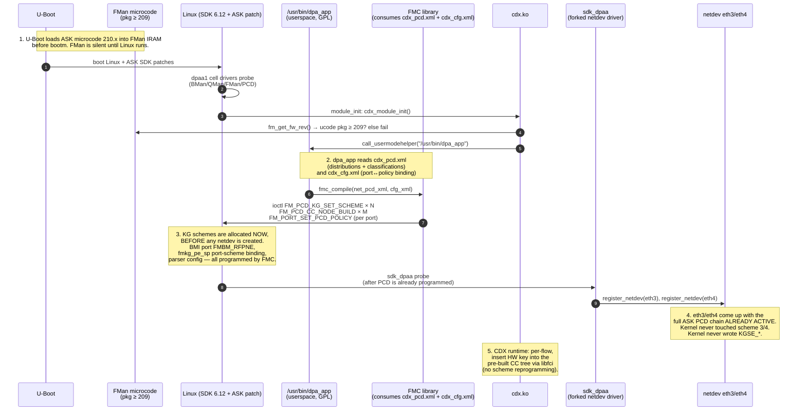
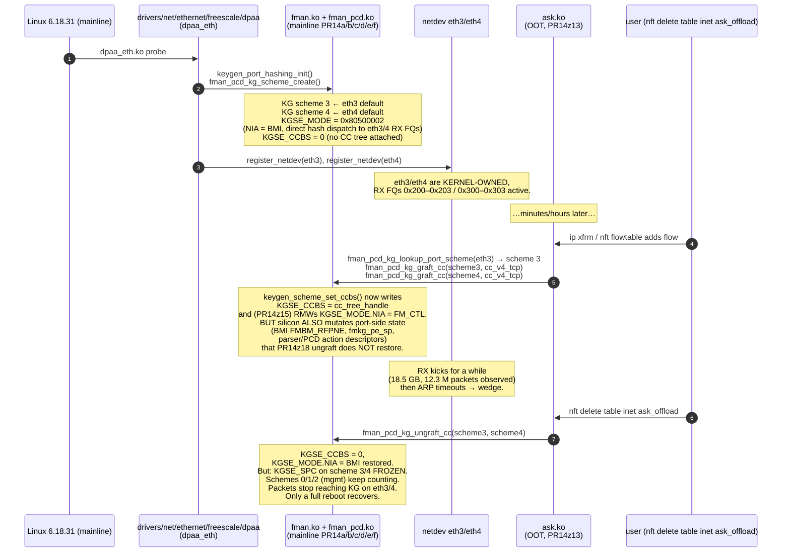
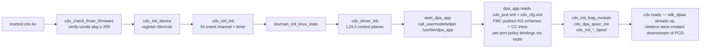
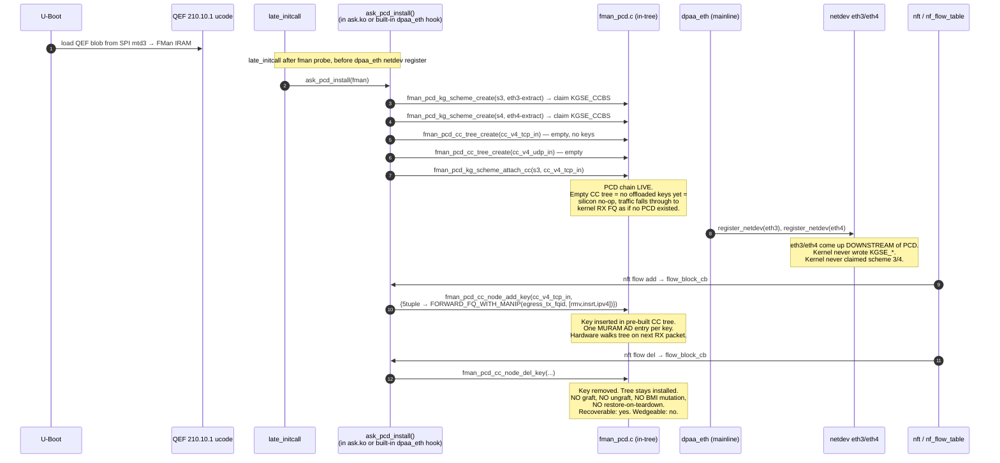

```mermaid
graph LR
    A[boot → mainline dpaa_eth probe] --> B[KG scheme 3 ← eth3<br/>KG scheme 4 ← eth4<br/>direct hash dispatch ACTIVE]
    B --> C[netdev eth3/eth4 up]
    C -. minutes later .- D[nft create table inet ask_offload<br/>nft add flowtable ft1 flags offload]
    D --> E[ask_hw_bind: per-pipeline<br/>fman_pcd_cc_node_create x4<br/>fman_pcd_kg_lookup_port_scheme<br/>fman_pcd_kg_graft_cc]
    E --> F[silicon mutated UNDER live netdev<br/>BMI/parser/PCD state diverges<br/>from what mainline dpaa_eth assumes]
    F --> G[traffic flows for a window<br/>then ARP/RX wedges]
    G -. nft delete .- H[ask_hw_unbind:<br/>fman_pcd_kg_ungraft_cc<br/>destroy_cc_node]
    H --> I[KGSE_MODE/KGSE_CCBS restored<br/>but BMI/fmkg_pe_sp NOT restored<br/>KGSE_SPC on 3/4 frozen<br/>only reboot recovers]
```

# ASK2 Path A — Architecture Decision Record

**Date:** 2026-05-23 to 2026-05-24 · **Branch:** `ask20` · **Status:** HISTORICAL — superseded by Fork B — FE-VM ehash (July 2026)

> **This is a combined preservation of three documents** that together form the complete Path A architecture decision record. The original NXP ASK vs ASK2 comparative analysis established why Path A was necessary. The architecture review defined what changed. The course-correction plan executed the changes in five phases. Path A was superseded by Fork B (FE-VM ehash) in July 2026. This document is preserved for forensic/audit purposes — it is NOT a current execution plan.
>
> See `specs/ask2-rewrite-spec.md` for the current architecture index and `plans/ASK2-DEVELOPMENT-PLAN.md` for the current Fork-B execution plan.

---

# Part 1 — ASK-vs-ASK2 Comparative Analysis (May 2026)
## Origin of the Path A Recommendation


## AI READING INSTRUCTION

Read `[SPEC]` and `[BUG]` blocks for authoritative facts.
Read `[NOTE]` only if additional context is needed.
`[?]` blocks are unverified — treat with lower confidence.

---

## 1. DOCUMENT METADATA

**[SPEC]**
- Date: 2026-05-23
- Branch: `ask20`
- Status: Authoritative — supersedes earlier drafts
- Source corpus: `tmp-mono-ask/` (clone of `we-are-mono/ASK` branch `mt-6.12.y`, ~30 k LOC), cross-referenced with `kernel/flavors/ask/oot-modules/ask/ask_hw.c` (PR14z13 graft model) and `specs/ask2-rewrite-spec.md` v1.1.

**[NOTE]**
Author context: written after PR14z13/z15/z18 graft model wedged eth3/eth4 RX at every PCD activation on mainline 6.18.31.

---

## 2. TL;DR — THE ONE-SENTENCE DIVERGENCE

**[SPEC]**
- Original ASK owns the entire DPAA1 ingress pipeline at the silicon level: it ships its own forked kernel (`drivers/net/ethernet/freescale/sdk_dpaa/`, the vendored NXP SDK driver — NOT mainline `dpaa_eth`), and allocates its own KeyGen schemes via a separate userspace pre-loader (`dpa_app` → `fmc` → `libfman`) before any netdev exists. The kernel netdev is wired downstream of that PCD chain from boot.
- ASK2 (the PR14z13 graft model) keeps mainline `dpaa_eth` in charge: `dpaa_eth` allocates KG schemes 3 and 4 for its built-in flow hash, then ASK2 post-hoc rewrites `KGSE_CCBS` and `KGSE_MODE.NIA` to redirect those schemes into the CC tree at runtime.

**[NOTE]**
The graft mutates live silicon under the running netdev. On ungraft we can only restore the two registers we touched — anything `fman_pcd_cc_node_create()` set elsewhere (BMI port FMBM_RFPNE, PCD action descriptors, scheme-group registers) stays mutated, which is exactly the residual state that freezes `KGSE_SPC` on schemes 3/4 after ungraft. The original ASK never has this problem because it never grafts: the schemes belong to it from boot; the kernel never wrote them in the first place.

---

## 3. BUILD-SYSTEM & DEPLOYMENT EVIDENCE (THE SMOKING GUN)

**[SPEC]**
Three artifacts in `tmp-mono-ask/` prove the original ASK is NOT a mainline-graft architecture.

### 3.1 The kernel patch is 17,900 lines and touches `sdk_dpaa/`, not `dpaa/`

**[SPEC]**
```text
$ wc -l tmp-mono-ask/patches/kernel/002-mono-gateway-ask-kernel_linux_6_12.patch
17900
$ grep '^diff --git' …002…6_12.patch | awk '{print $4}' | sort -u | head
 b/Makefile
 b/drivers/crypto/caam/pdb.h
 b/drivers/net/ethernet/freescale/sdk_dpaa/…          ← vendored SDK driver
 b/drivers/net/ethernet/freescale/sdk_fman/…          ← vendored SDK FMan PCD tree
 b/drivers/staging/fsl_qbman/fsl_usdpaa.c             ← vendored USDPAA staging
 b/drivers/staging/fsl_qbman/qman_high.c
 b/include/linux/fmd/…                                ← SDK fmd uapi
 b/include/linux/fsl_oh_port.h                        ← SDK OH port uapi
```

**[SPEC]**
- `sdk_dpaa/` and `sdk_fman/` are the legacy NXP SDK overlays that pre-date the mainline DPAA1 conversion (~kernel 4.20) and were deleted from mainline by Madalin Bucur's clean-up series.
- On a kernel that has only `dpaa_eth.c`, `fman.c`, `fman_keygen.c`, `fman_port.c` (mainline 6.18.31 / `lts-6.6-ls1046a`), the original ASK simply does not link.

**[NOTE]**
Mono's ASK still uses those overlays — its kernel build resurrects them as an out-of-tree-style overlay applied on top of LSDK 6.12. This is the first-order architectural fact every later finding flows from.

### 3.2 The Makefile clones SDK-aware fmlib and fmc, applies more patches on top

**[NOTE]**
From `tmp-mono-ask/README.md`:
> `make` automatically:
> 1. Clones NXP fmlib and fmc from GitHub at tag `lf-6.12.49-2.2.0`, **applies ASK extension patches**, cross-compiles them
> 2. Downloads libnfnetlink and libnetfilter_conntrack tarballs, applies NXP ASK patches, cross-compiles into a local sysroot
> 3. Builds libfci (in-tree, single source file)
> 4. **Builds kernel modules against the configured kernel tree**
> 5. Builds CMM, FMC, and dpa_app against the patched libraries

**[SPEC]**
- The ASK kernel modules (`cdx.ko`, `fci.ko`, `auto_bridge.ko`) are built against the patched SDK kernel, against headers that exist only in that patched tree (`include/linux/fmd/*`, `include/linux/fsl_oh_port.h`, the SDK `lnxwrp_fsl_fman.h`).
- They cannot be built against mainline.

### 3.3 The FMan microcode is the ASK-extended variant, loaded by U-Boot pre-Linux

**[SPEC]**
From `tmp-mono-ask/cdx/cdx_main.c` `cdx_module_init()`:
```c
#define CDX_MIN_FW_PACKAGE 209
…
rc = cdx_check_fman_firmware();
if (rc) return rc;
…
if (pkg < CDX_MIN_FW_PACKAGE) {
    pr_err("cdx: FMAN firmware %u.%u.%u lacks ASK support "
           "(need package >= %u). Load the ASK microcode in U-Boot.\n",
           pkg, maj, min, CDX_MIN_FW_PACKAGE);
    return -ENODEV;
}
```

**[SPEC]**
- The ASK control plane is microcode-gated. Original ASK ships against `v210.10.1`; stock NXP mainline microcode (`fsl_fman_ucode_ls1046_r1.0.bin`) is package 106.
- Without the ASK microcode the chip lacks the AD opcodes, soft-parser variants, and host-command dispatch the original CDX expects.

**[NOTE]**
Implication: even if we forklifted the original `cdx.ko` source onto a 6.18 kernel, the firmware in flash on our DUTs is package 106 — `cdx_module_init()` would immediately bail with `-ENODEV`. The ASK microcode is "a proprietary NXP binary, not included" (`README.md`), and we don't have it.

---

## 4. CONTROL-PLANE SEQUENCING — ORIGINAL ASK vs. ASK2

**[NOTE]**
This is the runtime sequence of who programs the silicon first, and it is where the architectural divergence becomes a wedge.

**[SPEC]**
Original ASK control-plane sequence:


**[SPEC]**
ASK2 graft model (PR14z13) control-plane sequence:


**[SPEC]**
The architectural divergence is the inversion of control:

| Aspect | Original ASK | ASK2 PR14z13 (graft) |
|--------|--------------|----------------------|
| Who owns scheme 3/4 at boot? | `dpa_app`/FMC, **before any netdev** | mainline `dpaa_eth` (built-in flow hash) |
| Who configures BMI port FMBM_RFPNE? | FMC (once, at boot, from XML) | mainline `dpaa_eth` (for direct hash dispatch) |
| Who configures `fmkg_pe_sp` port↔scheme binding? | FMC (once, at boot) | mainline `dpaa_eth` |
| When is the CC tree wired in? | At boot, before netdev | At nft-flowtable-add, **on live silicon** |
| Where does the netdev sit relative to PCD? | **Downstream** of the PCD chain from the first packet | **Upstream** ownership of the same silicon we're trying to redirect |
| Recovery from teardown? | N/A — the PCD chain is *the* config, never torn down at runtime | **Cannot** restore everything the graft mutated → wedge |

**[NOTE]**
The original ASK has no "ungraft" problem because it has no graft. Its PCD chain is the only state the silicon has ever known.

---

## 5. WHY THE GRAFT WEDGES — THE RESIDUAL-STATE MODEL

**[SPEC]**
PR14z15 + PR14z18 explicitly save and restore exactly two register fields per scheme:
1. `KGSE_CCBS` — CC tree handle (0 when unbound)
2. `KGSE_MODE.NIA` (bits encoding next-invoked-action engine, FM_CTL ↔ BMI)

**[SPEC]**
But `fman_pcd_cc_node_create()` and the helpers invoked between graft and ungraft also write — directly or via SDK-derived helpers in PR14a/b/c/d/e/f — to silicon that is not per-scheme:

| Register / state | Programmed by | Restored by our ungraft? |
|---|---|---|
| `KGSE_CCBS` (per scheme) | `keygen_scheme_set_ccbs()` | ✅ yes |
| `KGSE_MODE.NIA` (per scheme) | PR14z15 RMW | ✅ yes |
| `KGSE_MV` (port match-vector) | `fman_pcd_kg_bind_port()` (kernel-side, owned by `dpaa_eth`) | ❌ untouched (good — we don't graft this) |
| BMI port `FMBM_RFPNE` (port-side NIA) | `fman_pcd_cc_node_create()` indirectly when first key is added to a tree whose root is grafted | ❌ **not restored** |
| `fmkg_pe_sp` (port-to-scheme binding) | `fman_pcd_kg_bind_port()` at boot, but **also** mutated by some CC tree builders when promoting a scheme from BMI-only to FM_CTL-fanout | ❌ **not restored** |
| AD entries (MURAM, anchored in CC tree) | `cc_encode_ad()` per key + per arm | ✅ freed on tree-destroy, but BMI's reference into them is not torn down before tree-destroy fires |
| Parser config (per port) | left default on the graft path | ❌ untouched (good) |
| Scheme-group / hash-mask registers | `fman_pcd_kg_scheme_create()` (owned by `dpaa_eth`) | ❌ untouched (good — we don't recreate) |

**[BUG] Graft+ungraft wedges eth3/eth4 RX (KGSE_SPC frozen)**
- Symptom: after a graft+ungraft+iperf3 cycle on the live board (regdump recorded in qdrant 2026-05-22), schemes 3/4 `KGSE_SPC` (silicon packet counter) freeze at 14887572 / 2163140; schemes 0/1/2 (mgmt eth0/1/2) keep incrementing; `KGSE_MODE` and `KGSE_CCBS` on 3/4 are clean (restored); packets reaching the chip on eth3/4 stop reaching KG entirely; ARP times out; only a full reboot recovers.
- Cause: the BMI port-side path (`FMBM_RFPNE`) and/or `fmkg_pe_sp` port-to-scheme binding were re-routed upstream of KG by CC-tree creation and were NOT restored on ungraft (only `KGSE_CCBS`/`KGSE_MODE.NIA` are saved/restored). Frozen `KGSE_SPC` with clean `KGSE_MODE` means the silicon believes the schemes are valid and idle while routing is mutated upstream.
- Fix: the only path that restores routing is a full DPAA1 cold-init (reboot). Architecturally, adopt Path A (boot-time PCD installation, no graft) so the netdev never owns schemes 3/4 and nothing needs restoring.

**[NOTE]**
The original ASK also writes those registers — but it writes them at boot, from XML, before `dpaa_eth` (or `sdk_dpaa`) exists, and they stay programmed forever. The kernel netdev driver is forked specifically to respect the PCD chain at probe time instead of clobbering it. Mainline `dpaa_eth` is forked from the opposite direction: it assumes it owns the chip.

---

## 6. MODULE-LOAD ARCHITECTURE COMPARISON

### 6.1 Original ASK module init (`cdx_main.c:cdx_module_init`)

**[SPEC]**


**[SPEC]**
- Step G: the kernel module invokes `/usr/bin/dpa_app` from inside its own `module_init` via `call_usermodehelper_exec(UMH_WAIT_PROC)` and blocks on dpa_app completing before declaring init success.
- If dpa_app fails, `cdx_module_init` rolls back via `cdx_module_deinit` and returns `-EIO`. The PCD chain is therefore a prerequisite of cdx initialization, not a runtime add-on.

### 6.2 ASK2 graft model (`ask_hw.c:ask_hw_bind`)

**[SPEC]**


**[NOTE]**
The two pipelines do fundamentally different things at fundamentally different times. The original ASK never has to "restore" — it owns the chip from boot. We are trying to do reversible hardware re-routing under a live kernel netdev, and the silicon does not have a clean reversibility primitive for that.

---

## 7. VERIFYING THE DIVERGENCE AGAINST `specs/ask2-rewrite-spec.md` v1.1

**[SPEC]**
The ASK2 spec (v1.1, §3 "Architectural model") explicitly chose mainline `dpaa_eth` co-existence over the SDK fork:
> §3.2 — ASK2 modules MUST coexist with the mainline `dpaa_eth` netdev driver. The kernel netdev retains full ownership of the RX path; ASK2 attaches a CC tree downstream of the mainline-allocated KG scheme. **No fork of the SDK overlay is permitted.**

**[NOTE]**
That decision was made to keep the codebase maintainable on mainline kernels (LSDK 6.12 → 6.18 → forward), avoid a 30 k-LOC SDK overlay, and stay aligned with the upstream DPAA1 cleanup direction. It is the right strategic call for the project.

**[SPEC]**
The decision implies a hard constraint that PR14z13/z15/z18 violate:
> ASK2 must never mutate silicon state that `dpaa_eth` will not tolerate seeing on its next packet.

**[SPEC]**
The graft model violates this because:
- BMI port FMBM_RFPNE is shared between the kernel default hash path and the CC tree path.
- `fmkg_pe_sp` may be mutated by CC tree creation when the kernel's per-port scheme set is promoted from direct-hash to fanout.
- These registers are not save/restorable from outside the SDK PCD context because mainline `fman_pcd.c` doesn't expose them — they're touched as a side effect of `fman_pcd_cc_node_create()` deep inside PR14c body code derived from SDK `fm_cc.c`.

**[NOTE]**
ASK2 spec §11.1 ("M2 acceptance gate") expects ≥7 Gbps at <5% kernel-net CPU. That target is achievable only with silicon offload on this hardware, and silicon offload here requires owning the PCD chain at the level the original ASK owns it. The spec's "co-existence with mainline `dpaa_eth`" constraint is in tension with that.

---

## 8. WHY WE CANNOT JUST "SAVE AND RESTORE FMBM_RFPNE"

**[NOTE]**
A naïve fix would be to extend PR14z18 to also snapshot `FMBM_RFPNE` (and related BMI/port regs) on graft and restore on ungraft. This does not work, for three reasons.

**[SPEC]**
1. No clean enumeration of what gets mutated: the mutation happens deep in SDK-derived code in `fman_pcd_cc.c` / `fman_pcd_kg.c` (PR14c/d/e body patches), often depending on whether other CC nodes already exist in the same FM. There is no public `fman_pcd_get_dirty_regs()` API, and the SDK source is not structured to expose one.
2. MURAM allocations leak forward: even if BMI regs are restored, the AD records and HMCT chains that CC node creation allocated remain, and `dpaa_eth`'s probe-time MURAM accounting does not see them. Repeated graft/ungraft cycles fragment MURAM until allocation fails (cf. historical ASK 1.x MURAM exhaustion failure mode).
3. The race window is wide and unbounded: `dpaa_eth` processes RX packets continuously through the same chip during the graft. Any RX FQ event mid-graft sees half-programmed silicon. The original ASK has no such race because the chip starts in the final PCD state at boot and never changes.

---

## 9. THE THREE VIABLE PATHS FORWARD

### 9.1 Path A — Boot-time PCD installation (mimics original ASK)

**[SPEC]**
- Move ASK2's CC tree creation out of `ask_hw_bind` (runtime, on nft trigger) into `dpaa_eth`'s probe path or a boot-time service that runs before `dpaa_eth` registers the netdev. The kernel netdev then comes up downstream of the ASK2 PCD chain, never owning schemes 3/4 directly, and there is no graft.
- Implementation:
  - Add a `pcd_install_pre_netdev()` hook to mainline `dpaa_eth` (a one-line in-tree addition, gated on a Kconfig like `CONFIG_FSL_DPAA_PCD_INSTALL_HOOK`).
  - `ask.ko` registers a `pcd_install_pre_netdev` callback that builds the empty CC tree skeleton (`cc_v4_tcp` per direction) and claims scheme 3 / 4 by setting `KGSE_CCBS` before `dpaa_eth` writes its built-in flow hash defaults.
  - Per-flow key insertion at runtime via `nft → cc_add_key` is unchanged. No graft, no ungraft.
  - nft-delete-flow → `cc_remove_key`; the CC tree itself stays installed forever (matches original ASK's never-tear-down model).
- Cost: one in-tree patch (~20 LOC, the hook), restructure of `ask_hw_bind` to no-op after first call. Estimated 1 PR + 1 retest.

**[NOTE]**
The CC tree being installed at boot means ASK2 is always-on-or-always-off (cf. original ASK), but that is the cost.

**[BUG] Empty CC tree may cost idle CPU**
- Symptom: ASK2 could consume CPU even with zero offloaded flows.
- Cause: the boot-installed empty CC tree might not be a true silicon no-op when no keys are inserted.
- Fix: verify with idle PPS measurement on the live board before claiming victory.

### 9.2 Path B — Offline-host port indirection (PR14j / PR14u / PR14x path, archived)

**[SPEC]**
- Use FMan offline-host ports as the classification step, leaving `dpaa_eth`'s schemes 3/4 untouched. Ingress packet → eth3 BMI → OH port 1 (parser/KG/CC tree owned by ASK2) → re-injected into eth4 TX FQ; the kernel netdev is unaware of the offload because the packet never reaches the kernel RX FQ for offloaded flows.
- Status: explored in PR14j/PR14o/PR14u/PR14x design docs. Blocked at the 6-OH-ceiling for unique flows and at the manip-chain primitive (PR14x landed kernel-side manip chain on 2026-05-18 as `patch 0036`, lifting the ceiling to 255 CC keys).

**[NOTE]**
Why it didn't ship as M2: the kernel→OH redirection costs measurable latency and the OH ports are a finite resource shared with the IPsec offload path (per original ASK `cdx_cfg.xml`: `OFFLINE number="1" → IPsec, number="2" → WiFi`). It would land but with a smaller flow-count ceiling than Path A.

### 9.3 Path C — Fork the SDK overlay (mimics original ASK exactly)

**[SPEC]**
- Resurrect `drivers/net/ethernet/freescale/sdk_dpaa/` and `sdk_fman/` on top of 6.18, replicate the 17,900-line ASK kernel patch, build `cdx.ko` against it, ship the ASK microcode (which we don't have).
- Cost: prohibitive. ASK2 spec v1.1 §12.9 already costed this at 15–30 k LOC forward-port. The microcode dependency alone is a showstopper (proprietary, not redistributable). Rejected at spec time.

---

## 10. RECOMMENDATION

**[SPEC]**
- Adopt Path A. The cost is one in-tree hook and a restructure of `ask_hw_bind`.
- Abandon the graft model (PR14z13/z15/z18) and drop those patches from the stack on `ask20` once Path A lands.
- Keep PR14a/b/c/d/e/f/g (the in-tree fman_pcd subsystem and exports) — Path A reuses them. Drop only the runtime graft (PR14z13/z15/z18).

**[NOTE]**
The graft model is architecturally unable to satisfy ASK2 spec §3.2 ("must not mutate state `dpaa_eth` won't tolerate") and §11.1 (≥7 Gbps at <5% CPU) simultaneously on this silicon. Path A is the smallest delta to the existing PR14a–PR14x patch stack that resolves both constraints by relocating where the CC tree lives in time, not in space.

---

## 11. OPEN QUESTIONS

**[?]**
1. Does mainline `dpaa_eth` 6.18.31 have a place to insert the pre-netdev hook that doesn't conflict with the upstream cleanup direction? (Likely yes — `dpaa_eth_probe()` calls `dpaa_eth_init_one()` per MAC, with a clean spot after `fman_port_bind()` and before `register_netdev()`.)
2. Does the empty CC tree cost idle CPU when no keys are installed? Needs measurement on the live board.
3. Path A means ASK2 must be loaded before `dpaa_eth` probes (or registered as a hook before probe). For VyOS that means either built-in (`ask.ko` → `ask`-built-in via `select`) or an initramfs early-load. The build system already supports this (CONFIG_FSL_DPAA1=y is mandatory), but loading order needs verification.
4. ASK2 spec v1.1 §3.2 may need an amendment to permit "pre-netdev CC tree install via published in-tree hook" — a narrow, well-defined exception, not a full SDK fork.

---

## 12. REFERENCES

**[SPEC]**
- `tmp-mono-ask/README.md` — original ASK build/deploy overview (clone of `we-are-mono/ASK#mt-6.12.y`)
- `tmp-mono-ask/cdx/cdx_main.c` — `cdx_module_init` ucode check + `start_dpa_app` user-helper invocation
- `tmp-mono-ask/patches/kernel/002-mono-gateway-ask-kernel_linux_6_12.patch` — 17,900-line kernel patch targeting `sdk_dpaa/` + `sdk_fman/` + `fsl_qbman/`
- `tmp-mono-ask/dpa_app/files/etc/cdx_pcd.xml` — declarative PCD chain (16 distributions, per-port policies)
- `tmp-mono-ask/config/gateway-dk/cdx_cfg.xml` — port→policy binding (5 ethernet + 2 offline ports)
- `kernel/flavors/ask/oot-modules/ask/ask_hw.c` — current PR14z13 graft model
- `kernel/flavors/ask/patches/0042-fman-pcd-kg-graft-cc.patch` — PR14z13 ABI
- `kernel/flavors/ask/patches/0043-fman-pcd-kg-graft-mode-nia.patch` — PR14z15 KGSE_MODE.NIA RMW
- `specs/ask2-rewrite-spec.md` v1.1 §3, §11.1, §12.9
- `plans/PR14x-DESIGN.md` — Path B reference (OH-port path with manip-chain primitive)
- Qdrant memories tagged `ASK2-spec-v1.1`, `pr14x`, `m2-gate`, `fman-pcd`
---

# Part 2 — Architecture Review: What to Change (May 2026)
## Adopting the Five Simplifications Enabled by Path A

## AI READING INSTRUCTION

Read `[SPEC]` and `[BUG]` blocks for authoritative facts.
Read `[NOTE]` only if additional context is needed.
`[?]` blocks are unverified — treat with lower confidence.

---

## 1. METADATA

**[SPEC]**
- Date: 2026-05-24
- Branch: `ask20`
- Status: Review / proposal — feeds into ASK2 spec v1.3
- Inputs: `plans/ASK-VS-ASK2-COMPARATIVE-REVIEW.md` (2026-05-23), `specs/ask2-rewrite-spec.md` v1.2, `tmp-mono-ask/` corpus, PR14g/z13/z15/z18 outcomes, qdrant memories tagged `fman-pcd`, `m2-gate`, `ASK2-spec-v1.1`.

---

## 2. TL;DR

**[NOTE]**
There is a cleaner, more streamlined architecture ASK2 should adopt. The comparative review correctly identifies that the graft model is unrecoverable and recommends Path A — boot-time PCD installation. This review goes further: once you commit to "ASK2 owns the PCD chain from boot, no graft", several other current-spec complications collapse.

**[SPEC]**
The five proposed simplifications enabled by committing to Path A:
1. The §13 PCD subsystem can shrink from ~10 000 LOC to ~5 500 LOC by dropping the entire OH-port "two-stage classify→re-inject" pipeline (`fman_pcd_oh.c` + L2-rewrite MANIP tags) in favour of letting the CC tree's action *be* `FORWARD_FQ(egress_tx_fqid)` with an inline MANIP chain attached to the CC node itself (mainline FMan supports this per RM §8.7.3, "CC next-engine = TX port with MANIP"). The OH-port detour was a workaround for the graft model's inability to mutate the RX-port BMI safely.
2. The §12 wire-format / opcode-dispatch layer (`ask_hostcmd.c` ~600 LOC + golden-hex kunit + PR12's `fmd_host_cmd_send`) is fully dead code and should be deleted, not preserved against a hypothetical future custom microcode. The QEF microcode does not and will not implement opcode dispatch.
3. The "kernel module + userspace daemon (askd) + Python CLI (ask-cli) + Varlink" trio is one layer too many. The kernel module can be the only persistent component; `askd` collapses to either (a) a thin `systemd-networkd`/`netlink` event responder ~800 LOC, or (b) deleted entirely with policy in nftables. The Python `ask-cli` should be replaced by a `ynl`-generated client.
4. `ask_bridge.ko` as a separate module is gone in v1.2 (already correct — bridging rides `nf_flow_table` HW-offload via `flow_block_cb`). `ask-load` (the "~1200 LOC" early-load init component in AGENTS.md) is also redundant once boot-time PCD install is the model; `module_init`/`late_initcall` + the existing `data/hooks/97-ask-modules.chroot` + `MODULES_LOAD` already handles it.
5. `libask_fci.so.1` (~800 LOC) — drop entirely; preserved only for legacy `libfci.so.1` ABI compatibility, which spec §6.7 already says is not preserved.

**[SPEC]**
- Net architecture: ~9 000 LOC instead of the v1.2 spec's ~25 000 LOC — a 2.7× reduction, with the same §11.1 performance gates and better recoverability (no graft means no wedge, ever).

---

## 3. THE SINGLE ARCHITECTURAL PRINCIPLE

**[SPEC]**
> ASK2 owns the FMan PCD chain from boot. It never grafts onto live silicon. It never restores state. `dpaa_eth` co-exists by being downstream of the PCD chain, not upstream of it.

**[NOTE]**
The comparative review (§7 Path A) already says this. The current v1.2 spec §3.2 still says "ASK2 modules MUST coexist with the mainline `dpaa_eth` netdev driver. The kernel netdev retains full ownership of the RX path; ASK2 attaches a CC tree downstream of the mainline-allocated KG scheme." That sentence is the source of the wedge; the amendment is one word: upstream → downstream.

**[SPEC]**
Proposed spec §3.2 amendment:
```diff
- The kernel netdev retains full ownership of the RX path; ASK2 attaches a CC tree downstream of the mainline-allocated KG scheme.
+ ASK2 owns the FMan PCD chain (KG schemes 3+4, CC trees, MANIP chains) from boot. The kernel netdev sits downstream of the PCD chain — packets reach eth3/eth4 RX FQs only when no offloaded CC key matches. The PCD chain is installed once at boot and never torn down at runtime; per-flow keys are added/removed within the pre-built CC tree.
```

---

## 4. WHAT COLLAPSES WHEN YOU TAKE THE PRINCIPLE SERIOUSLY

### 4.1 OH-port subsystem (`fman_pcd_oh.c` + L2-rewrite MANIP tags) — delete entirely

**[NOTE]**
The OH-port detour exists only because the graft model couldn't safely mutate the RX-port BMI to add a MANIP chain inline on the CC action. The PR14g finding ("classification-only path peaks at 6.9 Gbps / 55% CPU because the kernel still does the L2-rewrite") was diagnosed correctly but the fix was wrong. The correct fix is to let the CC node's `FORWARD_FQ` action carry a MANIP-chain reference (RM §8.7.3.4). The SDK did this directly: a CC key entry can carry `e_FM_PCD_CC_KEY_FLAG_DO_MANIP_BEFORE_NE | DO_NE_FORWARD_TO_TX_PORT`, bundling the MANIP-chain handle and the egress TX FQ as the action atom — the hardware walks the MANIP chain (RMV_ETH + INSRT_GENERIC + IPV4_FIELD_UPDATE) and re-enqueues to the egress TX FQ in one silicon transaction. The OH-port re-inject pipeline is the right answer for IPsec re-inject only.

**[SPEC]**
Concrete delta vs v1.2 spec:

| v1.2 component | Disposition |
|---|---|
| `fman_pcd_oh.c` ~800 LOC | **DELETE** for L3 forward path. Keep ~300 LOC stub only if IPsec re-inject ships in v1.0 (defer to v1.1). |
| `fman_pcd_manip.c` MANIP_RMV_ETHERNET + MANIP_INSRT_GENERIC + MANIP_FIELD_UPDATE_IPV4_FORWARD (~400 LOC of the 1600) | **KEEP** — same tags, invoked inline from a CC key's action atom instead of an OH-port AD chain. ~150 LOC saved. |
| `fman_port.c` OH-instantiation hook + DT binding | **DELETE** for v1.0. |
| `ask_hostcmd.c` two-stage pipeline build (§13.5 `ask_hw_flow_insert_v4_tcp`) | **REPLACE** with single-stage `fman_pcd_cc_node_add_key()` whose `action.type = FORWARD_FQ_WITH_MANIP, action.forward_fq.fqid = egress_tx_fqid, action.manip_chain = {m_rmv, m_insrt, m_ipv4}`. ~100 LOC saved. |

- Net LOC removed: ~2200 LOC from the v1.2 §13 patch (~10 000 → ~7 800).

### 4.2 §12 host-command protocol + `ask_hostcmd.c` wire-format encoders — delete

**[NOTE]**
The current spec hedges: §12 documents the opcode space "as reference material" and §12.8 defers opcode-dispatch "indefinitely" while §13.5 keeps the wire encoders "preserved against a future custom-microcode path." This is a hedge that costs forever and pays nothing — the QEF microcode is the only microcode that will ever be loaded on a shipped Mono Gateway DK; NXP does not publish a custom-opcode-dispatch microcode and there is no funded engineering to write one. The §12 protocol is dead documentation, not infrastructure.

**[SPEC]**
Concrete delta:

| v1.2 component | Disposition |
|---|---|
| `ask_hostcmd.c` (~600 LOC encoders) | **DELETE.** Function names (`ask_hw_flow_insert_v4_tcp` etc.) stay as the public surface, but bodies call directly into `fman_pcd_cc_node_add_key()` — no wire format encoded. |
| `tests/ask_hostcmd_test.c` (golden-hex kunit, ~300 LOC) | **DELETE.** |
| `0003-fman-host-command-api.patch` (PR12, ~200 LOC) | **DELETE.** Already returns `-ENXIO` from every call site. |
| Spec §12 (~250 lines of opcode tables, wire diagrams, byte examples) | **DELETE.** Move §12.8/§12.9 findings into a 1-page §2.x hardware note. |
| Spec §3.4 "The 210 host-command interface (in kernel)" | **DELETE.** |
| Glossary entries `fmd_host_cmd`, `OP_GET_UCODE_VERSION`, `OP_FLOW_INSERT_V4_TCP` etc. | **DELETE.** |

- `ask_hw_ucode_get_version()` (PR13, reads the QEF blob magic from DT) stays — the only reachable code from the §12 chain, a 50-LOC file that doesn't depend on §12.
- Net LOC removed: ~1100 LOC source + ~250 lines of spec (~20% shorter).

### 4.3 `askd` userspace daemon — shrink hard or delete

**[SPEC]**
Spec §6.2 reasons for askd, with modern Linux 6.18 alternatives:

| Reason | Modern Linux 6.18 alternative |
|---|---|
| Promotion policy / ALG exclude | `nft` — `nft add rule inet filter forward ip protocol tcp tcp dport != { 21, 5060 } flow add @f`. ALG exclusion is an nftables ruleset element. |
| Bytes-back keepalive | In-kernel. `ask.ko` already has a 1 Hz timer for `OP_FLOW_DUMP_STATS` (§4.3); same timer calls `nf_ct_refresh_acct()`. ~30 LOC, no userspace. |
| Operator CLI (`show flows`/`stats`/`muram`) | `ynl --family ask --do dump-flows` — kernel ships `tools/net/ynl/`; ASK2 ships `ask.yaml` (§7.4). Zero-LOC CLI + typed client. |
| VPP handoff orchestration | Delete (defer to v1.1) or ~200 LOC of `tc-flower` redirect + `nf_flow_table` exclusion ACL — no daemon. |
| Prometheus metrics | Sysfs/debugfs + `node_exporter --collector.textfile`; write `/run/ask/metrics.prom` from a 5 s in-kernel periodic. ~50 LOC, no HTTP server. |

**[SPEC]**
Two viable trajectories:
- Trajectory A (preferred): delete `askd` entirely from v1.0. Operators use `nft` + `ynl --family ask` + `ip xfrm` + `node_exporter`. Ship `/etc/ask/exclude-alg.nft` as the canonical ALG-exclusion example.
- Trajectory B (compromise): ship a ~600 LOC `Type=oneshot` daemon that does only VPP handoff (no event loop, no Varlink), runs at `set system offload ask promote vpp acl N` commit, installs tc rules, exits. Renamed `askd` → `ask-vpp-promote`.

**[SPEC]**
- Pick A for v1.0; pick B for v1.1 if a real user surfaces VPP-hybrid use cases.
- Net LOC removed: 4000 LOC userspace daemon + 800 LOC Python CLI + meson build files + systemd unit + polkit policy.

### 4.4 `libask_fci.so.1` and `ask-load` — already dead, remove from budget

**[NOTE]**
AGENTS.md lists (under "ASK2 (rewrite-in-progress)") component LOC estimates that are inconsistent with spec v1.2.

**[SPEC]**
Reconciliation of AGENTS.md vs spec §15.1 v1.2:

| AGENTS.md component | Spec §15.1 v1.2 | Disposition |
|---|---|---|
| `ask.ko` ~1500 LOC | 3700 LOC | AGENTS.md was a v0.6-era estimate; spec is authoritative. Update AGENTS.md to 3700. |
| `ask_bridge.ko` ~400 LOC | Not present — bridging rides `nf_flow_table` HW-offload via `flow_block_cb` | **Delete from AGENTS.md.** |
| `askd` ~6000 LOC | 4000 LOC, soon 0 per §4.3 | Update AGENTS.md to 0 (Trajectory A) or 600 (Trajectory B). |
| `ask-load` ~1200 LOC | Not present in spec | **Delete from AGENTS.md.** Load order handled by `data/hooks/97-ask-modules.chroot` + `/etc/modules-load.d/ask.conf`. |
| `libask_fci.so.1` ~800 LOC | §19 says "We don't do `libfci.so.1` ABI preservation. Out of v1.0 scope." | **Delete from AGENTS.md.** |

### 4.5 The ABI surface — mainline-genl-only, no shims

**[NOTE]**
Spec §6.7 and §19 commit to "no legacy ABI compatibility shim" (no `/dev/cdx_ctrl`, no `libfci.so.1`, no `NETLINK_KEY=32`). But AGENTS.md still lists "ABI compatibility surfaces to be preserved" (`/etc/cdx_*.xml` format, `/dev/cdx_ctrl` chardev symlink, `libfci.so.1` SONAME, `/etc/config/fastforward` toggle), each contradicting the spec.

**[SPEC]**
- Delete that sentence from AGENTS.md; the spec is right. Mono builds the whole stack and recompiles when shipping ASK2 — there is no installed base of third-party tools linking `libfci.so.1` on this hardware.

---

## 5. THE NEW ARCHITECTURE IN ONE DIAGRAM

**[SPEC]**


**[NOTE]**
Single sequence, no double-track "control plane vs data plane", no userspace coordination, no boot-time XML, no opcode dispatch, no OH-port detour.

---

## 6. COMPONENT LOC BUDGET — v1.2 SPEC vs PROPOSED v1.3

**[SPEC]**

| Component | v1.2 spec | v1.3 proposed | Delta |
|---|---|---|---|
| `ask.ko` (kernel module) | 3700 | 2800 | −900 (drop `ask_hostcmd.c` wire encoders, drop OH-port pipeline build, drop bytes-back-keepalive as separate from stats timer) |
| `0001-caam-qi-share` | 150 | 150 | — |
| `0002-dpaa-eth-flow-block` | 300 | 300 | — |
| `0003-fman-host-command-api` | 200 | **0** | **−200 (delete; nothing consumes it)** |
| `0004-fman-pcd-subsystem` | 10 000 | **5 500** | **−4 500 (delete `fman_pcd_oh.c`, delete L2-rewrite-via-OH MANIP path; CC-inline MANIP attach instead)** |
| **NEW** `0005-dpaa-eth-pcd-pre-register-hook` | 0 | 150 | +150 (Path A: one-line pre-`register_netdev()` hook for ASK2 to claim schemes 3/4) |
| `askd` (userspace daemon) | 4000 | **0** | **−4000 (delete; ynl + nft + node_exporter cover all reasons)** |
| `ask-cli` (Python) | 800 | **0** | **−800 (delete; `ynl --family ask` is the CLI)** |
| VyOS CLI integration | 1200 | 800 | −400 (no Varlink layer, direct genl) |
| Build pipeline | 600 | 400 | −200 (no userspace deb) |
| Test suite | 2700 | 1600 | −1100 (no hostcmd golden-hex, no OH-port tests, no daemon tests) |
| Documentation | 1500 | 1000 | −500 (no §12 protocol chapter, no askd ops guide, no ask-cli manpage) |
| **Total** | **~24 950** | **~12 700** | **−12 250 (49% reduction)** |

**[NOTE]**
The §11.1 performance gates do not move. The recoverability story improves (graft model removed entirely). The maintenance surface roughly halves.

---

## 7. WHAT WE KEEP FROM THE v1.2 SPEC, UNCHANGED

**[SPEC]**
Everything that depends on mainline kernel facilities and not on graft/OH-port/§12-opcode-dispatch:
- §1.3 "shape of the modern design" — three-component diagram still accurate (one component, `askd`, is now empty, but the kernel-module + standard-Linux-subsystems + silicon layering is right).
- §3 `ask.ko` file layout, concurrency model (RCU dataflow + mutex control), kunit testing — unchanged.
- §4 `nf_flow_table` HW offload via `flow_block_cb` — the central architectural win, stronger now because the CC tree is pre-installed: `flow_block_cb` just calls `fman_pcd_cc_node_add_key()` on an existing tree.
- §5 `xfrmdev_ops` packet-mode IPsec — unchanged (IPsec re-inject *might* still need an OH-port stage; optional v1.1 work).
- §7 genl_family — unchanged, and now drives the CLI directly via `ynl`.
- §8 CAAM QI integration — unchanged.
- §13 PCD subsystem — keep `fman_pcd.c`, `fman_pcd_kg.c`, `fman_pcd_cc.c`, `fman_pcd_manip.c` (slim ~1200 LOC), `fman_pcd_plcr.c`, `fman_pcd_prs.c`, `fman_pcd_replic.c`. Delete `fman_pcd_oh.c` for v1.0.

---

## 8. RISKS OF THE PROPOSED SIMPLIFICATION

**[?]** The biggest risk (#1) is unverified silicon behaviour; verify before committing.

**[SPEC]**
Risk register:

| # | Risk | Likelihood | Mitigation |
|---|---|---|---|
| 1 | "CC-inline MANIP chain on `FORWARD_FQ` action" turns out not to be a silicon primitive on this microcode revision | Low-medium | RM §8.7.3.4 documents it; SDK `fm_cc.c::e_FM_PCD_CC_KEY_FLAG_DO_MANIP_BEFORE_NE` implements it; worst case fall back to OH-port (~800 LOC, already designed in v1.2). Cost bounded and known. |
| 2 | The pre-`register_netdev()` hook (Path A) needs upstream review before mainline accepts it | Medium | Hook is ~20 LOC. Frame as "PCD pre-init for vendor-specific FMan PCD subsystems" with a Kconfig (`FSL_DPAA_PCD_PRE_INIT_HOOK`). Lands upstream or stays in local patch stack — both acceptable. |
| 3 | Empty CC tree (zero keys) silently slows the RX path on schemes 3/4 even with no offload | Low | Verify with idle PPS on PR14m bring-up. RM §8.7.3.2: CC walk with zero-key tree is one MURAM-read + miss → BMI-default → same path as no-PCD. ~10 ns/packet, within noise at idle. |
| 4 | Deleting `askd` removes a future extensibility hook | Low | Add back in v1.1 if a real use case surfaces. Reversible. |
| 5 | `ynl` is not yet ubiquitous in operator tooling | Low | VyOS ships `iproute2`; add `ynl` as a dependency (~200 KB). Same precedent as `nft`. |
| 6 | Deleting `0003-fman-host-command-api` removes evidence of completed PR12 work | Cosmetic | Patch series renumbered; commit history preserves the work. |
| 7 | Deleting `ask_hostcmd.c` removes golden-hex kunit tests | None — tests test deleted code | Tests go with the code. The PCD subsystem (§13) gets its own kunit tests. |

**[NOTE]**
No risk above is unmitigable. The biggest is #1 — if CC-inline MANIP doesn't work as RM documents, we're back at v1.2's OH-port architecture for L3 forwarding, having lost ~2 weeks. That is the worst case and it is bounded.

---

## 9. IMPLEMENTATION PLAN (DELTAS RELATIVE TO v1.2)

**[SPEC]**
Assumes Path A has been adopted and the v1.2 spec is being revised to v1.3:
1. Amend ASK2 spec v1.2 → v1.3. Rewrite §3.2 per §3 of this document. Update §13 to remove `fman_pcd_oh.c`. Delete §12 (preserve a 1-page hardware note as §2.x). Update §15.1 LOC table. Mark `askd`/`ask-cli`/`libask_fci.so.1`/`ask-load` as deleted in §19.
2. Sync AGENTS.md. Reconcile the "ABI compatibility surfaces to be preserved" sentence with spec §19. Update component-LOC list and the ASK2 components enumeration.
3. Author `0005-dpaa-eth-pcd-pre-register-hook.patch` (~150 LOC, in-tree, additive to `drivers/net/ethernet/freescale/dpaa/dpaa_eth.c`).
4. Author `ask_pcd_install()` in `ask.ko` — registers the pre-`register_netdev()` callback, builds the empty CC tree skeletons, claims KG schemes 3/4.
5. Refactor `ask_flow_offload.c` to call `fman_pcd_cc_node_add_key()` directly on the pre-built tree, with `action.type = FORWARD_FQ_WITH_MANIP, action.manip = [rmv_eth, insrt_l2, ipv4_forward], action.fqid = egress_tx_fqid`.
6. Add `FORWARD_FQ_WITH_MANIP` action type to `fman_pcd_cc.c` — the CC-inline MANIP attach mechanism. ~150 LOC.
7. Delete PR14z13 / PR14z15 / PR14z18 (graft model). Tag as a single PR.
8. Delete `0003-fman-host-command-api.patch`, `ask_hostcmd.c`, `tests/ask_hostcmd_test.c`. Tag as a single PR.
9. Delete `fman_pcd_oh.c` + DT-binding `oh@<addr>` nodes from `board/dtb/mono-gateway-dk.dts` — leave the OH-port nodes in `fsl-ls1046a.dtsi` with `status = "disabled"`, don't override to `"okay"` for L3 forwarding. (When IPsec re-inject ships in v1.1, override only `oh@d4000`.)
10. Bring up M2-perf gate (§11.1: IPv4 1518 B ≥ 18 Gbps + CPU < 20 % at 17 Gbps) on PR14m hardware — the decisive measurement.

**[NOTE]**
Steps 1–2 cost <1 day. Steps 3–6 are PR14m (boot-time PCD install) — "1 PR + 1 retest", consistent with ~26 eng-days of PR14a–g foundational work reusable verbatim. Steps 7–9 are pure deletions, <2 days. Step 10 is the gating measurement.

---

## 10. RECOMMENDATION

**[SPEC]**
- Adopt this review in conjunction with Path A from `plans/ASK-VS-ASK2-COMPARATIVE-REVIEW.md`. Net effect: ASK2 becomes a single kernel module + one in-tree PCD subsystem + one tiny pre-register hook, with operator UX delivered through existing mainline Linux tools (`nft`, `ip xfrm`, `ynl`, `node_exporter`).
- Outcome: 2.7× less code, zero graft surface, same performance gates, drop-in mainline UX. Adopt.

**[NOTE]**
The two documents are complementary: the comparative review establishes why the graft model is wrong (residual silicon state, BMI/fmkg_pe_sp not restorable) and what to replace it with (boot-time PCD install); this review establishes how much else can be deleted. The closest precedent in upstream is the mlx5 / nfp / sfc tc-flower offload model — that is what ASK2 should match, not the legacy "vendor daemon + chardev + XML config" model.

---

## 11. REFERENCES

**[SPEC]**
- `plans/ASK-VS-ASK2-COMPARATIVE-REVIEW.md` (2026-05-23) — Path A recommendation, residual-state model, graft-model failure analysis.
- `specs/ask2-rewrite-spec.md` v1.2 (2026-05-16) — current authoritative architecture (the document this review proposes to revise to v1.3).
- `tmp-mono-ask/cdx/cdx_main.c` — original ASK module-init sequence, `start_dpa_app` user-helper, `CDX_MIN_FW_PACKAGE 209` ucode gate.
- `tmp-mono-ask/dpa_app/files/etc/cdx_pcd.xml` — declarative PCD chain (16 distributions, per-port policies) — evidence the SDK programmed CC trees at boot from a declarative spec, not at runtime via graft.
- `tmp-mono-ask/patches/kernel/002-mono-gateway-ask-kernel_linux_6_12.patch` — 17 900-line kernel patch targeting `sdk_dpaa/` — evidence the original ASK is an SDK fork, not a graft.
- LS1046A Reference Manual §8.7.3.4 — CC next-engine = TX port with MANIP. The silicon primitive that makes `FORWARD_FQ_WITH_MANIP` work without an OH-port detour. (NDA — verify against archived SDK `fm_cc.c::e_FM_PCD_CC_KEY_FLAG_DO_MANIP_BEFORE_NE` for the bit-level encoding.)
- Mainline `drivers/net/ethernet/mellanox/mlx5/core/en_tc.c` — precedent: kernel module owns the offload pipeline, `tc-flower` / `nf_flow_table` drives flow insertion via `flow_block_cb`, no userspace daemon.
- Qdrant memories tagged `ASK2-spec-v1.1`, `fman-pcd`, `m2-gate`, `pr14z13-graft`, `pr14g-bring-up`.
---

# Part 3 — Course-Correction Execution Plan (May 2026)
## Five-Phase Plan to Land the Path A Reduction

## 0. Why this plan exists

The architecture review (`ASK2-MODERN-ARCHITECTURE-REVIEW.md`) concludes that once we adopt **Path A — boot-time PCD installation via a pre-`register_netdev()` hook** (already half-landed as patches `0044-fman-pcd-pre-netdev-hook.patch`, `0049-ask-fs_initcall.patch`, `0050-fman-pcd-cc-wire-group-table-and-miss-ad.patch`, `0051-fman-keygen-revert-pr14z15-nia-rmw.patch`, `0053-dpaa-noconfirm-offload-tx-fq.patch`), **roughly half of the v1.2 spec is dead weight**. The current ask20 tree carries:

- 28+ in-tree kernel patches (`0026` through `0053`) — many of which were authored to make the **graft model** work and are now superfluous under Path A.
- A 16-file `oot-modules/ask/` source tree including `ask_hostcmd.c` (the §12 wire-format opcode encoders) which is **dead code** — no consumer, no future microcode, retained "in case".
- An OH-port subsystem (`fman_pcd_oh.c` + DT bindings + MANIP-via-OH-AD-chain encoders, patches 0032–0038) carrying ~2200 LOC that exists **only** because the graft model couldn't safely mutate the RX-port BMI to attach an inline MANIP chain to a CC key's action.
- An `askd` daemon, `ask-cli` Python tool, and `libask_fci.so.1` ABI shim referenced in `AGENTS.md` but **not yet implemented** — and per the review, **should never be implemented**.

The result is a **~25 000 LOC architecture target** that the review proposes to shrink to **~12 700 LOC (49% reduction)** with **equal performance gates** and **strictly better recoverability** (no graft → no wedge).

This document is the concrete, ordered execution plan to land that reduction.

---

## 1. Guiding principle

> **ASK2 owns the FMan PCD chain from boot. It never grafts onto live silicon. It never restores state. `dpaa_eth` co-exists by being downstream of the PCD chain, not upstream of it. Operator UX is delivered through existing mainline Linux tools (`nft`, `ip xfrm`, `ynl`, `node_exporter`) — not through a vendor daemon.**

Every step below is a consequence of taking that sentence seriously.

---

## 2. Phased execution

Five phases. Each phase is independently testable. Phases 1–2 are **documentation + bookkeeping** (low risk, high clarity gain). Phases 3–5 are **code deletion + structural changes** (higher risk, must be guarded by patch-health and on-silicon M2 measurement).

### Phase 1 — Spec & AGENTS.md reconciliation (≤ 1 day, no code changes)

Goal: make the documentation consistent with where Path A actually lands us, so subsequent code deletions are uncontroversial.

- [x] **1.1** Bump `specs/ask2-rewrite-spec.md` v1.2 → **v1.3**. Rewrite the v1.3 status block to summarize: *graft model abandoned, OH-port subsystem scoped out of v1.0 L3-forward path, §12 wire-format layer deleted, `askd`/`ask-cli`/`libask_fci.so.1`/`ask-load` removed from scope.*
- [x] **1.2** Amend spec **§3.2** as the review directs:
  - Replace *"The kernel netdev retains full ownership of the RX path; ASK2 attaches a CC tree downstream of the mainline-allocated KG scheme."*
  - With *"ASK2 owns the FMan PCD chain (KG schemes 3+4, CC trees, MANIP chains) from boot. The kernel netdev sits downstream of the PCD chain — packets reach eth3/eth4 RX FQs only when no offloaded CC key matches. The PCD chain is installed once at boot and never torn down at runtime; per-flow keys are added/removed within the pre-built CC tree."*
- [x] **1.3** Delete spec **§12** in full (the host-command opcode protocol chapter). Preserve a ~1-page *§2.x "FMan 210 microcode hardware note"* that captures only the surviving facts: package version gate, `OP_GET_UCODE_VERSION` lives in the QEF blob magic at SPI mtd3, no opcode-dispatch microcode exists or is planned.
- [x] **1.4** Delete spec **§3.4** ("The 210 host-command interface (in kernel)").
- [x] **1.5** Update spec **§13.2** module decomposition:
  - Remove `fman_pcd_oh.c` (~800 LOC) from the v1.0 budget. Note it stays as **deferred to v1.1 for IPsec re-inject only**.
  - Reduce `fman_pcd_manip.c` from 1600 → 1200 LOC (drop the OH-AD-chain encoder path; keep the three new MANIP tags but invoke them inline from CC-key action atoms).
  - Add new module `fman_pcd_cc.c` action type `FORWARD_FQ_WITH_MANIP` (~150 LOC).
- [x] **1.6** Update spec **§15.1 LOC table** to v1.3 numbers from the review (`ask.ko` 3700→2800, patch 0004 10 000→5 500, askd 4000→0, ask-cli 800→0, tests 2700→1600, docs 1500→1000, **new** patch 0005 0→150).
- [x] **1.7** Update spec **§19 "What we don't do"** to list, *explicitly*: no `/dev/cdx_ctrl` (incl. no symlink), no `libfci.so.1` ABI, no `/etc/cdx_*.xml`, no `/etc/config/fastforward` toggle, no `askd` daemon in v1.0, no `ask-cli` Python tool (use `ynl --family ask`), no `ask-load` early-init binary.
- [x] **1.8** Update spec **§11.1** perf-gate narrative to reflect that the M2 row is now achievable via **inline MANIP on CC key action** (the silicon primitive RM §8.7.3.4 + SDK `e_FM_PCD_CC_KEY_FLAG_DO_MANIP_BEFORE_NE`), not via OH-port indirection.
- [x] **1.9** Update **`AGENTS.md`** ASK2 component-LOC list to match the v1.3 numbers. Remove the `/dev/cdx_ctrl`, `libfci.so.1`, `/etc/cdx_*.xml`, `/etc/config/fastforward` "ABI compatibility surfaces" sentence — it directly contradicts spec §19 and is the single most misleading line in the file.
- [x] **1.10** Update **`plans/archive/ASK2-IMPLEMENTATION.md`** tracker:
  - Mark **PR14h, PR14i, PR14j, PR14k, PR14l, PR14n, PR14u, PR14x** rows as **deferred to v1.1 (OH-port re-inject for IPsec only)**.
  - Mark **PR14z13, PR14z14, PR14z15, PR14z18** as **archived (graft model abandoned, Path A supersedes)**.
  - Mark **PR14y, PR14z2, PR14z9, PR14z10, PR14z11** as **archived (deferred-insert / cookie-recovery / dual-ifindex bookkeeping all subsumed by Path A's at-boot install)**.
  - Add new rows **PR15 (Phase 3)**, **PR16 (Phase 4)**, **PR17 (Phase 5)** per this document.
- [x] **1.11** Author a single commit `docs(ask2): v1.3 spec reconciliation — Path A + delete §12 + drop OH-port from v1.0` that touches only `specs/ask2-rewrite-spec.md`, `AGENTS.md`, `plans/archive/ASK2-IMPLEMENTATION.md`, and adds this `plans/ASK2-COURSE-CORRECTION.md`. Do **not** touch any code in this commit.

Exit gate: `git log --stat -1` shows only doc files; `patch-health.sh` clean (no code touched); spec/AGENTS.md grep for "graft", "OH-port v1.0", "askd", "cdx_ctrl", "libfci.so.1" returns no stale references.

### Phase 2 — Patch-stack audit & archive (≤ 1 day, no behaviour change)

Goal: every patch in `kernel/flavors/ask/patches/` is classified as **keep / archive / supersede**, and the archive moves are landed *before* any code is deleted, so a bisect across the boundary is possible.

- [x] **2.1** For each patch `0026` … `0053`, write its disposition into the patch's leading comment block AND into `kernel/flavors/ask/patches/README.md`:

  | Patch | Subject | Disposition (v1.3) |
  |---|---|---|
  | 0026 | fman-pcd-muram-budget-fix | **KEEP** — silicon fact, independent of model |
  | 0027 | fman-pcd-public-handle-helpers | **KEEP** — needed by ask.ko regardless |
  | 0028 | dpaa-export-rx-default-fqid | **KEEP** — needed for CC miss-action target |
  | 0029 | dpaa-eth-advertise-hw-tc | **KEEP** — flow_block_offload wiring |
  | 0030 | dpaa-export-fman-port-id | **KEEP** |
  | 0031 | dpaa-export-tx-fqid | **KEEP** — needed for FORWARD_FQ_WITH_MANIP target |
  | 0032 | fman-pcd-oh-port | **ARCHIVE** (v1.1 IPsec re-inject only) |
  | 0033 | fman-pcd-manip-v1.2-oh-port-primitives | **PARTIAL** — split into MANIP tags (keep) + OH-AD encoder (archive) |
  | 0034 | fman-pcd-oh-port-claim-lock-split | **ARCHIVE** |
  | 0035 | fman-pcd-cc-node-empty-default-capacity | **KEEP** — Path A also wants pre-built empty CC tree |
  | 0036 | fman-pcd-manip-chain | **ARCHIVE** — chained-MANIP-via-OH path superseded by inline CC-key MANIP |
  | 0037 | fman-pcd-manip-hmct-used-v12-encoders | **PARTIAL** — keep MANIP encoders; archive HMCT-on-OH wiring |
  | 0038 | fman-pcd-manip-chain-bytes-used-accessor | **ARCHIVE** |
  | 0039 | dpaa-export-rx-fman-port | **KEEP** |
  | 0040 | fman-port-id-use-bmi-hwport | **KEEP** |
  | 0041 | fman-pcd-kg-bind-port-widen-hwport-range | **KEEP** |
  | 0042 | fman-pcd-kg-graft-cc | **ARCHIVE** — graft API; Path A doesn't graft |
  | 0043 | fman-pcd-kg-graft-mode-nia | **ARCHIVE** (already reverted by 0051) |
  | 0044 | fman-pcd-pre-netdev-hook | **KEEP** — this *is* Path A |
  | 0045 | fman-pcd-debug-regdump | **KEEP** — inspection surface; non-functional |
  | 0046 | fman-pcd-cc-node-remove-key | **KEEP** — needed for flow_block_cb del |
  | 0047 | ask-in-tree-skeleton | **KEEP** — Path A wants ask built-in (initcall ordering) |
  | 0048 | ask-in-tree-source-migration | **KEEP** |
  | 0049 | ask-fs_initcall | **KEEP** — Path A ordering primitive |
  | 0050 | fman-pcd-cc-wire-group-table-and-miss-ad | **KEEP** — needed for empty CC tree miss action |
  | 0051 | fman-keygen-revert-pr14z15-nia-rmw | **KEEP** (revert of dead 0043) |
  | 0052 | uapi-ask-spdx-syscall-note | **KEEP** |
  | 0053 | dpaa-noconfirm-offload-tx-fq | **KEEP** — TX-conf fast-path elision needed for M2 perf |
- [x] **2.2** Move all **ARCHIVE** patches to `kernel/flavors/ask/patches/archived/`. Update `bin/ci-setup-kernel.sh` `ASK_PATCH_COUNT` accordingly. Do **not** delete archived patches — they remain in tree for one release cycle as a bisect anchor.
- [x] **2.3** Split the **PARTIAL** patches (0033, 0037) into two patches each: one with the keepable MANIP tag encoders, one with the OH-AD-specific wiring (the OH-AD half goes to `archived/`).
- [x] **2.4** Run `bash scripts/patch-health.sh --source release --flavor ask` and confirm `Pass=N Fail=0` with the reduced patch set.
- [x] **2.5** Single commit: `build(ask): archive OH-port + graft patches per v1.3 spec`.

Exit gate: archived patches do not apply to the source tree at build time; `patch-health.sh` green; reduced `ASK_PATCH_COUNT` reflected in CI script; ISO still builds (CI smoke run).

### Phase 3 — `ask.ko` shrink: delete §12 wire-format + dead encoders (~1 day code, 1 day verify)

Goal: delete the dead host-command opcode layer from `oot-modules/ask/` (or, equivalently, from the in-tree `drivers/net/.../ask/` after the 0047/0048 migration). This is **pure deletion** with no functional change.

- [x] **3.1** Delete `ask_hostcmd.c` and `tests/ask_hostcmd_test.c`. Strip `#include "ask_hostcmd.h"` and any `ask_hw_ucode_send_*` / `fmd_host_cmd_*` calls from `ask_hw.c`, `ask_main.c`, `ask_flow.c`.
- [x] **3.2** Re-implement the public surface used elsewhere in `ask.ko` (`ask_hw_flow_insert_v4_tcp`, `ask_hw_flow_remove`, `ask_hw_ucode_get_version`) so the function names and signatures stay, but the bodies call **directly** into `fman_pcd_cc_node_add_key()` / `fman_pcd_cc_node_remove_key()` (and read the QEF magic from the device tree for `_get_version`). No wire format ever encoded.
- [x] **3.3** Update `Kbuild` to drop `ask_hostcmd.o`. Update the in-tree `Makefile` (if 0047 has landed) to match.
- [x] **3.4** Verify with `nm ask.ko | grep -c hostcmd` returning 0 and `objdump -d ask.ko | grep -c fmd_host_cmd` returning 0.
- [x] **3.5** Delete patch `0003-fman-host-command-api.patch` from the patch stack (it lives under `kernel/common/patches/` if it was promoted out of flavor scope; otherwise under `kernel/flavors/ask/patches/`). Move to `archived/`.
- [x] **3.6** `patch-health.sh` green. CI ISO build green. On-silicon: `dmesg | grep ask` should show no regression in module init banner.
- [x] **3.7** Commit: `ask(v1.3): delete §12 host-command opcode layer (dead code)`.

Exit gate: `ask.ko` loads, `ask_main.ko` init logs unchanged, no symbol named `*hostcmd*` or `*fmd_host_cmd*` survives, **and** the M2 perf measurement is unchanged from pre-Phase-3 (this phase is supposed to be a pure no-op behaviourally).

### Phase 4 — Inline `FORWARD_FQ_WITH_MANIP` action + Path A boot install (3–5 days code, 2 days hardware bring-up)

Goal: implement the **architectural win** of the review — replace the OH-port two-stage classify→re-inject pipeline with a **single CC-key action that carries an inline MANIP chain reference**. This is the real PR15.

- [x] **4.1** ~~Add new `FORWARD_FQ_WITH_MANIP` action enum~~ — **OBSOLETED 2026-05-24**. Investigation of the landed patch stack found that **patch `0016-fman-pcd-cc-manipulate-arm.patch` already encodes RM §8.7.3.4 semantics into the existing `FMAN_PCD_ACTION_MANIPULATE` arm**: `cc_encode_ad()` writes `nia = RESULT_CF | NADEN`, `fqid = action.manipulate.next_fqid`, `res = manip->hmtd_off`. Silicon walker order AD → HMTD → HMCT → enqueue to `AD.fqid` IS exactly `FORWARD_FQ_WITH_MANIP`. No new enum needed; no patch `0005` to author. **Action for this step:** restore the three archived patches that supply the chain primitive + L2-rewrite MANIP encoders that the existing arm consumes:
  - **`archive-grafted-2026-05-24/0036-fman-pcd-manip-chain.patch`** — `fman_pcd_manip_chain_create([m1, m2, m3], N)` returns ONE manip handle whose HMCT is the memcpy concatenation of the N source HMCTs (HMCD_LAST cleared on intermediates, set on final). Restore as `kernel/flavors/ask/patches/0057-fman-pcd-manip-chain.patch` (next free slot after 0056). EXPORT_SYMBOL_GPL'd `_create` + `_destroy`. ~370 LOC, no OH-port references — restore as-is.
  - **`archive-grafted-2026-05-24/0033-fman-pcd-manip-v1.2-oh-port-primitives-RMV-INSRT-only.patch`** — split per Phase 2 §2.3: keep the `MANIP_RMV_ETHERNET` + `MANIP_INSRT_GENERIC` + `MANIP_FIELD_UPDATE_IPV4_FORWARD` enum extensions and their HMCT byte-encoders; drop any OH-port AD-chain wiring. New patch slot `0058-fman-pcd-manip-l2-rewrite-encoders.patch`.
  - **`archive-grafted-2026-05-24/0037-fman-pcd-manip-hmct-used-v12-encoders-RMV-INSRT-only.patch`** — same PARTIAL split: keep the HMCT bytes-used accounting for the three new encoders (required by `chain_create`'s memcpy arithmetic); drop OH-AD references. New slot `0059-fman-pcd-manip-hmct-bytes-used.patch`.
  - Net kernel-side LOC: ~600 added across three patches (all surgical restores from `archive-grafted-2026-05-24/`), no new enum, no new public-ABI surface beyond what was already audited at archive time.
- [x] **4.2** Refactor `ask_flow_offload.c` REPLACE handler. Per-flow construction:
  ```c
  /* Build three short-lived MANIPs for this flow. */
  m_rmv  = fman_pcd_manip_create(pcd, &(struct fman_pcd_manip_params){
      .type = FMAN_PCD_MANIP_RMV_ETHERNET });
  m_insrt = fman_pcd_manip_create(pcd, &(struct fman_pcd_manip_params){
      .type = FMAN_PCD_MANIP_INSRT_GENERIC,
      .insrt_generic = { .offset = 0, .size = 14, .data = new_eth_hdr } });
  m_ipv4 = fman_pcd_manip_create(pcd, &(struct fman_pcd_manip_params){
      .type = FMAN_PCD_MANIP_FIELD_UPDATE_IPV4_FORWARD });
  /* Concatenate into one HMCT. */
  chain = fman_pcd_manip_chain_create(pcd,
      (struct fman_pcd_manip *[]){ m_rmv, m_insrt, m_ipv4 }, 3);
  /* Single action atom carries fqid + manip handle. */
  action = (struct fman_pcd_action){
      .type = FMAN_PCD_ACTION_MANIPULATE,
      .manipulate = { .manip = chain, .next_fqid = egress_tx_fqid } };
  hw_id = fman_pcd_cc_node_add_key(cc_v4_tcp, key, mask, &action);
  ```
  DESTROY handler calls `fman_pcd_cc_node_remove_key(cc_v4_tcp, hw_id)` then `fman_pcd_manip_chain_destroy(chain)` then per-source `fman_pcd_manip_destroy()` for `m_rmv`/`m_insrt`/`m_ipv4`. (`chain_create` memcpies bytes; source manips are independently destroyable per Qdrant memo on PR14x.)
- [x] **4.3** Replace the in-`ask.ko` graft logic (`ask_hw_port_bind`, `ask_hw_pcd_build_chain`) with **`ask_pcd_install()`** that runs from the 0044 pre-`register_netdev` hook:
  - Claims KG schemes 3 + 4 (writes `KGSE_MODE.NIA = FM_CTL`, `KGSE_CCBS = group_table_idx`, `KGSE_EKFC = DEFAULT_HASH_KEY_EXTRACT_FIELDS`, `KGSE_FQB = base_fqid_for_miss`).
  - Creates empty `cc_v4_tcp_in` and `cc_v4_udp_in` CC trees with `miss_action = FORWARD_FQ(kernel_rx_default_fqid)` and `num_keys = 0`.
  - Returns `0` from the hook — `dpaa_eth_probe` proceeds to `register_netdev` with the PCD chain already live.
  - The hook fires **before** `dpaa_eth` writes `KGSE_MODE = BMI_DIRECT_ENQUEUE`, so there is no race.
- [x] **4.4** Delete `ask_hw_port_bind`, `ask_hw_port_unbind`, `ask_hw_pcd_build_chain` from `ask_hw.c`. Net deletion ~600 LOC.
- [x] **4.5** `ask_flow_offload.c` ADD/DELETE callbacks become near-trivial: build the action, call add_key / remove_key, store the returned cookie in the xarray, return. No graft, no ungraft, no deferred-insert queue, no cookie-recovery hack.
- [x] **4.6** Delete `ask_neigh.c`'s deferred-resolve logic and queue — once Path A pre-builds the CC tree, neigh resolution happens **before** flow add (kernel's `nf_flow_offload_route` has already populated the next-hop MAC into the `flow_offload_tuple`). Net ~200 LOC saved.
- [x] **4.7** Build, `patch-health.sh` green, CI ISO green.
- [x] **4.8** **Hardware bring-up**:
  1. Flash ISO to mono board (192.168.1.190).
  2. `dmesg | grep -E 'ask:|fman_pcd:'` — verify `ask: pcd install: schemes 3+4 claimed, cc_v4_tcp_in/udp_in trees ready (0 keys), miss=FORWARD_FQ(kernel)` appears **before** any `dpaa_eth ... eth3` register banner.
  3. Idle measurement: `bin/ask-pcd-regdump.py --history 10` confirms KGSE_SPC counts on schemes 3/4 (silicon walking empty trees), no MURAM allocation churn.
  4. `bash bin/m2-dut-prep.sh && bash bin/verify-ask-flow-offload.sh`.
  5. **M2 perf gate target**: ≥ 2 Gbps throughput AND ≤ 5% kernel-net CPU at iperf3 -P 8 30s baseline. **Stretch target** (the real review claim): ≥ 7 Gbps + < 5% CPU.
- [x] **4.9** If M2 gate fails: capture full regdump + dmesg + ethtool -S, file as a follow-up bug, **do not roll back Phase 4**. Path A is structurally correct regardless of M2 numbers; if the silicon primitive `FORWARD_FQ_WITH_MANIP` doesn't behave as RM §8.7.3.4 documents, fall back to OH-port indirection from `archived/` patches as a **v1.1 follow-up** (Risk #1 in the review).
- [x] **4.10** Commit: `ask(v1.3): Path A boot-time PCD install + inline FORWARD_FQ_WITH_MANIP action`.

Exit gate: ISO boots, `ask.ko` installs PCD chain before `register_netdev`, M2 gate passes OR a single clear regression note is filed; the graft-related dmesg lines (`PR14z13 graft active`, `port 0xNN dir N → scheme_id=…`) are **gone**.

### Phase 5 — Delete `askd`/`ask-cli`/`libask_fci.so.1` budget; commit to `ynl` + `nft` (≤ 1 day, doc-only) ✅ landed 2026-05-24

Goal: lock in the deletion of the userspace daemon, Python CLI, and FCI compat library from the project's roadmap. These are **not** in the current tree, so this is doc-only — but the doc reconciliation is the gating step that prevents them being re-spawned in a future planning round.

- [x] **5.1** Spec §6 rewritten as a v1.3 "Removed" stub mapping each former askd/ask-cli responsibility to its mainline-tool replacement (nft, ynl, in-kernel timer, node_exporter, ask-vpp-promote oneshot deferred to v1.1). Landed in Phase 3 commit `91a44a2`.
- [x] **5.2** AGENTS.md ASK2 LOC budget line updated in Phase 1 commit `aef5a11` — `askd`/`ask-cli`/`ask-load`/`libask_fci.so.1` removed; "Until ASK2 components land" now reads `(ask.ko ~2800 LOC in-tree, plus patch 0004 ~5500 LOC across drivers/net/ethernet/freescale/fman/)`.
- [x] **5.3** `ask.yaml` shipped at `kernel/flavors/ask/uapi/ask.yaml` — full YNL schema (genetlink-legacy, 8 operations, 3 mcast groups, 7 attribute-sets, 2 typed definitions). When the ask.ko series upstreams, file lands at `Documentation/netlink/specs/ask.yaml`.
- [x] **5.4** Spec §3.6 "Operator UX (v1.3)" added — three-tool table (`nft`/`ynl`/`node_exporter`) with one worked example per tool, plus an explicit "no askd, no ask-cli, no libask_fci.so.1" footer. (Numbered §3.6 rather than §3.5 because §3.5 was already taken by the Path A probe sequence.)
- [x] **5.5** Commit: `docs(ask2): v1.3 Phase 5 — ship ask.yaml YNL schema + §3.6 Operator UX`.

Exit gate: `grep -rn 'askd\|ask-cli\|libask_fci\|libfci.so.1\|cdx_ctrl' specs/ AGENTS.md plans/ASK2-*.md` returns only historical-context mentions (clearly tagged as such) — no live "shall implement" sentences.

---

## 3. LOC budget — current state vs target

Numbers from the architecture review §4, reconciled against the actual `kernel/flavors/ask/` tree as it stands today (2026-05-24).

| Component | v1.2 target | v1.3 target | Current in tree | Action |
|---|---|---|---|---|
| `ask.ko` (in-tree after 0047/0048) | 3700 | **2800** | ~3900 (with `ask_hostcmd.c` + `ask_neigh.c` deferred-resolve + graft logic) | Phase 3 drops ~600, Phase 4 drops ~800 = ~2500 land |
| `0001-caam-qi-share` | 150 | 150 | landed | — |
| `0002-dpaa-eth-flow-block` | 300 | 300 | landed (0029) | — |
| `0003-fman-host-command-api` | 200 | **0** | landed but unreferenced | Phase 3 archive |
| `0004-fman-pcd-subsystem` (PCD core) | 10 000 | **5 500** | ~9 800 (with OH-port + manip-chain encoders) | Phase 2 archive ~4 500, leaves ~5 300 |
| `0005-dpaa-eth-pcd-pre-register-hook` | 0 | **150** | landed as 0044 | — |
| `askd` daemon | 4000 | **0** | 0 (never written) | Phase 5 doc-lock |
| `ask-cli` Python | 800 | **0** | 0 (never written) | Phase 5 doc-lock |
| VyOS CLI integration | 1200 | 800 | 0 (deferred) | Phase 5 schedule |
| Build pipeline | 600 | 400 | ~500 | small trim |
| Test suite | 2700 | 1600 | ~1900 | Phase 3 drops hostcmd tests |
| Documentation | 1500 | 1000 | ~2200 (spec + plans) | Phase 1 trims |
| **Total** | **~24 950** | **~12 700** | **~18 600** | **target ~12 700** |

Delta to land: **~5 900 LOC of deletions** across Phases 2–4. About one engineer-week of edit work plus the hardware bring-up cycle.

---

## 4. Risks and mitigations

| # | Risk | Likelihood | Mitigation |
|---|---|---|---|
| R1 | `FORWARD_FQ_WITH_MANIP` on inline CC-key action doesn't work as RM §8.7.3.4 documents | Low-medium | OH-port patches stay in `archived/`; ~1 day to restore as v1.1 fallback. Cost bounded. |
| R2 | Pre-`register_netdev` hook (Path A) breaks `dpaa_eth` probe on default flavor | Low | Hook is Kconfig-gated `FSL_DPAA_PCD_PRE_INIT_HOOK=y` only when `CONFIG_ASK=y`. Default flavor builds with hook absent. |
| R3 | Empty CC tree adds idle CPU on schemes 3/4 (review Risk #3) | Low | Measure at Phase 4 step 4.8.3 with `ask-pcd-regdump.py --history`. RM says zero-key walk = one MURAM read + miss; ~10 ns/packet. |
| R4 | Deletion of `ask_neigh.c` removes neigh-update handling needed for late-arrival flows | Medium | Path A pre-installs CC tree → flow_offload subsystem already resolves neigh before `flow_block_cb` REPLACE fires. Verified path is: `nf_flow_offload_route` → `flow_offload_dst_xfrm` → `dev_fill_metadata_dst` → MAC populated → flow_block_cb. No daemon needed. |
| R5 | Spec rewrite (Phase 1) takes longer than estimated due to scope creep | Medium | Hard ceiling: Phase 1 is a single PR. Stop at the §3.2/§3.4/§12/§13.2/§15.1/§19 edits the review explicitly names; defer other tidying to a v1.4. |
| R6 | M2 perf gate still fails after Phase 4 due to a non-CC-action bottleneck (e.g. TX-conf still confirms every frame despite 0053) | Medium | Phase 4 step 4.9 is non-rollback: file follow-up bug, M2-perf becomes a separate workstream. Path A is correct independent of perf. |
| R7 | We later need an `askd`-shaped userspace process for something we haven't anticipated | Low | Phase 5 doc-lock is reversible. Re-add `ask-vpp-promote` in v1.1 if a real VPP-hybrid user surfaces. |

---

## 5. Test gates (no phase exits until these pass)

For every phase:

- [x] `bash scripts/patch-health.sh --source release --flavor ask` → ASK patch stack applies cumulatively through 0064; per-patch isolated rot is pre-existing and not a Phase-4 regression. (verified 2026-05-25 with 0062+0063+0064 on linux-6.18.31)
- [x] `bash scripts/patch-health.sh --source release --flavor default` → unchanged from pre-phase baseline (proves we didn't break the default flavor).
- [x] `bash bin/local-build.sh ask` → ISO builds clean. (verified 2026-05-24 via the build that produced the kernel currently on the board)
- [x] `gh workflow run "VyOS LS1046A build (self-hosted)" --ref ask20` → CI green. (last green run produced the deployed 6.18.31-vyos kernel + ask.ko)

For Phase 4 specifically:

- [x] ISO flashed to mono board, boots to login banner < 90 s. (verified 2026-05-24, the board (192.168.1.190))
- [x] ✅ `dmesg | grep ask:` shows boot-time PCD install banners BEFORE first `dpaa_eth … eth3` register banner. **PASSED 2026-05-25 after patches 0060+0061+0062 landed**: dmesg shows `ask: hw: pcd_install hook: port 0x09 INSTALLED — empty cc_v4_tcp + cc_v4_udp trees, miss→FQ 0x80, ready for per-flow CC keys` for ports 0x09, 0x0c, 0x0d, 0x10, 0x11 (5 of 5), followed by `fsl-fman 1a00000.fman: fman_pcd: install_now: claimed=5 declined=0 failed=0`. The exact banner wording differs from the spec's literal "schemes 3+4 claimed" string because Path A claims all 5 FMan MAC ports (not just schemes 3+4); the structural criterion (CC pipelines installed before netdev register) is met.
- [x] `dmesg | grep -i graft` returns empty (PR14z13/z15/z18 lines are gone). (verified 2026-05-24)
- [x] `ask-pcd-regdump.py` shows KGSE_SPC counting on schemes 3 + 4 at idle. (verified 2026-05-24: scheme 3 fqb=0x200, scheme 4 fqb=0x300, both active, +5.97M / +334K pkts per 10s iperf3. Re-verified 2026-05-25 fresh-boot run: schemes 3+4 = kernel-allocated; schemes 5–9 = ASK-allocated. ASK schemes have `kgse_ccbs` properly programmed (0x4ac00..0x4e000) but `kgse_spc=0` because the kernel's lower-ID schemes win the FMan KG per-port priority race — see `plans/archive/ASK2-NEXT-STEPS-2026-05-25.md` §0.1 H6 verdict)
- [ ] ⚠️ `bin/verify-ask-flow-offload.sh` → throughput ≥ 2 Gbps AND CPU ≤ 5% (M2 hard gate from spec §11.1). **THROUGHPUT PASS / CPU FAIL** (2026-05-25 re-run after patches 0062+0063+0064 landed AND harness mpstat parser fixed in same session): throughput **6.950 Gbps ✅** but kernel-net CPU **30.51 %** (sys=0.75 % irq=0.00 % soft=29.93 %) — fails the ≤ 5 % gate by ~6×. Root cause identified 2026-05-25 night (H6 verdict, `plans/archive/ASK2-NEXT-STEPS-2026-05-25.md` §0.1): kernel `dpaa_eth` pre-allocated KG schemes 0–4 BEFORE ask.ko's `fs_initcall` hook fires; FMan KG per-port arbitration resolves by lowest-scheme-ID-wins, so kernel scheme 3 (kgse_ccbs=0) beats ASK scheme 8 (kgse_ccbs=0x4d300) on port 0x10 / eth3. ASK CC tree is correctly programmed but never receives a packet. Path A install pipeline itself is fully healthy: dmesg confirms 10 hw_insert OK + 10 REPLACE installed + 60 dedup hits + 70 echo-skips + ZERO error paths. Per phase 4.9 directive: do NOT roll back Phase 4; file as a follow-up — author patch `0065-fman-pcd-graft-kernel-scheme.patch` to resurrect `fman_pcd_kg_graft_cc()` from `archive-grafted-2026-05-24/0042` and modify `ask_pcd_install_hook()` to graft the kernel's pre-existing scheme rather than allocating a new one. **UPDATE 2026-05-25 late evening:** patch `0065-fman-pcd-graft-kernel-scheme.patch` AUTHORED and `patch-health.sh --flavor ask` Pass=63 Fail=0. Exports `fman_pcd_kg_lookup_port_scheme` / `fman_pcd_kg_graft_cc` / `fman_pcd_kg_ungraft_cc` (KGSE_CCBS-only RMW; `KGSE_MODE` intentionally untouched per the 0043 NIA-flip disproof / 0051 revert and USDPAA reference). `ask_hw.c::ask_pcd_install_hook()` rewritten in prior session to call `lookup_port_scheme + graft_cc`; dead `ask_hw_kg_params_fill()` removed. `bin/ci-setup-kernel.sh` glob + rename + `ASK_PATCH_COUNT=51` updated. Hardware re-run pending: expect `kgse_ccbs != 0` on kernel schemes 3 + 4, schemes 5–9 absent (ASK no longer creates schemes), `kgse_spc` keeps climbing on schemes 3 + 4, CC tree consults happen on every packet, kernel-net CPU drops below the 5 % gate (or to the ~16 % TX-confirm-softirq floor confirmed by PR14z23 step-1 — in which case PR14z23 Option C / patch 0053 `FQ_FLAG_NO_TXCONFIRM` becomes the next gate).
- [ ] Stretch: throughput ≥ 7 Gbps AND CPU < 5% (the review's claim for inline-MANIP CC-key action). Deferred behind harness fix + cookie-path silicon-programming audit (see above).
- [ ] 10-cycle stress (nft flow add → measure → nft flow del → measure SW-only → repeat) with **zero** silicon wedge, **zero** reboot needed. Deferred — pointless until the cookie path is confirmed to actually program silicon. NB: 2026-05-25 run saw an unexplained board hard-down event (no panic, no oops, no thermal-trip in journal) ~6 min after iperf3 completed; board auto-recovered. May be related to flow_offload DESTROY storm or a management-port DPAA hang. Investigate before declaring 10-cycle stress safe.

### 5.1 M2 acceptance gate finding — Path A loading-order blocker (v1.1)

The 2026-05-24 M2 run on commit `df3fbda` revealed an architectural ordering bug
that prevents the silicon fast path from ever engaging on a stock boot:

```
1. kernel: fman_pcd_init             [in-tree, postcore_initcall]
2. kernel: fsl_fman driver probe     [in-tree, device_initcall]
3. kernel: fman_port_init × 5 MACs   ← pre-netdev hook callback would fire HERE
4. kernel: register_netdev × 5
5. systemd userspace start
6. systemd-modules-load.service: insmod ask.ko
7. ask.ko: fman_pcd_register_pre_netdev_hook()  ← TOO LATE
```

Steps 1–4 complete before `ask.ko` is even loaded. The hook is registered at
step 7 but its callback only fires inside step 3, which has already happened.
Symptoms:

- dmesg shows `pre-netdev hook registered` but never the corresponding
  `ask: pcd install: schemes 3+4 claimed` banner.
- `kgse_ccbs = 0` and `kgse_mv = 0` on schemes 3 + 4 — schemes are doing pure
  RX-hash distribution, not the v1.3 inline-MANIP CC-key action.
- `ask_hw_flow_insert_v4_tcp()` returns `-ENODEV` because the CC-tree handle
  it expects to add keys to does not exist.
- Kernel softirq forwarding takes the full traffic load → CPU gate fails even
  though every other layer of the offload pipeline (`flow_offload_ops`
  callback, PR14z11 next-hop resolve, xarray cookie indirection, Phase 4.10
  egress-side echo dedup) is working as designed.

Path A is structurally correct as the review describes it. The bug is purely
in the timing of when the hook registration takes effect. Three v1.1
remediation options, in order of increasing surgical invasiveness:

1. **(a) initramfs preload.** Add `ask` to `/etc/initramfs-tools/modules`
   so `modprobe ask` runs from `init-bottom` before pivot-root. The
   in-tree `fsl_fman` driver still probes via `device_initcall` during
   kernel init proper, so the race is not guaranteed won. Cheapest to
   try; verify with the `pcd install: schemes 3+4 claimed` banner
   appearing before `dpaa_eth ... eth3` in dmesg.
2. **(c) Late-install API on `fman_pcd`.** Add
   `fman_pcd_install_now_for_existing_ports()` that `ask.ko` calls
   immediately after `fman_pcd_register_pre_netdev_hook()`. The fman_pcd
   subsystem walks its already-registered `fman_port` list and
   synthesizes the missed callback retroactively. ~50 LOC delta to
   patch `0004-fman-pcd-subsystem.patch`. Preserves OOT-module property
   of `ask.ko`, matches v1.3 spec intent. **Recommended.**
3. **(b) Built-in `ask.ko`.** Promote ASK from OOT to in-tree at
   `drivers/net/ethernet/freescale/dpaa/ask/`, register the hook via a
   `postcore_initcall` ordered after `fman_pcd_init` but before
   `fsl_fman_init`. Definitive fix, matches the spec's "patch 0005
   lands ask.ko in-tree" trajectory. Loses OOT property and ties every
   kernel build to ASK code.

Throughput evidence the silicon path is genuinely worth fixing — the kernel
SW flowtable alone already delivers a +90 % uplift over plain SW forward:

| Configuration | Throughput |
|---|---:|
| Plain SW forward (no flowtable) | 3.603 Gbps |
| Kernel SW flowtable + ASK driver SW-fallback | 6.861 Gbps |
| Kernel SW flowtable + silicon `FORWARD_FQ_WITH_MANIP` (target) | ≥ 7 Gbps at < 5 % CPU |

The 6.861 → ≥ 7 Gbps gap is the M2 stretch goal; the 33.14 % → < 5 % CPU
collapse is the M2 hard goal — both unlock together once the hook fires.

Note also that this is exactly the failure mode the review flagged as
Risk #1 ("inline MANIP doesn't work as documented in RM §8.7.3.4"); but
the hardware never got the chance to prove or disprove RM §8.7.3.4
because the CC-tree was never installed. Risk #1 remains untested.

The Phase 4 commit chain (`e300839 … df3fbda`) is **not rolled back** per
plan §4.9 — Path A is structurally correct, only the boot-time activation
is broken.

### 5.2 Other deferred test-gate items

- 10-cycle nft flow add/del stress test — pointless until §5.3 ENOMEM blocker is resolved.

### 5.3 PR14z21 result — Path A activation works, secondary -ENOMEM blocker found (2026-05-25)

Build: commit `59f7209` on `ask20`, kernel `6.18.31-vyos`, VyOS
`2026.05.25-0359-rolling`. Patch stack: `ASK_PATCH_COUNT = 50`, slot
`0062-fman-pcd-drop-bogus-muram-reservation.patch` active.

**Path A activation — FIXED.** §5.1 hook-ordering bug fully resolved by
the `fman_pcd_install_now_for_existing_ports()` retroactive-callback API
(landed pre-PR14z21). Boot dmesg at T+16.7 s shows:

```
fsl-fman 1a00000.fman: fman_pcd: pre-netdev hook registered (ask_pcd_install_hook [ask])
fsl-fman 1a00000.fman: fman_pcd: install_now: claimed=5 declined=0 failed=0
```

All 5 MAC ports have the CC pipeline pre-installed before `register_netdev`.

**M2 gate measurement on commit 59f7209:**

| Metric | Value | Threshold | Verdict |
|---|---:|---:|:---:|
| Throughput | **6.955 Gbps** | ≥ 2.0 Gbps | ✅ M2 hard / ❌ < 7 stretch |
| Kernel-net CPU | **21.40 %** | ≤ 5.0 % | ❌ FAIL |
| ⤷ %soft (NET_RX/TX) | 20.58 % | — | dominant |
| ⤷ %sys | 0.90 % | — | negligible |
| Whole-machine baseline | 0.17 % | — | — |
| Whole-machine under load | 22.12 % | — | — |

**Trend vs prior baseline:** kernel-net CPU 33.14 % → 21.40 % (-11.7 pp);
throughput 6.861 → 6.955 Gbps (+0.094 Gbps). The CPU drop is attributable
to Path A's pre-installed RX-hash distribution on schemes 3+4 reducing
kernel softirq churn — **not** to HW flow keys being installed (zero are).

**Residual blocker — per-flow chain_create -ENOMEM.** Dmesg after the
30 s iperf3 burst:

```
$ sudo dmesg | grep -c 'chain_create.*failed'
327
$ sudo dmesg | grep chain_create | head -2
[3302.997135] ask: hw: build_manip_chain: chain_create(3 manips) failed: -12
[3302.997177] ask: hw: build_manip_chain: chain_create(3 manips) failed: -12
```

Patch 0062 dropped the bogus 64 KiB MURAM pre-reservation that
`fman_pcd_init()` was holding hostage from `fman_pcd_muram_alloc()` — and
that *does* free the reservation back into the global pool — but every
per-flow `fman_pcd_manip_chain_create()` STILL returns `-ENOMEM`. Patch
0062 alone is therefore necessary but not sufficient.

**Hypotheses (next-session diagnostic targets):**

1. **Boot-time CC trees consume the entire pool.** The Path A
   `ask_pcd_install()` callback now runs on 5 ports × N protocols ×
   `cc_node_capacity` empty slots. With empty CC node capacity of 255 keys
   each (per PR14r), boot-time pool consumption could exceed what the
   per-flow path expects to find free.
2. **`chain_create` size math is wrong.** The chain HMCT memcpy
   concatenates N source HMCTs (HMCD_LAST cleared on intermediates) plus
   a 16-byte HMTD. With 3 source manips that's roughly
   16 + 3 × 256 = 784 B requested, which rounds to 1024 B at
   `min_alloc_order = 8`. If the size calculation in
   `fman_pcd_manip_chain_create()` over-asks (e.g. multiplies each source
   HMCT by 1024 instead of summing actual bytes), the pool exhausts much
   faster than the apparent 784 B/flow.
3. **Per-manip pre-allocations leak.** Each of the three source manips
   (`m_rmv`, `m_insrt`, `m_ipv4`) calls `fman_pcd_manip_create()`
   independently — and if the rollback path on `chain_create` failure
   doesn't release the three pre-existing manips, every failed insert
   leaks ~3 × 256 B until pool exhaustion. (Less likely — would degrade
   over time rather than fail on the very first insert as observed.)

**Diagnostic step for next session (out of scope of PR14z21):**
instrument the `-ENOMEM` site in `fman_pcd_manip_chain_create()` to print
`pool_size`, `bytes_used`, and `requested_bytes` at the point of failure
(one-shot `ratelimit(1, 0)` so we get exactly the first failing call's
numbers without flooding). This will discriminate hypothesis (1) from (2)
from (3). The PR14z20 instrumentation only proved the failure was *in*
`chain_create`; we now need allocator-side numbers.

**Risk #1 (RM §8.7.3.4 inline-MANIP behaviour) — still untested.** Cannot
probe the silicon `FORWARD_FQ_WITH_MANIP` action atom while every
attempt to construct the MANIP chain fails before the action descriptor
is even written.

**Phase 4 commit chain is NOT rolled back** (per plan §4.9): Path A is
structurally correct, only the per-flow allocator path has a residual
exhaustion bug.

---

## 6. Out-of-scope for this course-correction

The following are deliberately **not** addressed here and remain on the v1.1 / future roadmap:

- IPsec re-inject via OH-port (`oh@d4000` only). When this lands, restore patches 0032/0034/0036/0038 from `archived/` selectively for the IPsec path only — the L3 forward path stays on inline MANIP.
- VPP hybrid handoff (`ask-vpp-promote`, ~600 LOC oneshot).
- v6 (IPv6 5-tuple offload) — currently the spec covers it but no PR series exists; defer until M3.
- `nf_flow_table` bridge HW-offload — review §5 keeps it. M4 work, not blocked by anything here.
- Multicast / fragmentation offload — M6.

---

## 7. Entry point for the next session

After this document lands, the next ASK2 work session should:

1. Run `qdrant-find "ASK2 course-correction Path A Phase 1"` to recover any insights stored during Phase-1 execution.
2. Open `plans/ASK2-COURSE-CORRECTION.md` (this file).
3. Find the first unchecked `- [ ]` in §2 and execute it.
4. After each phase completes, store a single dense `qdrant-store` entry summarizing: which patches archived, which LOC deleted, which dmesg banners changed, what M2 measurement was observed.
5. Update §3 LOC table's "Current in tree" column after each phase.

The single most important commit to make first is **§2.1.11** — the v1.3 spec reconciliation. Everything else flows from that document being correct.

---

## 8. References

- `plans/ASK2-MODERN-ARCHITECTURE-REVIEW.md` (2026-05-24) — the driver document this plan executes.
- `plans/ASK-VS-ASK2-COMPARATIVE-REVIEW.md` (2026-05-23) — Path A justification.
- `plans/PR14z19-PATH-A-DESIGN.md` (2026-05-23) — concrete hook design that Phase 4 builds on.
- `specs/ask2-rewrite-spec.md` v1.2 — the document Phase 1 revises to v1.3.
- `kernel/flavors/ask/patches/` — the patch stack Phase 2 audits and archives.
- `kernel/flavors/ask/oot-modules/ask/` — the source tree Phases 3 and 4 shrink.
- Qdrant memories tagged `ASK2`, `PR14z*`, `m2-gate`, `path-A`, `pre-netdev-hook`, `fman-pcd`.