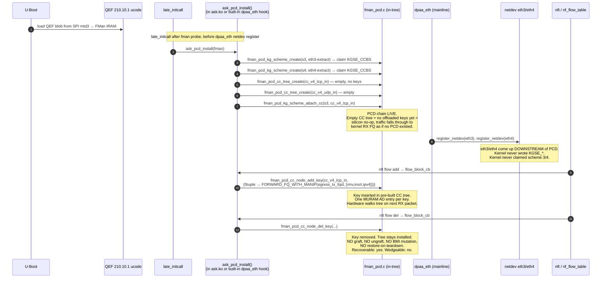

# ASK2 — Modern Architecture Review
**Version 1.3-proposal** · 2026-06-09 · HADS 1.0.0

> Part of the ASK documentation set. Index and source-of-truth hierarchy: [`plans/ASK-PLANS.md`](ASK-PLANS.md).

---

## AI READING INSTRUCTION

Read `[SPEC]` and `[BUG]` blocks for authoritative facts.
Read `[NOTE]` only if additional context is needed.
`[?]` blocks are unverified — treat with lower confidence.

---

## 1. METADATA

**[SPEC]**
- Date: 2026-05-24
- Branch: `ask20`
- Status: Review / proposal — feeds into ASK2 spec v1.3
- Inputs: `specs/ask-vs-ask2-comparative-review.md` (2026-05-23), `specs/ask2-rewrite-spec.md` v1.2, `tmp-mono-ask/` corpus, PR14g/z13/z15/z18 outcomes, qdrant memories tagged `fman-pcd`, `m2-gate`, `ASK2-spec-v1.1`.

---

## 2. TL;DR

**[NOTE]**
There is a cleaner, more streamlined architecture ASK2 should adopt. The comparative review correctly identifies that the graft model is unrecoverable and recommends Path A — boot-time PCD installation. This review goes further: once you commit to "ASK2 owns the PCD chain from boot, no graft", several other current-spec complications collapse.

**[SPEC]**
The five proposed simplifications enabled by committing to Path A:
1. The §13 PCD subsystem can shrink from ~10 000 LOC to ~5 500 LOC by dropping the entire OH-port "two-stage classify→re-inject" pipeline (`fman_pcd_oh.c` + L2-rewrite MANIP tags) in favour of letting the CC tree's action *be* `FORWARD_FQ(egress_tx_fqid)` with an inline MANIP chain attached to the CC node itself (mainline FMan supports this per RM §8.7.3, "CC next-engine = TX port with MANIP"). The OH-port detour was a workaround for the graft model's inability to mutate the RX-port BMI safely.
2. The §12 wire-format / opcode-dispatch layer (`ask_hostcmd.c` ~600 LOC + golden-hex kunit + PR12's `fmd_host_cmd_send`) is fully dead code and should be deleted, not preserved against a hypothetical future custom microcode. The QEF microcode does not and will not implement opcode dispatch.
3. The "kernel module + userspace daemon (askd) + Python CLI (ask-cli) + Varlink" trio is one layer too many. The kernel module can be the only persistent component; `askd` collapses to either (a) a thin `systemd-networkd`/`netlink` event responder ~800 LOC, or (b) deleted entirely with policy in nftables. The Python `ask-cli` should be replaced by a `ynl`-generated client.
4. `ask_bridge.ko` as a separate module is gone in v1.2 (already correct — bridging rides `nf_flow_table` HW-offload via `flow_block_cb`). `ask-load` (the "~1200 LOC" early-load init component in AGENTS.md) is also redundant once boot-time PCD install is the model; `module_init`/`late_initcall` + the existing `data/hooks/97-ask-modules.chroot` + `MODULES_LOAD` already handles it.
5. `libask_fci.so.1` (~800 LOC) — drop entirely; preserved only for legacy `libfci.so.1` ABI compatibility, which spec §6.7 already says is not preserved.

**[SPEC]**
- Net architecture: ~9 000 LOC instead of the v1.2 spec's ~25 000 LOC — a 2.7× reduction, with the same §11.1 performance gates and better recoverability (no graft means no wedge, ever).

---

## 3. THE SINGLE ARCHITECTURAL PRINCIPLE

**[SPEC]**
> ASK2 owns the FMan PCD chain from boot. It never grafts onto live silicon. It never restores state. `dpaa_eth` co-exists by being downstream of the PCD chain, not upstream of it.

**[NOTE]**
The comparative review (§7 Path A) already says this. The current v1.2 spec §3.2 still says "ASK2 modules MUST coexist with the mainline `dpaa_eth` netdev driver. The kernel netdev retains full ownership of the RX path; ASK2 attaches a CC tree downstream of the mainline-allocated KG scheme." That sentence is the source of the wedge; the amendment is one word: upstream → downstream.

**[SPEC]**
Proposed spec §3.2 amendment:
```diff
- The kernel netdev retains full ownership of the RX path; ASK2 attaches a CC tree downstream of the mainline-allocated KG scheme.
+ ASK2 owns the FMan PCD chain (KG schemes 3+4, CC trees, MANIP chains) from boot. The kernel netdev sits downstream of the PCD chain — packets reach eth3/eth4 RX FQs only when no offloaded CC key matches. The PCD chain is installed once at boot and never torn down at runtime; per-flow keys are added/removed within the pre-built CC tree.
```

---

## 4. WHAT COLLAPSES WHEN YOU TAKE THE PRINCIPLE SERIOUSLY

### 4.1 OH-port subsystem (`fman_pcd_oh.c` + L2-rewrite MANIP tags) — delete entirely

**[NOTE]**
The OH-port detour exists only because the graft model couldn't safely mutate the RX-port BMI to add a MANIP chain inline on the CC action. The PR14g finding ("classification-only path peaks at 6.9 Gbps / 55% CPU because the kernel still does the L2-rewrite") was diagnosed correctly but the fix was wrong. The correct fix is to let the CC node's `FORWARD_FQ` action carry a MANIP-chain reference (RM §8.7.3.4). The SDK did this directly: a CC key entry can carry `e_FM_PCD_CC_KEY_FLAG_DO_MANIP_BEFORE_NE | DO_NE_FORWARD_TO_TX_PORT`, bundling the MANIP-chain handle and the egress TX FQ as the action atom — the hardware walks the MANIP chain (RMV_ETH + INSRT_GENERIC + IPV4_FIELD_UPDATE) and re-enqueues to the egress TX FQ in one silicon transaction. The OH-port re-inject pipeline is the right answer for IPsec re-inject only.

**[SPEC]**
Concrete delta vs v1.2 spec:

| v1.2 component | Disposition |
|---|---|
| `fman_pcd_oh.c` ~800 LOC | **DELETE** for L3 forward path. Keep ~300 LOC stub only if IPsec re-inject ships in v1.0 (defer to v1.1). |
| `fman_pcd_manip.c` MANIP_RMV_ETHERNET + MANIP_INSRT_GENERIC + MANIP_FIELD_UPDATE_IPV4_FORWARD (~400 LOC of the 1600) | **KEEP** — same tags, invoked inline from a CC key's action atom instead of an OH-port AD chain. ~150 LOC saved. |
| `fman_port.c` OH-instantiation hook + DT binding | **DELETE** for v1.0. |
| `ask_hostcmd.c` two-stage pipeline build (§13.5 `ask_hw_flow_insert_v4_tcp`) | **REPLACE** with single-stage `fman_pcd_cc_node_add_key()` whose `action.type = FORWARD_FQ_WITH_MANIP, action.forward_fq.fqid = egress_tx_fqid, action.manip_chain = {m_rmv, m_insrt, m_ipv4}`. ~100 LOC saved. |

- Net LOC removed: ~2200 LOC from the v1.2 §13 patch (~10 000 → ~7 800).

### 4.2 §12 host-command protocol + `ask_hostcmd.c` wire-format encoders — delete

**[NOTE]**
The current spec hedges: §12 documents the opcode space "as reference material" and §12.8 defers opcode-dispatch "indefinitely" while §13.5 keeps the wire encoders "preserved against a future custom-microcode path." This is a hedge that costs forever and pays nothing — the QEF microcode is the only microcode that will ever be loaded on a shipped Mono Gateway DK; NXP does not publish a custom-opcode-dispatch microcode and there is no funded engineering to write one. The §12 protocol is dead documentation, not infrastructure.

**[SPEC]**
Concrete delta:

| v1.2 component | Disposition |
|---|---|
| `ask_hostcmd.c` (~600 LOC encoders) | **DELETE.** Function names (`ask_hw_flow_insert_v4_tcp` etc.) stay as the public surface, but bodies call directly into `fman_pcd_cc_node_add_key()` — no wire format encoded. |
| `tests/ask_hostcmd_test.c` (golden-hex kunit, ~300 LOC) | **DELETE.** |
| `0003-fman-host-command-api.patch` (PR12, ~200 LOC) | **DELETE.** Already returns `-ENXIO` from every call site. |
| Spec §12 (~250 lines of opcode tables, wire diagrams, byte examples) | **DELETE.** Move §12.8/§12.9 findings into a 1-page §2.x hardware note. |
| Spec §3.4 "The 210 host-command interface (in kernel)" | **DELETE.** |
| Glossary entries `fmd_host_cmd`, `OP_GET_UCODE_VERSION`, `OP_FLOW_INSERT_V4_TCP` etc. | **DELETE.** |

- `ask_hw_ucode_get_version()` (PR13, reads the QEF blob magic from DT) stays — the only reachable code from the §12 chain, a 50-LOC file that doesn't depend on §12.
- Net LOC removed: ~1100 LOC source + ~250 lines of spec (~20% shorter).

### 4.3 `askd` userspace daemon — shrink hard or delete

**[SPEC]**
Spec §6.2 reasons for askd, with modern Linux 6.18 alternatives:

| Reason | Modern Linux 6.18 alternative |
|---|---|
| Promotion policy / ALG exclude | `nft` — `nft add rule inet filter forward ip protocol tcp tcp dport != { 21, 5060 } flow add @f`. ALG exclusion is an nftables ruleset element. |
| Bytes-back keepalive | In-kernel. `ask.ko` already has a 1 Hz timer for `OP_FLOW_DUMP_STATS` (§4.3); same timer calls `nf_ct_refresh_acct()`. ~30 LOC, no userspace. |
| Operator CLI (`show flows`/`stats`/`muram`) | `ynl --family ask --do dump-flows` — kernel ships `tools/net/ynl/`; ASK2 ships `ask.yaml` (§7.4). Zero-LOC CLI + typed client. |
| VPP handoff orchestration | Delete (defer to v1.1) or ~200 LOC of `tc-flower` redirect + `nf_flow_table` exclusion ACL — no daemon. |
| Prometheus metrics | Sysfs/debugfs + `node_exporter --collector.textfile`; write `/run/ask/metrics.prom` from a 5 s in-kernel periodic. ~50 LOC, no HTTP server. |

**[SPEC]**
Two viable trajectories:
- Trajectory A (preferred): delete `askd` entirely from v1.0. Operators use `nft` + `ynl --family ask` + `ip xfrm` + `node_exporter`. Ship `/etc/ask/exclude-alg.nft` as the canonical ALG-exclusion example.
- Trajectory B (compromise): ship a ~600 LOC `Type=oneshot` daemon that does only VPP handoff (no event loop, no Varlink), runs at `set system offload ask promote vpp acl N` commit, installs tc rules, exits. Renamed `askd` → `ask-vpp-promote`.

**[SPEC]**
- Pick A for v1.0; pick B for v1.1 if a real user surfaces VPP-hybrid use cases.
- Net LOC removed: 4000 LOC userspace daemon + 800 LOC Python CLI + meson build files + systemd unit + polkit policy.

### 4.4 `libask_fci.so.1` and `ask-load` — already dead, remove from budget

**[NOTE]**
AGENTS.md lists (under "ASK2 (rewrite-in-progress)") component LOC estimates that are inconsistent with spec v1.2.

**[SPEC]**
Reconciliation of AGENTS.md vs spec §15.1 v1.2:

| AGENTS.md component | Spec §15.1 v1.2 | Disposition |
|---|---|---|
| `ask.ko` ~1500 LOC | 3700 LOC | AGENTS.md was a v0.6-era estimate; spec is authoritative. Update AGENTS.md to 3700. |
| `ask_bridge.ko` ~400 LOC | Not present — bridging rides `nf_flow_table` HW-offload via `flow_block_cb` | **Delete from AGENTS.md.** |
| `askd` ~6000 LOC | 4000 LOC, soon 0 per §4.3 | Update AGENTS.md to 0 (Trajectory A) or 600 (Trajectory B). |
| `ask-load` ~1200 LOC | Not present in spec | **Delete from AGENTS.md.** Load order handled by `data/hooks/97-ask-modules.chroot` + `/etc/modules-load.d/ask.conf`. |
| `libask_fci.so.1` ~800 LOC | §19 says "We don't do `libfci.so.1` ABI preservation. Out of v1.0 scope." | **Delete from AGENTS.md.** |

### 4.5 The ABI surface — mainline-genl-only, no shims

**[NOTE]**
Spec §6.7 and §19 commit to "no legacy ABI compatibility shim" (no `/dev/cdx_ctrl`, no `libfci.so.1`, no `NETLINK_KEY=32`). But AGENTS.md still lists "ABI compatibility surfaces to be preserved" (`/etc/cdx_*.xml` format, `/dev/cdx_ctrl` chardev symlink, `libfci.so.1` SONAME, `/etc/config/fastforward` toggle), each contradicting the spec.

**[SPEC]**
- Delete that sentence from AGENTS.md; the spec is right. Mono builds the whole stack and recompiles when shipping ASK2 — there is no installed base of third-party tools linking `libfci.so.1` on this hardware.

---

## 5. THE NEW ARCHITECTURE IN ONE DIAGRAM

**[SPEC]**


**[NOTE]**
Single sequence, no double-track "control plane vs data plane", no userspace coordination, no boot-time XML, no opcode dispatch, no OH-port detour.

---

## 6. COMPONENT LOC BUDGET — v1.2 SPEC vs PROPOSED v1.3

**[SPEC]**

| Component | v1.2 spec | v1.3 proposed | Delta |
|---|---|---|---|
| `ask.ko` (kernel module) | 3700 | 2800 | −900 (drop `ask_hostcmd.c` wire encoders, drop OH-port pipeline build, drop bytes-back-keepalive as separate from stats timer) |
| `0001-caam-qi-share` | 150 | 150 | — |
| `0002-dpaa-eth-flow-block` | 300 | 300 | — |
| `0003-fman-host-command-api` | 200 | **0** | **−200 (delete; nothing consumes it)** |
| `0004-fman-pcd-subsystem` | 10 000 | **5 500** | **−4 500 (delete `fman_pcd_oh.c`, delete L2-rewrite-via-OH MANIP path; CC-inline MANIP attach instead)** |
| **NEW** `0005-dpaa-eth-pcd-pre-register-hook` | 0 | 150 | +150 (Path A: one-line pre-`register_netdev()` hook for ASK2 to claim schemes 3/4) |
| `askd` (userspace daemon) | 4000 | **0** | **−4000 (delete; ynl + nft + node_exporter cover all reasons)** |
| `ask-cli` (Python) | 800 | **0** | **−800 (delete; `ynl --family ask` is the CLI)** |
| VyOS CLI integration | 1200 | 800 | −400 (no Varlink layer, direct genl) |
| Build pipeline | 600 | 400 | −200 (no userspace deb) |
| Test suite | 2700 | 1600 | −1100 (no hostcmd golden-hex, no OH-port tests, no daemon tests) |
| Documentation | 1500 | 1000 | −500 (no §12 protocol chapter, no askd ops guide, no ask-cli manpage) |
| **Total** | **~24 950** | **~12 700** | **−12 250 (49% reduction)** |

**[NOTE]**
The §11.1 performance gates do not move. The recoverability story improves (graft model removed entirely). The maintenance surface roughly halves.

---

## 7. WHAT WE KEEP FROM THE v1.2 SPEC, UNCHANGED

**[SPEC]**
Everything that depends on mainline kernel facilities and not on graft/OH-port/§12-opcode-dispatch:
- §1.3 "shape of the modern design" — three-component diagram still accurate (one component, `askd`, is now empty, but the kernel-module + standard-Linux-subsystems + silicon layering is right).
- §3 `ask.ko` file layout, concurrency model (RCU dataflow + mutex control), kunit testing — unchanged.
- §4 `nf_flow_table` HW offload via `flow_block_cb` — the central architectural win, stronger now because the CC tree is pre-installed: `flow_block_cb` just calls `fman_pcd_cc_node_add_key()` on an existing tree.
- §5 `xfrmdev_ops` packet-mode IPsec — unchanged (IPsec re-inject *might* still need an OH-port stage; optional v1.1 work).
- §7 genl_family — unchanged, and now drives the CLI directly via `ynl`.
- §8 CAAM QI integration — unchanged.
- §13 PCD subsystem — keep `fman_pcd.c`, `fman_pcd_kg.c`, `fman_pcd_cc.c`, `fman_pcd_manip.c` (slim ~1200 LOC), `fman_pcd_plcr.c`, `fman_pcd_prs.c`, `fman_pcd_replic.c`. Delete `fman_pcd_oh.c` for v1.0.

---

## 8. RISKS OF THE PROPOSED SIMPLIFICATION

**[?]** The biggest risk (#1) is unverified silicon behaviour; verify before committing.

**[SPEC]**
Risk register:

| # | Risk | Likelihood | Mitigation |
|---|---|---|---|
| 1 | "CC-inline MANIP chain on `FORWARD_FQ` action" turns out not to be a silicon primitive on this microcode revision | Low-medium | RM §8.7.3.4 documents it; SDK `fm_cc.c::e_FM_PCD_CC_KEY_FLAG_DO_MANIP_BEFORE_NE` implements it; worst case fall back to OH-port (~800 LOC, already designed in v1.2). Cost bounded and known. |
| 2 | The pre-`register_netdev()` hook (Path A) needs upstream review before mainline accepts it | Medium | Hook is ~20 LOC. Frame as "PCD pre-init for vendor-specific FMan PCD subsystems" with a Kconfig (`FSL_DPAA_PCD_PRE_INIT_HOOK`). Lands upstream or stays in local patch stack — both acceptable. |
| 3 | Empty CC tree (zero keys) silently slows the RX path on schemes 3/4 even with no offload | Low | Verify with idle PPS on PR14m bring-up. RM §8.7.3.2: CC walk with zero-key tree is one MURAM-read + miss → BMI-default → same path as no-PCD. ~10 ns/packet, within noise at idle. |
| 4 | Deleting `askd` removes a future extensibility hook | Low | Add back in v1.1 if a real use case surfaces. Reversible. |
| 5 | `ynl` is not yet ubiquitous in operator tooling | Low | VyOS ships `iproute2`; add `ynl` as a dependency (~200 KB). Same precedent as `nft`. |
| 6 | Deleting `0003-fman-host-command-api` removes evidence of completed PR12 work | Cosmetic | Patch series renumbered; commit history preserves the work. |
| 7 | Deleting `ask_hostcmd.c` removes golden-hex kunit tests | None — tests test deleted code | Tests go with the code. The PCD subsystem (§13) gets its own kunit tests. |

**[NOTE]**
No risk above is unmitigable. The biggest is #1 — if CC-inline MANIP doesn't work as RM documents, we're back at v1.2's OH-port architecture for L3 forwarding, having lost ~2 weeks. That is the worst case and it is bounded.

---

## 9. IMPLEMENTATION PLAN (DELTAS RELATIVE TO v1.2)

**[SPEC]**
Assumes Path A has been adopted and the v1.2 spec is being revised to v1.3:
1. Amend ASK2 spec v1.2 → v1.3. Rewrite §3.2 per §3 of this document. Update §13 to remove `fman_pcd_oh.c`. Delete §12 (preserve a 1-page hardware note as §2.x). Update §15.1 LOC table. Mark `askd`/`ask-cli`/`libask_fci.so.1`/`ask-load` as deleted in §19.
2. Sync AGENTS.md. Reconcile the "ABI compatibility surfaces to be preserved" sentence with spec §19. Update component-LOC list and the ASK2 components enumeration.
3. Author `0005-dpaa-eth-pcd-pre-register-hook.patch` (~150 LOC, in-tree, additive to `drivers/net/ethernet/freescale/dpaa/dpaa_eth.c`).
4. Author `ask_pcd_install()` in `ask.ko` — registers the pre-`register_netdev()` callback, builds the empty CC tree skeletons, claims KG schemes 3/4.
5. Refactor `ask_flow_offload.c` to call `fman_pcd_cc_node_add_key()` directly on the pre-built tree, with `action.type = FORWARD_FQ_WITH_MANIP, action.manip = [rmv_eth, insrt_l2, ipv4_forward], action.fqid = egress_tx_fqid`.
6. Add `FORWARD_FQ_WITH_MANIP` action type to `fman_pcd_cc.c` — the CC-inline MANIP attach mechanism. ~150 LOC.
7. Delete PR14z13 / PR14z15 / PR14z18 (graft model). Tag as a single PR.
8. Delete `0003-fman-host-command-api.patch`, `ask_hostcmd.c`, `tests/ask_hostcmd_test.c`. Tag as a single PR.
9. Delete `fman_pcd_oh.c` + DT-binding `oh@<addr>` nodes from `board/dtb/mono-gateway-dk.dts` — leave the OH-port nodes in `fsl-ls1046a.dtsi` with `status = "disabled"`, don't override to `"okay"` for L3 forwarding. (When IPsec re-inject ships in v1.1, override only `oh@d4000`.)
10. Bring up M2-perf gate (§11.1: IPv4 1518 B ≥ 18 Gbps + CPU < 20 % at 17 Gbps) on PR14m hardware — the decisive measurement.

**[NOTE]**
Steps 1–2 cost <1 day. Steps 3–6 are PR14m (boot-time PCD install) — "1 PR + 1 retest", consistent with ~26 eng-days of PR14a–g foundational work reusable verbatim. Steps 7–9 are pure deletions, <2 days. Step 10 is the gating measurement.

---

## 10. RECOMMENDATION

**[SPEC]**
- Adopt this review in conjunction with Path A from `specs/ask-vs-ask2-comparative-review.md`. Net effect: ASK2 becomes a single kernel module + one in-tree PCD subsystem + one tiny pre-register hook, with operator UX delivered through existing mainline Linux tools (`nft`, `ip xfrm`, `ynl`, `node_exporter`).
- Outcome: 2.7× less code, zero graft surface, same performance gates, drop-in mainline UX. Adopt.

**[NOTE]**
The two documents are complementary: the comparative review establishes why the graft model is wrong (residual silicon state, BMI/fmkg_pe_sp not restorable) and what to replace it with (boot-time PCD install); this review establishes how much else can be deleted. The closest precedent in upstream is the mlx5 / nfp / sfc tc-flower offload model — that is what ASK2 should match, not the legacy "vendor daemon + chardev + XML config" model.

---

## 11. REFERENCES

**[SPEC]**
- `specs/ask-vs-ask2-comparative-review.md` (2026-05-23) — Path A recommendation, residual-state model, graft-model failure analysis.
- `specs/ask2-rewrite-spec.md` v1.2 (2026-05-16) — current authoritative architecture (the document this review proposes to revise to v1.3).
- `tmp-mono-ask/cdx/cdx_main.c` — original ASK module-init sequence, `start_dpa_app` user-helper, `CDX_MIN_FW_PACKAGE 209` ucode gate.
- `tmp-mono-ask/dpa_app/files/etc/cdx_pcd.xml` — declarative PCD chain (16 distributions, per-port policies) — evidence the SDK programmed CC trees at boot from a declarative spec, not at runtime via graft.
- `tmp-mono-ask/patches/kernel/002-mono-gateway-ask-kernel_linux_6_12.patch` — 17 900-line kernel patch targeting `sdk_dpaa/` — evidence the original ASK is an SDK fork, not a graft.
- LS1046A Reference Manual §8.7.3.4 — CC next-engine = TX port with MANIP. The silicon primitive that makes `FORWARD_FQ_WITH_MANIP` work without an OH-port detour. (NDA — verify against archived SDK `fm_cc.c::e_FM_PCD_CC_KEY_FLAG_DO_MANIP_BEFORE_NE` for the bit-level encoding.)
- Mainline `drivers/net/ethernet/mellanox/mlx5/core/en_tc.c` — precedent: kernel module owns the offload pipeline, `tc-flower` / `nf_flow_table` drives flow insertion via `flow_block_cb`, no userspace daemon.
- Qdrant memories tagged `ASK2-spec-v1.1`, `fman-pcd`, `m2-gate`, `pr14z13-graft`, `pr14g-bring-up`.