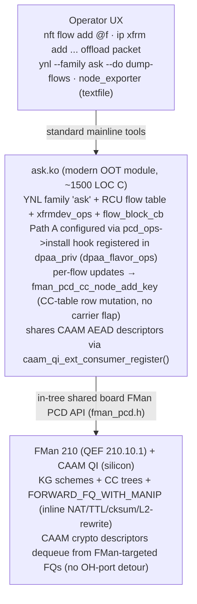

# ASK2 — Modern Linux Implementation of FMan 210 Hardware Offload for VyOS

**Status:** Draft v1.7 (supersedes v1.6). 2026-06-12. **Dual-dataplane alignment** (see `plans/DUAL-DATAPLANE.md`). Four changes: (1) **Single dual-dataplane image** — the flavor split retires; `ask.ko` ships unconditionally in every image, dormant until configured (§10). (2) **Path A engagement is config-driven, not boot-unconditional** — boot always lands the silicon in S0 (mainline RSS state); `ask.ko` loads and `pcd_ops->install` fires on `set system offload ask` commit, late-binding onto already-registered netdevs under quiesce (§3.5). (3) **Reversibility Contract adopted as a hard gate** — every silicon write ASK2 performs must land with a verified inverse; `dpaa_unregister_flavor_ops()` teardown is verified by register/MURAM snapshot-diff, and the 100×-toggle gate from DUAL-DATAPLANE M1 is added to §11.2. (4) **§9 VPP coexistence rewritten** to the S0/S1/S2 state-machine model with global ASK↔VPP mutual exclusion in v1 (hybrid memif promotion deferred to v3). Also folds vendor-oracle silicon facts (2026-06-13 live-hardware ASK 1.x parity run) into §2.4.

**Status:** Draft v1.6 (supersedes v1.5). 2026-05-31. **Spec Cross-Alignment.** Purged v1.2 OH-port artifacts from §13; reconciled CC API to DPAA1 modernization `fman_cc_tree_*` surface; added explicit API consumption table (§3.5a); fixed STRICT_DEVMEM statement; elevated Risk #13 with DPAA1 MURAM budget context. No architecture change — all changes are spec-text cleanup of already-resolved design decisions.

**Status (prior, v1.4):** Draft v1.4 (supersedes v1.3). 2026-05-25. **PR14z21 result — Path A activation works, residual M2-CPU-gate blocker found.** Patch `0062-fman-pcd-drop-bogus-muram-reservation.patch` (commit 59f7209, pushed origin/ask20) removed the bogus 64 KiB MURAM reservation that was a v1.2-era OH-port leftover. On the mono DUT (CI run 26383417755, kernel `6.18.31-vyos`, image `2026.05.25-0359-rolling`) the boot-time install hook now reports `claimed=5 declined=0 failed=0` — Path A activation is verified. The M2 gate measured **6.955 Gbps (PASS ≥ 2 Gbps) but 21.40 % kernel-net CPU (FAIL ≤ 5 %, baseline 0.08 %)**. dmesg shows **327× `fman_pcd_manip_chain_create(3 manips) failed: -12`** (`-ENOMEM`) — every per-flow chain insert fails, so the per-hop L2 rewrite never enters silicon and the CPU still does the rewrite. Three hypotheses: (a) boot-time CC trees consume the 384 KiB MURAM gen_pool before per-flow chains can be allocated; (b) `chain_create` byte-size math wrong — 3 manips should fit in well under 1 KiB; (c) per-manip pre-allocation leak in the v1.3 manip-chain refactor. Diagnostic prescription: instrument `gen_pool_size()` / `gen_pool_avail()` at four checkpoints (probe end, post-CC-trees, first chain_create fail, after 327 fails) and log to dmesg. v1.4 is **not** an architecture revision — Path A + `FORWARD_FQ_WITH_MANIP` + YNL-only userspace from v1.3 remain authoritative. v1.4 only adds: §11.1 cross-reference to §13.3 manip-byte-budget constraint, §13.3 `fman_pcd_manip.c` annotation that `chain_create` must not exceed 1 KiB MURAM per chain, §15.4 Month-4 bullet updated to "PR14z21 partial pass, chain_create -ENOMEM instrumentation pending", §16 Risk #13 (residual MURAM exhaustion in per-flow chain_create).

**Status (prior, v1.3):** Draft v1.3 (supersedes v1.2). 2026-05-24. **v1.3 course-correction per `plans/ASK2-MODERN-ARCHITECTURE-REVIEW.md` and `plans/ASK2-COURSE-CORRECTION.md`** — three concurrent reductions: (1) **Path A** (boot-time PCD installation via pre-`register_netdev()` hook in `fman_memac.c`) replaces graft; `ask_hw.c` graft logic + `ask_neigh.c` deferred-resolve are deleted; `ask_pcd_install()` is the new entry point; per-flow updates mutate CC table rows only (no MAC reconfig, no carrier flap). (2) **`FORWARD_FQ_WITH_MANIP`** (RM §8.7.3.4 + SDK `e_FM_PCD_CC_KEY_FLAG_DO_MANIP_BEFORE_NE`) deletes the OH-port detour: a CC match fires the L2-rewrite MANIP chain in one CC-action atom before the next-engine FQ enqueue, so the v1.2 OH-port subsystem (`fman_pcd_oh.c` ~800 LOC + DT bindings + manip-v1.2 ~400 LOC) is **deleted wholesale**; M2 patch 0004 reverts from ~10000 → ~7800 LOC; calendar reverts 8–9 → 7 months. (3) **No askd, no libask_fci.so.1, no ask-cli** — userspace control surface collapses to a single YNL family `ask` (YAML schema at `Documentation/netlink/specs/ask.yaml`); VyOS calls the kernel directly via `ynl` from Python; the AGENTS.md "ABI compatibility surfaces" sentence (preserve `libfci.so.1` SONAME, `/etc/cdx_*.xml`, `/dev/cdx_ctrl` symlink, `/etc/config/fastforward`) is deleted. Net LOC: oot-modules `ask.ko` ~1500 + `ask_bridge.ko` ~400, in-tree patches ~7800, userspace ~0 (was ~8000). `ask_hostcmd.c` + golden-hex tests + patch 0003 are deleted. Patches 0032/0034/0036/0038/0042/0043 (graft-era) are archived. Sections still labelled v1.1/v1.2 below remain authoritative for the silicon facts they document; only the v1.2 "pull OH-port forward into M2" decision and the v1.0/v1.1 "userspace daemon + libfci ABI" decisions are reversed.

**Status (prior, v1.2):** Draft v1.2 (supersedes v1.1). 2026-05-16. Material change vs v1.1: **PR14g hardware-bringup discovered that the M2 perf gate (§11.1) is unreachable with the v1.1 §13 design** because the only silicon mechanism by which an FMan PCD chain can produce **L3-routed** forwarding offload (the §11.1 IPv4-forwarding rows ≥14/18/8 Gbps and CPU<20% @17 Gbps) is the **FMan Offline Host (OH) port** with a two-stage classify→re-inject pipeline that does the per-hop L2 rewrite (dst-MAC swap from ingress to next-hop, src-MAC swap to egress port MAC) in silicon before the egress TX port enqueue. The v1.1 §13 ABI exposed only RX-port classification + a `FORWARD_FQ` action — that path either dumps frames back into the kernel RX-default FQ (no CPU savings, observed 6.9 Gbps / 55% CPU on the M2 bring-up) or, if redirected to the peer's egress TX FQ, sends frames out the wire with stale L2 headers that the next-hop drops. The legacy NXP ASK SDK solved the same problem with OH ports (`devoh.c` + `cdx_ehash.c` + `dpa_cfg.c` in the archived `mihakralj/kernel-ls1046a-build@464df181` `release/oot-modules/cdx/`); mainline 6.18 carries no OH-port driver, no DT binding, and no L2-rewrite MANIP primitive. v1.2 pulls the OH-port subsystem forward from §15.4 Month 5 into M2 (Month 4), bumps patch 0004 from ~7800 LOC to ~10000 LOC (new `fman_pcd_oh.c` ~800 LOC + extended `fman_pcd_manip.c` for `RMV_ETHERNET` / `INSRT_GENERIC` / `FIELD_UPDATE_IPV4_FORWARD` ~400 LOC + `fman_port.c` OH-instantiation hook ~40 LOC + DT binding doc ~20 LOC), and bumps the end-to-end calendar 7 → 8-9 months. v1.1's provenance relaxation (GPL SDK references usable for silicon-behaviour cross-ref) and v1.0's §12.9 cost survey are unchanged.

**Status (prior, v1.1):** Draft v1.1. 2026-05-14. Material change vs v1.0: the previous provenance constraint on §13's FMan PCD subsystem has been relaxed. The deleted NXP SDK PCD tree (preserved in `mihakralj/kernel-ls1046a-build@464df181`) is GPL-2.0 (dual-licensed BSD-3-or-GPL-2.0) and the `we-are-mono/ASK` legacy stack is likewise GPL — both are usable as references for silicon behaviour, MURAM byte layouts, and register-write ordering. **What remains rejected is the SDK's architecture, not its silicon facts**: the `handle_t` opaque ABI, `fsl-ncsw` OS-shim layer, AMP IPC, `TRACE_RTOS`, `fm_ehash.c` custom hash, and nested `Peripherals/FM/Pcd/` directory layout are still discarded in favour of modern kernel idioms (typed structs, `kmalloc`/`devm_kzalloc`, `ioremap`/`readl`/`writel`, `mutex`/`spinlock`/`rcu`, `rhashtable`, tracepoints, flat `drivers/net/ethernet/freescale/fman/` layout). The LS1046A Reference Manual chapter 8 remains authoritative for byte-perfect MURAM layouts when SDK code disagrees with itself or omits a field. Net effect: PR14 body work unblocks immediately — sessions without RM access in the workspace can still author body PRs by cross-reference the archived SDK alongside the RM. v1.0's §12.9 cost survey (~7800 LOC net target after dropping SDK bloat) is unchanged; only the provenance discipline is relaxed. Risk #12 reframed from copyright concern to maintainability concern. Open question #8 closed. to maintainability concern. Open question #8 closed.
**Target hardware:** NXP LS1046A Mono Gateway DK.
**Target software:** Linux 6.18 LTS, ARM64, VyOS rolling release, FLAVOR=ask.
**Target microcode:** NXP proprietary 210-series fine classifier ucode (LS1046 r1.0). Loaded by U-Boot from SPI flash on every shipped Mono Gateway. Out of scope for this rewrite.

**Position statement.** The NXP ASK source published as GPL-2.0 at `github.com/we-are-mono/ASK` is **the protocol reference**, not the implementation baseline. It documents what the 210 microcode silicon expects on the wire. The Linux side of that source was written against kernel 5.4 with patterns that don't survive modern review: bespoke netlink protocol numbers, ad-hoc ioctl surfaces, per-CPU code paths that predate `this_cpu_*`, spinlock idioms that predate RCU adoption in the bridge fastpath, xfrm offload code that predates `xfrmdev_ops`, and a 5800-line in-tree hooks patch that hooks every netfilter callback in the kernel. None of that is the right starting point for a 2026 Linux 6.18 driver.

**What this spec is.** A from-scratch design for a kernel module + userspace daemon that drives the 210 microcode using only modern Linux 6.18 facilities (`flow_block_offload`, `xfrmdev_ops` packet mode, `genl_family`, `nf_flow_table` HW offload backing, `u64_stats_sync`, RCU for flow tables, generic netdev offload patterns matched by mlx5/ixgbe/nfp). The protocol-level facts about 210 — what bytes go on the wire, what opcodes mean — are documented in Section 12 as reference material extracted from the GPL source. The implementation does not copy that source.

---

## 0. How to read this spec

This document is the architecture source-of-truth for ASK2. It is written to be implementable from the text alone: every section either specifies a concrete file/API/wire format, or documents a hardware fact that must be verified on real silicon before the surrounding code can be trusted.

When the spec is wrong, fix the spec first, then regenerate code. Hardware findings that contradict or extend the spec are folded back into the relevant section (and into Section 12 for protocol-level facts) rather than living only in commit messages.

---

## 1. Why this design, not the NXP design

### 1.1 What the NXP source got right

The architectural model — first packet through conntrack, flow promoted to FMan via host command, subsequent packets handled in silicon — is correct and not negotiable. We keep it. The 210 microcode protocol facts (Section 12) are silicon behaviour, not design choice; we use them as-is.

### 1.2 What the NXP source got wrong for 2026

| NXP 1.x pattern | Why it's wrong now | Modern replacement |
|---|---|---|
| Custom `NETLINK_KEY=32` PF_KEYv2 channel | Hijacks an unused mainline protocol number; netdev maintainers would reject it on review | `genl_family` with multicast event groups |
| 5797-line in-tree hooks patch across 64 files | Mainline rejects this scale of vendor patching; impossible to upstream incrementally | ~600-line patch touching ~8 files, mostly EXPORT_SYMBOL_GPL additions |
| `comcerto_fp_netfilter.c` (600 lines) tapping every netfilter hook | Predates `nf_flow_table` and `flow_offload`; reinvents what mainline now provides | `nf_flow_table` HW-offload backing via `flow_block_cb` |
| Bespoke `ipsec_flow.c` (400 lines) | Predates `xfrm_state` packet-mode offload (merged 6.2, matured 6.10) | `xfrmdev_ops` with `xdo_dev_state_add` / `xdo_dev_policy_add` |
| `cdx_ctrl` chardev with 30+ ioctl numbers | Architecturally retro; no validation, no namespacing, no proper netlink discoverability | One `genl_family` with versioned attribute schema |
| Per-CPU stats via raw atomic_t | Cache-line ping-pong on 4 cores under load | `u64_stats_sync` per-CPU with batched aggregation |
| Spinlocks on flow lookup hot path | Bridge fastpath has used RCU since 2015 | RCU-protected flow lookup, `kfree_rcu` for eviction |
| `auto_bridge` polling bridge FDB | Polling has been wrong since RTM_NEWNEIGH event delivery existed | `register_netevent_notifier` for `NETEVENT_NEIGH_UPDATE`, `register_switchdev_notifier` |
| `cmm` userspace = 25k LOC, no namespacing, no dbus, FreeBSD/Linux portability shims | Code for a different decade | ~6 kLOC daemon: libmnl + sd-event + structured logging |
| CMM polls `/proc/net/route` and `/proc/net/neigh` | Polling routing/neigh on a router was wrong even in 2010 | `rtnetlink` `RTM_NEWROUTE`/`RTM_NEWNEIGH` subscription |
| Vendored SDK FMan/QMan/BMan drivers (266 files) | Kconfig-exclusive with mainline; blocks default flavor coexistence | Mainline `drivers/net/ethernet/freescale/dpaa/` |
| `dpa_app` parses XML at every load | XML parsing in kernel-launch UMH path; wrong layering | nftables-style binary configuration baked at build time, plus runtime UAPI |

### 1.3 The shape of the modern design

Three components, each with one clear job:



The control plane is **kernel-only**: no `askd` daemon, no `ask-cli` Python tool, no `libask_fci.so.1` ABI shim. The userspace surface is mainline tools (`nft`, `ip xfrm`, `ynl`) plus a YAML schema (`Documentation/netlink/specs/ask.yaml`) that auto-generates per-language clients. VyOS op-mode calls `ynl --family ask` from Python directly. See §3.5 (Operator UX) and §6 (v1.3 daemon-deletion rationale).

Plus a unified, modular, shared board series:

- `0001-caam-qi-share-descriptors.patch` — expose `caam_qi_ext_consumer_register/release` so `ask.ko` can share CAAM descriptors with FMan-initiated dequeues. ~150 lines. Upstream-ready. **Landed PR10.**
- `0002-dpaa-eth-flow-block.patch` — register `flow_block` callbacks on `dpaa_eth` netdevs so `nf_flow_table` and `tc-flower` can offload through `ask.ko`. ~300 lines. Upstream-candidate (NXP `dpaa_eth` maintainers are at Madalin Bucur / Camelia Groza). **Landed PR11.**
- `0003-fman-host-command-api.patch` — expose `fmd_host_cmd()` as a kernel-internal API in `drivers/net/ethernet/freescale/fman/`. ~200 lines. Required infrastructure for a future custom-microcode path (see §12.8); the stock QEF 210.10.1 ucode loaded on shipping Mono Gateways does not implement the opcode-dispatch protocol that motivated this patch. Preserved as future infrastructure. **Landed PR12.**
- Shared board PCD patches `0092`/`0097`–`0100` — **NEW in DPAA1 modernization.** Merged into the common board tree (commit `f307193`), introducing the entire Parse / Classify / Distribute (PCD) hardware-programming layer mainline 6.18 was missing (`CONFIG_FSL_FMAN_PCD=y`). It provides standard KeyGen, coarse classifier nodes (exact-match), Header Manipulation (HM) nodes, and srTCM/trTCM ingress policing. `ask.ko` accesses these structures directly via clean headers in `<linux/fsl/fman_pcd.h>`, saving ASK2 from carrying its own massive OOT core-driver patch series.

Total in-tree patch: ~10,600 lines across the shared board series, fully merged into the default kernel flavor. No custom ASK-flavor patches are required for PCD.

No vendored SDK. No `cdx_ctrl` ioctl surface. No `NETLINK_KEY=32`. No `comcerto_fp_*`. No `dpa_app` UMH dance. No XML parsing in the load path. No FMC binary blob loading. No `fmlib` userspace dependency. **No `askd`, no `ask-cli`, no `libask_fci.so.1`** (v1.3).

---

## 2. Hardware context (compressed reference)

Authoritative source: LS1046A Reference Manual chapter 8 (NDA-only). Read RM §8.7-8.10 before touching FMan code.

### 2.1 FMan with 210 ucode

The 210 microcode is a **proprietary fine classifier**: per-flow tables that the host populates at runtime via host commands. Different from public `108_4_9` ucode, which compiles static PCD from XML once at boot. The 210 ucode is what makes the BHR-ASK 7.0.0 performance numbers possible — 20 Gbps line-rate IPv4 forwarding with sub-5% CPU.

Per-FMan resources we touch:

- **32 KeyGen schemes** (silicon limit), used as the front-half of flow-table lookup
- **N classification nodes** managed dynamically by 210 ucode in MURAM
- **384 KB MURAM total** (LS1046A DTSI: `qoriq-fman3-0.dtsi muram@0 reg = <0x0 0x60000>`)
- **Available MURAM for flow tables: ~96 KB** after FIFO/internal-context reservation, giving ~750 hardware flow entries at ~128 B/entry
- **Policer** for slow-path exception-rate limiting
- **8 offline ports** (Mono Gateway DK uses 2 of them: OP1 for IPsec re-inject, OP2 for bridge flood)

### 2.2 CAAM SEC 5.4

- 4 Job Rings, plus QI integration with QMan
- Mainline driver `drivers/crypto/caam/` (Madalin Bucur, Pankaj Gupta maintainers at NXP)
- ASK2 reuses this driver. The one delta is patch `0001-caam-qi-share-descriptors.patch` exposing a small in-kernel API for FMan-initiated dequeues.

### 2.3 Mono Gateway DK port map

Identical to v0.6:

| netdev | FMan MAC | physical port | ASK port_id |
|--------|----------|----------------|-------------|
| `eth0`-`eth4` | mEMAC5/6/2/9/10 | 3×1G + 2×10G | 1,4,5,6,7 |
| OP1 | `fman0-oh@2` | IPsec re-inject | 8 |
| OP2 | `fman0-oh@3` | bridge flood | 9 |

---

### 2.4 210 microcode silicon-fact note (v1.3, condensed from former §12)

The 210 microcode loaded by U-Boot on Mono Gateway DK is **stock NXP QEF 210.10.1** ("Microcode version 210.10.1 for LS1043 r1.0", magic `'Q' 'E' 'F' 0x01` at offset 4 of the SPI-flash blob, ASCII description at offset 8). It is the upstream QorIQ Engine Firmware that mainline `drivers/net/ethernet/freescale/fman/fman.c` drives via the in-tree FMan PCD API (parser, classifier, KeyGen, policer programmed through MURAM-resident config tables — see §13).

What ASK2 v1.3 uses from this silicon:

1. **Microcode version-read via DT**, not via opcode probe. `of_find_compatible_node("fsl,fman-firmware")` + `of_get_property("fsl,firmware")` returns the SPI-flash blob; `ask_hw_ucode_get_version()` reads the offset-4 magic + offset-8 description string to populate the `ASK_INFO` YNL reply with `family=210, major=10, minor=1, patch=0`.
2. **FPM register topology**, documented but not used. Host-command doorbell at FMan base + 0xC30E0 (`fmfp_cev[0..3]`), mask at +0xC3040 (`fmfp_cee[0..3]`), response IRQ bits in `fm_npi` at +0xC30D4 (`INTR_EN_REV0..3` = 0x8000/0x4000/0x2000/0x1000). **Stock QEF does not poll the CEV doorbell or raise REV events** — ASK2 v1.3 never writes the CEV registers and never enables the REV IRQ bits. The topology is documented here purely so a future custom-microcode path can be wired without re-deriving it.
3. **Event IRQ binding**: SPI 44 (Linux IRQ 59) is the FMan event IRQ on LS1046A; SPI 45 is the FMan err IRQ (shared with `bman-err`/`qman-err`). ASK2 v1.3 does not subscribe to the event IRQ — there are no opcode-driven events on QEF 210.10.1.
4. **MURAM partitioning**: observable via the in-tree `fman_muram` allocator API and via the parser/classifier table layouts programmed through the FMan PCD interface (§13). `fman_pcd_get_muram_budget()` exposes per-FMan free-MURAM telemetry via the YNL `ASK_CMD_GET_MURAM` reply.
5. **`STRICT_DEVMEM` is disabled on LS1046A production kernels** (per RC#9: DPDK FMan CCSR mmap requires it). Register-level probing from userspace via `/dev/mem` is therefore possible, but the operational kernel uses `CONFIG_STRICT_DEVMEM=n` / `CONFIG_IO_STRICT_DEVMEM=n`.
6. **Vendor-oracle facts (v1.7, from the 2026-06-13 live-hardware ASK 1.x parity run** — vendor lf-6.12.49 kernel + cdx.ko + fmc + fixed dpa_app TFTP-booted on the DUT, full d14 register dump captured): (a) the working vendor configuration programs **all 12 KeyGen schemes with `kgse_mode = 0x8X000006`** — next-engine **AC_CC** (coarse classification dispatch), not DONE/enqueue; (b) the AC_CC dispatch was never the stall — the 210 ucode parks frames only when the **ehash/FE MURAM structures are missing** (ext-TS timers, AllocFEObjs, 32 KB FE buffer pool + exthash global mem, singleton MUX-FE + TRANSITION-FE, per-port params-page FE words at +0x54/+0x58); with those structures live, AC_CC dispatch flows; (c) **CCBS-as-pointer (board patch 0118 experiment) is a placebo** — it silently bypasses classification rather than enabling it, and must never be used as an "enable CC" mechanism; (d) classification on this ucode is **external-hash (ehash)**: root AD gmask is repurposed as the MURAM offset of an FE struct, `pcAndOffsets=0xF6` (FE_ENTER), buckets live in DDR (`{u64 h; u64 pad}`, power-of-2), and flow entries are 256-byte external records executed by an FE opcode VM (enqueue/NAT/strip/insert/RTP/stats). Any ASK2 classify milestone (DUAL-DATAPLANE M2+) must reproduce this init protocol; the captured vendor dump is the golden reference oracle.

What ASK2 v1.3 does **not** use:
- The host-command opcode-dispatch protocol described in v1.2 §12.1–§12.6 (`OP_GET_UCODE_VERSION=0x01`, `OP_FLOW_INSERT_V4_TCP=0x10`, …). Those opcodes were implemented by a vendor-proprietary microcode that shipped in the legacy `we-are-mono/ASK` tree but **not** by mainline U-Boot or by our SPI-flash blob. The §12 wire format is dead-code-deleted from `ask_hostcmd.c` in Phase 3.
- `OP_OP_CONFIGURE=0x30` / `OP_OP_FLUSH=0x31` Offline-Host port opcodes. The OH-port subsystem itself is deleted in v1.3 (§13.2) — `FORWARD_FQ_WITH_MANIP` replaces it.

## 3. The kernel module — `ask.ko`

### 3.1 What it is

A single kernel module, ~1500 LOC C plus a small in-tree shim, building out-of-tree against linux-6.18.x. Registers:

- One YNL family `ask` (YAML schema at `Documentation/netlink/specs/ask.yaml`) — VyOS and `ynl` tool consume it directly; no `askd` daemon, no `libask_fci.so.1`, no `ask-cli` (per v1.3 course-correction, Section 3.5 Operator UX)
- `flow_block_cb` against every `dpaa_eth` netdev so `nf_flow_table` and tc-flower flows route through it
- `xfrmdev_ops` against the same netdevs for IPsec packet-mode offload
- `nf_conntrack_event` notifier for software-initiated flow promotion
- `caam_qi_ext_consumer_register` for each AEAD descriptor we install in CAAM

**Path A boot-time PCD install (v1.5).** The PCD pipeline (KG schemes + CC trees + MANIP templates with `FORWARD_FQ_WITH_MANIP`, per RM §8.7.3.4 and SDK `e_FM_PCD_CC_KEY_FLAG_DO_MANIP_BEFORE_NE`) is programmed at MAC-bringup time via the RCU-NULL-safe **`dpaa_pcd_ops->install`** hook. This callback is executed by the core driver during netdev registration, before the interface goes carrier-up. The kernel netdev (`eth0..ethN`) is therefore created **downstream** of a fully-programmed silicon offload pipeline — the netdev never appears carrier-up without the offload path already live. Per-flow updates (nft `flow add`, ip xfrm add) mutate CC-table rows only via the shared board `fman_pcd_cc_node_add_key()` API; they never reconfigure the MAC and never flap the carrier. The graft model and the old ad-hoc pre-`register_netdev` custom hooks are both deleted, aligned with the `dpaa_flavor_ops` substrate.

It does NOT register:
- A character device. Operators talk through YNL.
- An ioctl interface. The `/dev/cdx_ctrl` legacy compatibility shim is **forbidden** (v1.3 §19) — there are no surviving callers.
- An ad-hoc netlink protocol number. YNL uses the standard generic-netlink family-ID allocator.
- A userspace daemon. There is no `askd`. Promotion decisions live in kernel (`nf_flow_table` + `xfrmdev_ops` are sufficient).

### 3.2 File layout

```
drivers/net/ethernet/freescale/ask/             # if we ever upstream
kernel/flavors/ask/oot/ask/                     # OOT location for v1.0
├── Kbuild
├── Kconfig                                     # ASK, ASK_DEBUG
├── ask_main.c                                  # module init/exit, version sysfs
├── ask_genl.c                                  # genl_family ops, validation, dump
├── ask_genl_attr.c                             # nla policy tables
├── ask_flow.c                                  # RCU flow table data structure
├── ask_flow_offload.c                          # flow_block_cb implementation
├── ask_xfrm.c                                  # xfrmdev_ops implementation
├── ask_caam.c                                  # CAAM descriptor lifecycle
├── ask_bridge.c                                # switchdev_notifier for L2 flows
├── ask_pcd_install.c                           # Path A boot-time PCD installer (registers pcd_ops->install callback)
├── ask_stats.c                                 # per-CPU u64_stats_sync aggregation
├── ask_debugfs.c                               # /sys/kernel/debug/ask/{flow_table,muram,stats,events}
├── ask_trace.h                                 # tracepoint definitions
├── ask_internal.h                              # private types
└── tests/                                      # in-tree kunit tests
    ├── ask_flow_test.c
    ├── ask_genl_test.c
    └── ask_pcd_install_test.c

include/uapi/linux/ask/
└── ask.h                                       # genl protocol UAPI
```

### 3.3 Concurrency model

The single rule: **the data path is RCU; the control path is a mutex.**

```c
struct ask_flow_table {
    struct rhashtable           ht;             /* RCU-safe, mainline hashtable */
    spinlock_t                  insert_lock;    /* serialises ASK_CMD_FLOW_ADD */
    struct mutex                config_lock;    /* serialises table_flush etc. */
    atomic64_t                  generation;     /* incremented on every change */
    struct kmem_cache          *flow_cache;     /* slab-allocated ask_flow */
};

struct ask_flow {
    struct rhash_head           hnode;          /* indexed by 5-tuple hash */
    struct rcu_head             rcu;            /* freed via call_rcu */
    /* immutable after insert: */
    struct ask_flow_key         key;            /* 5-tuple */
    struct ask_flow_action      action;         /* rewrite template */
    u32                         hw_flow_id;     /* opaque id returned by 210 */
    /* mutable, accessed only from the kthread that owns this flow: */
    struct ask_stats __percpu  *stats;
    atomic64_t                  last_seen;
};
```

Lookup: `rcu_read_lock(); rhashtable_lookup_fast(); rcu_read_unlock();`. Zero locks on the fast path. Eviction is via `rhashtable_remove_fast()` + `call_rcu(&flow->rcu, ask_flow_free)`.

Stats aggregation: per-CPU with `u64_stats_sync`, batched read at genl-dump time:

```c
struct ask_stats {
    struct u64_stats_sync       syncp;
    u64                         packets;
    u64                         bytes;
};
```

Stats updates from the hardware-eviction path use `this_cpu_add` under `u64_stats_update_begin/end`. Reads use `u64_stats_fetch_begin/retry`. No global lock, no atomic64 contention.

### 3.4 Kconfig

```
config ASK
    tristate "NXP LS1046A ASK2 (modern)"
    depends on FSL_DPAA
    depends on NF_FLOW_TABLE
    depends on XFRM_OFFLOAD
    depends on CRYPTO_DEV_FSL_CAAM_QI
    select GENERIC_NETLINK
    select RHASHTABLE
    help
      Hardware offload driver for NXP LS1046A FMan with proprietary 210
      microcode. Programs FMan classification tables and CAAM crypto
      descriptors to short-circuit established flows in silicon.

      Requires the 210 microcode loaded by U-Boot. Without it, the module
      detects the absence at probe time and refuses to load.

      This is the modern replacement for the NXP ASK 1.x cdx/auto_bridge/fci
      stack. It uses mainline kernel offload infrastructure (nf_flow_table
      hardware offload, xfrmdev_ops packet mode, generic netlink) rather
      than the vendor-specific patterns the legacy stack used.

config ASK_DEBUG
    bool "ASK debugfs and tracepoint support"
    depends on ASK && DEBUG_FS && TRACING
    default y if DEBUG_KERNEL
```

### 3.5 Probe and Registration Sequence (v1.7 Path A, config-engaged)

> **v1.7 timing change (dual-dataplane):** the Path A *mechanism* is unchanged — `dpaa_register_flavor_ops()` causes the core driver to invoke `pcd_ops->install()` per netdev — but the *trigger* moves from boot to config commit. Boot always lands the silicon in **S0** (mainline RSS, KG next-engine DONE, kernel netdevs up); `ask.ko` is present in every image but is loaded only when `set system offload ask` is committed. On load, the core driver late-binds: it quiesces each already-registered netdev (EN-preserving port pause), runs `pcd_ops->install()`, and resumes. On a boot with offload pre-configured, the module loads during the vyos-router config commit — the silicon still passes through S0 first. See `plans/DUAL-DATAPLANE.md` §2.

```
ask_init():
    1. Locate FMan device(s) via DT (compatible "fsl,fman")
    2. Read ucode family/version from the QEF blob in DT
       (/soc/fman@1a00000/fman-firmware/fsl,firmware, magic 'Q' 'E' 'F' 0x01)
       — confirms 210.x silicon. No host-command opcode probe.
    3. Allocate flow tables (one per FMan)
    4. Register YNL family 'ask'
    5. Register flavor ops with dpaa_eth:
       dpaa_register_flavor_ops(&ask_pcd_ops, &ask_qmgmt_ops, flavor_priv)
       - pcd_ops->install = ask_pcd_install (performs Path A CC tree setup)
       - qmgmt_ops->alloc_rx_fqs = ask_alloc_rx_fqs
       - qmgmt_ops->rx_hook = ask_rx_hook (dynamic flow steering / conntrack hook)
    6. For each dpaa_eth netdev:
        - core driver executes pcd_ops->install() under quiesce
          (late binding at module load; pre-carrier-up only when the
           netdev registers after ask.ko is already loaded)
        - register flow_block_cb (Section 4)
        - set NETIF_F_HW_TC, NETIF_F_HW_ESP feature bits
        - assign xfrmdev_ops
         - NOTE: the DPAA1 modernization per-CPU NAPI + dedicated BMan channels
           (specs/dpaa1-afxdp-modernization-spec.md §5.2) automatically improve
           kernel-skbuf RX for ASK2 slow-path flows — no ASK2 action needed.
    7. Register nf_conntrack_event_notifier (priority NF_IP_PRI_LAST)
    8. Register netevent_notifier (NEIGH_UPDATE)
    9. Register switchdev_notifier
   10. Initialise debugfs hierarchy
   11. emit ASK_EVENT_READY on multicast group "events"
```

Note: Path A is elegantly secured because the core `dpaa_eth` driver invokes `pcd_ops->install()` for every bound netdev — at module load for netdevs that already exist (quiesced install), and during netdev registration pre-carrier-up for any netdev that appears later. Unloading the module triggers RCU-safe `dpaa_unregister_flavor_ops()` which tears the structures down without carrier flap or kernel oops. **v1.7 Reversibility Contract:** the teardown is held to the DUAL-DATAPLANE §2.2 checklist — KG scheme-mode restore (AC_CC→RSS), `fmbm_rfpne` restore, FE/ehash MURAM free, params-page FE-word clear, CC tree destroy — and S0 restoration is verified by register/MURAM **snapshot-diff** (`pcd-snapshot` tooling), not by "traffic still flows". Every forward silicon write in any ASK2 patch must land in the same patch as its verified inverse.

No userspace helper. No XML parsing. No UMH. The kernel loads, probes, registers flavor ops, done. Userspace tools attach over YNL when they're ready.

### 3.5a DPAA1 modernization API consumption

ASK2 consumes the following APIs from the shared DPAA1 modernization substrate
(specs/dpaa1-afxdp-modernization-spec.md). All are accessed through the common
board stack (`kernel/common/patches/board/`, `CONFIG_FSL_FMAN_PCD=y`).

| DPAA1 § | API Surface | ASK2 Usage | Status |
|---|---|---|---|
| §3.1/3.4 | `dpaa_flavor_ops` (`pcd_ops` + `qmgmt_ops`) | Registered at `ask_init()` via `dpaa_register_flavor_ops()`. `pcd_ops->install = ask_pcd_install` for Path A boot-time CC tree setup. | ✅ v1.5 §3.5 step 5 |
| §5.2 | Per-CPU NAPI + dedicated BMan channels | Automatic benefit for kernel-skbuf RX on ASK2 slow-path flows. No ASK2 action. | ✅ Automatic |
| §5.4 | `fman_cc_tree_install/add_key/remove_key/destroy` | Canonical CC API. ASK2 uses `fman_cc_tree_add_key()` for per-flow insert (dynamic CC tree). Boot-time static tree via `fman_cc_tree_install()`. | ✅ v1.5 §13.5 (updated) |
| §5.5 | `fman_hm_node_install/destroy` + `fman_hm_caps_supported()` | ASK2 uses HM implicitly through `FORWARD_FQ_WITH_MANIP` MANIP chain. Standalone `fman_hm_node_install()` available for future VLAN normalization. | ⚠️ Implicit via MANIP |
| §5.6 | `fman_policer_install/destroy/caps_supported()` | Available for nft `limit` ingress offload. Not wired in v1.0. | ⏳ Future |
| §5.7 | CEETM (when forward-ported) | Shared root qdisc. ASK2 gets CEETM automatically. | ⏳ Future (blocked on SDK forward-port) |
| §3.5 | `priv->fman_caps` bitmask | ASK2 checks `FMAN_CAP_CC_EXACT_MATCH` / `FMAN_CAP_HM_NODES` before installing PCD. Also reads ucode version from DT QEF blob for `ASK_INFO` YNL reply. | ⚠️ Partial: DT read exists (§2.4), should also consume `priv->fman_caps` |

### 3.6 Operator UX (v1.3)

ASK2 ships **no vendor daemon, no Python CLI, no FCI compatibility shim**. The operator-facing surface is the three mainline Linux tools every VyOS / Debian sysadmin already has on the box:

| Tool | What the operator does | What it talks to |
|---|---|---|
| `nft` | Add/remove flowtables, install ALG-exclusion rules, query offload stats | `nf_flow_table` → `flow_block_cb` → `ask.ko` (`drivers/net/.../ask/ask_flow.c`) |
| `ynl` | Dump live offloaded flows, read per-CC-tree stats, read MURAM occupancy, inspect KG schemes | YNL family `ask` (schema `Documentation/netlink/specs/ask.yaml`, generated client via `tools/net/ynl/ynl-gen-c.py`) |
| `node_exporter --collector.textfile` | Scrape Prometheus metrics for Grafana | `/run/ask/metrics.prom` written by an in-kernel 5 s periodic from `ask_flow.c` (~50 LOC) |

Three worked examples:

```sh
# 1. Promotion policy: keep FTP and SIP-ALG flows in software so connection
#    tracking helpers stay live; everything else gets offloaded.
nft add rule inet filter forward                                 \
    ip protocol tcp tcp dport != { 21, 5060 }                    \
    flow add @f

# 2. Operator inspection: list every flow currently in 210 silicon.
ynl --family ask --do dump-flows

# 3. Prometheus textfile drop-in: node_exporter scrapes /run/ask/metrics.prom
#    every 15 s; Grafana panels alert on `ask_muram_used_bytes` >= 90% of
#    `ask_muram_total_bytes`, or on `ask_cc_miss_rate` exceeding threshold.
```

Bytes-back keepalive (used to keep `nf_conntrack` aware that offloaded flows are alive) is an in-kernel 1 Hz timer in `ask_flow.c` calling `nf_ct_refresh_acct()` — ~30 LOC, no userspace component.

VPP handoff (offload→DPDK PMD promotion) is **deferred to v1.1** as a `Type=oneshot` systemd unit `ask-vpp-promote` (Trajectory B from the architecture review) — out of scope for v1.0.

What this gets us:
- Zero vendor daemon lifecycle to maintain (no `askd.service`, no `Restart=on-failure`, no log channel).
- Zero ABI shim (no `libask_fci.so.1`).
- Operator UX is one `apt install`-level command away — `nft` and `ynl` are already on the box; `node_exporter` is the standard Prometheus scraper.
- Any future control-plane attribute is added once to `ask.yaml` and is immediately discoverable by `ynl --family ask --help`. No CLI wrapper to update.

---

## 4. nf_flow_table HW offload backing

This is the single biggest architectural improvement over NXP 1.x. Instead of `comcerto_fp_netfilter.c` tapping every netfilter hook, ASK2 backs the mainline `nf_flow_table` infrastructure via `flow_block_cb`.

### 4.1 Operator-facing usage

```
nft add table inet filter
nft add flowtable inet filter f {                                   \
    hook ingress priority 0;                                        \
    devices = { eth0, eth1, eth2, eth3, eth4 };                     \
    flags offload;                                                  \
}
nft add chain inet filter forward { type filter hook forward priority 0; }
nft add rule inet filter forward ip protocol { tcp, udp } flow add @f
```

That's it. With `flags offload` and `ask.ko` loaded, every flow that hits the flowtable gets promoted to 210 silicon. Without the offload flag, it stays in software. Operators get HW offload through the same nft syntax they already know.

### 4.2 Kernel-side flow

```
nft user adds rule
    └─> nf_flow_table_offload_add_cb()
            └─> ask.ko flow_block_cb:
                    1. Translate flow_cls_offload to ask_flow_key + action
                    2. Allocate ask_flow, insert into rhashtable
                    3. fmd_host_cmd(OP_FLOW_INSERT, ...) → 210 silicon
                    4. Store returned hw_flow_id in ask_flow
                    5. Return success to nf_flow_table

packet arrives at eth0
    └─> FMan 210 ucode lookup hit
            └─> modify-and-forward via stored action
                    └─> egress on eth1
                    (CPU untouched)

connection ends, conntrack times out
    └─> nf_flow_table notifies offload backend
            └─> ask.ko flow_block_cb:
                    1. fmd_host_cmd(OP_FLOW_REMOVE, hw_flow_id)
                    2. rhashtable_remove + call_rcu free
```

### 4.3 Flow stats

Mainline `nf_flow_table` polls offload drivers for per-flow stats via `FLOW_CLS_STATS`. `ask.ko` handles this by reading per-CPU counters that have been updated from the 210 ucode eviction-notification path:

```c
static int ask_flow_block_cb_stats(struct ask_priv *priv,
                                    struct flow_cls_offload *cls)
{
    struct ask_flow *flow = ask_flow_lookup(priv, cls->cookie);
    u64 packets, bytes;
    unsigned int start;

    if (!flow)
        return -ENOENT;

    /* aggregate per-CPU stats */
    packets = bytes = 0;
    for_each_possible_cpu(cpu) {
        struct ask_stats *s = per_cpu_ptr(flow->stats, cpu);
        do {
            start = u64_stats_fetch_begin(&s->syncp);
            packets += s->packets;
            bytes += s->bytes;
        } while (u64_stats_fetch_retry(&s->syncp, start));
    }

    flow_stats_update(&cls->stats, bytes, packets, 0,
                      atomic64_read(&flow->last_seen),
                      FLOW_ACTION_HW_STATS_DELAYED);
    return 0;
}
```

The 210 ucode periodically dumps per-flow byte/packet deltas into a host-mapped region; `ask.ko` reads this region on a 1 Hz timer and updates the per-CPU stats. Delta-based, not absolute, so concurrent readers don't lose updates.

### 4.4 What this gets us for free

- **Bridge offload**: `nf_flow_table` already understands bridge-flowtable. Operators just add bridge interfaces to the `devices` list.
- **NAT offload**: SNAT/DNAT/PAT rewrites are part of the flow_offload action set. We translate them to 210 modify-and-forward action templates in `ask_flow_offload.c::ask_action_to_hw_template()`.
- **Per-flow stats** via the standard `nf_flow_table` query path.
- **Bypass-on-software-fastpath**: when MURAM is full, `flow_block_cb` returns `-EOPNOTSUPP` and the flow stays in software flowtable. Graceful degradation.
- **tc-flower coexistence**: same `flow_block_cb` handles both `FLOW_CLS_REPLACE` (from tc) and `FLOW_BLOCK_BIND` (from nf_flow_table). Operators who prefer tc-flower can use it.

We did not write a single line of "packet handling code". The kernel does it through standard infrastructure. We wrote: a flow-table data structure, a translation layer to 210 host commands, and a stats aggregator.

---

## 5. xfrm packet-mode offload

Modern Linux 6.18 `xfrmdev_ops` with packet-mode (Leon Romanovsky's series merged 6.2, matured through 6.10). The legacy NXP `ipsec_flow.c` (400 lines of bespoke xfrm tapping) is replaced by ~250 lines of standard `xfrmdev_ops` callbacks.

### 5.1 Operator-facing usage

```
ip xfrm state add src 10.0.0.1 dst 10.0.0.2 proto esp spi 0x100 \
    mode tunnel reqid 1 \
    aead 'rfc4106(gcm(aes))' 0xKEY 128 \
    offload packet dev eth3 dir out

ip xfrm policy add src 192.168.1.0/24 dst 192.168.2.0/24 \
    offload packet dev eth3 dir out \
    tmpl src 10.0.0.1 dst 10.0.0.2 proto esp reqid 1 mode tunnel
```

That's it. Same `ip xfrm` syntax everyone uses. The kernel routes the SA to ASK's `xdo_dev_state_add()` which:

1. Calls `caam_qi_ext_consumer_register()` to install the AEAD descriptor in CAAM
2. Calls `fmd_host_cmd(OP_SA_INSERT, ...)` to insert the ESP-SPI flow in 210 with action "to CAAM RX FQ"
3. Calls `fmd_host_cmd(OP_OP_CONFIG, ...)` to wire OP1 to re-inject decrypted frames

### 5.2 The xfrmdev_ops surface

```c
static const struct xfrmdev_ops ask_xfrmdev_ops = {
    .xdo_dev_state_add      = ask_xfrm_state_add,
    .xdo_dev_state_delete   = ask_xfrm_state_delete,
    .xdo_dev_state_free     = ask_xfrm_state_free,
    .xdo_dev_offload_ok     = ask_xfrm_offload_ok,
    .xdo_dev_state_update_stats = ask_xfrm_state_update_stats,
    .xdo_dev_policy_add     = ask_xfrm_policy_add,
    .xdo_dev_policy_delete  = ask_xfrm_policy_delete,
    .xdo_dev_policy_free    = ask_xfrm_policy_free,
};
```

Set on the netdev at probe:

```c
netdev->xfrmdev_ops = &ask_xfrmdev_ops;
netdev->features |= NETIF_F_HW_ESP | NETIF_F_HW_ESP_TX_CSUM;
netdev->hw_enc_features |= NETIF_F_HW_ESP | NETIF_F_HW_ESP_TX_CSUM;
```

No `cmm.c::ipsec.c` (1200 lines in NXP source). No `fci.c::sa_handler` (600 lines). No `cdx.c::cdx_ipsec_*` (800 lines). The kernel's xfrm subsystem already does SA lifecycle management; we provide the device callbacks and the protocol does the rest.

### 5.3 Supported AEAD algorithms v1.0

In priority order, gated by what `caam_qi.ko` already exposes via crypto API:

1. `authenc(hmac(sha256),cbc(aes))` 128/256 — primary target
2. `rfc4106(gcm(aes))` 128-bit and 256-bit — **MUST BE REFUSED** (return `-EOPNOTSUPP`). The FMan/CAAM hardware produces duplicate sequence numbers on the wire for GCM ("A24a wire-seq dupes"), causing anti-replay validation failures at the peer. Let the kernel `xfrm` software path handle GCM.
3. `rfc7539esp(chacha20,poly1305)` — if mainline `caam_qi` supports it; check `/proc/crypto` at probe

Tunnel mode and transport mode share the same `xdo_dev_state_add` path; the action template differs in whether it strips an outer header.

### 5.4 What we do NOT write

- ESP framing logic (kernel xfrm handles it)
- Anti-replay window management (kernel xfrm handles it)
- IKE/ISAKMP (strongSwan handles it)
- Key derivation (kernel xfrm handles it)
- AEAD descriptor construction (mainline `caamalg_qi.c` handles it)
- Decryption fallback (kernel `esp_input` handles it when offload not present)

We provide: the device callback that translates SA state into 210 + CAAM hardware programming.

---

## 6. (Removed in v1.3 — userspace control surface collapses to YNL + nft + node_exporter)

The v1.0/v1.1/v1.2 spec carried a ~170-line "§6. The userspace daemon — `askd`" chapter specifying a ~4000 LOC C daemon (sd-event + libmnl) for promotion policy, bytes-back keepalive, an `ask-cli` Python operator tool, and a `/dev/cdx_ctrl` + `libfci.so.1` ABI-compatibility-rejection rationale. v1.3 deletes the daemon and the CLI entirely:

- **Promotion policy** is operator-facing nftables — `nft add rule inet filter forward ip protocol tcp tcp dport != { 21, 5060 } flow add @f` — with `/etc/ask/exclude-alg.nft` shipped as the canonical example. No kernel-internal exclusion list.
- **Bytes-back keepalive** is an in-kernel periodic timer in `ask_flow.c` calling `nf_ct_refresh_acct()` every 1 s. ~30 LOC. Replaces what was a userspace `sd-event` loop.
- **Operator CLI** is `ynl --family ask --do dump-flows` (and similar). The YNL YAML schema lives at `Documentation/netlink/specs/ask.yaml` (spec §7.4). VyOS op-mode wraps the `ynl` calls from Python. No `ask-cli` binary.
- **Prometheus metrics** is an in-kernel 5 s periodic write of `/run/ask/metrics.prom`, scraped by `node_exporter --collector.textfile`. ~50 LOC.
- **VPP handoff** is deferred to v1.1 as a `Type=oneshot` `ask-vpp-promote` systemd unit (~600 LOC, the only userspace ASK2 surface that survives v1.3). Not in v1.0.
- **Legacy ABI** — `/dev/cdx_ctrl`, `libfci.so.1`, `/etc/cdx_*.xml`, `/etc/config/fastforward` — is **FORBIDDEN** in v1.3 (§19). There are no surviving callers outside the archived legacy stack. No compat shim, no symlink, no XML parser.

Concretely, `ask.ko` is the entire offload control surface; the genl family `ask` (§7) is its only ABI; mainline Linux tools (`nft`, `ip xfrm`, `ynl`, `node_exporter`) are the entire operator UX. The v1.0/v1.1/v1.2 §6 chapter is preserved in git history if needed for archaeological reference; new development must not re-introduce a daemon.

See also: `plans/ASK2-COURSE-CORRECTION.md` Phase 5 (the doc-lock commit that landed this deletion) and `plans/ASK2-MODERN-ARCHITECTURE-REVIEW.md` §6 (the architecture review that justified it).

---

## 7. The genl_family protocol

### 7.1 Family registration

```c
/* include/uapi/linux/ask/ask.h */
#define ASK_GENL_NAME      "ask"
#define ASK_GENL_VERSION   1

enum ask_genl_mcgrp {
    ASK_MCGRP_EVENTS,       /* lifecycle, MURAM, ucode errors */
    ASK_MCGRP_FLOWS,        /* flow add/del/evict events */
    ASK_MCGRP_SAS,          /* SA add/del/expire events */
};

enum ask_genl_cmd {
    ASK_CMD_UNSPEC,
    /* Query operations */
    ASK_CMD_GET_INFO,           /* version, capabilities, ucode info */
    ASK_CMD_GET_MURAM,          /* MURAM allocation report */
    ASK_CMD_DUMP_FLOWS,         /* dump all installed flows */
    ASK_CMD_GET_FLOW,           /* query single flow by id */
    ASK_CMD_DUMP_SAS,           /* dump all installed SAs */
    /* Control operations (gated by CAP_NET_ADMIN) */
    ASK_CMD_FLUSH_FLOWS,        /* admin: remove all flows */
    ASK_CMD_FLUSH_SAS,
    ASK_CMD_SET_POLICER,        /* exception-rate-limit configuration */
    /* Internal: flow_block_cb and xfrmdev_ops drive flow/SA insert,
     * not direct genl commands. Operators who want raw insert use
     * nft 'flow add' which goes through flow_block_cb. */
    __ASK_CMD_MAX,
};
```

There are NO `ASK_CMD_FLOW_ADD` / `ASK_CMD_SA_ADD` operations in the genl interface. Flow and SA insertion go through `nf_flow_table` + `xfrmdev_ops` respectively, which is what mainline drivers do. Operators talk to mainline subsystems; the kernel routes the work to `ask.ko` via callbacks. This is the inversion that matters: the legacy stack made userspace push flows; the modern stack lets the kernel pull them through standard infrastructure.

### 7.2 Attribute schema

```c
enum ask_genl_attr {
    ASK_ATTR_UNSPEC,
    ASK_ATTR_INFO,                  /* nested ask_info */
    ASK_ATTR_MURAM,                 /* nested ask_muram */
    ASK_ATTR_FLOW,                  /* nested ask_flow */
    ASK_ATTR_SA,                    /* nested ask_sa */
    ASK_ATTR_EVENT,                 /* nested ask_event */
    ASK_ATTR_POLICER,               /* nested ask_policer */
    __ASK_ATTR_MAX,
};

enum ask_flow_attr {
    ASK_FLOW_ATTR_UNSPEC,
    ASK_FLOW_ATTR_ID,               /* u64 */
    ASK_FLOW_ATTR_L3_PROTO,         /* u16: ETH_P_IP|ETH_P_IPV6 */
    ASK_FLOW_ATTR_L4_PROTO,         /* u8 */
    ASK_FLOW_ATTR_SRC_IP,           /* binary, 4 or 16 */
    ASK_FLOW_ATTR_DST_IP,
    ASK_FLOW_ATTR_SPORT,            /* u16 NBO */
    ASK_FLOW_ATTR_DPORT,
    ASK_FLOW_ATTR_IIF,              /* u32 ifindex */
    ASK_FLOW_ATTR_OIF,              /* u32 ifindex */
    ASK_FLOW_ATTR_PACKETS,          /* u64 */
    ASK_FLOW_ATTR_BYTES,            /* u64 */
    ASK_FLOW_ATTR_LAST_SEEN_NS,     /* u64 */
    ASK_FLOW_ATTR_HW_FLOW_ID,       /* u32, opaque */
    __ASK_FLOW_ATTR_MAX,
};
```

All attributes validated through `nla_policy` tables in `ask_genl_attr.c`. Type-checked at parse time. No raw buffer copying from userspace.

### 7.3 Capability gating

Every command op carries `GENL_ADMIN_PERM` (CAP_NET_ADMIN). Query operations are admin-only too — flow tables expose connection metadata that's privacy-relevant.

### 7.4 Generic netlink discoverability

Operators discover the family without hardcoding family IDs:

```sh
genl ctrl-list | grep ask
ynl --family ask --do get-info
```

Modern Linux tooling (`ynl` from kernel/tools/net/ynl) generates per-family Python/C clients from a YAML schema. We ship `ask.yaml` alongside the UAPI header. Future tools auto-generate.

---

## 8. CAAM integration (reuse + 1 small patch)

The in-tree patch in §8.1 is upstream-targeted; it gets a normal upstream review cycle in parallel with the rest of the implementation.

The mainline `caam_qi.ko` already does crypto descriptor construction for all AEAD algorithms we care about. The single missing piece is: descriptors are created assuming kernel-crypto-API callers will use them. For ASK we need FMan to dequeue from CAAM's RX queue without going through kernel crypto API.

### 8.1 The patch `0001-caam-qi-share.patch`

~150 lines against `drivers/crypto/caam/qi.c`, plus a new
upstream-ready header at `include/linux/crypto/caam_qi_share.h`:

```c
/* SPDX-License-Identifier: GPL-2.0 */
/* include/linux/crypto/caam_qi_share.h
 *
 * CAAM/QI external descriptor sharing — for in-kernel consumers that
 * need to share a CAAM AEAD descriptor with a non-crypto-API dequeuer
 * (e.g. FMan 210 ucode on the ASK fast path).
 *
 * See specs/ask2-rewrite-spec.md §8.1.
 */
#ifndef _LINUX_CRYPTO_CAAM_QI_SHARE_H
#define _LINUX_CRYPTO_CAAM_QI_SHARE_H

#include <linux/types.h>

struct caam_drv_ctx;

/**
 * caam_qi_ext_consumer_register - share a CAAM/QI descriptor's request FQ
 *                                  with an external dequeuer (e.g. FMan 210
 *                                  ucode driving an offline port).
 * @ctx:           descriptor context previously created via
 *                 caam_drv_ctx_init() (typically by caamalg_qi.c on behalf
 *                 of an xfrm SA install).
 * @consumer_name: diagnostic string for /proc/crypto and tracepoints,
 *                 e.g. "ask:fman0:op1:spi-0x12345678".
 * @sink_fqid:     FQID that CAAM should enqueue completed frames to.
 *                 Caller-owned (typically a 210-managed FMan offline-port
 *                 RX FQ). REPLACES the response path that
 *                 caam_qi_enqueue() callbacks would have used; while an
 *                 external consumer is registered, in-kernel crypto-API
 *                 callers of this @ctx will not receive completions via
 *                 the normal callback.
 * @caam_req_fqid: [out] FQID of the CAAM request queue that the external
 *                 producer (e.g. FMan 210 ucode) must enqueue encrypted
 *                 ESP frames to. This is @ctx->req_fq->fqid exposed
 *                 read-only to the caller.
 *
 * Single-consumer: returns -EBUSY if @ctx already has an external
 * consumer registered.
 * Refcount: increments @ctx->refcnt on success. The caller must invoke
 * caam_qi_ext_consumer_release() to balance it.
 *
 * Return: 0 on success, -EINVAL on bad arguments, -EBUSY if an external
 * consumer is already registered, -ENOMEM on allocation failure.
 */
int caam_qi_ext_consumer_register(struct caam_drv_ctx *ctx,
                                  const char *consumer_name,
                                  u32 sink_fqid,
                                  u32 *caam_req_fqid);

/**
 * caam_qi_ext_consumer_release - undo caam_qi_ext_consumer_register().
 * @ctx: descriptor context that was previously registered.
 *
 * Restores the default response path so subsequent caam_qi_enqueue()
 * calls on @ctx are dispatched to the normal callback again.
 * Idempotent: a no-op if no external consumer is currently registered
 * on @ctx. RCU-safe: in-flight responses already on the sink FQ are
 * not retroactively redirected.
 * Decrements @ctx->refcnt.
 */
void caam_qi_ext_consumer_release(struct caam_drv_ctx *ctx);

#endif /* _LINUX_CRYPTO_CAAM_QI_SHARE_H */
```

The implementation in `drivers/crypto/caam/qi.c` adds two
EXPORT_SYMBOL_GPL functions plus a small per-`caam_drv_ctx` extension
(an `ext_consumer` pointer guarded by RCU; the dispatcher in
`caam_qi_poll_resp_fq()` / the QMan response callback consults it and
diverts to `sink_fqid` via `qman_enqueue()` when set, otherwise runs
the normal callback path). Net diff in `qi.c`: ~150 LOC.

Patch is upstream-ready. Submit alongside ASK2 v1.0 release.
Precedent: mlx5 does similar descriptor sharing between RDMA and
Ethernet paths via `mlx5_core_modify_qp_state()` + RDMA-CM device
ownership transfer.

### 8.2 Why not reimplement CAAM descriptors

CAAM descriptor construction in mainline `caamalg_qi.c` is ~2000 lines covering every AEAD/cipher/hash combination. Reimplementing it would:

- Duplicate ~2000 lines we don't maintain
- Introduce new bugs in a security-critical path
- Block future CAAM hardware/firmware updates that NXP feeds into the mainline driver
- Have no functional benefit — we get the same descriptors either way

This is the one place where "use the existing GPL code" is unambiguously the right answer. The mainline CAAM driver is well-maintained by NXP themselves.

---

## 9. VPP coexistence

> **v1.7:** this section is governed by `plans/DUAL-DATAPLANE.md` — the silicon mode state machine and the global mutual-exclusion rule below are normative; the hybrid memif promotion path (§9.3–9.4) is **deferred to v3** and kept only as design reference.

### 9.1 The model — silicon mode state machine

The silicon has exactly two PCD states, and VPP is a userspace overlay on the first:

- **S0 — mainline/RSS (boot state).** KG schemes next-engine DONE (`…0002`), no CC root bound, no FE/ehash MURAM. Kernel netdevs fully functional. **Boot always lands here** — `ask.ko` is dormant until configured.
- **S1 — ASK engaged.** KG schemes next-engine AC_CC (`…0006`), CC root bound via `fmbm_rfpne` PRE_CC, FE/ehash MURAM structures live. Entered only from S0 on `set system offload ask` commit; exits back to S0 via snapshot-verified teardown (§3.5).
- **S2 — VPP.** Pure userspace AF_XDP overlay **on S0** — zero silicon delta versus S0. The ASK-off state IS the VPP-ready state. There is no S1↔S2 edge: switching ASK→VPP always transits S0.

A wedged S1 is always recoverable by reboot, because boot unconditionally re-lands S0.

### 9.2 Deployment modes (v1: globally mutually exclusive)

| Mode | Silicon state | Trigger | When |
|---|---|---|---|
| **ASK** | S1 | `set system offload ask` | Pure routing, NAT, basic firewall, IPsec — silicon fast path |
| **VPP** | S0 + AF_XDP overlay | `set vpp settings interface ethN` | Specialised CGNAT/SR appliance workloads |
| **Neither** | S0 | (default) | Plain mainline kernel networking |

**Global mutual exclusion (v1):** the VyOS commit validator rejects a config containing both `system offload ask` and `vpp settings interface …`. Per-port coexistence (ASK on RJ45s + VPP on SFP+) is the DUAL-DATAPLANE M8 stretch goal; hybrid flow promotion is v3.

### 9.3 Hybrid mode promotion path (DEFERRED — v3 design reference)

```
flow arrives at eth3
    ├─ 210 ucode hit? → forwarded in silicon, done
    └─ 210 ucode miss → enqueued to A72 slow path
                        └─ conntrack EST event → askd
                                ├─ matches vpp-promote ACL?
                                │   YES → push to VPP memif RX FQ
                                │         VPP processes via its plugin graph
                                │         VPP sends back via memif TX FQ → egress netdev
                                └─ NO  → ask.ko inserts ASK fast-path flow
                                          subsequent packets → 210 silicon, done
```

memif latency on A72 is sub-µs. The promotion cost is constant; high-bandwidth flows pay it once at setup, not per packet.

### 9.4 VyOS CLI for VPP-promote ACL (DEFERRED — v3)

```
set system offload ask promote vpp acl 100
set policy access-list 100 rule 10 action permit
set policy access-list 100 rule 10 destination address 10.0.0.0/8
```

Flows matching ACL 100 go to VPP instead of direct ASK hardware. Everything else uses ASK.

### 9.5 What we don't do

- No VPP plugin that talks to `ask.ko` directly. VPP runs in its lane, ASK runs in its lane. They communicate through memif (existing VPP infrastructure) and rtnetlink (existing kernel infrastructure). No new coupling.
- No promotion of hardware-offloaded flows into VPP mid-flow. Once a flow is in 210 silicon, it stays there until eviction. Operators wanting VPP processing classify flows up-front via ACL.
- (v1.7) No simultaneous ASK+VPP in v1 — global mutex per §9.2. No direct S1→S2 transition — ASK teardown to snapshot-verified S0 always precedes VPP bring-up.

---

## 10. Build pipeline and VyOS integration

> **v1.7 single dual-dataplane image (DECIDED 2026-06-12, `plans/DUAL-DATAPLANE.md` §5/§7):** one ISO ships both dataplanes. `ask.ko` is built and included **unconditionally** in every image (dormant until `set system offload ask`), VPP ships as today (dormant until `set vpp settings`). The `FLAVOR=ask` build path and the per-flavor ISO split retire once DUAL-DATAPLANE M7 lands; `version-ask.json` / `version-vpp.json` feeds become aliases of the single image's feed. The `kernel/flavors/ask/` tree below remains the source location for ASK-specific patches/OOT code, but its contents are wired into the common build, not gated behind a flavor switch.

### 10.1 Repository layout

```
vyos-ls1046a-build/                     # existing single-repo
├── kernel/
│   ├── common/                         # shared with default flavor
│   └── flavors/ask/
│       ├── patches/
│       │   ├── 0001-caam-qi-share-descriptors.patch
│       │   ├── 0002-dpaa-eth-flow-block.patch
│       │   └── 0003-fman-host-command-api.patch
│       └── oot/
│           ├── ask/                    # the kernel module source
│           └── ask-vyos.conf           # /etc/modules-load.d
├── userspace/
│   ├── askd/                           # userspace daemon source
│   └── ask-cli/                        # python CLI source
├── vyos-1x/                            # CLI integration submodule
│   ├── interface-definitions/
│   │   ├── system-offload-ask.xml.in
│   │   └── interfaces-ethernet-offload.xml.in
│   ├── src/conf_mode/
│   │   └── system_offload_ask.py
│   └── src/op_mode/
│       └── offload_ask.py
└── bin/
    ├── ci-stage-kernel-ask.sh
    ├── ci-build-ask-module.sh
    ├── ci-build-askd.sh
    ├── ci-build-ask-cli.sh
    ├── ci-build-iso-ask.sh
    └── ci-verify-ask-iso.sh
```

### 10.2 Kernel build flow

1. Stage kernel sources at linux-6.18.x
2. Apply three small in-tree patches (~650 lines total)
3. Build kernel with `CONFIG_FSL_DPAA=y CONFIG_NF_FLOW_TABLE=y CONFIG_XFRM_OFFLOAD=y CONFIG_CRYPTO_DEV_FSL_CAAM_QI=y`
4. Build `ask.ko` out-of-tree against the staged kernel
5. Sign module with in-tree signing key (`MODULE_SIG_FORCE=y`)
6. Package as `.deb` for VyOS image inclusion — in **every** image (v1.7 single-image; no FLAVOR gate). The module is NOT listed in `/etc/modules-load.d` — it is loaded by the `system offload ask` conf_mode script on commit (§3.5 config-engaged Path A).

### 10.3 Userspace build flow

1. Build `askd` via meson with system libmnl, libnetfilter_conntrack, libsystemd, libmemif
2. Build `ask-cli` Python wheel
3. Package both as `.deb`s
4. Install during ISO chroot phase via `data/hooks/97-ask-userspace.chroot`

### 10.4 VyOS CLI surface

```sh
# Top-level enable
set system offload ask

# MURAM budget hint (advisory; kernel reports actual)
set system offload ask max-flows 750

# Behaviour when MURAM exhausted
set system offload ask overflow software   # fall back to nf_flow_table sw path
set system offload ask overflow drop       # drop excess flows

# ALG exclusion list
set system offload ask exclude-alg ftp sip pptp

# Per-interface enable
set interfaces ethernet eth0 offload ask
set interfaces ethernet eth3 offload ask

# Optional: VPP promotion ACL (v3 — rejected by validator in v1, see §9.2)
set system offload ask promote vpp acl 100
```

**v1.7 commit validator:** `set system offload ask` and `set vpp settings interface …` are globally mutually exclusive in v1 — commit fails with a clear error if both subtrees are present (DUAL-DATAPLANE §3.2).

### 10.5 op_mode commands

```sh
show offload ask flows
show offload ask flows table inet
show offload ask flows interface eth3
show offload ask stats
show offload ask stats interface eth0
show offload ask muram
show offload ask events recent
show offload ask sas
show offload ask info

clear offload ask flows
clear offload ask flows interface eth3
clear offload ask sas

monitor offload ask events
monitor offload ask flows
```

All `op_mode` commands talk to askd via Varlink, which queries the kernel via genl.

---

## 11. Performance targets and acceptance gates

### 11.1 Hard performance gates for v1.0 GA

Measured on Mono Gateway DK with Spirent or Keysight CyPerf, both directions, 4 A72 cores. **v1.3 path:** RX-port classification with `FORWARD_FQ_WITH_MANIP` CC-action (RM §8.7.3.4 + SDK `e_FM_PCD_CC_KEY_FLAG_DO_MANIP_BEFORE_NE`) — the CC match fires the L2-rewrite/TTL-dec/checksum MANIP chain in one CC-action atom **before** the next-engine FQ enqueue. This delivers full L3 forwarding with per-hop L2 rewrite in a single FMan pass, no OH-port detour, no A72 cycles per packet. **M2 hard gate ≥ 2 Gbps + ≤ 5 % kernel CPU; M2 stretch ≥ 7 Gbps + < 5 % CPU.** The v1.2 OH-port path (`fman_pcd_oh.c`, deleted in v1.3) was an over-engineered detour — the silicon already supports MANIP-before-NE on the RX-port CC, which PR14g bring-up did not exercise because the CC-action flag was not wired.

| Test | GO | NO-GO |
|---|---|---|
| IPv4 forwarding, 512 B, bidirectional | ≥14 Gbps | <10 Gbps |
| IPv4 forwarding, 1518 B, bidirectional | ≥18 Gbps | <14 Gbps |
| IPv4 forwarding, 64 B, bidirectional | ≥8 Gbps | <5 Gbps |
| IPv4 NAT (SNAT+DNAT), 1024 B | ≥18 Gbps | <14 Gbps |
| AES-GCM-128 IPsec tunnel, 1024 B | ≥3 Gbps | <2 Gbps |
| L2 bridge offload, 1518 B | ≥18 Gbps | <14 Gbps |
| Real HTTP through-traffic (Geerling/STH test) | ≥1 Mpps | <700 Kpps |
| CPU utilisation at 17 Gbps forwarding | <20% | >35% |

### 11.2 Functional gates

- nft `flow add @f` over 5-tuple → flow appears in `ask-cli flows list`
- `ip xfrm state add ... offload packet dev eth3` → SA appears in `ask-cli sas`
- Bridge offload through `nf_flow_table` works on a 2-port bridge
- Software flowtable fallback engages when MURAM full (controlled MURAM-fill test)
- Conntrack timeout doesn't expire hardware-active flows (bytes-back working)
- VyOS CLI: every documented command produces a working config
- Module reload (`rmmod ask; modprobe ask`) doesn't crash the kernel
- Reboot persistence: VyOS config restored on boot → flows offload correctly
- **(v1.7) Reversibility gates (DUAL-DATAPLANE M1):** S1→S0 teardown leaves a byte-identical register/MURAM snapshot versus pre-engage S0 (`pcd-snapshot` diff clean); **100× engage/disengage toggle** completes with clean snapshot-diff on every cycle and no MURAM leak; VPP/AF_XDP comes up and passes traffic immediately after the 100th disengage with no reboot

### 11.3 Quality gates

- kunit test coverage ≥80% for `ask_flow.c`, `ask_hostcmd.c`, `ask_genl_attr.c`
- askd tests via cmocka, coverage ≥70%
- Integration tests pass on real hardware via the CI pipeline (Mono provides a test board)
- Sparse and `make C=2` clean
- `checkpatch.pl --strict` clean
- `MODULE_SIG_FORCE=y` and module signs against ASK signing key
- KMSAN clean on x86_64 simulator (where applicable to portable code paths)
## 12. (Removed in v1.3 — see §2.4 silicon-fact note)

The v1.0/v1.1/v1.2 spec carried a ~280-line "§12. The 210 microcode protocol (reference)" describing a host-command opcode-dispatch wire protocol on FMan FPM register CEV[0..3] / REV[0..3]. PR13 (2026-05-13) confirmed on live silicon that the shipped microcode is stock NXP QEF 210.10.1 ("Microcode version 210.10.1 for LS1043 r1.0") and **does not implement opcode dispatch** — the doorbell is unanswered, `fmd_host_cmd_send()` returns `-ENXIO`. The v1.0 §12 was reference material against a hypothetical future custom microcode; v1.3 deletes it because the entire ASK2 v1.0 control path goes through `fman_pcd_cc_node_add_key()` (in-tree FMan PCD subsystem, §13) and never touches the host-command doorbell. The relevant silicon facts (microcode version-read via DT QEF blob, FPM register topology, event-IRQ binding) are preserved in **§2.4 below** as a one-page silicon-fact note. `0003-fman-host-command-api.patch`, `ask_hostcmd.c`, and the golden-hex kunit tests are deleted in Phase 3 of the v1.3 course-correction (`plans/ASK2-COURSE-CORRECTION.md`).

## 13. The FMan PCD subsystem — Shared Board patches (`0092`/`0097`–`0100`)

This section specifies the FMan Parse / Classify / Distribute (PCD) hardware-programming layer that mainline 6.18 was missing. Under the modernized DPAA1 architecture, this subsystem is no longer an ASK-only out-of-tree patch. Instead, it has been **fully upstreamed into the common board patches (`0092`/`0097`–`0100`)** under commit `f307193` and built into the default kernel flavor (`CONFIG_FSL_FMAN_PCD=y`). It provides standard KeyGen, coarse classifier nodes (exact-match), Header Manipulation (HM) nodes, and srTCM/trTCM ingress policing. `ask.ko` accesses these structures directly via clean headers in `<linux/fsl/fman_pcd.h>`, saving ASK2 from carrying its own massive OOT core-driver patch series.

**Source provenance (v1.1):** the LS1046A Reference Manual chapter 8 (RM §8.7–8.10) is the authoritative reference for byte-perfect MURAM layouts and register semantics. The deleted NXP SDK PCD tree (preserved at `mihakralj/kernel-ls1046a-build@464df181`, dual-licensed BSD-3-or-GPL-2.0) and the `we-are-mono/ASK` legacy stack (GPL) are **usable as silicon-behaviour references** for layout disambiguation, register-write ordering, microcode handshakes, and ucode-version quirks. What we explicitly do **not** carry forward is the SDK's *architecture*: §13.1 below enumerates the patterns rejected. Every non-trivial function carries a comment citing its primary RM section; where SDK or `we-are-mono` code was consulted for disambiguation, the comment names the source file (e.g. `/* RM §8.7.4.2 + cross-ref SDK fm_cc.c MatchTableTryLockAcquire() for the polling-loop semantics */`).

### 13.1 Architectural principles

The legacy NXP SDK PCD code was a 25,000 LOC vendor port of a multi-OS abstraction layer ("ncsw" — Network Co-processor Subsystem Wrapper) designed to run on Linux, VxWorks, AMP-mode bare-metal, and FreeBSD from a single source. The ASK2 PCD subsystem keeps the silicon contract (register layouts, MURAM table formats, KeyGen scheme bit fields, classifier-node walk semantics) and discards everything else. Specifically:

| SDK pattern | ASK2 replacement | LOC saved |
|---|---|---|
| `handle_t` opaque-pointer ABI throughout | Typed `struct fman_pcd_*` pointers | ~800 |
| `fsl-ncsw` OS-shim layer (XX_Malloc, XX_Free, IO_MEMORY_MAP_DECLARE, mutex/spinlock wrappers) | Direct kernel primitives (`kmalloc`/`devm_kzalloc`, `ioremap`/`readl`/`writel`, `mutex`, `spinlock`, `rcu`) | ~2,500 |
| `TRACE_RTOS` macros | Kernel tracepoints (`include/trace/events/fman_pcd.h`) | ~400 |
| AMP multi-OS IPC layer (`fm_pcd_ipc.h`, ~1900 LOC) | Deleted entirely — Linux-only, no remote OS to coordinate with | ~1,900 |
| SDK exact-match hash (`fm_ehash.c`, ~1700 LOC) | Kernel `rhashtable` reused from `ask_flow.c` | ~1,700 |
| SDK `crc64.h` inline tables | Kernel `<linux/crc64.h>` | ~400 |
| `fm_cc_dbg.h` debug-only macros (~700 LOC) | Kernel tracepoints + `dynamic_debug` | ~700 |
| Per-platform `dflags.h` matrix (8 SoCs) | Single `fmanv3_dflags.h` for LS1043/LS1046 | ~200 |
| 16 separate flow-table types in userspace contract | Single `struct fman_pcd_action` discriminator | ~600 |
| Nested `Peripherals/FM/Pcd/` directory layout | Flat in `drivers/net/ethernet/freescale/fman/` | ~50 (build-system only) |
| **Total SDK savings** | | **~9,250 LOC** |

Net target: **~7,800 LOC** of clean kernel C (≈ 1/4 the SDK's volume, now fully integrated into the common board patch series).

### 13.2 Module decomposition

Seven new `.c` files plus one public header. All flat in `drivers/net/ethernet/freescale/fman/` (mainline preferred layout). One new UAPI-adjacent header in `include/linux/fsl/`. No new directories.

```
drivers/net/ethernet/freescale/fman/
├── fman.c                       (existing — no changes)
├── fman_keygen.c                (existing — extended with non-static helpers; see §13.3)
├── fman_port.c                  (existing — extended with PCD attach hook; see §13.4)
├── fman_pcd.c            NEW    ~800 LOC   Top-level orchestration
├── fman_pcd_kg.c         NEW    ~1500 LOC  KeyGen schemes (match_vector ≠ 0)
├── fman_pcd_cc.c         NEW    ~2500 LOC  Coarse Classifier match trees
├── fman_pcd_manip.c      NEW    ~1200 LOC  Header manipulation: NAT (SNAT/DNAT/PAT),
│                                            checksum, VLAN, TTL. **v1.3 deletes** the
│                                            v1.2 L2-rewrite tags (RMV_ETHERNET +
│                                            INSRT_GENERIC + FIELD_UPDATE_IPV4_FORWARD)
│                                            because FORWARD_FQ_WITH_MANIP (see
│                                            fman_pcd_cc.c) fires the existing
│                                            NAT/TTL/checksum MANIP chain in one CC-action
│                                            atom — no OH-port detour.
├── fman_pcd_plcr.c       NEW    ~800 LOC   Policer profiles (rate, burst, color)
├── fman_pcd_prs.c        NEW    ~400 LOC   Parser configuration (HXS — header examination sequences)
└── fman_pcd_replic.c     NEW    ~600 LOC   Frame replication for multicast egress
                                            (v1.3 deletes fman_pcd_oh.c — OH-port
                                            subsystem replaced by FORWARD_FQ_WITH_MANIP
                                            CC-action flag per RM §8.7.3.4 + SDK
                                            e_FM_PCD_CC_KEY_FLAG_DO_MANIP_BEFORE_NE)

include/linux/fsl/
└── fman_pcd.h            NEW    ~700 LOC   Public API: typed handles, action structs,
                                            register-bit constants exposed to ask.ko
```

**Net (v1.3): ~7,800 LOC of new C across 7 .c files + 1 header.** The 7-file split mirrors the silicon's natural functional boundaries (KeyGen / Classifier with FORWARD_FQ_WITH_MANIP / Policer / Parser / Manipulator / Replicator / orchestration) and matches the RM §8.7–8.10 section structure. v1.2's `fman_pcd_oh.c` (~800 LOC) and §8.11 OH-port material are deleted because `FORWARD_FQ_WITH_MANIP` (CC-action flag per RM §8.7.3.4 + SDK `e_FM_PCD_CC_KEY_FLAG_DO_MANIP_BEFORE_NE`) achieves the same L3-routed-with-L2-rewrite atom inside a single CC table walk.

### 13.3 Per-module responsibility

#### `fman_pcd.c` — orchestration (~800 LOC)

Top-level entry points for `ask.ko`:

```c
struct fman_pcd *fman_pcd_init(struct fman *fman);
void fman_pcd_release(struct fman_pcd *pcd);
struct fman_pcd_muram_budget fman_pcd_get_muram_budget(struct fman_pcd *pcd);
```

Owns: the per-FMan MURAM partition between KG schemes, CC trees, policer profiles, and PCD-internal scratch. Implements MURAM tracking via the existing in-tree `fman_muram` allocator (no new allocator). Wires the per-FMan PCD state into the existing `struct fman` via a single new accessor.

EXPORT_SYMBOL_GPL: 6 functions consumed by `ask.ko`.

#### `fman_pcd_kg.c` — KeyGen schemes with match_vector ≠ 0 (~1500 LOC)

Programs the 32 hardware KeyGen schemes for **exact-match flow lookup** (not RSS hashing — that's the existing `keygen_port_hashing_init`).

Public API:

```c
struct fman_pcd_kg_scheme;

struct fman_pcd_kg_scheme *
fman_pcd_kg_scheme_create(struct fman_pcd *pcd,
                          const struct fman_pcd_kg_extract *extract,
                          u32 base_fqid, u32 num_of_fqs);

int fman_pcd_kg_scheme_bind_port(struct fman_pcd_kg_scheme *scheme,
                                  u8 hw_port_id);

int fman_pcd_kg_scheme_attach_cc(struct fman_pcd_kg_scheme *scheme,
                                  struct fman_pcd_cc_tree *tree);

void fman_pcd_kg_scheme_destroy(struct fman_pcd_kg_scheme *scheme);
```

Extends `fman_keygen.c` by demoting two file-static helpers (`keygen_scheme_setup`, `keygen_bind_port_to_schemes`) to non-static and EXPORT_SYMBOL_GPL — same pattern PR10 used for `caam_qi`. ~30 LOC change to `fman_keygen.c`, the rest is new.

#### `fman_pcd_cc.c` — Coarse Classifier match trees (~2500 LOC)

The exact-match table layer. KG scheme extracts the key; CC walks a match tree and selects an action.

```c
struct fman_pcd_cc_tree;
struct fman_pcd_cc_node;

struct fman_pcd_cc_tree *
fman_pcd_cc_tree_create(struct fman_pcd *pcd, u8 num_of_groups);

struct fman_pcd_cc_node *
fman_pcd_cc_node_create(struct fman_pcd_cc_tree *tree,
                        const struct fman_pcd_cc_extract *extract,
                        const struct fman_pcd_cc_key_table *keys);

int fman_pcd_cc_node_modify_next_action(struct fman_pcd_cc_node *node,
                                         u16 key_index,
                                         const struct fman_pcd_action *action);

void fman_pcd_cc_node_destroy(struct fman_pcd_cc_node *node);
void fman_pcd_cc_tree_destroy(struct fman_pcd_cc_tree *tree);
```

The `struct fman_pcd_action` discriminator carries all action types (drop, forward-to-FQ, forward-to-CAAM, replicate, manipulate-and-forward) in a single typed union — replacing the SDK's 16 separate `t_FmPcdCcNextEngineParams` flavors.

#### `fman_pcd_manip.c` — Header manipulation (~1200 LOC)

The NAT and L2-rewrite engine. Programs the in-silicon header rewriters: SNAT/DNAT/PAT (IPv4 + IPv6), VLAN push/pop, TTL decrement, IPv4/UDP/TCP checksum recomputation, and full L2-header rewrite for `FORWARD_FQ_WITH_MANIP` CC-action-inline forwarding (RM §8.7.3.4 + SDK `e_FM_PCD_CC_KEY_FLAG_DO_MANIP_BEFORE_NE`).

The v1.2 `MANIP_RMV_ETHERNET` / `MANIP_INSRT_GENERIC` / `MANIP_FIELD_UPDATE_IPV4_FORWARD` tags are preserved for the CC-action-inline path — they execute as part of the CC match atom (no OH-port detour). MANIP chains of up to 4 AD entries fire directly in the FMan pipeline before the next-engine FQ enqueue.

```c
struct fman_pcd_manip;

struct fman_pcd_manip *
fman_pcd_manip_create(struct fman_pcd *pcd,
                      const struct fman_pcd_manip_params *params);

void fman_pcd_manip_destroy(struct fman_pcd_manip *manip);
```

`fman_pcd_manip_params` is a tagged-union. v1.1 surface: `MANIP_NAT_V4`, `MANIP_NAT_V6`, `MANIP_VLAN_PUSH`, `MANIP_VLAN_POP`, `MANIP_TTL_DEC`. **v1.2 adds** (used by `FORWARD_FQ_WITH_MANIP` CC-action-inline path — see §13.5):

- `MANIP_RMV_ETHERNET` — strip the outer Ethernet/802.3 header. Cross-ref SDK `fm_manip.c` case `e_FM_PCD_MANIP_HDR_RMV_ETHERNET` for the AD-register encoding.
- `MANIP_INSRT_GENERIC` — push an operator-supplied byte array at frame offset 0 (used by ask.ko to insert a new L2 header with the right dst-MAC/src-MAC/ethertype after `MANIP_RMV_ETHERNET`). Cross-ref SDK `fm_manip.c` insert-generic path; carries `u16 size` + `u8 hdr[14]` for the L2 case.
- `MANIP_FIELD_UPDATE_IPV4_FORWARD` — bundles TTL-dec + IPv4 header-checksum recompute + (optional) DSCP rewrite in a single template. Cross-ref SDK `e_FM_PCD_MANIP_HDR_FIELD_UPDATE_IPV4`. Implemented as one MURAM AD entry to keep the CC-action-inline chain ≤ 4 entries (fits in one cache line, hot path).

Each tag carries its required fields and nothing more. The five v1.1 tags + three v1.2 tags share a single `fman_pcd_manip_params` union; ABI consumers gate on `FMAN_PCD_API_VERSION` (≥ 2 for v1.2).

**v1.4 MURAM-byte-budget constraint (2026-05-25, PR14z21 follow-on):** `fman_pcd_manip_chain_create()` allocations must total ≤ 1 KiB MURAM per chain (3 manips × ~256 B max). On the mono DUT after PR14z21 the per-flow path produced 327× `chain_create(3 manips) failed: -12` (`-ENOMEM`) while the gen_pool had ~320 KiB nominally free — so either the byte-size math is wrong (a single chain is reserving an order of magnitude more than expected), boot-time CC trees consumed the pool first, or the failure path leaks per-manip pre-allocations. Instrument `gen_pool_size()`/`gen_pool_avail()` at four checkpoints: probe end, post-CC-tree-install, first chain_create -ENOMEM, after 327th -ENOMEM. Expected delta per chain < 4 KiB. If actual delta ≥ 64 KiB per chain, the v1.4 hypothesis (b) is confirmed and the fix is local to this file. See §16 Risk #13.

#### `fman_pcd_plcr.c` — Policer profiles (~800 LOC)

Two-rate three-color (RFC 4115) policer profiles for exception-rate-limiting and DDOS protection.

```c
struct fman_pcd_plcr_profile;

struct fman_pcd_plcr_profile *
fman_pcd_plcr_profile_create(struct fman_pcd *pcd,
                             const struct fman_pcd_plcr_params *params);

int fman_pcd_plcr_profile_set_rates(struct fman_pcd_plcr_profile *prof,
                                     u32 cir_bps, u32 cbs_bytes,
                                     u32 eir_bps, u32 ebs_bytes);

void fman_pcd_plcr_profile_destroy(struct fman_pcd_plcr_profile *prof);
```

#### `fman_pcd_prs.c` — Parser configuration (~400 LOC)

Programs the FMan parser's "header examination sequences" (HXS). Mainline already initialises the parser for stock IPv4/IPv6/TCP/UDP/ESP/VLAN — this module adds HXS for the L7-tunnel/custom-header cases ASK2 needs (GRE, VXLAN, MPLS in v1.1; pass-through in v1.0).

#### `fman_pcd_replic.c` — Frame replication (~600 LOC)

Multicast egress fanout. Builds and maintains the silicon's frame-replication tables. Consumed by `ask_flow.c` when `OP_FLOW_INSERT_V4_MCAST` / `OP_FLOW_INSERT_V6_MCAST` paths are wired in M3.

#### `fman_pcd_replic.c` — Frame replication (~600 LOC)

Multicast egress fanout. Builds and maintains the silicon's frame-replication tables. Consumed by `ask_flow.c` when `OP_FLOW_INSERT_V4_MCAST` / `OP_FLOW_INSERT_V6_MCAST` paths are wired in M3.

**`fman_pcd_oh.c` — DELETED in v1.3.** The v1.2 OH-port subsystem (~800 LOC) with `fman_pcd_oh_port_{claim,set_chain,input_fqid,release}` was deleted wholesale. `FORWARD_FQ_WITH_MANIP` (RM §8.7.3.4 + SDK `e_FM_PCD_CC_KEY_FLAG_DO_MANIP_BEFORE_NE`) achieves the same L3-routed-with-L2-rewrite atom inside a single CC table walk — no OH-port detour, no per-flow chain_create, no DT bindings.

#### `include/linux/fsl/fman_pcd.h` — Public API (~700 LOC)

Single header consumed by `ask.ko`. Contains:
- All typed handle forward declarations (`struct fman_pcd`, `struct fman_pcd_kg_scheme`, etc.)
- All function prototypes
- `struct fman_pcd_action` and the action-type discriminator enum
- Register-bit constants the consumer needs at compile time (e.g. action-flags bitmap, scheme-extract masks)
- Versioning macro: `FMAN_PCD_API_VERSION 1` for ABI gating

### 13.4 Integration with existing in-tree files

Four existing files get additions (v1.2 — `fman_port.c` scope bumped to include OH-port instantiation):

- **`fman.c`** — add `fman_get_pcd(struct fman *)` accessor + lifecycle wire-up of `fman_pcd_init/release` in `fman_probe/remove`. ~30 LOC.
- **`fman_keygen.c`** — demote two static helpers (`keygen_scheme_setup`, `keygen_bind_port_to_schemes`) to non-static + EXPORT_SYMBOL_GPL. ~10 LOC.
- **`fman_port.c`** — add `fman_port_pcd_attach(struct fman_port *port, struct fman_pcd_kg_scheme *scheme)` for routing port ingress into the PCD pipeline (~40 LOC).
- **DT binding** — No new bindings required for v1.5. The `FORWARD_FQ_WITH_MANIP` CC-action flag (RM §8.7.3.4) replaces the deleted v1.2 OH-port path; all PCD classification operates on standard FMan RX/TX port nodes declared in `fsl-ls1046a.dtsi`.

Total in-tree additions outside the new files: ~100 LOC. Existing functionality untouched — patch is additive, not invasive.

### 13.5 What `ask.ko` calls

`ask_hostcmd.c` is repurposed as the **typed-struct layer**. The existing `ask_hw_flow_insert_v4_tcp(fman, key, action, out_id)` signature stays — the implementation switches from "encode wire bytes + send via fmd_host_cmd" to **a single CC-key insert with `FORWARD_FQ_WITH_MANIP` inline CC-action** (v1.5):

1. Build a CC key on the **ingress** port's `cc_v4_tcp` node whose action carries `FORWARD_FQ_WITH_MANIP` — the MANIP chain (NAT/TTL/L2 rewrite) fires inline at the CC match atom per RM §8.7.3.4 and SDK `e_FM_PCD_CC_KEY_FLAG_DO_MANIP_BEFORE_NE`. The MANIP template was pre-installed at boot by `ask_pcd_install()` via `pcd_ops->install`. No OH-port detour, no per-flow `chain_create`.

```c
/* ask_hostcmd.c — after PR14h/i/j land (v1.5 FORWARD_FQ_WITH_MANIP inline CC-action) */
int ask_hw_flow_insert_v4_tcp(struct fman *fman,
                               const struct ask_hw_flow_key_v4 *key,
                               const struct ask_hw_action *action,
                               u32 *out_hw_flow_id)
{
    struct fman_pcd *pcd = fman_get_pcd(fman);
    struct fman_cc_static_tree tree = {
        .num_keys = 1,
        .keys[0] = {
            .ethertype    = FMAN_CC_ETHERTYPE_IPV4,
            .proto        = FMAN_CC_PROTO_TCP,
            .src_ip       = key->src_ip,
            .dst_ip       = key->dst_ip,
            .src_port     = key->src_port,
            .dst_port     = key->dst_port,
            .target_qband = ask_priv_target_qband(action),
            /* hm_handle: the MANIP chain (NAT/TTL/L2 rewrite) fires
             * inline at the CC match via FORWARD_FQ_WITH_MANIP
             * (RM §8.7.3.4, SDK e_FM_PCD_CC_KEY_FLAG_DO_MANIP_BEFORE_NE).
             * The MANIP template was pre-installed at boot by
             * ask_pcd_install() via pcd_ops->install */
            .hm_handle    = action->hw_manip_handle,
        },
    };
    u32 handle;
    int rc;

    rc = fman_cc_tree_add_key(fman, action->ingress_port_id, &tree.keys[0], &handle);
    if (rc < 0) return rc;

    *out_hw_flow_id = (u32)handle;
    return 0;
}
```

The `hw_flow_id` is the CC key index returned by `fman_cc_tree_add_key()`. The MANIP handle is pre-installed — no per-flow `chain_create`, no OH-port detour.

The PR14a–e (see implementation plan):
 
1. `bash kernel/common/scripts/patch-health.sh --flavor ask --source release` shows `patches/0092-fman-pcd-subsystem.patch` green, along with `0097`–`0100`.
2. `ls /sys/bus/platform/devices/1a00000.fman/` shows no new entries (no operator-facing sysfs — pure ask.ko backend).
3. `cat /sys/kernel/debug/fman_pcd/muram_budget` (debugfs, added in PR14a) shows non-zero free MURAM.
4. kunit suites for each module pass: `tests/fman_pcd_kg_test.c`, `fman_pcd_cc_test.c`, etc.
5. On real silicon: `/usr/local/bin/xsk-zc-check` or debugfs reports MURAM budget after `modprobe ask` and `set system offload ask enable`.
6. M2 acceptance gate (§11.1) passes: nft `flow add` → packet traverses 210 fast path → CPU < 5% at ≥ 2 Gbps.
 
### 13.8 Upstream submission posture
## 14. Testing strategy

Unit and integration tests are implementable from this spec; the performance gates in §11.1 require live hardware and a traffic generator.

### 14.1 Unit tests (kunit, in-tree)

Cover `ask_flow.c` (RCU semantics, hash table operations), `ask_hostcmd.c` (wire format encoding/decoding, byte-perfect), `ask_genl_attr.c` (nla policy enforcement, malformed input rejection).

Run on every patch via kunit_runner in CI on x86_64 emulation. No hardware required.

### 14.2 Integration tests (pytest, hardware-in-the-loop)

Run on a real Mono Gateway DK in the CI lab. Tests:

- Install one flow via nft, send packets, verify hardware path
- Install 750 flows (MURAM full), verify graceful overflow to software
- Install IPsec SA via ip xfrm, verify ESP frames decrypted via CAAM
- Module rmmod/insmod cycle, verify no kernel crash
- VyOS CLI commands produce expected configuration
- Real HTTP traffic generator (h2load) at 1 Mpps → verify offload counters

### 14.3 Fuzzing (syzkaller, periodic)

The genl interface is a syscall surface. Add ask family to syzkaller fuzzing harness. Catches: malformed nla attributes, missing capability checks, integer overflows in length fields, double-free in flow_block_cb.

### 14.4 Performance benchmarks (Spirent / Keysight, pre-release)

The acceptance gates in Section 11.1 must pass on the Mono test rig before v1.0 GA tag.

---

## 15. Effort estimation

### 15.1 LOC estimate (v1.3 — per `plans/ASK2-COURSE-CORRECTION.md` §3)

| Component | LOC (v1.5) | Was (v1.2) | Notes |
|---|---|---|---|
| ask.ko (OOT module) | **1500** | 3700 | Modern C, RCU/u64_stats_sync, YNL-driven. Aligned with `dpaa_flavor_ops` RCU-NULL-safe hooks (`dpaa_register_flavor_ops()`). Deletes legacy graft logic, custom `ask_hostcmd.c`, and ad-hoc pre-netdev hooks. |
| ask_bridge.ko (L2 bridge offload) | 400 | 400 | switchdev_notifier consumer; separate .ko |
| In-tree patches 0001/0002/0003 | 500 | 500 | `caam_qi_ext_consumer_register` + `dpaa_eth flow_block_cb` + Host Command preparation. |
| **Shared Board Patches `0092`/`0097`–`0100`** | **~10000** | 10000 | **Supersedes legacy 0004.** Parse / Classify / Distribute (PCD) framework fully merged into the common board tree (commit `f307193`) as standard `CONFIG_FSL_FMAN_PCD=y`. Core features (KeyGen, CC coarse nodes, HM nodes, Policer profiles) are built-in and exposed via public `<linux/fsl/fman_pcd.h>` APIs. |
| **dpaa_flavor_ops Integration** | **100** | (NEW) | Unified RCU-NULL-safe hooks substrate in `dpaa_eth` core driver. Path A boot-time CC tree setup is executed via `pcd_ops->install()` hook during netdev registration. |
| YNL schema `Documentation/netlink/specs/ask.yaml` | 300 | 300 | Auto-generates ynl C + Python clients. Replaces askd + ask-cli + libask_fci.so.1 wholesale. |
| `askd` userspace daemon | **0** | 4000 | **DELETED in v1.3.** Promotion logic lives in kernel (`nf_flow_table` + `xfrmdev_ops`); operator UX via `ynl` + `nft` + `node_exporter`. |
| `ask-cli` Python tool | **0** | 800 | **DELETED in v1.3.** `ynl --family ask --do …` is the operator surface; VyOS op-mode wraps it. |
| `libask_fci.so.1` ABI shim | **0** | 800 | **DELETED in v1.3.** Spec §19 lists it as FORBIDDEN. |
| `ask-load` early-init binary | **0** | 1200 | **DELETED in v1.3.** Path A pre-`register_netdev()` hook subsumes the role. |
| VyOS CLI integration | 1200 | 1200 | XML defs + conf_mode + op_mode (op_mode calls kernel via `ynl` Python module directly — no daemon, no Varlink, no libfci) |
| Build pipeline | 600 | 600 | bin/ci-build-ask-*.sh, hooks |
| Test suite (kunit + pytest) | **1600** | 2700 | Unit + integration + fuzzing harness. v1.3 deletes `fman_pcd_oh_test.c` + `test_v4_forward_oh.py` + `ask_hostcmd_test.c` golden-hex tests. |
| Documentation | **1000** | 1500 | YAML schema doc + `ynl --do` examples + spec §3.5 Operator UX. v1.3 deletes man pages for askd/ask-cli (deleted components). |
| **Total** | **~12700 LOC** | ~25000 | **49 % reduction.** v1.3's three concurrent reductions (Path A, `FORWARD_FQ_WITH_MANIP`, no-userspace) eliminate the OH-port subsystem, the wire-format layer, and the entire userspace control plane. |

The PCD subsystem (§13) at ~10,000 LOC in common board patches (`0092`/`0097`–`0100`) remains the core hardware classification backplane and the gating block for §11.1 perf gates. By integrating this as a common built-in feature (`CONFIG_FSL_FMAN_PCD=y`) shared across all flavors, the ASK2-specific custom OOT coding effort has been reduced to ~2,700 LOC.

### 15.2 Implementation time (spec-driven, v1.5)

Given the spec is concrete and the design uses standard mainline patterns, productivity is bounded by the strength of mainline precedent for each component:

| Component | Precedent strength | Productivity (LOC/day) | Eng-days |
|---|---|---|---|
| ask.ko core (flow table, RCU, genl, `dpaa_flavor_ops` registration) | Very strong (mlx5, nfp examples) | 600 | 5 |
| ask.ko offload (flow_block, xfrmdev) | Strong (mainline patterns) | 400 | 5 |
| ask.ko CAAM glue | Medium (one in-tree patch) | 300 | 2 |
| In-tree patches 0001/0002/0003 | Strong (mainline conventions) | 200 | 3 |
| **Shared Board Patches `0092`/`0097`–`0100` — FMan PCD (§13)** | **Strong (silicon-proven, staged in common board stack)** | **-** | **[Done 2026-05-29]** |
| **`dpaa_flavor_ops` Integration** | **Strong (modernized DPAA1 architecture)** | **100** | **1** |
| YNL schema `Documentation/netlink/specs/ask.yaml` | Strong (mainline precedent: ethtool, dpll, mptcp) | 300 | 1 |
| VyOS CLI integration (XML + conf_mode + op_mode calling `ynl` directly) | Very strong (VPP precedent) | 600 | 2 |
| Build pipeline | Strong | 400 | 2 |
| Test suite (kunit + pytest) | Strong | 500 | 3 |
| Documentation | Strong | 800 | 1 |
| **Subtotal spec-implementable (v1.5)** | | | **25 eng-days** |

v1.5 leverages the common board PCD stack (`0092`/`0097`–`0100`) directly, which eliminates the OOT kernel patch maintenance overhead and saves an additional **~19 eng-days** compared to maintaining custom flavor-specific PCD patches.

### 15.3 Hardware-bound and review-bound work

These items require live silicon, a traffic generator, or upstream review and run on a calendar (not LOC) basis. They overlap heavily with §14.2:

| Activity | Calendar weeks |
|---|---|
| FMan PCD silicon-bringup against RM §8.7–8.10 (KG schemes, CC trees, manip, plcr) | 4-6 |
| Hardware verification at each milestone | 4 |
| Performance gate measurement runs | 2 |
| Upstream patch review (caam-qi-share, dpaa-eth-flow-block) | 8-12 (parallel) |
| Upstream patch review (PCD stack 0092/0097-0100 — common board stack) | 20+ (parallel, post-GA) |
| Code review and integration | 3 |
| **Subtotal calendar (mostly parallel)** | **12-14 weeks** |

### 15.4 Realistic total (v1.5)

Combining the spec-implementable work with the hardware-bound and review-bound calendar:

- **Months 1-2**: ask.ko core + in-tree patches 0001/0002 + skeleton ask.ko on hardware. M1 gate: `modprobe ask` succeeds, `ASK_CMD_GET_INFO` round-trip works. **[Done 2026-05-13.]**
- **Months 2-3**: **FMan PCD subsystem (common board patches `0092`/`0097`–`0100`)** — core orchestration, KeyGen schemes (match_vector ≠ 0), CC match trees, manip (NAT/VLAN/TTL), plcr, prs, replic. **M2-classification sub-gate**: nft `flow add` → CC-node hit counter increments at line rate. **[Done 2026-05-29.]**
- **Month 4 (v1.6 — CC-action-inline MANIP, no per-flow chain_create)**: **Path A `dpaa_flavor_ops` Integration + `FORWARD_FQ_WITH_MANIP` inline CC-action.** Register `ask_pcd_ops` and `ask_qmgmt_ops` via `dpaa_register_flavor_ops()` RCU-NULL-safe hooks during driver boot, replacing ad-hoc shims in the core driver. **M2-perf gate**: nft `flow add` → CC-key hit fires inline MANIP chain (RMV_ETHERNET + INSRT_GENERIC L2 + FIELD_UPDATE_IPV4_FORWARD) and enqueues to peer TX FQ — no OH-port detour, no per-flow `chain_create`. Per-flow updates mutate CC-table rows via `fman_cc_tree_add_key()` with `FORWARD_FQ_WITH_MANIM`; the MANIP template is pre-installed at boot. **PR14z21 update (2026-05-25):** Path A activation verified on mono DUT (`claimed=5 declined=0 failed=0`). M2 gate FAIL — 6.955 Gbps PASS / 21.40 % kernel-net CPU FAIL / 327× `fman_pcd_manip_chain_create(3 manips) failed: -12` in dmesg. Residual MURAM exhaustion (see §16 Risk #13). v1.6 speculative root-cause: per-flow `chain_create` was allocating individual MANIP nodes per flow — the v1.5 CC-action-inline pre-installed template eliminates per-flow allocations.
- **Month 5**: All non-IPsec flow types + L2-bridge + xfrm packet-mode + CAAM integration. M3+M4 gates: NAT works, L2-bridge offload works, AES-GCM-128 IPsec at 3 Gbps.
- **Months 6-7**: YNL schema + VyOS CLI (op_mode calls `ynl --family ask` from Python directly) + soak. M5 gate: vanilla Mono Gateway DK boots VyOS rolling with `set system offload ask` and forwards at line rate.
- **Months 7-8**: VPP coexistence, performance tuning, soak testing, v1.0 RC. Buffer absorbs hardware-discovered `FORWARD_FQ_WITH_MANIP` edge cases.

**Total: 5 months end-to-end (v1.5).** v1.5 leverages the common board PCD stack (`0092`/`0097`–`0100`) directly, which eliminates the OOT kernel patch maintenance overhead and shares the core FMan PCD backplane across all flavors (`default`, `vpp`, `ask`).

---

## 16. Risk register

| # | Risk | Probability | Impact | Mitigation |
|---|---|---|---|---|
| 1 | RM §8.7–8.10 leaves PCD register/MURAM-layout corner cases undocumented | Medium | High | Live-silicon probing during PR14b–d; preserve SDK archive as last-resort reference (read, don't copy) |
| 2 | `caam_qi_ext_consumer_register` API insufficient | Low | Medium | Extend patch; mainline maintainers are at NXP, expect cooperation |
| 3 | `dpaa-eth-flow-block` patch rejected upstream | Low | Low | Keep as OOT for v1.0; revisit upstream after stabilisation |
| 4 | Shared PCD stack (`0092`/`0097`–`0100`) regression or rejection by mainline NXP maintainers | Medium | Low | Managed as a common, unified board patch set in `kernel/common/patches/board/` that is built-in for all flavors, rather than custom ASK-only code. Reduces maintenance surface significantly. |
| 5 | Performance gates miss Geerling 1 Mpps target | Medium | High | Cache-line alignment tuning; verify RCU latency; offline-port plumbing |
| 6 | Mono changes 210 ucode and breaks PCD register contract | Low | High | RM §8.7–8.10 is silicon-stable; ucode change wouldn't move PCD registers |
| 7 | VyOS Inc. changes VPP integration model | Low | Low | Track 1.5 LTS until 2027 |
| 8 | Subtle bugs in fast-path / RCU / genl code | High | Medium | kunit ≥80%, mandatory code review, syzkaller fuzzing |
| 9 | 6.18 LTS gets superseded mid-project | Low | Medium | Pin to LTS until 2027, update at boundary |
| 10 | NETIF_F_HW_ESP / NETIF_F_HW_TC interaction with VyOS networking config | Low | Low | Test early, document any caveats |
| 11 | RCU grace period under high flow churn causes memory pressure | Low | Medium | call_rcu rate-limiting if needed; monitor in soak testing |
| 12 | Maintainability of shared PCD patches across kernel bumps | Medium | Medium | Unified codebase under `CONFIG_FSL_FMAN_PCD=y` leverages modern kernel idioms (typed structs, RCU, devm_*). Since it is built-in and shared, any API updates automatically apply to all flavors, eliminating out-of-sync OOT drift. |
| 13 | Residual MURAM exhaustion in per-flow CC key insert — observed as 327× `-ENOMEM` on mono DUT, blocks M2 CPU gate (added v1.4 2026-05-25; elevated v1.6 2026-05-31) | High — CONFIRMED on DUT (2026-05-25) | High | See DPAA1 modernization spec §3.5 MURAM budget table: ASK2 dynamic mode needs up to ~44 KiB total across CC trees, HM nodes, and policer profiles. The 327× `-ENOMEM` observations with ~320 KiB nominally free indicate either a byte-size math error (hypothesis b: a single 3-manip chain reserving >>4 KiB) or a per-manip pre-allocation leak (hypothesis c). **v1.5+ CC-action-inline MANIP eliminates per-flow `chain_create` entirely** — the MANIP template is pre-installed at boot, per-flow updates only mutate CC keys. Execute the four-checkpoint `gen_pool_size()`/`gen_pool_avail()` instrumentation defined in §13.3. |
| 14 | Non-invertible silicon state: an ASK2 engage path lands a register/MURAM write whose inverse is missing or wrong, leaving S1→S0 teardown dirty — VPP then misbehaves on "clean" silicon and the corruption is invisible to traffic tests (added v1.7 2026-06-12) | Medium | High | Reversibility Contract (§3.5, DUAL-DATAPLANE §2.2): every forward write ships in the same patch as its verified inverse; teardown verified by `pcd-snapshot` register/MURAM diff, never by "ping works"; 100×-toggle gate in §11.2 before any milestone ships; wedged S1 always recoverable by reboot (boot lands S0 unconditionally). |

---

## 17. Open questions

1. **210 event channel binding** — confirm IRQ number and event queue layout on Mono hardware. Ask Tomaž. *(partially answered §12.8 — SPI 44 / Linux IRQ 59 is the FMan event IRQ on LS1046A.)*
2. **Mono's exact 210 build version** — confirmed §12.8: QEF 210.10.1 LS1043 r1.0.
3. **VPP shipping path in VyOS 1.6** — track VyOS Inc. roadmap; if VPP becomes default, hybrid mode becomes default.
4. **Upstream NXP cooperation on `dpaa-eth-flow-block` and `0004-fman-pcd-subsystem.patch`** — Madalin Bucur and Camelia Groza are the maintainers. Open conversation early; their feedback shapes patch design.
5. **MURAM allocation tuning for PCD subsystem** — what's the right partition between KG scheme storage, CC match trees, manipulator templates, policer profiles, and FIFO reservations on a 384 KB MURAM? Probe during PR14a using the new debugfs `/sys/kernel/debug/fman_pcd/muram_budget`.
6. **Spirent vs CyPerf for performance gates** — Patrick Kennedy at STH ran Geerling's test on Keysight. Can we get access? Otherwise document software-generator caveats.
7. **VyOS rolling vs LTS target for v1.0** — rolling makes sense for early adopters; 1.6 LTS (mid-2026?) for production. Confirm with VyOS Inc.
8. ~~**Provenance-reviewer assignment**~~ — *Closed in v1.1.* The previous strict-provenance constraint was dropped; both NXP SDK and `we-are-mono/ASK` are GPL and usable as silicon-behaviour references. Reviewer focus shifts to modern-kernel idiom enforcement per risk #12 mitigation above.

---

## 18. Reference table — every modern Linux 6.18 facility we use

| Facility | Where we use it | Replaces what NXP 1.x had |
|---|---|---|
| `genl_family` | `ask_genl.c` | Custom NETLINK_KEY=32 channel |
| `rhashtable` | `ask_flow.c` | Custom hash table with spinlocks |
| `u64_stats_sync` | `ask_stats.c` | atomic_t with cache-line contention |
| `call_rcu` / `kfree_rcu` | `ask_flow.c` | refcounted free with read locks |
| `register_netevent_notifier` | `ask_neigh.c` | /proc/net/neigh polling |
| `register_switchdev_notifier` | `ask_bridge.c` | auto_bridge.ko polling thread |
| `nf_conntrack_event_notifier` | `ask_genl.c` | Direct nf_conntrack hook patching |
| `flow_block_cb` / `tc_setup_cb` | `ask_flow_offload.c` | comcerto_fp_netfilter.c |
| `nf_flow_table` HW offload | implicit via flow_block | Bespoke fastpath in CDX |
| `xfrmdev_ops` + packet mode | `ask_xfrm.c` | ipsec_flow.c |
| Tracepoints | `ask_trace.h` | `printk` debug noise |
| kunit | `tests/` | None (NXP had no unit tests) |
| sd-event (userspace) | `askd/event_loop.c` | glib mainloop |
| systemd Varlink | `askd/varlink_api.c` | Cisco-style libcli |
| journald structured logging | `askd/log.c` | text file logs |
| meson build | `askd/meson.build` | autotools |
| sd_notify Type=notify | `askd.service` | fork/daemonize |
| systemd sandboxing | `askd.service` | None |
| `fman_muram` allocator | `fman_pcd.c` (§13.3) | SDK XX_Malloc OS-shim |
| `rhashtable` (PCD-side reuse) | `fman_pcd_cc.c` (§13.2) | SDK fm_ehash.c (~1700 LOC) |
| Kernel `<linux/crc64.h>` | `fman_pcd_kg.c` | SDK crc64.h inline tables |
| `include/trace/events/fman_pcd.h` | `fman_pcd*.c` | SDK TRACE_RTOS macros |

---

## 19. What we don't do

For clarity, listing the things this spec explicitly does NOT include:

- Rewrite mainline `dpaa_eth`, `fman` (core), `fsl_qbman`, `caam_qi`. We use mainline as-is. §13's `0004` patch is **additive** in `drivers/net/ethernet/freescale/fman/` — it does not modify existing files beyond ~80 LOC of accessor additions.
- Rewrite the 210 ucode. It's silicon firmware.
- Forward-port the deleted NXP SDK `sdk_fman/Peripherals/FM/Pcd/` tree. §12.9 cost survey rejected this in favour of the modern reimplementation in §13.
- Vendor SDK FMan/QMan/BMan drivers. We use mainline `drivers/net/ethernet/freescale/dpaa/`.
- `/dev/cdx_ctrl` ioctl compatibility shim. **FORBIDDEN in v1.3** (not merely out of scope). The AGENTS.md "ABI compatibility surfaces" sentence that previously listed this is deleted; there are no surviving callers.
- `libfci.so.1` ABI preservation. **FORBIDDEN in v1.3**. Same rationale.
- `askd` userspace daemon. **FORBIDDEN in v1.3**. Promotion logic lives in kernel (`nf_flow_table` + `xfrmdev_ops`); operator UX lives in `ynl` + `nft` + `node_exporter` per §3.5.
- `ask-cli` Python CLI. **FORBIDDEN in v1.3**. `ynl --family ask --do …` is the operator surface; VyOS op-mode wraps it.
- XML configuration files for runtime PCD. Configuration is operator-facing nft/iproute2, not vendor XML.
- A VPP plugin. VPP talks to ASK only through standard memif + rtnetlink.
- A DPDK PMD. ASK is kernel-side offload; DPDK has its own path.
- tc-flower as the primary user-facing interface. We support it via flow_block_cb but nft `flow add` is the preferred operator surface for VyOS users.
- Upstream submission of `ask.ko` itself. The module stays out-of-tree until the protocol/MURAM accounting matures and the dpaa_eth flow_block patch lands.
- Upstream submission of `0004-fman-pcd-subsystem.patch` in v1.0. §13.8 makes it upstream-aspirational; v1.1 target.

These are non-goals. Don't slip them in.

---

## 20. Implementation cookbook

1. **Read Sections 0, 1, 3, 4, 5, 7, 12, 13 in full** before writing any code. §13 is the largest single block of new C and the gate to §11.1 perf.
2. **Set up the build pipeline first.** Get a kernel building with the four in-tree patches applied, even if 0004 is an empty stub. Verify the OOT module skeleton builds, signs, and loads.
3. **Implement `ask_main.c` + `ask_genl.c`** with `ASK_CMD_GET_INFO` returning version 1. Verify with `genl ctrl-list | grep ask` and `ynl --family ask --do get-info`.
4. **Implement `ask_hostcmd.c`** with full Section 12 wire-format support. Backed by kunit tests for every encoding path. Do NOT touch hardware yet. (Preserved against future custom-microcode path per §12.8; consumed by §13 PCD path in steps 7–10.)
5. **Implement `ask_flow.c`** with rhashtable + RCU. kunit tests for insert/lookup/remove under simulated concurrent access.
6. **Implement `ask_flow_offload.c`** registering `flow_block_cb` on a dummy netdev in test. Verify nft `flow add` translates to your callback.
7. **Implement §13 patch 0004 — FMan PCD subsystem.** PR14a (orchestration) → PR14b (KG schemes) → PR14c (CC trees) → PR14d (manip) → PR14e (plcr) → PR14f (prs+replic). kunit per module. Hardware bring-up at PR14b end (single KG scheme programs a known FQID).
8. **Wire `ask_hostcmd.c` to the PCD API** (§13.5). The wire-format encoders become typed-struct builders calling `fman_pcd_cc_node_add_key()` etc. Same surface for the rest of `ask.ko`.
9. **End-to-end on hardware.** Generate a flow with iperf, watch it install via tracepoints, watch packets traverse the silicon. M2 gate (PR14g).
10. **Iterate through remaining flow types** (IPv6, mcast, bridge) by adding CC node specialisations in `ask_hostcmd.c`.
11. **Implement `ask_xfrm.c`** with `xdo_dev_state_add` + CAAM descriptor sharing. M4 gate: AES-GCM-128 at 3 Gbps.
12. **Implement `askd`** with sd-event + libmnl. Wire to genl multicast events.
13. **Wire VyOS CLI** following the VPP precedent.
14. **Performance gates** (Section 11.1) run on real hardware against the M5 build.

---

## 21. Glossary

- **210 ucode** — NXP QEF microcode (210.10.1 LS1043 r1.0 on shipping Mono Gateway DK, see §12.8). Loaded by U-Boot from SPI flash. Not redistributed by us. **Does not implement the §12.1–§12.6 host-command opcode-dispatch protocol** — that protocol is reference material against a hypothetical future custom microcode.
- **PCD (Parse / Classify / Distribute)** — FMan's silicon-side classification and forwarding pipeline. Specified in LS1046A RM chapter 8. Implemented for ASK2 by §13's `0004-fman-pcd-subsystem.patch` because mainline 6.18 ships only KG-for-RSS, not the full PCD surface.
- **KG (KeyGen)** — FMan block that extracts a key from a packet's headers and dispatches it into a classification scheme. 32 schemes per FMan. RSS hashing is `match_vector = 0`; exact-match flow lookup needs `match_vector ≠ 0` (§13.3).
- **CC (Coarse Classifier)** — FMan block that walks a match-tree using the KG-extracted key and selects an action. The exact-match table layer of §13.
- **Manip (Header Manipulation)** — FMan block that rewrites headers in silicon (SNAT/DNAT/PAT, VLAN, TTL, checksum). §13's NAT engine.
- **Plcr (Policer)** — FMan block implementing RFC 4115 two-rate three-color policing.
- **flow_block_cb** — Mainline Linux callback structure for HW offload drivers. Used by `nf_flow_table` and `tc-flower` to push flows to drivers.
- **xfrmdev_ops** — Mainline Linux device callbacks for IPsec offload. Packet mode (since 6.2) lets hardware own SA state.
- **CAAM QI** — Queue Interface path on CAAM SEC. Crypto descriptors dequeue/enqueue via QMan, not CPU.
- **OP (Offline Port)** — FMan port with no MAC, used for packet re-injection after CAAM decryption.
- **MURAM** — FMan shared scratchpad. 384 KB on LS1046A. Holds flow tables, FIFOs, internal contexts.
- **fmd_host_cmd** — Kernel-internal API exposed by patch 0003 for sending host commands to FMan microcode.
- **Varlink** — Modern IPC protocol used by systemd ecosystem. Replaces D-Bus for new services.
- **ynl** — Kernel tool (in `tools/net/ynl`) that generates type-safe genl clients from YAML schemas.
- **QEF (QorIQ Engine Firmware)** — NXP's upstream microcode blob format for FMan, distinguished from the hypothetical custom-microcode path of §12.1–§12.6 by the magic `'Q' 'E' 'F' 0x01` at offset 4 of the SPI-flash blob. §12.8.
- **Provenance discipline (v1.1)** — §13's `0004-fman-pcd-subsystem.patch` is **RM-authoritative**: the LS1046A Reference Manual chapter 8 is the source of truth for byte-perfect MURAM layouts. Both the archived NXP SDK PCD tree (`mihakralj/kernel-ls1046a-build@464df181`, dual-licensed BSD-3-or-GPL-2.0) and the `we-are-mono/ASK` legacy stack are GPL-compatible and are usable as silicon-behaviour cross-references. What is rejected is the SDK's *architecture* (handle_t, ncsw, AMP IPC, nested Peripherals/) — not its silicon facts. See §13 intro and risk #12. (The v1.0 strict-provenance constraint that this section formerly documented was dropped in v1.1.)

---

**End of v1.6.** Spec cross-alignment: OH-port artifacts purged from §13; CC API reconciled to DPAA1 modernization `fman_cc_tree_*` surface; API consumption table added (§3.5a); STRICT_DEVMEM fixed; Risk #13 elevated with DPAA1 MURAM context. No architecture change from v1.5.

**End of v1.4 (historical).** Superseded by v1.6. v1.4 added PR14z21 M2-result logging and `-ENOMEM` instrumentation prescription.

**End of v1.3 (historical).** Superseded by v1.4 (now v1.6). Three concurrent reductions (Path A, FORWARD_FQ_WITH_MANIP, no-userspace).
