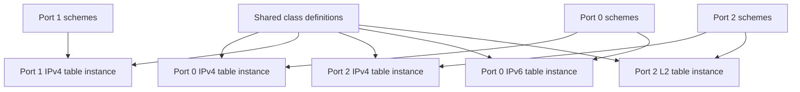
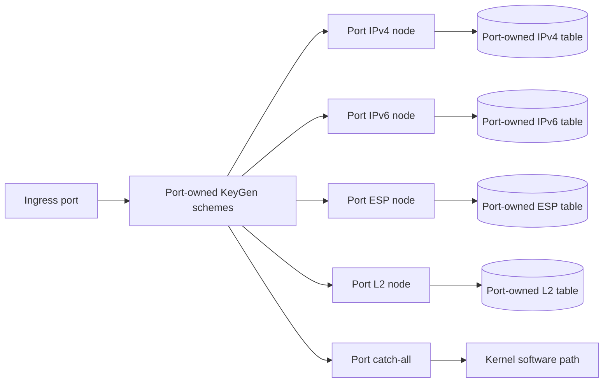

# ASK2 Per-Port Table Multi-Protocol Offload Design Proposal

**Status:** Draft, vendor-source corrected  
**Date:** 2026-08-21  
**Branch:** `dpaa1`  
**Target:** LS1046A DPAA1 / FMan v3 / microcode 210.10.1

## 1. Purpose

This proposal defines how ASK2 should scale hardware flow offload across the five product ports while preserving software forwarding and staying within FMan's 32 KeyGen schemes.

The design is based on a corrected reading of the vendor FMC/NCSW implementation:

> Share protocol-class definitions in software, but instantiate the external-hash table, dispatch node, schemes, records, and lifecycle per ingress port.

Vendor XML classifications marked `shared="true"` are reusable definitions. FMC's `replicateHtNodes()` creates a new `HTNode` for each port whose policy references that definition. The vendor does not pool all ports into one DDR hash table.

This proposal therefore replaces the earlier shared-cross-port-table design. It deliberately does not require a programmable PORT_ID byte in the comparison key.

## 2. Executive design

For each ASK-engaged ingress port, allocate only the protocol classes that port carries:

```text
port-owned routed IPv4 table instance
port-owned routed IPv6 table instance, when enabled
port-owned ESPv4/ESPv6 table instances, when enabled
port-owned Ethernet/L2 table instance, when enabled
one safe catch-all path when specific match vectors are active
```

Definitions remain shared:

- key layout;
- hash mask and bucket sizing policy;
- action-record format;
- CCOBASE class numbering;
- preflight and fallback rules.

Runtime instances are port-owned:

- DDR bucket array;
- table software object;
- RCCB node row;
- KeyGen scheme;
- flow records;
- teardown and ownership.

This removes cross-port key aliasing and cross-port flow ownership without depending on an unproven non-zero `kgse_dv0/dv1` PORT_ID extraction.

## 3. Goals

1. Hardware-offloaded routed IPv4 on all five product ports.
2. Hardware-offloaded routed IPv6 on any port after its multi-port parser/scheme path passes silicon acceptance.
3. Software forwarding for every flow that is not safely offloaded.
4. No cross-port table ownership or cleanup ambiguity.
5. No dependency on a programmable PORT_ID comparison-key byte.
6. A deterministic scheme budget below FMan's 32-entry limit.
7. Per-port, on-demand class arming.
8. Atomic reservation and fail-closed hardware programming.
9. Reversible engage/disengage with no stale schemes, tables, records, parser state, or MURAM leaks.
10. Incremental enablement beginning with five-port routed IPv4.

## 4. Non-goals

This proposal does not:

- claim that routed IPv6, ESP, or L2 offload is production-ready today;
- treat current multi-port IPv6 LCV/match-vector behavior as solved;
- require a real PORT_ID byte in the comparison key;
- reintroduce FMC, CMM, `dpa_app`, or ASK 1.x userspace;
- require every protocol class on every port;
- replace the kernel software flowtable;
- treat the vendor's 16 XML classifications as a direct scheme-budget template for ASK2;
- enable ASK experimentally on eth0 before a sacrificial 1G port passes.

## 5. Corrected vendor model

### 5.1 Shared definition, replicated hardware instance

The vendor FMC extension handles a `shared="true"` classification by creating a new `HTNode` for every additional port:

```cpp
HTNode& htNode = all_htnodes[FMBlock::assignIndex(all_htnodes)];
port.htnodes.push_back(htNode.getIndex());
port.cctrees.push_back(htNode.getIndex());
```

The implication is precise:

- one XML definition can be referenced from many policies;
- each port receives its own table/node instance;
- records are not pooled into one cross-port DDR bucket array;
- table ownership is naturally per port.

ASK2 should reproduce this ownership model, not the earlier interpretation that all ports share one table object.

### 5.2 Vendor PORT_ID is not the production justification for cross-port sharing

Vendor CMM writes `portid` into byte zero of `union dpa_key`, but the XML `<combine portid="true" ...>` path feeds the KeyGen extracted-OR/FQID stage. It is not, by itself, a comparison-key discriminator.

The vendor tree also contains an overlay that force-adds `KG_SCH_KN_PORT_ID` to EKFC because software expects a port byte. That overlay is a compensation mechanism, not evidence that stock FMan naturally provides a programmable cross-port comparison-key byte.

ASK2's controlled-zero key path is established:

- F-179 zeroes the per-scheme defaults;
- F-188 writes key byte zero as `0x00`;
- the zero-prefixed hardware hash is silicon-characterized.

A non-zero `kgse_dv0/dv1` discriminator remains an optional research experiment, not a prerequisite for this design.

## 6. Hardware constraints

### 6.1 KeyGen schemes

FMan exposes 32 scheme entries. Schemes are the scarce resource.

A scheme fixes or controls:

- key extraction;
- match vector;
- CCOBASE;
- scheme defaults;
- port scheme-partition binding;
- miss/base FQID behavior;
- next engine.

Routed IPv4 and IPv6 require different schemes on a dual-stack port because they use different fixed key sizes and CCOBASE values.

### 6.2 CCOBASE and per-port node windows

CCOBASE is seven bits, but ASK2 currently allocates a 256-byte node window per engaged port. At 16 bytes per node, the current software window supports 16 table classes per port.

The proposed initial design uses no more than five table classes per port.

### 6.3 External-hash table instances

Each table instance requires:

- a DDR bucket array;
- flow-record allocations in DDR;
- a software table object;
- a 16-byte node row in the owning port's RCCB window;
- a scheme bound to that port and class.

The bucket array is the dominant per-instance cost and resides in DDR. Node-row MURAM cost is small:

```text
5 ports * 5 classes * 16-byte node = 400 bytes
```

Table setup can have additional shared/internal-buffer implications. Every new class must still pass the live MURAM-budget and reversibility gates; the 400-byte node calculation is not a substitute for measurement.

### 6.4 Parser and live reconfiguration

The FMan parser has per-port configuration windows but shared execution resources. Vendor NCSW programs NetEnv/LCV state while a port is disabled, before enabling traffic.

ASK2 must bracket parser and scheme changes with:

```text
fman_port_disable(target)
program schemes / CCOBASE / LCV / node state
fman_port_enable(target)
```

The quiesce-arm implementation improved immediate engage behavior, but sustained two-port IPv6 traffic still caused RX degradation in testing. Multi-port IPv6 remains default-OFF until that blocker is resolved.

## 7. Table classes and key layouts

A table class corresponds to one fixed comparison-key layout.

### 7.1 Routed IPv4

Per-port key size: 14 bytes, preserving the current controlled-zero byte:

```text
[reserved/current PORT_ID byte:1 = 0]
[src IPv4:4]
[dst IPv4:4]
[L4 protocol:1]
[src port:2]
[dst port:2]
```

TCP and UDP share the class because the protocol byte is part of the key.

Each ASK-enabled port gets its own routed-IPv4 table instance. Identical tuples on different ports cannot alias because they reside in different arrays.

### 7.2 Routed IPv6

Per-port key size: 38 bytes:

```text
[reserved/current PORT_ID byte:1 = 0]
[src IPv6:16]
[dst IPv6:16]
[L4 protocol:1]
[src port:2]
[dst port:2]
```

TCP and UDP share the class.

A port gets an IPv6 table instance only when IPv6 hardware offload is enabled for that port and the multi-port family-selection path has passed silicon gates.

### 7.3 ESP

Vendor reference key sizes are:

- ESP over IPv4: 10 bytes;
- ESP over IPv6: 22 bytes.

The initial design keeps ESPv4 and ESPv6 separate because their fixed key sizes differ. Any unified padded ESP class requires a KeyGen extraction proof and is deferred.

ESP is armed only on ports that are IPsec endpoints.

### 7.4 Ethernet/L2

Vendor Ethernet reference key size is 15 bytes. ASK2's production L2 key must include enough context to distinguish bridge/VLAN forwarding domains and destination MAC state.

A bridge-member port gets its own L2 table instance. FDB learning, aging, VLAN changes, and topology changes remain software-authoritative.

### 7.5 NAT

NAT normally does not require another table class. It is an action attached to a routed-flow record:

- source/destination address rewrite;
- source/destination port rewrite;
- IPv4 and L4 checksum updates;
- TTL or hop-limit update;
- L2 rewrite;
- enqueue to the resolved egress FQ.

Separate direction records implement forward and reverse translations.

### 7.6 Deferred classes

These remain in software until explicitly designed and silicon-proven:

- PPPoE;
- multicast replication;
- fragments and reassembly;
- tunnels;
- unsupported IPv6 extension-header combinations;
- flows without stable neighbour state.

## 8. Per-port object model

Each port owns a collection of class instances:



A per-port table registry should be keyed by:

```text
(hw_port_id, table_class)
```

Suggested classes:

```c
enum ask_table_class {
    ASK_TABLE_IPV4,
    ASK_TABLE_IPV6,
    ASK_TABLE_ESPV4,
    ASK_TABLE_ESPV6,
    ASK_TABLE_L2,
};
```

The current global `table_idx` lookup must become a port/class lookup. Add and delete operations must use the same composite selector.

## 9. Scheme architecture

### 9.1 Per-port schemes remain necessary

Per-port table instances do not reduce scheme usage. The scheme is still required to select the owning port's node/class and to provide:

- CCOBASE;
- extraction layout;
- match vector;
- port scheme-partition binding;
- own-port miss FQID.

Per-port tables improve correctness and ownership, not scheme count.

### 9.2 Routed IPv4 baseline

A v4-only port can repurpose its existing RSS scheme as the routed-IPv4 AC_CC scheme and keep `kgse_mv=0`.

This is the first target for five-port enablement because it avoids the live LCV split and uses the proven IPv4 production path.

### 9.3 Dual-stack ports

A dual-stack port currently requires:

- IPv4 scheme;
- IPv6 scheme;
- catch-all scheme when non-zero family match vectors are active.

The present F-205/F-212 live LCV-split approach has repeatedly caused multi-port failures. It is not production-ready. The eventual implementation must reproduce vendor-style static NetEnv/distinction-unit programming on a disabled port or replace the family-selection mechanism with another silicon-proven method.

### 9.4 Catch-all

When the original v4 match-all scheme is narrowed, a catch-all prevents ARP, neighbour discovery, multicast, and other L2 traffic from producing `FM_FD_ERR_NO_SCHEME`.

A pure v4-only `kgse_mv=0` port does not require an additional catch-all.

### 9.5 Atomic reservation

Before hardware mutation, reserve every scheme and table instance required by the requested port classes. If resources are unavailable:

- leave existing classes intact;
- do not partially narrow match vectors;
- leave the new class in software;
- report the admission failure over genl/YNL and `ask-check`.

## 10. Scheme budget

### 10.1 Hard maximum

FMan has 32 scheme entries total, including baseline RSS schemes that ASK2 may repurpose.

### 10.2 Maximum initial class set

If every port carried every initial class:

```text
5 ports * (
    IPv4
  + IPv6
  + ESPv4
  + ESPv6
  + L2
  + catch-all
) = 30 total schemes in use
```

The 30 includes the five baseline schemes repurposed as IPv4 schemes. It is not 30 net-new allocations.

This configuration fits but leaves only two entries and is not the recommended deployment.

### 10.3 On-demand example

| Port role | Classes | Schemes |
|---|---|---:|
| WAN/uplink | IPv4, IPv6, ESPv4, ESPv6, catch-all | 5 |
| LAN 1 | IPv4, IPv6, catch-all | 3 |
| LAN 2 | IPv4, IPv6, catch-all | 3 |
| LAN 3 | IPv4, IPv6, catch-all | 3 |
| Bridge/member | IPv4, L2, catch-all | 3 |
| **Total** |  | **17** |

A pure v4-only port can use one match-all scheme and may consume less than the conservative table above.

### 10.4 Admission policy

ASK2 should report:

```text
requested classes
reusable baseline schemes
free scheme slots
reserved schemes
remaining schemes
```

No automatic scheme eviction is proposed initially.

## 11. Data path

### 11.1 Classification and lookup



### 11.2 Flow insertion

For each offloadable direction:

1. Resolve ingress hardware port.
2. Resolve the requested table class.
3. Look up the table instance by `(hw_port_id, class)`.
4. Resolve egress interface, neighbour, TX FQ, source MAC, and MTU.
5. Build the class key.
6. Run preflight.
7. Insert into the owning port's table.
8. Publish the hardware handle only after success.

No cross-port key discriminator is required.

### 11.3 Flow deletion and teardown

Flow ownership includes:

```text
hw_port_id
table_class
hardware flow id
```

Deletion uses the same `(hw_port_id, class)` selector as insertion.

Disengaging one port:

- stops new insertion for that port;
- removes only that port's records;
- unbinds only that port's schemes;
- destroys only that port's table instances;
- leaves other ports' tables and flows untouched.

Clear-all on one table must never flush another port's instance.

## 12. Software fallback

Software forwarding remains authoritative for:

- classes not armed on the ingress port;
- unresolved neighbours;
- resource admission failure;
- fragments, unsupported extensions, tunnels, PPPoE, or multicast;
- unsupported NAT/IPsec/bridge actions;
- insertion or validation failure;
- recovery and reconfiguration windows.

A hardware failure must degrade to software, not misforward.

## 13. Five-port rollout

### Phase 0 — Preserve the current IPv4 baseline

- Keep v6 hardware default-OFF.
- Preserve the working eth3/eth4 v4 path.
- Keep build-signing and ISO-vmlinuz consistency guards.
- Do not enable ASK on eth0 yet.

### Phase 1 — Introduce the per-port table registry

- Replace the global class-only table lookup with `(hw_port_id, class)`.
- Allocate a routed-IPv4 table instance per engaged port.
- Point each port's CCOBASE 0 node at its own IPv4 table.
- Thread the composite selector through add, delete, clear, stats, and teardown.
- Preserve the current 14-byte controlled-zero key.

Acceptance:

- eth3 and eth4 use distinct table objects and bucket arrays;
- the same five-tuple can be inserted independently on both ports;
- deleting or disengaging one port does not affect the other;
- v4 production HIT and throughput remain unchanged.

### Phase 2 — Enable a sacrificial 1G port

- Extend CLI mapping for eth1 or eth2 first.
- Resolve own-port miss FQID and per-egress TX FQ.
- Validate flow HIT, miss fallback, MTU, deletion, and reversibility.
- Keep eth0 as the management lifeline.

### Phase 3 — Expand routed IPv4 to all five ports

- Enable remaining 1G ports after the sacrificial port passes.
- Remove or generalize the module-global eth4 `dedicated_fq` fallback.
- Add per-port ask-check coverage and table stats.
- Validate concurrent five-port traffic and independent teardown.

### Phase 4 — Redesign routed IPv6 selection

Do not carry forward the current live F-205/F-212 split as production architecture.

Before IPv6 rollout:

- define a vendor-aligned static NetEnv/distinction-unit setup performed while the port is disabled;
- prove stable family selection on two simultaneously-active ports under sustained traffic;
- retain per-port IPv6 table instances and schemes;
- add `UPDATE_HOPLIMIT`;
- validate insertion, HIT, deletion, neighbour changes, and software fallback.

### Phase 5 — Add ESP and L2 one class at a time

For each class:

1. define the fixed key;
2. allocate one table instance on one sacrificial port;
3. prove one hardware HIT;
4. validate teardown and software fallback;
5. add on-demand arming;
6. then expand to more ports.

Do not budget or arm classes globally before their first HIT.

## 14. Five-port operational work

### 14.1 CLI allow-list

The current VyOS patch restricts ASK to eth3/eth4. Later phases add:

| Interface | RX hardware port |
|---|---:|
| eth2 | `0x09` |
| eth0 | `0x0c` |
| eth1 | `0x0d` |
| eth3 | `0x10` |
| eth4 | `0x11` |

### 14.2 TX FQ handling

Per-flow egress FQ resolution is netdev-based, but the legacy module-global `dedicated_fq` is hardwired to QMan channel `0x801` (eth4/MAC10). It must be retired or made per-egress-port before five-port readiness.

### 14.3 Eth0 safety

Eth0 remains untouched until:

- eth1 or eth2 passes the full 1G acceptance suite;
- remote and serial recovery are verified;
- no shared resource operation can take down the management lifeline.

## 15. Acceptance criteria

### 15.1 Routed IPv4 per-port ownership

- Every engaged port owns a distinct IPv4 table instance.
- Concurrent identical tuples on two ports coexist.
- Per-port HIT counters increment independently.
- One-port deletion/disengage does not alter another port.
- Miss traffic returns to the correct ingress netdev.

### 15.2 Five-port IPv4

- ASK engages on all five ports.
- One 1G port passes before eth0 is enabled.
- Per-egress TX FQs are correct.
- Sustained concurrent traffic does not wedge BMI, KG, FE-VM, or QMan.
- Software fallback remains functional.

### 15.3 IPv6

- Family selection no longer depends on a live parser rewrite.
- Two or more dual-stack ports sustain traffic concurrently.
- IPv4 and IPv6 records use separate port-owned table instances.
- IPv6 hop limit decrements correctly.
- No `NO_SCHEME`, zero-address FD, deaf-port, or unexplained drift occurs.

### 15.4 Scheme budget

- Engage reports required, reserved, and remaining schemes.
- No accepted configuration exceeds 30 ASK-owned/repurposed entries.
- Admission failure leaves the requested class in software.

### 15.5 Reversibility

After disengage:

- port-owned records are gone;
- port-owned tables are freed;
- temporary schemes are disabled/unbound;
- the baseline IPv4 scheme returns to its previous state;
- parser, CP, RCCB, and MURAM state return to baseline;
- sibling ports remain active and unchanged.

## 16. Risks and mitigations

### 16.1 DDR use

**Risk:** Per-port replication multiplies bucket-array DDR consumption.

**Mitigation:** Size masks by expected class/port flow count instead of copying vendor maximums. Report DDR table usage and cap allocations per port.

### 16.2 Scheme exhaustion

**Risk:** Every class on every port approaches 32 schemes.

**Mitigation:** Arm on demand, reserve atomically, keep unimplemented classes in software, and reject configurations that exceed budget.

### 16.3 IPv6 family selection

**Risk:** The current live LCV split has caused real multi-port failures.

**Mitigation:** Treat it as experimental and default-OFF. Replace it with static disabled-port setup before production IPv6 enablement.

### 16.4 Table teardown

**Risk:** Incorrect ownership could free a sibling port's table or records.

**Mitigation:** Key every table operation by `(hw_port_id, class)` and maintain explicit per-port ownership lists.

### 16.5 Build skew

**Risk:** Stale kernels/modules invalidate silicon results.

**Mitigation:** Keep per-build kernel package versions, signing-key identity checks, stale-deb purge, and ISO-vmlinuz equality assertions.

## 17. Rejected alternatives

### 17.1 Cross-port shared DDR table with PORT_ID byte

Rejected as the production baseline because:

- it is not the vendor's actual per-port HTNode model;
- the non-zero `kgse_dv0/dv1` discriminator is unproven;
- shared cleanup/ownership becomes more complex;
- per-port tables remove aliasing without a new silicon dependency.

Retain only as an optional future optimization if non-zero PORT_ID extraction is independently proven.

### 17.2 One scheme for IPv4 and IPv6

Rejected because one scheme has one CCOBASE, while IPv4 and IPv6 have different fixed key sizes and nodes. A unified fixed-width key requires unproven all-generic extraction.

### 17.3 Classification-plan-only family selection

Rejected because CPID is not assigned per family. CP masks can suppress LCV bits but cannot create the family distinction.

### 17.4 Continue the live F-205/F-212 LCV split unchanged

Rejected for production because it has caused repeated multi-port silicon failures. It remains default-OFF experimental code until replaced or deleted.

### 17.5 Enable every feature on every port immediately

Rejected because it leaves no scheme headroom and combines too many unproven datapaths. Classes must be added one at a time after a confirmed HIT.

## 18. Recommended production path

1. Build a per-port table registry from shared class definitions.
2. Move routed IPv4 from the current FMan-global table to per-port table instances without changing the 14-byte key.
3. Prove independent IPv4 HIT and teardown on eth3/eth4.
4. Enable one sacrificial 1G port, then all five IPv4 ports.
5. Redesign IPv6 family selection around static disabled-port configuration; retain per-port IPv6 tables.
6. Add ESP and L2 only after one-port silicon proof for each class.
7. Keep software fallback for every unsupported or resource-rejected flow.

This path matches the vendor's real table ownership model, avoids an unproven PORT_ID comparison-key dependency, preserves the working IPv4 substrate, and isolates each new protocol class behind an explicit silicon acceptance gate.

## 19. Authoritative references

- `plans/ASK2-MASTER-PLAN.md`
- `specs/fman-keygen-flow-key-spec.md`
- `arch/fman-microcode-210-programming-reference.md`
- `arch/fman-fe-ehash.md`
- `arch/fman-vendor-source-extraction-2026-08-07.md`
- `arch/muram.md`
- `specs/reference/nxp-ask-fmc/cdx_pcd.xml`
- `/mnt/build/ASK/patches/fmc/01-mono-ask-extensions.patch` (`replicateHtNodes`)
- `/mnt/build/ASK/cdx/cdx_ehash.c`
- `/mnt/build/ASK/cdx/cdx_common.h`
- `/mnt/build/opnsense-src/sys/contrib/ncsw/Peripherals/FM/Pcd/fm_pcd.c`
- `/mnt/build/opnsense-src/sys/contrib/ncsw/Peripherals/FM/Pcd/fm_port.c`
- `/mnt/build/opnsense-src/sys/contrib/ncsw/Peripherals/FM/Pcd/fm_kg.c`
- `kernel/ask/oot-modules/ask/ask_flow_offload.c`
- `bin/kernel-fixups/F_140.py`
- `bin/kernel-fixups/F_204.py`
- `bin/kernel-fixups/F_205.py`
- `bin/kernel-fixups/F_209.py`
- `bin/kernel-fixups/F_210.py`
- `bin/kernel-fixups/F_211.py`
- `bin/kernel-fixups/F_212.py`
- `bin/kernel-fixups/F_214.py`
- `bin/kernel-fixups/F_218.py`
- `bin/kernel-fixups/F_219.py`
