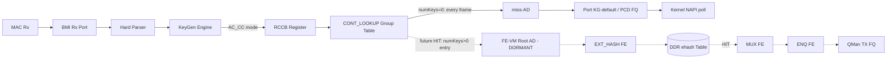

# FMan KeyGen Flow-Key Architecture for ASK2 (LS1046A / DPAA1)

**Status:** v4.0 — Settled Dispatch Topology. 2026-07-16.
**Branch:** dpaa1
**Changes since v3.1:** Dispatch topology SETTLED (supersedes v2.0 §5 "RCCB→FE_ENTER direct" ruling): AC_CC + CONT_LOOKUP group-table pass-through for MISS→kernel delivery (silicon-proven 7.37 Gbps, build 28809182051), FE-VM chain retained dormant for future HIT phase. FmPortSetFESupport workspace-pool requirement documented (Gate A proven 2026-07-15). Three FE-VM ENQ delivery variants recorded as failed and closed.
**Scope:** FMan KeyGen EKFC extraction, FE-VM dispatch, ehash flow-table architecture, and the software/silicon contract that ASK2 must satisfy.
**References:**
- `drivers/net/ethernet/freescale/fman/fman_keygen.c` (mainline, NXP 2017) — EKFC register definitions, KGSE indirect-write protocol
- `drivers/net/ethernet/freescale/fman/fman.c` — FMan top-level, CCSR map, IRQ dispatch
- NXP DPAA Reference Manual (LS1046ADPAARM, Rev 0, 03/2017) §8.9.3.12.2 — KGSE_EKFC register, AWR2_RFMODE_FMKG_SE_EKFC
- NXP QorIQ LS1046A Data Sheet (Rev 4, 06/2020) — DPAA block diagram, FMan v3 capabilities
- NXP LSDK 5.4 `999-layerscape-ask-kernel` patch — production-proven FE-VM ehash reference (CRC64, bucket/index, record layout)
- `http://www.nxp.com/assets/documents/data/en/white-papers/QORIQDPAAWP.pdf` — DPAA architectural overview

---

## 1. FMan Data-Path Architecture



The FMan v3 (LS1046A, microcode 210.10.1) implements a Parse → Classify → Distribute pipeline:

1. **BMI Rx Port** — receives frames from MACs, assigns Storage Profiles
2. **Hard Parser** — recognises L2/L3/L4 headers at wire speed, populates a 32-byte Parse Result in the frame's internal context. Fields identified: Ethernet MACs, VLAN tags, EtherType, MPLS labels, IPv4/IPv6 addresses, L4 ports, IPsec SPI, TCP flags
3. **KeyGen Engine** — extracts fields from the Parse Result, assembles a key buffer, optionally hashes it for FQID distribution
4. **Coarse Classifier (CC)** — dispatches to the target specified by `FMBM_RCCB` (the per-port RX CC Base register). In AC_CC mode this is a MURAM address
5. **FE-VM (Frame Engine opcode VM)** — executes Action Descriptors: EXT_HASH lookup, MUX, ENQ, HM (header manipulation), EXIT
6. **QMan** — enqueues classified frames onto TX Frame Queues for egress

## 2. KeyGen Extraction Mechanisms

The KeyGen Scheme Entry (`struct fman_kg_scheme_regs`, offsets 0x100–0x158) exposes two independent extraction engines. They use different registers and produce different key-buffer layouts. A scheme may use either or both.

### 2.1 EKFC — Extract Known Fields Command

- **Register:** `kgse_ekfc`, offset 0x104
- **Mechanism:** A 32-bit bitmask. Each set bit selects a field the hard parser has already decoded. The silicon reads the field's value from the Parse Result by offset, not by re-parsing. Extraction is a scatter-gather against a pre-populated table.
- **Key property:** The assembly order — the sequence in which fields land in the key buffer — is **fixed in silicon**. Software selects *which* fields are extracted; it cannot control *where* they appear relative to each other. This is the fundamental constraint of EKFC.
- **Used by:** mainline DPAA1 RSS hashing (`DEFAULT_HASH_KEY_EXTRACT_FIELDS`), ASK2 flow offload

### 2.2 GEC — Generic Extract Commands

- **Registers:** `kgse_gec[0..7]`, offsets 0x120–0x13C
- **Mechanism:** Eight programmable slots, each specifying an arbitrary `(offset, length)` byte range within the frame or the Parse Result. Fields are assembled in GEC index order (0 first).
- **Key property:** The assembly order is **declared by software**, in GEC index order. This gives complete control over key layout at the cost of one byte-range copy through the internal-context pipeline per GEC entry.
- **Used by:** NXP SDK FMC-configured schemes (XML-driven, via `cdx_pcd.xml` → `dpa_app` → FMan PCD)

### 2.3 Decision: EKFC Only

ASK2 uses EKFC exclusively. `kgse_gec[]` stays zero. Rationale:

1. Every field ASK2 needs for an IPv4 5-tuple (IPSRC1, IPDST1, PTYPE1, L4PSRC, L4PDST) is a hard-parser known field with a defined EKFC bit.
2. GEC adds per-frame pipeline latency (five byte-range copies on every frame at ~32 Mpps aggregate) that is permanent and cumulative.
3. The EKFC order problem (§3) is a one-time engineering cost paid at development time. Paying GEC latency to avoid it would be a permanent per-frame cost in production.
4. A combined mode (EKFC prefix + GEC suffix) makes key length a function of both mechanisms, with the EKFC prefix length varying by L3 protocol (4 bytes for IPv4, 16 for IPv6). The NXP SDK does not use combined mode for its primary classification path either.

**Consequence:** ASK2's EKFC key order will differ from the NXP SDK's FMC/GEC key order. This is expected and correct. Both produce the same five fields (same information content) in different byte orders. The software serialiser must match the silicon's EKFC order, not the SDK's FMC order.

## 3. EKFC Key Buffer Assembly

### 3.1 The Assembly Rule

The FMan v3 KeyGen assembles the key buffer by iterating over EKFC bits and appending each selected field's bytes to the buffer. Each field's byte order within its contribution is big-endian (network byte order) — the same convention as the Parse Result itself.

The iteration direction — whether the silicon walks bits from 31 down to 0 (descending) or from 0 up to 31 (ascending) — determines which field lands at buffer offset 0. **This direction is not documented in any public NXP reference.** The DPAA RM §8.9.3.12.2 defines the register and its bits but does not specify the assembly order. The Linux `fman_keygen.c` defines the bit constants but does not document the order. The LSDK SDK's `dpa_app`/FMC uses GEC (software-declared order) for its primary classification path, so it does not exercise this silicon behaviour.

Three candidate orders exist, all consistent with the documented register interface:

| Model | Iteration | Byte 0 holds | 13-byte layout (EKFC=0x001C0006) |
|---|---|---|---|
| Descending | Bit 31 → 0 | Highest-set-bit field | SIP, DIP, PROTO, SPORT, DPORT |
| Ascending | Bit 0 → 31 | Lowest-set-bit field | DPORT, SPORT, PROTO, DIP, SIP |
| Size-grouped | 4B fields first (descending within), then 2B, then 1B | Largest-field, highest-bit | SIP, DIP, SPORT, DPORT, PROTO |

### 3.2 Engineering Response

The order is encoded as a data table, not as control flow. The serialiser, the key-length derivation, the EKFC cross-check, and the runtime self-test all derive from one source of truth. Resolving the order — once empirical observation confirms it — is a table reorder, not a code rewrite.

```c
/* Single source of truth: EKFC field order table.
 * ORDER IS DATA. Reorder this table to change the key layout.
 * The serialiser, key_len, EKFC cross-check, and selftest all
 * derive from this table. No other code hardcodes field positions.
 */
static const struct fman_kg_field fman_kg_order_v4[] = {
    /* { EKFC_bit, width_bytes, name } — MSB-first descending (CONFIRMED 2026-07-13) */
    { .bit = 20, .width = 4, .name = "ipsrc1"  },  /* IP source      */
    { .bit = 19, .width = 4, .name = "ipdst1"  },  /* IP destination */
    { .bit = 18, .width = 1, .name = "ptype1"  },  /* IP protocol    */
    { .bit =  2, .width = 2, .name = "l4psrc"  },  /* L4 source port */
    { .bit =  1, .width = 2, .name = "l4pdst"  },  /* L4 dest port   */
};
```

Fields walk in the order the silicon iterates EKFC bits. The table's element order IS the key-buffer byte order. A field at index 0 lands at byte offset 0 in the extracted key. The widths are IPv4 sizes; IPv6 would use `.width = 16` on the address rows and require a separate scheme (§8).

```c
#define FMAN_KG_EKFC_V4_5TUPLE  0x001C0006u
/* = KG_SCH_KN_IPSRC1 | KG_SCH_KN_IPDST1 | KG_SCH_KN_PTYPE1
 * | KG_SCH_KN_L4PSRC | KG_SCH_KN_L4PDST */

/* Compile-time: table covers exactly the EKFC bits */
static_assert(FMAN_KG_EKFC_V4_5TUPLE ==
    (KG_SCH_KN_IPSRC1 | KG_SCH_KN_IPDST1 | KG_SCH_KN_PTYPE1 |
     KG_SCH_KN_L4PSRC | KG_SCH_KN_L4PDST));
```

At init, key length is derived by walking the table:

```c
static int fman_pcd_key_init(struct fman_pcd *pcd)
{
    u32 covered = 0;
    size_t len = 0;
    for (int i = 0; i < ARRAY_SIZE(fman_kg_order_v4); i++) {
        covered |= BIT(fman_kg_order_v4[i].bit);
        len += fman_kg_order_v4[i].width;
    }
    if (covered != FMAN_KG_EKFC_V4_5TUPLE) {
        /* The table's covered bits don't match the EKFC constant.
         * A field was added/removed from the table without updating EKFC.
         */
        return -EINVAL;
    }
    pcd->key_len_v4 = len;  /* 13 for EKFC=0x001C0006 */
    return 0;
}
```

### 3.3 Serialiser

The serialiser walks the same table. If the order changes, the serialiser does not.

```c
int fman_pcd_key_serialize_v4(const struct fman_pcd *pcd,
                               const struct ask_hw_flow_key_v4 *k,
                               u8 *buf, size_t buf_len)
{
    size_t off = 0;
    if (buf_len < pcd->key_len_v4)
        return -ENOBUFS;

    for (int i = 0; i < ARRAY_SIZE(fman_kg_order_v4); i++) {
        switch (fman_kg_order_v4[i].bit) {
        case  1: put_unaligned(k->dst_port, (__be16 *)(buf + off)); break;
        case  2: put_unaligned(k->src_port, (__be16 *)(buf + off)); break;
        case 18: buf[off] = k->proto;                               break;
        case 19: put_unaligned(k->dst_ip,   (__be32 *)(buf + off)); break;
        case 20: put_unaligned(k->src_ip,   (__be32 *)(buf + off)); break;
        default: return -EINVAL; /* table and switch diverged */
        }
        off += fman_kg_order_v4[i].width;
    }
    return off;
}
```

`put_unaligned()` is mandatory when L4 ports land at unaligned offsets (offset 9 and 11 under MSB-first order: SIP@0 + DIP@4 + PROTO@8 + SPORT@9 + DPORT@11). The `default: return -EINVAL` catches the case where a field was added to the table but the switch was not updated.

### 3.4 Extraction Order — CONFIRMED (2026-07-13)

The extraction order was resolved by CRC-64 hash-match on hardware: two independent TCP flows on eth4 produced hash values that matched `crc64_raw(SIP|DIP|6|SPORT|DPORT)` under MSB-first order and no other order. The ascending-bit-position model and size-grouped model are both **DISPROVEN**.

**Confirmed byte layout for EKFC=0x001C0006 (13 bytes):**
```
Byte:  0  1  2  3  4  5  6  7  8   9 10 11 12
Field: SIP────────  DIP────────  PROTO  SPORT  DPORT
```

The software-side serializers in `ask_flow_offload.c` (ehash path) and `fman_pcd_key_serialize_v4()` already use this order.

### 3.5 Runtime Self-Check (NOT YET IMPLEMENTED)

```
# echo "10.99.1.106 10.99.2.200 6 55001 5201" > /sys/kernel/debug/fman_pcd/0/key_selftest
# cat /sys/kernel/debug/fman_pcd/0/key_selftest
predicted (table order):  1451 D6D9 06 0A6302C8 0A63016A
observed:                 1451 D6D9 06 0A6302C8 0A63016A
verdict: PASS.
```

A debugfs-triggered self-test verifies that the run-time key layout matches the build-time expectation by inserting a known 5-tuple key into the ehash table, sending a matching frame, and confirming a HIT. The test validates the end-to-end pipeline: CRC-64, bucket index, key bytes in DDR record, and FE-VM comparison. Implementation status: **specified but not yet committed** — no kernel patch creates `key_selftest`, `key_verified`, or `force_unverified` debugfs nodes.

### 3.6 Engagement Gate (NOT YET IMPLEMENTED)

`fe_arm_engage()` refuses to engage the FE path unless the self-test has passed at least once since boot:

```c
if (!pcd->key_verified)
    return -EPROTO;
```

A developer can override with `fman_pcd.force_unverified=1` for experiments. A production build cannot. This prevents any build from running the FE path with an unverified key layout.

`/sys/kernel/debug/fman_pcd/<fm>/key_verified` reads `"0"` or `"1"`.

## 4. EKFC Register Reference

Source: `fman_keygen.c` (NXP, 2017). All definitions are mainline kernel constants.

### 4.1 Complete Bit Map

```
Bit  Mask        Constant              Width        Field
---  ----------  --------------------  -----------  ------------------------------------
31   0x80000000  KG_SCH_KN_PORT_ID        1B         Ingress port ID
30   0x40000000  KG_SCH_KN_MACDST         6B         Ethernet destination MAC
29   0x20000000  KG_SCH_KN_MACSRC         6B         Ethernet source MAC
28   0x10000000  KG_SCH_KN_TCI1           2B         VLAN TCI, outermost
27   0x08000000  KG_SCH_KN_TCI2           2B         VLAN TCI, QinQ inner
26   0x04000000  KG_SCH_KN_ETYPE          2B         EtherType
25   0x02000000  KG_SCH_KN_PPPSID         2B         PPPoE session ID
24   0x01000000  KG_SCH_KN_PPPID          2B         PPP protocol ID
23   0x00800000  KG_SCH_KN_MPLS1          4B         MPLS label entry 1
22   0x00400000  KG_SCH_KN_MPLS2          4B         MPLS label entry 2
21   0x00200000  KG_SCH_KN_MPLS_LAST      4B         MPLS label entry, last
20   0x00100000  KG_SCH_KN_IPSRC1       4 or 16B     IP source address, outer header
19   0x00080000  KG_SCH_KN_IPDST1       4 or 16B     IP destination address, outer header
18   0x00040000  KG_SCH_KN_PTYPE1         1B         IP protocol / next-header, outer
17   0x00020000  KG_SCH_KN_IPTOS_TC1      1B         DSCP + ECN, outer
16   0x00010000  KG_SCH_KN_IPV6FL1        3B         IPv6 flow label, outer (20-bit, right-justified)
15   0x00008000  KG_SCH_KN_IPSRC2       4 or 16B     IP source address, inner tunnel
14   0x00004000  KG_SCH_KN_IPDST2       4 or 16B     IP destination address, inner tunnel
13   0x00002000  KG_SCH_KN_PTYPE2         1B         IP protocol, inner tunnel
12   0x00001000  KG_SCH_KN_IPTOS_TC2      1B         DSCP + ECN, inner tunnel
11   0x00000800  KG_SCH_KN_IPV6FL2        3B         IPv6 flow label, inner tunnel
10   0x00000400  KG_SCH_KN_GREPTYPE       2B         GRE protocol type
 9   0x00000200  KG_SCH_KN_IPSEC_SPI      4B         IPsec SPI (ESP/AH)
 8   0x00000100  KG_SCH_KN_IPSEC_NH       1B         IPsec next header (AH)
 7   0x00000080  KG_SCH_KN_IPPID          2B         IP fragment identification
6–3              (reserved — no constants defined; setting is undefined behaviour)
 2   0x00000004  KG_SCH_KN_L4PSRC         2B         L4 source port (TCP/UDP/SCTP)
 1   0x00000002  KG_SCH_KN_L4PDST         2B         L4 destination port (TCP/UDP/SCTP)
 0   0x00000001  KG_SCH_KN_TFLG           1B         TCP flags
```

### 4.2 Field Width Notes

- **IPSRC1, IPDST1:** width is parser-determined. 4 bytes for IPv4 frames, 16 bytes for IPv6 frames. A single KG scheme handling both address families produces variable-length keys. Separate schemes per address family (§8) are the correct approach.
- **IPV6FL1:** 20-bit flow label occupies the low 20 bits of a 3-byte field. The high 4 bits are reserved/zero.
- **All multi-byte fields:** big-endian byte order within the field contribution.

### 4.3 Field Selection Rationale

**Target EKFC for ASK2 IPv4 5-tuple:**

```
EKFC = 0x001C0006
     = KG_SCH_KN_IPSRC1  | KG_SCH_KN_IPDST1  | KG_SCH_KN_PTYPE1
     | KG_SCH_KN_L4PSRC  | KG_SCH_KN_L4PDST
```

Five fields, 13 bytes for IPv4. The protocol byte (`PTYPE1`, bit 18) disambiguates TCP and UDP flows that share the same IP:port 4-tuple. Without it, a TCP flow and a UDP flow with the same addresses and ports produce byte-identical keys and alias to one ehash entry — a silent misforwarding hazard on any router that forwards both protocols.

The mainline RSS default (`DEFAULT_HASH_KEY_EXTRACT_FIELDS = 0x00180206`) includes `IPSEC_SPI` (bit 9) but omits `PTYPE1` (bit 18). This is correct for RSS — where hash collisions among 128 FQs are harmless — but incorrect for exact-match flow classification, where a collision means a wrong forwarding decision.

### 4.4 Fields Explicitly Excluded

- **IPSEC_SPI (bit 9):** On non-IPsec frames the parser has no SPI offset in the Parse Result. The extraction reads whatever byte range the SPI slot happens to point at — for TCP, header bytes that vary per connection. The resulting key is unpredictable. ASK2 v1.0 does not offload IPsec flows; bit 9 must remain clear.
- **IPSEC_NH (bit 8):** Same vulnerability. Must remain clear.
- **MACDST/MACSRC (bits 30/29):** ASK2 classifies at L3/L4, not L2. Including MACs adds 12 bytes to the key and ties flows to a specific Ethernet peer. Excluded.
- **VLAN TCI (bits 28/27):** Out of scope for v1.0. Can be added later if per-VLAN flow isolation is required.

### 4.5 EKDV Default Substitution

When EKFC requests a field the parser did not populate (e.g. L4 ports on a non-TCP/UDP frame), the silicon substitutes a default value:

| Field(s) | Default register | Selector bits in `kgse_ekdv` | Default value |
|---|---|---|---|
| IPSRC1, IPDST1 | `kgse_dv0` | bits [19:18] | `0x0A0A0A0A` |
| L4PSRC, L4PDST | `kgse_dv1` | bits [9:8] | `0x0B0B0B0B` |
| PTYPE1 | *(none)* | *(no slot)* | undocumented |

**PTYPE1 has no default-value slot.** On a non-IP frame that somehow reaches a PTYPE1-enabled scheme, the silicon writes an undocumented value (likely `0x00` for "no IP header decoded"). ASK2 gates the FE path on the parser's IPv4 indication, so non-IP frames do not reach the FE. The flow-insert path rejects `proto == 0` as an additional guard: no inserted flow carries `proto == 0`, so even if a non-IP frame slips through, its key cannot match any entry.

## 5. KG Scheme Register Programming

### 5.1 Scheme Entry Registers

```c
struct fman_kg_scheme_regs {
    u32 kgse_mode;    /* 0x100: enable + next-engine */
    u32 kgse_ekfc;    /* 0x104: extraction bitmask  */
    u32 kgse_ekdv;    /* 0x108: default-value select */
    u32 kgse_bmch;    /* 0x10C: bitmask high [31:0]  */
    u32 kgse_bmcl;    /* 0x110: bitmask low  [63:32] */
    u32 kgse_fqb;     /* 0x114: FQ base for hash dist */
    u32 kgse_hc;      /* 0x118: hash command */
    u32 kgse_ppc;     /* 0x11C: policer profile cmd  */
    u32 kgse_gec[8];  /* 0x120: generic extract cmds  */
    u32 kgse_spc;     /* 0x140: packet counter (RO)   */
    u32 kgse_dv0;     /* 0x144: default value 0        */
    u32 kgse_dv1;     /* 0x148: default value 1        */
    u32 kgse_ccbs;    /* 0x14C: CC base (MURAM offset) */
    u32 kgse_mv;      /* 0x150: match vector           */
    u32 kgse_om;      /* 0x154: operation mode         */
    u32 kgse_vsp;     /* 0x158: virtual storage profile*/
};
```

### 5.2 Indirect Write Protocol

KGSE registers are accessed through the KG Action Register (KGAR) indirect window:

```
1. Populate the in-memory struct fman_kg_scheme_regs
2. Build KGAR value:
   kgar = FM_KG_KGAR_GO | FM_KG_KGAR_WRITE | FM_KG_KGAR_SEL_SCHEME_ENTRY
        | port_id | (scheme_id << 16)
3. iowrite32be(kgar, &kg_regs->kgar)
4. Poll until FM_KG_KGAR_GO clears in ioread32be(&kg_regs->kgar)
5. Check FM_KG_KGAR_ERR — if set, the write failed
6. (Defensive) Read back the scheme entry and compare against the written values
```

Step 6 is not performed by the mainline driver but is essential for correctness: the FMan does not report MURAM or indirect-write failures through any mechanism other than `FM_KG_KGAR_ERR`, and KGAR_ERR does not catch all failure modes. A readback comparison catches silent corruption.

### 5.3 Scheme Mode

For ASK2 AC_CC (FE-VM dispatch):

```
kgse_mode = 0x80000006
          = KG_SCH_MODE_EN          (0x80000000: scheme enabled)
          | NIA_ENG_FM_CTL          (0x00000000: next-engine = FM Controller)
          | NIA_FM_CTL_AC_CC        (0x00000006: dispatch to CC, AC_CC mode)
```

`kgse_ccbs` is set to `0` — the CC engine dispatches to the Action Descriptor at the MURAM address stored in the per-port `FMBM_RCCB` register, not to a CC group table.

### 5.4 Hash Command

```
kgse_hc = hash_fqid_count - 1         /* bits [23:0]:  FQID distribution range */
        | (hashShift << 24)           /* bits [31:24]: hash-result right-shift  */
        | (symmetric ? 0x40000000 : 0) /* bit 30: sym hash (swap src/dst)      */
```

Reference: `fman_keygen.c` lines 569–583.

`kgse_hc` configures FQID distribution only. It does **not** select a hash algorithm. The KeyGen hash algorithm is fixed in silicon: CRC-64, ECMA-182, reflected polynomial `0xC96C5795D7870F42`, seed `~0ULL`, no final XOR.

For ASK2 (ehash lookup, not FQID distribution):
- `hash_fqid_count` is irrelevant (FQ distribution is not used); set to 1
- `hashShift = 0` (use full 64-bit hash result for bucket derivation)
- `symmetric = false` (direction-distinct flows — what conntrack wants)

The software CRC64 used in `fman_pcd_crc64()` and `fman_pcd_ehash_bucket_index()` matches this silicon hash. Verified against the LSDK 5.4 SDK's production `get_indexed_hash_bucket()`. The bucket index formula:

```c
u64 crc = fman_pcd_crc64(key, key_len);
u32 shift = (6 - hash_shift) * 8;     /* 48 for hashShift=0 */
u64 bucket = (crc >> shift) & mask;    /* mask=0x7fff → 32768 buckets */
```

## 6. FE-VM Dispatch Architecture

### 6.1 Topology (SETTLED 2026-07-16 — supersedes v2.0 §5)

The FM Controller in AC_CC mode dispatches to the Action Descriptor at `FMBM_RCCB` (per-port register, offset 0x34 in the BMI port register window). The settled topology fronts the FE-VM with a **CC CONT_LOOKUP group table** — matching the vendor architecture, where MISS disposition is resolved at the CC layer and the FE-VM is entered only for classified (HIT-candidate) traffic:

```
BMI RX → KeyGen (AC_CC: mode=0x80000006, ccbs=0)
       → FMBM_RCCB → CONT_LOOKUP group table
       → numKeys=0 (shipping): every frame → miss-AD → port KG-default/PCD FQ → kernel
       → numKeys>0 (future HIT): match entry → FE_ENTER → EXT_HASH → ehash → MUX → ENQ → TX FQ
```

**Why this supersedes the v2.0 "RCCB→FE_ENTER direct" ruling.** The v2.0 ruling was made before three facts were established on silicon:

1. **The FE-VM requires the per-port workspace pool** (`FmPortSetFESupport`, params page `+0x54`/`+0x58`) — never ported until F-072 (2026-07-15). Every pre-F-072 FE-VM frame carved its workspace at a garbage MURAM offset, corrupting MURAM cumulatively (BMI stall, port deafness, disengage crash). All pre-F-072 FE-VM delivery results are void. Gate A (2026-07-15): pool armed, 600-frame MISS flood survived, first clean disengage in program history.
2. **The FE-VM has no viable kernel-delivery terminal.** Three ENQ variants failed on silicon: F-070 NIA-mode (fqidEn=0, w1=0x00500002 — zero sustained delivery), F-073 vendor encoding (same), F-073B (fqidEn=1 with FQID written to the DDR miss context — wrong memory space; the ENQ reads the MURAM workspace, not the DDR context). EXIT-DEALLOCATE drops the frame (proven: 100% ping loss); EXIT-without-DEALLOCATE leaves the frame stranded in the BMI FIFO (no scheme-NIA fallback exists in AC_CC mode — watchdog reset).
3. **The vendor never asks the FE-VM to deliver MISS frames.** The production CDX/ASK topology (RSR 10.3.0.B1 `cdx_pcd.xml` + 999-patch) resolves MISS at the CC-lookup layer, falling through to the KG-computed distribution FQID. The FE-VM opcode machinery executes only on HIT.

The CONT_LOOKUP pass-through (numKeys=0 → miss-AD → kernel FQ) is silicon-proven: build 28809182051 (2026-07-06) — ping 3/3, **zero QMan errors**, clean disengage; M2 gate **7.37 Gbps / 0.16% CPU**. The group table costs 2–3 extra MURAM fetches per frame; that cost buys the only proven MISS→kernel mechanism on 210.10.1.

### 6.1.1 CONT_LOOKUP Group AD (RM 8.7.4.1)

The AD at RCCB, 16 bytes MURAM:

```
Offset  Value                                    Field
0x00    (numKeys<<24) | (matchTableAddr&0xFFFFFF)  word0
0x04    (adTableAddr&0xFFFFFF)                     word1
0x08    0x40000000 | ((keySize-1)<<24)             word2
0x0C    0x00000000                                 word3
```

With `numKeys=0` the match walk can never match; every frame takes the miss-AD (last slot of the AD table). The miss-AD is a hardware enqueue AD targeting the port's **KG-default/PCD FQ, sourced from the `fqids` sysfs at engage time — never hardcoded** (eth3: PCD base 0x200; eth4: Rx default 0x292, PCD 0x300–0x37F). Frames enqueued to an un-polled FQ are silently lost — this was the failure mode of two prior attempts (dedicated TX FQ 0x2b9 is a TX-channel FQ, wrong direction).

The pre-v3 `{flags, next_ptr}` group-entry format decodes as `RESULT_CF fqid=0` (reserved-invalid) and floods QMan with Invalid Enqueue State errors — do not resurrect it.

**Engage inverse (reversibility contract):** disarm must read the node offset from the group entry, free the group table and node/AD tables, and clear `pcd->fe_cc_grp_off`. The historical scaffold leaked +36 B per engage cycle; the pcd-snapshot gate (`MURAM used == 0` after disengage) is the acceptance test.

### 6.1.2 Workspace-Pool Precondition for the Future HIT Path

The moment any frame crosses into the FE-VM (a `numKeys>0` entry targeting FE_ENTER), the per-port FE internal buffer pool becomes **mandatory**:

- Pool: `total_tnums × 512 B` MURAM, 256-aligned, zeroed
- Management index ring: `(5 + tnums)` bytes — byte0 = cursor (0x04), bytes 1–3 = 24-bit pool offset, then index ring `0,1,…,tnums-1,0xFF`
- Params page publication: `+0x54` = index MURAM offset, `+0x58` = 0 (depletion counter)

Without it, the microcode does read-modify-write bookkeeping at MURAM offset 0 and carves frame workspaces at garbage offsets (F-072 root cause). Teardown order per the vendor `FmPortDeleteFESupport`: clear `+0x54` **while the params page still exists**, free pool and index, then detach PCD. Inverting this order (PCD detach first) writes to freed MURAM — the disengage-crash failure mode.

### 6.2 FE-VM Action Descriptors

FE_ENTER — the root AD that the FM Controller dispatches to:

```
Offset  Value          Field
0x00    0x40800000     word0: FE type flags + ALLOCATE (0x00800000)
0x04    0x00000000     word1: (reserved for FE_ENTER)
0x08    0x000000F6     word2: pcAndOffsets (0xF6 = OPC_FE_ENTER)
0x0C    <next_fe_off>  word3: MURAM offset of next FE (EXT_HASH)
```

ALLOCATE (bit 23, `0x00800000`) is essential: it tells the FE-VM to allocate a workspace for this frame. The workspace holds the extracted key and the KG hash result, which the EXT_HASH FE reads to perform the ehash lookup. Without ALLOCATE the lookup has no key to compare.

EXT_HASH (hash frontend):

```
Offset  Value          Field
0x00    0x06000000     word0: FM_PCD_FE_TYPE_EXT_HASH (type 6)
0x04    <hash_cfg>     word1: mask[31:16] | (ctxSize-1)[15:8] | hashShift[7:0]
0x08    <ddr_hi>       word2: DDR bus address, high 32 bits
0x0C    <ddr_lo>       word3: DDR bus address, low 32 bits
0x10    <miss_fe>      word4: MURAM offset of FE on MISS
0x14    <hit_fe>       word5: MURAM offset of FE on HIT (MUX)
0x18    0x00000000     word6: (reserved)
```

Total: 28 bytes (7 × u32).

ENQ (enqueue):

```
Offset  Value          Field
0x00    0x02000000     word0: FM_PCD_FE_TYPE_ENQ (type 2) + flags
0x04    <tx_fqid>      word1: target TX FQID (24-bit)
```

16 bytes.

MUX (multiplexer, routes HIT frames to ENQ):

```
8 bytes: type 0x04000000, next-FE offset → ENQ
```

EXIT (deallocates workspace AND frame — terminal drop, NOT kernel delivery):

```
4 bytes: type 0x03800000 (EXIT | DEALLOCATE)
```

EXIT-DEALLOCATE frees the BMI FIFO allocation and terminates the frame — proven on silicon as 100% packet loss for frames taking this path. It is a safe terminal disposition (the port does not stall) but it is a **drop**, not a return-to-kernel. In AC_CC mode there is no scheme-NIA fallback after the FE-VM; kernel delivery is the CC-layer miss-AD's job (§6.1.1).

### 6.3 Ehash Record Format

Per-flow records are stored in DDR (allocated via `dma_alloc_coherent`). Layout:

```
Offset  Size   Field
0x00    2B     flags (bit 15 = valid)
0x02    6B     chain_ptr (next record in bucket chain, 48-bit DDR address)
0x08    N B    key (key_size bytes)
0x08+N  4B     next_fe_ptr (MURAM offset of next FE on HIT — typically ENQ)
```

Total record stride must be aligned to avoid DDR burst-boundary crossings. For a 13-byte key: record size = 2 + 6 + 13 + 4 = 25 bytes. Pad to 32 bytes for burst alignment.

### 6.4 Bucket Array

```c
struct en_exthash_bucket {
    u64 head;     /* 48-bit DDR address of first record in chain */
    u64 pad;      /* unused, for 16B stride */
};
```

`mask = 0x7FFF` → 32768 buckets × 16 bytes = 524288 bytes (512 KiB) DDR allocation.

Bucket index for flow insertion = `crc64(key, key_len) >> 48 & 0x7FFF`.

## 7. Software/Silicon Contract

### 7.1 Key Length Invariant

The ehash compares `keysize` bytes starting at buffer offset 0. If `keysize` does not equal the full EKFC extraction length, the comparison truncates whichever fields the silicon placed at the highest offsets — which, depending on extraction order, may include the IP addresses.

**`keysize` MUST equal `key_len_v4`.** This is a checked invariant:

```c
if (ehash->keysize != pcd->key_len_v4)
    return -EINVAL;
```

To make coarser flow definitions, change the EKFC bitmask (selecting fewer fields), not the `keysize`. This ensures the software knows exactly what the silicon extracts and the ehash compares exactly what was extracted.

### 7.2 Single Source of Truth for Key Length

The key length has exactly one definition in the kernel. The userspace tooling reads it:

```
/sys/kernel/debug/fman_pcd/<fm>/key_len → "13\n"
```

```sh
KEY_LEN=$(cat "${DEBUGFS}/key_len")
EXPECT_CHARS=$((KEY_LEN * 2))
if [ ${#key} -ne "$EXPECT_CHARS" ]; then
    echo "ERROR: key must be ${KEY_LEN} bytes" >&2
    exit 1
fi
```

No literal `13`, `26`, `24`, or any other magic number appears in the shell layer. This eliminates the class of bug where a key-size change in the kernel is not reflected in the userspace validation gate.

### 7.3 MURAM Ownership

Every MURAM write goes to an address owned by the writer:

```c
static inline void muram_write32(struct fman_muram_obj *o, size_t off, u32 v)
{
    if (WARN_ON_ONCE(off + 4 > o->size))
        return;
    iowrite32be(v, o->base + off);
}
```

Never compute a MURAM address by offset arithmetic from another object's address. MURAM objects are independent allocations from `fman_muram_alloc()`. Writing outside an allocated region corrupts neighbouring data structures — KG schemes, CC trees, FE objects, parameter pages — without any error report from the FMan.

### 7.4 Silicon Write Readback

After programming an FE descriptor or KGSE entry through an indirect window, read it back and compare:

```c
if (ioread32be(o->base + off) != v) {
    dev_err(dev, "MURAM readback @%zx: wrote %08x read %08x\n",
            off, v, ioread32be(o->base + off));
    return -EIO;
}
```

The FMan does not report indirect-write failures through any mechanism other than `FM_KG_KGAR_ERR`, and MURAM writes report nothing at all. Readback is the only way to detect silent corruption.

### 7.5 Cold Boot for Silicon Experiments

BMI port state and MURAM contents survive warm reboots. A warm reboot does not guarantee a clean FMan state. All silicon experiments that measure FMan behaviour must start from a cold boot (full power cycle). Record the boot type in every experimental result.

### 7.6 One Variable Per Experiment

When testing silicon behaviour, change exactly one variable per run. One key, one flow, one packet class. If multiple candidates must be tested, test them in separate runs with a cold-boot clear between each.

### 7.7 Dead Code Management

Code that is architecturally superseded is deleted, not disabled with `if (0)` or comment blocks. Disabled code survives rebases, gets re-enabled by conflict resolution during `git apply --3way`, and carries no signal about *why* it was disabled. Git history holds the deleted code. Where experimental code must coexist, gate it on an explicit module parameter with `MODULE_PARM_DESC` documenting the experiment.

## 8. IPv6 Flow Offload (Deferred)

With `IPSRC1` and `IPDST1` set and an IPv6 frame, the silicon extracts 16 bytes per address. `EKFC = 0x001C0006` then yields 2 + 2 + 1 + 16 + 16 = 37 bytes. The ehash `keysize` is fixed per table, so a 13-byte table cannot classify a 37-byte key.

IPv6 requires a separate KG scheme and a separate ehash table. Dispatch between them can use parser-result indication (EtherType `0x0800` vs `0x86DD`) or a separate CC scheme per address family.

The `fman_kg_field` table structure generalises cleanly to IPv6 by setting `.width = 16` on the address rows. The serialiser needs no structural change — it walks the same table and emits the same fields, just at different widths. This is why the serialiser uses a data-driven design rather than a `__packed` struct: the struct approach would be wrong for IPv6.

## 9. Performance Characteristics

### 9.1 Key Width

Adding `PTYPE1` (one byte) to go from 4-tuple to 5-tuple has negligible performance cost:

- **Extraction:** The parser already decoded the protocol byte. EKFC reads it in the same gather that fetches IPSRC1 and IPDST1. No additional pipeline stage.
- **Hashing:** 13 bytes through hardware CRC-64 versus 12 bytes. Not measurable at FMan v3 clock speeds (~700 MHz).
- **Comparison:** 13 bytes instead of 12. The record layout places the key at offset 8; with 32-byte-aligned records both fit within a single DDR burst.
- **Insert path:** One more byte through software CRC64. Control-plane operation. Irrelevant.

### 9.2 Dispatch Topology

The shipping pass-through path (RCCB → CONT_LOOKUP → miss-AD → kernel FQ) involves:

1. KeyGen extraction and hash (per-frame, in silicon)
2. One MURAM group-entry fetch + one miss-AD fetch
3. Hardware enqueue to the port's KG-default/PCD FQ (kernel NAPI polls it)

Measured: 7.37 Gbps / 0.16% CPU / zero QMan errors (M2 gate, build 28809182051).

The future HIT path (numKeys>0 entry → FE_ENTER → EXT_HASH) adds:

1. One MURAM descriptor fetch (FE_ENTER, workspace allocation from the per-port pool)
2. One DDR bucket read (ehash head pointer)
3. Chain walk: one DDR record read per entry in the bucket chain
4. On HIT: one MUX fetch + one ENQ fetch (both in MURAM)
5. On MISS within the FE-VM: one EXIT-DEALLOCATE fetch (MURAM) — but note MISS traffic should be filtered at the CC layer before entering the FE-VM

At a load factor of 0.023 (750 max flows / 32768 buckets), essentially every bucket is empty or contains one entry. Chain walks are one record deep.

### 9.3 EKFC vs GEC

GEC would give software-declared byte order, eliminating the extraction-order uncertainty (§3). The cost is one byte-range copy through the internal-context pipeline per GEC field — five fields, on every frame. At ~32 Mpps aggregate through FMan v3 at ~700 MHz, five additional internal-context copies per frame is a permanent latency adder on the classification hot path.

The EKFC order problem is a one-time engineering cost paid at development time. The GEC latency is a permanent per-frame cost paid in production. Staying on EKFC is the correct engineering trade.

## 10. Summary

| Component | Specification | Source |
|---|---|---|
| Extraction mechanism | EKFC only, no GEC | §2.3 |
| Target EKFC | `0x001C0006` (IPSRC1\|IPDST1\|PTYPE1\|L4PSRC\|L4PDST) | §4.3 |
| Key length | 13 bytes for IPv4 | §3.2 |
| Extraction order | Data-driven; table `fman_kg_order_v4[]` | §3.2 |
| Order verification | `fman_pcd_key_selftest()` via debugfs | §3.4 |
| Engagement gate | `key_verified == 1` required | §3.5 |
| Dispatch (shipping) | RCCB → CONT_LOOKUP (numKeys=0) → miss-AD → port PCD FQ → kernel | §6.1 |
| Dispatch (future HIT) | CONT_LOOKUP match entry → FE_ENTER → EXT_HASH → DDR ehash (dormant) | §6.1 |
| Workspace pool | `FmPortSetFESupport` mandatory before any FE-VM entry | §6.1.2 |
| miss-AD FQID | Sourced from `fqids` sysfs at engage — never hardcoded | §6.1.1 |
| Hash algorithm | CRC-64 ECMA-182 (fixed silicon) | §5.4 |
| Bucket index | `(crc64(key, key_len) >> 48) & 0x7FFF` | §5.4 |
| Buckets / table size | 32768 / 512 KiB DDR | §6.4 |
| Record stride | 32 bytes (13B key + 2B flags + 6B chain + 4B next FE + padding) | §6.3 |
| Ehash keysize invariant | `keysize == key_len_v4` (checked, not assumed) | §7.1 |
| Key length export | `/sys/kernel/debug/fman_pcd/<fm>/key_len` | §7.2 |
| MURAM safety | Ownership-checked writes, readback verification | §7.3–§7.4 |
| IPv6 path | Separate KG scheme + separate ehash table (37B keys) | §8 |
| Cold boot protocol | Required for all silicon experiments | §7.5 |
