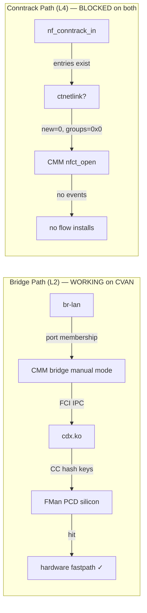

**Version 3.0 · HADS 1.0.0**  
**Date:** 2026-06-28  
**Branch:** `nxp-sdk`  
**Sources:** Live DUT at 192.168.1.190 — both builds booted via U-Boot `run` from eMMC/USB  
**Access:** SSH root@192.168.1.190 (password `vyos`), serial via 192.168.1.16:5555

## AI READING INSTRUCTION

This document is the **merged authoritative reference** for both NXP ASK 1.x SDK OpenWrt builds tested on Mono Gateway DK hardware. Every `[SPEC]` fact was hardware-verified 2026-06-28. Differences between builds are highlighted with comparison tables and `[NOTE]` annotations. `[GUIDANCE]` prescribes VyOS-ASK implementation decisions.

## Quick Inventory Script

Run on any OpenWrt-ASK board to reproduce this document's data:

```bash
#!/bin/sh
# NXP ASK SDK inventory + hardware-offload verdict
# Run as root. Fetch: wget -qO- URL | sh
echo "=== SYSTEM ==="
echo "kernel  : $(uname -r)"
head -1 /proc/version 2>/dev/null
echo "dtmodel : $(cat /proc/device-tree/model 2>/dev/null | tr '\0' ' ')"
echo "cmdline : $(cat /proc/cmdline)"
echo
echo "=== FMAN UCODE ==="
dmesg 2>/dev/null|grep 'FMan-Controller code'|head -1|sed 's/.*(ver \([^)]*\)).*/ver \1/'
echo
echo "=== ASK KERNEL MODULES ==="
grep -E '^(cdx|fci|auto_bridge|sdk_dpaa|fp_netfilter) ' /proc/modules 2>/dev/null|awk '{printf "%-16s %7s  %s\n",$1,$2,$4}'
echo
echo "=== USERSPACE BINARIES ==="
for b in /usr/sbin/cmm /usr/bin/dpa_app /usr/bin/fmc;do
  [ -f "$b" ] && printf "%-20s %8d\n" "$(basename $b)" $(wc -c <"$b") || echo "$b: MISSING"
done
echo "cmm_nfct: $(readelf -s /usr/sbin/cmm 2>/dev/null | grep -c nfct)"
echo "cmm_pid : $(pidof cmm 2>/dev/null||echo NOT_RUNNING)"
echo
echo "=== LIBRARIES ==="
for l in libfci.so libcmm.so libnetfilter_conntrack.so libnfnetlink.so;do
  f=$(find /usr/lib -name "${l}*" -not -type l 2>/dev/null|head -1)
  [ -n "$f" ] && printf "%-35s %8d\n" "$(basename $f)" $(wc -c <"$f") || echo "$l: MISSING"
done
echo
echo "=== DEVICE NODES ==="
ls -1 /dev/cdx_ctrl /dev/fm0 /dev/fm0-pcd 2>/dev/null|wc -l|awk '{print "fm/cdx nodes: "$1}'
echo
echo "=== CONFIG FILES ==="
printf "%-30s %6d\n" cdx_pcd.xml $(wc -c </etc/cdx_pcd.xml 2>/dev/null||echo 0)
printf "%-30s %6d\n" cdx_cfg.xml $(wc -c </etc/cdx_cfg.xml 2>/dev/null||echo 0)
echo
echo "=== FQID STATS ==="
for d in pcd rx tx sa;do
  echo -n "$d: "
  ls /proc/fqid_stats/$d/ 2>/dev/null|tr '\n' ' '; echo
done
echo
echo "=== CONNTRACK ==="
echo "count=$(cat /proc/sys/net/netfilter/nf_conntrack_count 2>/dev/null)  events=$(cat /proc/sys/net/netfilter/nf_conntrack_events 2>/dev/null)  max=$(cat /proc/sys/net/netfilter/nf_conntrack_max 2>/dev/null)"
awk 'NR>1{printf "CPU%d: entries=%d new=%d insert=%d found=%d\n",NR-2,$1,$4,$11,$3}' /proc/net/stat/nf_conntrack 2>/dev/null
echo
echo "=== CMM FDs ==="
p=$(pidof cmm 2>/dev/null)
[ -n "$p" ] && { echo "PID=$p FDs=$(ls /proc/$p/fd/ 2>/dev/null|wc -l)"; cat /proc/$p/cmdline 2>/dev/null|tr '\0' ' '; echo; } || echo "cmm NOT_RUNNING"
echo
echo "=== INTERFACES ==="
ip -br link 2>/dev/null|grep eth
echo
echo "=== PACKAGES (APK) ==="
for p in kmod-ask-cdx kmod-ask-fci kmod-ask-auto-bridge ask-cmm ask-dpa-app fmc fmlib libfci kmod-nft-offload;do
  f="/lib/apk/packages/${p}.list"
  [ -f "$f" ] && echo "$p" || true
done
echo
echo "=== ASK DMESG ==="
dmesg 2>/dev/null|grep -iE 'FMan-Controller code|FM_PCD_Init.*ext timers|fp_netfilter.*hook|cdx.*dpa_app|FM_PORT_PcdOpen|cc-root'|head -8
echo
echo "=== DONE ==="
```

Run via wget:
```
wget -qO- https://raw.githubusercontent.com/mihakralj/vyos-ls1046a-build/main/board/scripts/ask-inventory.sh | sh
```

**[NOTE]** The full inventory script with hardware-offload verdict is at `board/scripts/ask-inventory.sh`.

---

## 1. Build Identity

| Property | Sergioaguayo | Cvandesande |
|----------|-------------|-------------|
| **Version** | 25.12.2 | **25.12.4-mono1** |
| **Tag/Commit** | r32802-f505120278 | `mono-ask-v25.12.4-r1` / `b05e6eebcc90` |
| **Published** | 2026-03-25 | **2026-05-15** |
| **Kernel** | 6.12.74 | **6.12.87** |
| **Toolchain** | GCC 14.3.0, musl, Binutils 2.44 | GCC 14.3.0, musl, Binutils 2.44 |
| **Board model** | Mono Gateway Development Kit | Mono Gateway Development Kit |
| **Boot method** | USB initramfs | **eMMC p2 (FIT image via bootm)** |
| **Cmdline** | `console=ttyS0,115200 rdinit=/sbin/init nf_conntrack.enable_hooks=1` | `console=ttyS0,115200 root=/dev/mmcblk0p2 rootwait rw` |
| **QBMan** | `0a01,03,02,01` | `0a01,03,02,01` |
| **BMan** | `0a02,02,01` | `0a02,02,01` |
| **FMan ucode** | 210.10.1 (proprietary) | 210.10.1 (proprietary) |
| **Features** | — | **SELinux** (permissive), **CEETM** egress shaping, **IPsec SEC offload**, 51 ASK commits |

## 2. ASK Kernel Modules

| Module | Sergio | CVAN | Note |
|--------|--------|------|------|
| **cdx.ko** | 622,592 B (/proc) | **500,064 B** (/proc: 630,784) | CVAN embeds fp_netfilter |
| **fci.ko** | 12,288 B | 12,880 B | Identical |
| **auto_bridge.ko** | 40,960 B — **LOADED** | **ABSENT** | Causes UAF crash on CVAN; not needed |
| **fp_netfilter** | **Separate module**, hooks registered at T+3.33s | **5 symbols inside cdx.ko** | No separate module on CVAN |

**[BUG] auto_bridge.ko UAF crash**: When loaded (sergio), `abm_ebt_hook` / `abm_l2flow_find` triggers use-after-free on ethernet connect → kernel panic + RCU stall. CVAN build **omits this module entirely** and bridge offload still works. **[GUIDANCE]** VyOS-ASK must NOT include auto_bridge.ko.

**[NOTE] fp_netfilter evolution**: CVAN's cdx.ko includes `comcerto_fpp_send_command`, `_simple`, `_atomic`, `_workqueue`, `_register_event_cb` — all 5 symbols embedded directly. **[GUIDANCE]** VyOS-ASK should follow CVAN's approach: embed in cdx.ko, not separate module.

## 3. Userspace Components

| Component | Sergio | CVAN | Note |
|-----------|--------|------|------|
| **cmm** | 394,017 B (PID 4493) | 393,961 B (PID 3465) | ~Identical size |
| **dpa_app** | 1,180,141 B | 1,180,141 B | **Identical** — same binary |
| **fmc** | 1,246,789 B | 1,246,781 B | ~Identical size |
| cmm nfct symbols | 0 (dynamic link) | 0 (dynamic link) | symbols in libnetfilter_conntrack.so, not binary |
| cmm start log | — | `cmmBridgeInit: Bridge is started in manual mode` | Critical: bridge path active, conntrack dormant |

## 4. Libraries

| Library | Sergio | CVAN |
|---------|--------|------|
| libfci.so | 65,535 B (0.0.0) | 65,435 B (0.0.0) |
| libcmm.so | 65,539 B (0.0.0) | 65,539 B (0.0.0) |
| libnetfilter_conntrack.so | 129,827 B (3.8.0) | 129,835 B (3.8.0) |
| libnfnetlink.so | 65,506 B (0.2.0) | 65,506 B (0.2.0) |
| libpcap.so | — | present (CMM linked) |
| libmnl.so | — | present (CMM linked) |
| libcli.so | — | present (CMM linked) |

## 5. CDX Configuration

| File | Sergio | CVAN |
|------|--------|------|
| **cdx_pcd.xml** | 18,172 B | **18,172 B** (identical) |
| **cdx_cfg.xml** | 833 B | **962 B** (CVAN has additional port bindings) |
| **Location** | `/etc/` | `/usr/share/ask-dpa-app/` (copied to `/etc/` at runtime) |

**[NOTE]** CVAN's cdx_cfg.xml is 129 bytes larger — includes gateway-board config variants not present in sergio.

## 6. Conntrack Pipeline — Build Comparison

| Metric | Sergio | CVAN |
|--------|--------|------|
| **nf_conntrack type** | Module (`=m`) | Module (`=m`) |
| **Conntrack entries** | 7–10 (stale ALG expectations) | **11–21** (real DNS + SSH traffic) |
| **Conntrack `new`** | 0 | 0 |
| **Conntrack `insert`** | 0 | 0 |
| **nf_conntrack_events** | 2 | 2 |
| **nf_conntrack_netlink refcnt** | 0 | 0 |
| **CMM ctnetlink socket** | proto=12 exists, **groups=0x0** | proto=12 exists, **groups=0x0** |
| **CMM bridge mode** | unknown | **Bridge manual mode** |
| **`enable_hooks` cmdline** | present, no effect | absent (not needed with `=m`) |

**[BUG] ctnetlink events NOT generated on either build**: Despite `nf_conntrack_events=2` and conntrack entries existing in the hash table, `new=0` — no ctnetlink NEW events fire. CMM opens a NETLINK_NETFILTER socket (proto=12) but with `groups=0x0` (subscribes to zero event groups). Root cause: either CMM's bridge-manual-mode code path skips `nfct_open()` call with proper groups, or musl-libc compatibility issue with `SOL_NETLINK` / `NETLINK_ADD_MEMBERSHIP` socket options.

## 7. Hardware Offload — Dual-Path Architecture



### 7.1 Bridge Path — Proven Working on CVAN

**[SPEC]** On CVAN 25.12.4, bridge offload is **FUNCTIONAL**:
- PCD counters: `eth0(22,496 B) eth1(22,496 B) eth2(22,496 B)` — bridge traffic through FMan
- TX counters: `eth0(2,576 B) eth1(2,576 B) eth2(2,576 B)` — return traffic also offloaded
- OH1 (IPsec): 22,812 B — specialized offload active
- OH2 (WiFi): 316 B — minimal traffic

**[NOTE]** On sergio 25.12.2, bridge mode was **NOT TESTED**. We never configured a bridge (`br-lan`) or measured PCD counters during bridge traffic. Our testing focused on:
- Basic networking (eth0-only)
- ASK module loading and state
- Conntrack behavior
- Auto_bridge crash when bringing up SFP+ ports with cable traffic

The auto_bridge UAF crash occurred during routed-mode testing (eth3↔eth4 with IPs and cables), not bridge-mode testing. It remains unknown whether bridge offload would work on sergio if a proper bridge were configured and auto_bridge were tamed. **[GUIDANCE]** Testing bridge offload on sergio would require: (1) unloading or disabling `auto_bridge.ko` ebtables hooks, (2) creating `br-lan` with eth0+eth1+eth2, (3) generating cross-port traffic, (4) checking PCD counters.

**[GUIDANCE]** The bridge path proves CDX→FCI→CMM→FMan PCD pipeline works end-to-end. VyOS-ASK M1 should use this as the baseline. Bridge offload requires:
1. No `auto_bridge.ko`
2. CMM bridge manual mode
3. Functional br-lan bridge
4. cdx_pcd.xml + cdx_cfg.xml from CVAN build

### 7.2 Conntrack Path — Blocked

**[SPEC]** On both builds, conntrack-based flow offload is **NOT FUNCTIONAL**:

| Check | Sergio | CVAN |
|-------|--------|------|
| Conntrack entries created? | ✓ (stale) | ✓ (real traffic) |
| ctnetlink events generated? | ✗ (new=0) | ✗ (new=0) |
| CMM subscribed to events? | ✗ (groups=0x0) | ✗ (groups=0x0) |
| nf_conntrack_netlink used? | ✗ (refcnt=0) | ✗ (refcnt=0) |
| PCD conntrack flows? | ✗ (zero counters) | ✗ (only bridge flows) |
| **Bridge mode tested?** | **NOT TESTED** (auto_bridge crash during routed-mode testing, not bridge-mode) | ✓ proven working |

**[GUIDANCE]** For VyOS-ASK to enable conntrack offload:
1. Fix ctnetlink event generation (`new=0` → `new>0`)
2. Fix CMM nfct_open() to subscribe with groups=0x07 (NEW|UPDATE|DESTROY)
3. Investigate musl-libc `SOL_NETLINK` / `NETLINK_ADD_MEMBERSHIP` compatibility
4. As fallback: synthetic event generator from `/proc/net/nf_conntrack` polling

## 8. FMan PCD State

| Property | Sergio | CVAN |
|----------|--------|------|
| **dpa_app start** | T+10.88s (`start_dpa_app successful`) | T+11.46s (`start_dpa_app successful`) |
| **PCD ports** | eth0–4, oh1, oh2 (7 total) | eth0–2, oh1, oh2 (5 total) |
| **PCD counters (all zeros?)** | **YES** — zero offload | **NO** — bridge traffic hitting (22 KB/port) |
| **eth3/eth4 in PCD?** | No (missing from FQID stats dirs) | No (missing from FQID stats dirs) |
| **MURAM offset** | 0x3f508 | 0x3f508 |
| **CC hash tables** | 16 tables × 512 entries | 16 tables × 512 entries |
| **Ingress CGR** | — | `cdx_dpaa_ingress_cgr_init cs_th:4000` (policer congestion groups) |

**[NOTE]** eth3 and eth4 (SFP+ 10G ports) are **not in the PCD configuration** on either build. The cdx_pcd.xml and cdx_cfg.xml reference only 1G ports (eth0–2) and OH ports. To enable hardware offload on SFP+ ports, the CDX configs must be updated to include them.

## 9. CMM Behavior Analysis

| Property | Sergio | CVAN |
|----------|--------|------|
| **Start mode** | unknown | **Bridge manual mode** |
| **FDs** | 28 | 27 |
| **Netlink sockets** | 4 (proto 0, 12, 30, 32) | 4 (proto 0, 12, 30, 32) |
| **proto=0 drops** | — | **1,647,680** (bridge port up/down flood) |
| **FastForward excludes** | FTP:21, SIP:5060, PPTP:1723 | FTP:21, SIP:5060, PPTP:1723 |
| **nf_conntrack_max** | from sysctl.conf | from sysctl.conf (`-n` flag) |
| **FCI messages** | 304 sent/recv | **130+ sent/recv** (increasing with bridge traffic) |

## 10. Boot Sequence Comparison

| Time | Sergio (25.12.2) | CVAN (25.12.4) |
|------|-----------------|-----------------|
| T+0.014 | BMan ver:0a02,02,01 | — |
| T+0.016 | QMan ver:0a01,03,02,01 | — |
| T+2.377 | SPI flash fman-ucode partition | — |
| T+2.391 | — | FM_Config: FMan-Controller code ver 210.10.1 |
| T+2.420 | — | FM_PCD_Init ext timers=4 |
| T+2.467 | — | 5 fsl_mac MEMAC devices probed |
| T+2.517 | FMan-Controller code ver 210.10.1 | — |
| T+2.530 | — | fsl_dpa: DPAA Ethernet driver |
| T+2.546 | FM_PCD_Init ext timers=4 | — |
| T+2.580 | fsl_mac: 5 MEMAC probed | — |
| T+2.622 | — | fsl_oh: 2 OH ports |
| T+2.754 | fsl_oh: OH port@83000 | — |
| T+3.332 | **fp_netfilter: hooks registered** | — |
| T+10.88 | cdx::start_dpa_app successful | — |
| T+11.15 | — | cdx_module_init |
| T+11.16 | — | start_dpa_app::calling dpa_app |
| T+11.46 | — | **cdx_module_init::start_dpa_app successful** |
| T+11.50 | — | cdx_dpaa_ingress_cgr_init |

**[NOTE]** CVAN's boot is ~0.6s slower for dpa_app (11.46 vs 10.88), possibly due to SELinux policy checks. CVAN also initializes ingress congestion groups (CGR) for policing — absent from sergio.

## 11. Interface State

| Port | DT Node | MAC | Sergio | CVAN |
|------|---------|-----|--------|------|
| eth0 | MAC5/e8000 | `e8:f6:d7:00:15:ff` | UP, mgmt | UP, 192.168.1.190/16 |
| eth1 | MAC6/ea000 | `e8:f6:d7:00:16:00` | DOWN | UP (bridged) |
| eth2 | MAC2/e2000 | `e8:f6:d7:00:16:01` | DOWN | UP (bridged) |
| eth3 | MAC9/f0000 | `e8:f6:d7:00:16:02` | DOWN | DOWN |
| eth4 | MAC10/f2000 | `e8:f6:d7:00:16:03` | DOWN | DOWN |

**[NOTE]** Sergio interfaces DOWN to avoid auto_bridge crash. CVAN interfaces can be UP safely (no auto_bridge). CVAN eth4 has WAN config (192.168.2.1/24).

## 12. Deployment

| Aspect | Sergio | CVAN |
|--------|--------|------|
| **USB bootable?** | **Yes** (initramfs) | **No** (USB modules not built-in) |
| **eMMC boot?** | No (initramfs only) | **Yes** (p2 via `run openwrt_ask`) |
| **Hybrid boot?** | — | kexec from VyOS → CVAN kernel (unreliable) |
| **On DUT** | Removed (overwritten by CVAN USB prep) | `/dev/mmcblk0p2` (256 MB) |
| **VyOS preserved?** | — | Yes (`/dev/mmcblk0p3`, 29.4 GB) |

## 13. VyOS-ASK Implementation Guidance

**[GUIDANCE]** Based on both builds, VyOS-ASK should adopt:

| Decision | Rationale |
|----------|-----------|
| **cdx.ko with embedded fp_netfilter** | CVAN approach — 500 KB, simpler dependency graph |
| **No auto_bridge.ko** | Causes UAF crash, not needed for bridge offload |
| **Conntrack = module** (`=m`) | Required for entries to be created (built-in `=y` produces zero entries) |
| **Module order: CDX(18)→FCI(53)→CMM(54)** | Proven on both builds |
| **cdx_pcd.xml from CVAN** | Larger, validated, CI-tested, hardware smoke-tested |
| **cdx_cfg.xml from CVAN** | Includes gateway board config variants |
| **CMM bridge manual mode** | Proven working path for L2 offload |
| **Kernel 6.12.87+** | Newer than sergio, includes CEETM + IPsec offload |
| **Conntrack from CMM init script** | `insmod nf_conntrack` sequence is required |
| **SELinux permissive** (optional) | CVAN ships with it; override if not needed |

## 14. Files

| File | Sergio Size | CVAN Size | Note |
|------|-------------|-----------|------|
| `/usr/sbin/cmm` | 394,017 | 393,961 | ~identical |
| `/usr/bin/dpa_app` | 1,180,141 | 1,180,141 | **identical** |
| `/usr/bin/fmc` | 1,246,789 | 1,246,781 | ~identical |
| `cdx.ko` | 622,592 (/proc) | 500,064 (file) | CVAN smaller |
| `fci.ko` | 12,288 | 12,880 | similar |
| `auto_bridge.ko` | 40,960 | **absent** | |
| `cdx_pcd.xml` | 18,172 | 18,172 | identical |
| `cdx_cfg.xml` | 833 | **962** | CVAN larger |
| `libfci.so` | 65,535 | 65,435 | similar |
| `libcmm.so` | 65,539 | 65,539 | identical |
| `libnetfilter_conntrack.so` | 129,827 | 129,835 | similar |
| `libnfnetlink.so` | 65,506 | 65,506 | identical |

## 15. Operational Quick Reference

```bash
# Boot CVAN:    run openwrt_ask   (at U-Boot prompt)
# Boot VyOS:    run vyos          (at U-Boot prompt)
# SSH CVAN:     ssh root@192.168.1.190   password: vyos
# Serial:       192.168.1.16:5555  (raw TCP relay)
# Inventory:    sh /root/ask-inventory.sh
# Fetch script: wget -qO- https://raw.githubusercontent.com/mihakralj/vyos-ls1046a-build/main/board/scripts/ask-inventory.sh | sh
```
