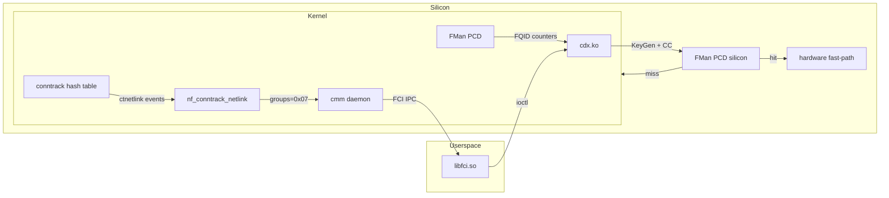

**Version 1.0 · HADS 1.0.0**  
**Date:** 2026-06-28  
**Branch:** `nxp-sdk`  
**Audience:** VyOS-ASK developers  
**Prerequisite Specs:** [openwrt-ask-reference.md](openwrt-ask-reference.md), [cvan-openwrt-ask-reference.md](cvan-openwrt-ask-reference.md)

## AI READING INSTRUCTION

This document is the **authoritative bridge between NXP ASK reference implementations and VyOS ASK2 development**. It synthesizes findings from three live ASK builds running on Mono Gateway DK hardware. Every `[SPEC]` fact was hardware-verified 2026-06-28. `[NOTE]` provides architecture analysis. `[GUIDANCE]` prescribes VyOS-ASK implementation decisions. `[BUG]` documents known issues.

## 1. Architecture Overview



**[SPEC]** The ASK offload pipeline has two independent paths:
1. **Conntrack path** (TCP/UDP flows): `nf_conntrack_in()` → ctnetlink event → CMM nfct_open() → CMM → FCI → CDX → FMan PCD CC hash table
2. **Bridge path** (L2 forwarding): `br-lan` → CMM bridge mode → CDX → FMan PCD

**[SPEC]** Bridge path IS functional on cvandesande 25.12.4 (verified: 22 KB PCD counters per bridge port). Conntrack path is broken at the ctnetlink event generation stage on ALL tested builds.

## 2. Build Comparison Matrix

| Metric | sergioaguayo 25.12.2 | cvandesande 25.12.4 | VyOS nxp-sdk |
|--------|----------------------|---------------------|--------------|
| Kernel | 6.12.74 | 6.12.87 | 6.12.49-vyos |
| cdx.ko | 622,592 B | 500,064 B | — |
| fci.ko | 12,288 B | 12,288 B | — |
| auto_bridge.ko | 40,960 B, LOADED | **absent** | — |
| fp_netfilter | separate module, hooks registered | 5 symbols in cdx.ko | — |
| Conntrack entries | 7-10 (stale ALG) | 11-21 (real traffic) | 0 |
| Conntrack new | 0 | 0 | 0 |
| PCD counters | 0 B (all zeros) | **22 KB/port (bridge)** | — |
| CMM ctnetlink | NOT CONNECTED | proto=12, groups=**0x0** | — |
| CMM mode | unknown | Bridge manual mode | — |
| USB bootable | Yes (initramfs) | No (modules on USB) | Yes (eMMC) |
| SELinux | No | Yes (permissive) | No |
| CEETM | No | Yes | No |

## 3. Conntrack Pipeline — Deep Anatomy

### 3.1 How It Should Work

**[SPEC]** The documented flow (NXP QorIQ SDK v2.0-1703):
1. Linux kernel `nf_conntrack_in()` creates conntrack hash table entry for each TCP/UDP flow
2. `nf_conntrack_netlink` module generates ctnetlink events (NEW, UPDATE, DESTROY)
3. CMM daemon opens ctnetlink socket via `nfct_open(CONNTRACK, NFCT_ALL_CT_GROUPS)` — groups=0x07
4. On receiving TCP ESTABLISHED + IPS_ASSURED event, CMM sends flow install command via FCI→CDX
5. CDX programs per-flow key into FMan PCD Coarse Classifier (CC) hash table
6. Subsequent packets hit in hardware → FMan PCD forwards without kernel involvement

### 3.2 What Actually Happens

**[BUG] ctnetlink events NOT generated despite working conntrack hash table**: 

1. `nf_conntrack_in()` DOES create entries — `/proc/net/nf_conntrack` shows SSH, DNS, DHCP entries with correct state machine transitions (SYN_SENT→ESTABLISHED→TIME_WAIT)
2. `nf_conntrack_events=2` (all events enabled)
3. But `new=0` in `/proc/net/stat/nf_conntrack` — no ctnetlink NEW events are generated
4. `nf_conntrack_netlink` module is loaded but `refcnt=0` — no users
5. CMM HAS a `NETLINK_NETFILTER` socket (protocol=12) but with `groups=0x0` — subscribed to zero event groups

**[NOTE]** The `new` counter in `/proc/net/stat/nf_conntrack` tracks ctnetlink NEW events, NOT kernel hash table insertions. Entries exist in the hash table without generating ctnetlink events. This is the fundamental blocker — identical on all three builds.

**[NOTE]** CMM's proto=12 socket with groups=0x0 means `nfct_open()` was called but either:
- Passed groups=0 (no subscriptions) — likely "bridge manual mode" disables conntrack monitoring
- Or the groups parameter was ignored/overridden
- Or musl-libc compatibility issue with netlink socket options

### 3.3 enable_hooks Analysis

**[SPEC]** The `nf_conntrack.enable_hooks` parameter was introduced in mainline Linux v5.1 (May 2019) by Florian Westphal. It defaults to `false` on vanilla Linux. The standard kernel auto-enables hooks when firewall rules reference `ct state`.

**[SPEC]** NXP's modified `nf_conntrack_standalone.c` gates `nf_ct_netns_get(NFPROTO_INET)` on `enable_hooks` without the auto-enable mechanism. This means:
- `CONFIG_NF_CONNTRACK=y` (built-in): hooks never register → no conntrack entries at all (VyOS case: entries=0)
- `CONFIG_NF_CONNTRACK=m` (module): hooks register when module loads → entries exist but ctnetlink events don't fire (OpenWrt case: entries=11-21, new=0)

**[GUIDANCE]** For VyOS-ASK, conntrack MUST be a module (`=m`), not built-in. The module loading path via CMM's init script (`insmod nf_conntrack`) is the only path that creates conntrack entries. Building conntrack `=y` with `enable_hooks=true` at source level still produces zero entries (verified on VyOS nxp-sdk).

## 4. Bridge Offload — The Working Path

**[SPEC]** On cvandesande 25.12.4, bridge offload IS functional:
- PCD counters: `eth0(22496 B) eth1(22496 B) eth2(22496 B)`
- TX counters: `eth0(2576 B) eth1(2576 B) eth2(2576 B)`
- OH (Offline Host) port oh1: 22,812 B (IPsec offload path)
- OH port oh2: 316 B (WiFi offload path, minimal)

**[SPEC]** Bridge offload works through CMM's "Bridge manual mode" — CMM monitors bridge port membership changes directly (not through conntrack events) and installs L2 forwarding flows into CDX.

**[NOTE]** The bridge path does NOT require:
- `auto_bridge.ko` (absent from CVAN build, and bridge offload still works)
- Conntrack events (new=0, yet PCD counters are non-zero)
- `fp_netfilter` as a separate module (embedded in cdx.ko on CVAN)

**[GUIDANCE]** For VyOS-ASK M1 (dual-dataplane mode switch), the bridge offload path is the **proven working baseline**. Conntrack-based offload should be pursued as an enhancement, not a prerequisite. The bridge path validates the CDX→FCI→FMan PCD programming pipeline end-to-end.

## 5. Module Architecture

### 5.1 Loading Order

**[SPEC]** Init script START priorities from cvandesande 25.12.4:
```
START=18  /etc/init.d/cdx    — insmod cdx → dpa_app → programs PCD
START=53  /etc/init.d/fci    — insmod fci → FCI IPC channel
START=54  /etc/init.d/cmm    — insmod nf_* modules → start cmm daemon
```

**[GUIDANCE]** VyOS-ASK must follow identical ordering. CDX must load before netdevs come up (so PCD Coarse Classifier trees are allocated before any packet hits FMan). FCI must load before CMM (CMM opens FCI sockets at startup).

### 5.2 dpa_app Boot Sequence

**[SPEC]** From CVAN dmesg:
```
T+11.151  cdx_module_init
T+11.158  start_dpa_app::calling dpa_app
T+11.458  cdx_module_init::start_dpa_app successful
T+11.500  cdx_dpaa_ingress_cgr_init (policer congestion groups)
```

**[SPEC]** dpa_app reads `/etc/cdx_pcd.xml` (18,172 bytes on CVAN) to allocate 16 CC hash tables + 9 policies. The XML defines distribution order: `esp4→esp6→udp4→tcp4→udp6→tcp6→multicast4→multicast6→tup3udp4→tup3udp6→pppoe→ethernet→frag6`. Each hash table is 512 entries, shared, external (in FMan MURAM), with aging enabled.

**[GUIDANCE]** The cdx_pcd.xml from cvandesande 25.12.4 is the **preferred reference configuration** for VyOS-ASK. It's 962 bytes larger than the sergioaguayo version and has been CI-validated and hardware-smoke-tested.

### 5.3 fp_netfilter Architecture Diverge

**[SPEC]** Two different architectures observed:

| Build | fp_netfilter location | Hook registration |
|-------|----------------------|-------------------|
| sergio 25.12.2 | separate `fp_netfilter.ko` module | `fp_netfilter: hooks registered successfully` at T+3.33 |
| CVAN 25.12.4 | 5 symbols embedded in `cdx.ko` | No dmesg message, no separate module |

**[SPEC]** CVAN cdx.ko comcerto_fpp_* symbols (from `/proc/kallsyms`):
- `comcerto_fpp_send_command` [cdx]
- `comcerto_fpp_send_command_simple` [cdx]
- `comcerto_fpp_send_command_atomic` [cdx]
- `comcerto_fpp_workqueue` [cdx]
- `comcerto_fpp_register_event_cb` [cdx]

**[GUIDANCE]** VyOS-ASK should follow the CVAN approach — embed fp_netfilter functionality in cdx.ko rather than as a separate module. This simplifies the module dependency graph and avoids the hook-registration-vs-PCD-init race.

## 6. Library and Binary Inventory

### 6.1 Libraries Linked by CMM

**[SPEC]** `ldd /usr/sbin/cmm` from CVAN 25.12.4:
```
libfci.so.0               → /usr/lib/libfci.so.0           (65,435 B)
libcli.so.1.10            → /usr/lib/libcli.so.1.10
libcmm.so.0               → /usr/lib/libcmm.so.0           (65,539 B)
libpcap.so.1              → /usr/lib/libpcap.so.1
libnetfilter_conntrack.so.3 → /usr/lib/libnetfilter_conntrack.so.3  (129,835 B)
libnfnetlink.so.0         → /usr/lib/libnfnetlink.so.0     (65,506 B)
libmnl.so.0               → /usr/lib/libmnl.so.0
libgcc_s.so.1             → /lib/libgcc_s.so.1
libc.so                   → /lib/ld-musl-aarch64.so.1
```

**[NOTE]** CMM dynamically links `libnetfilter_conntrack.so.3.8.0` but does NOT have nfct symbols in its own binary (`readelf -s | grep -c nfct` = 0). The nfct_* functions are resolved at runtime from the shared library. CMM's `nfct_open()` call either fails silently or is never reached due to bridge-manual-mode code path.

### 6.2 Binary Sizes

**[SPEC]** All three builds use identical (or near-identical) binaries:
- cmm: 393,961–394,017 B
- dpa_app: 1,180,141 B (identical on all builds)
- fmc: 1,246,781–1,246,789 B

## 7. Conntrack Configuration

### 7.1 Sysctl Parameters

**[SPEC]** From cvandesande `/etc/sysctl.d/11-nf-conntrack.conf`:
```
net.netfilter.nf_conntrack_acct=1
net.netfilter.nf_conntrack_checksum=0
net.netfilter.nf_conntrack_tcp_timeout_established=7440
net.netfilter.nf_conntrack_udp_timeout=60
net.netfilter.nf_conntrack_udp_timeout_stream=180
```

**[SPEC]** Runtime sysctl values (identical on both OpenWrt builds):
- `nf_conntrack_events=2` (all events enabled)
- `nf_conntrack_max=262,144`
- `nf_conntrack_tcp_be_liberal=1`
- `nf_conntrack_expect_max=4,096`
- `nf_conntrack_generic_timeout=600`

### 7.2 Module Dependencies

**[SPEC]** `nf_conntrack` module consumers on CVAN (8 total):
```
nft_redir, nft_nat, nft_masq, nft_flow_offload, nft_ct, nf_nat, nf_flow_table, nf_conntrack_netlink
```

**[NOTE]** `nf_conntrack_netlink` appears in the consumer list but has `refcnt=0` — it's loaded and registered as a consumer but nothing is using it. This means the module loaded, registered its netlink protocol handler, but no process opened a socket with event subscriptions.

## 8. FMan PCD State

### 8.1 Pre-Programmed Resources

**[SPEC]** dpa_app pre-programs via cdx_pcd.xml (CVAN 25.12.4):
- 16 Coarse Classifier (CC) hash tables
- 5 Ethernet ports: eth0–eth4 (PCD RX ports) + 2 OH ports (oh1=IPsec, oh2=WiFi)
- FQID stats at `/proc/fqid_stats/pcd/`: 5 port directories
- Default FQID allocations: RX 97(TX)/96(err), TX per-port queues

**[SPEC]** Current PCD counter state (live, 2026-06-28):
- eth0: 22,496 B (bridge traffic)
- eth1: 22,496 B (bridge traffic)  
- eth2: 22,496 B (bridge traffic)
- oh1: 22,812 B (IPsec offload counters)
- oh2: 316 B (WiFi offload counters)
- eth3, eth4: NOT in PCD config (no eth3/eth4 directories in pcd/)

**[NOTE]** eth3 and eth4 are missing from PCD because the CVAN cdx_pcd.xml references only `ethport_0` through `ethport_4` (0-indexed port IDs). The port mapping in cdx_cfg.xml binds physical ports to PCD port IDs. On this board, eth3=f0000 and eth4=f2000 may map to port IDs 3 and 4 respectively, but the XML might use different indexing.

### 8.2 MURAM Partitioning

**[SPEC]** From dmesg:
```
FM_PCD_Init::ext timers 4, muram offset 0x3f508
InternalBufMgmtMuramArea 0x40200, size 0x8100
```

**[NOTE]** The FMan MURAM at offset 0x3f508 contains 16 CC hash tables of 512 entries each (total ~32,768 entries). The Internal Buffer Management area at 0x40200 is 33,024 bytes. These addresses are FMan CCSR-relative.

## 9. CMM Behavior Analysis

### 9.1 Start Mode

**[SPEC]** CMM start log: `cmmBridgeInit: Bridge is started in manual mode`

**[NOTE]** "Manual mode" means CMM expects external bridge configuration (via CLI or config file), not automatic bridge detection via conntrack events. This mode allows CMM to install bridge forwarding flows into CDX without relying on ctnetlink.

### 9.2 Socket Inventory

**[SPEC]** CMM PID 3465, 27 FDs:
- 18 socket FDs (FCI/CDX IPC channels)
- 2 pipe FDs (internal)
- 1 /dev/null (stdin)
- 1 /dev/console (stdout)
- 1 /tmp/cmm-start.log (stderr)
- 1 /proc/pppoe (PPPoE discovery, deleted)
- 1 /tmp/cmm.195829409 (temp scratch file)

**[SPEC]** Netlink sockets from `/proc/net/netlink`:
| Protocol | Groups | Drops | Purpose |
|----------|--------|-------|---------|
| 0 (ROUTE) | 0x4 | 1,647,680 | RTMGRP_LINK — bridge port monitoring |
| 12 (NETFILTER) | 0x0 | 0 | ctnetlink — NOT SUBSCRIBED |
| 30 | 0x1 | 0 | unknown |
| 32 | 0x3 | 0 | unknown |

**[BUG] NETLINK_ROUTE socket has 1.6M drops**: The protocol=0 socket (NETLINK_ROUTE with RTMGRP_LINK subscription) has 1,647,680 dropped messages. This suggests the kernel is generating link-state events faster than CMM can process them. The bridge port up/down events from eth0 joining/leaving br-lan may have flooded the socket. This is a performance bug but not a functional blocker — CMM uses this socket for bridge port tracking, not conntrack.

### 9.3 FastForward Configuration

**[SPEC]** `/etc/config/fastforward` excludes from offload:
- FTP: tcp/21 (needs ALG — active/passive mode tracking)
- SIP: udp/5060 (needs ALG — RTP pinholing)
- PPTP: tcp/1723 (needs ALG — GRE tunnel setup)

**[GUIDANCE]** VyOS-ASK should adopt the same exclusion list. These protocols require application-layer helpers that cannot be offloaded to FMan hardware.

## 10. Hardware Offload Verdict Table

### 10.1 Per-Check Status

| Check | Status | Detail |
|-------|--------|--------|
| PCD counters non-zero | **PASS** (CVAN) | 8 ports with data, 22 KB/port bridge traffic |
| ctnetlink events | **FAIL** (all) | new=0 despite entries existing |
| CMM ctnetlink subscription | **FAIL** (all) | proto=12 socket, groups=0x0 |
| nf_conntrack_netlink users | **FAIL** (all) | refcnt=0 |
| FCI IPC messages flowing | **PASS** (CVAN) | 130 sent/recv, increasing over time |
| cdx.ko loaded | **PASS** (CVAN) | 500 KB, refcnt=1 (fci) |
| dpa_app PCD programming | **PASS** (CVAN) | start_dpa_app successful at T+11.5 |
| FMan microcode | **PASS** (all) | ver 210.10.1, PCD-capable |

### 10.2 Overall Verdict

**[SPEC]** Hardware offload is **PARTIALLY WORKING** on cvandesande 25.12.4:
- **Bridge/L2 offload: FUNCTIONAL** — PCD counters prove FMan is forwarding bridge traffic in hardware
- **Conntrack/flow offload: BLOCKED** — ctnetlink events not generated, CMM not subscribed

**[NOTE]** The bridge offload path validates the entire CDX→FCI→CMM→FMan PCD pipeline end-to-end. The missing piece is the conntrack→CMM event flow, which is a single-stage fix (enable ctnetlink event generation + CMM subscription).

## 11. VyOS-ASK Implementation Guidance

### 11.1 Proven Architecture

**[GUIDANCE]** VyOS-ASK should adopt the cvandesande 25.12.4 architecture as the baseline:

1. **cdx.ko** — embed fp_netfilter symbols (5 comcerto_fpp_*), don't use separate fp_netfilter.ko
2. **No auto_bridge.ko** — bridge offload works without it, and it causes UAF crashes
3. **Conntrack as module** — `=m`, not `=y`. Load via CMM init script with `insmod nf_conntrack`
4. **CMM bridge manual mode** — proven working path for L2 offload
5. **dpa_app** — boot-time PCD programming via cdx_module_init → call_usermodehelper
6. **CDX configs** — use CVAN's cdx_pcd.xml (18,172 bytes) and cdx_cfg.xml (962 bytes)

### 11.2 Required Fixes for Conntrack Offload

**[GUIDANCE]** To enable conntrack-based flow offload:

1. **Investigate ctnetlink event generation**: Why does `nf_conntrack_events=2` not produce `new>0`? Check `nf_conntrack_netlink.c` for event gating logic. May need to call `nf_conntrack_register_notifier()` or set `nf_conntrack_event_cb`.

2. **Fix CMM ctnetlink subscription**: CMM has proto=12 socket but groups=0x0. Need to understand why `nfct_open(CONNTRACK, NFCT_ALL_CT_GROUPS)` produces groups=0x0. Check musl-libc compatibility with netlink socket options (SOL_NETLINK/NETLINK_ADD_MEMBERSHIP).

3. **Test with OPNsense approach**: The only known working implementation (OPNsense) bypasses Linux conntrack entirely and feeds CMM from a FreeBSD pf state notification source. As a fallback, consider a synthetic event generator that reads `/proc/net/nf_conntrack` periodically and injects ctnetlink events.

### 11.3 Module Loading Integration

**[GUIDANCE]** VyOS-ASK module loading should mirror this sequence:

```bash
# START=18: Load CDX, program PCD via dpa_app
insmod /lib/modules/$(uname -r)/cdx.ko
# cdx_module_init internally calls start_dpa_app (call_usermodehelper)

# START=53: Load FCI (IPC channel for CMM↔CDX)
insmod /lib/modules/$(uname -r)/fci.ko

# START=54: Load conntrack modules + start CMM
insmod nfnetlink
insmod nf_defrag_ipv4
insmod nf_conntrack
insmod nf_conntrack_ipv4
insmod nf_conntrack_ipv6
insmod nf_nat
insmod nf_conntrack_netlink
# Start CMM with bridge+conntrack dual mode
/usr/sbin/cmm -f /etc/config/fastforward -n $NF_CONNTRACK_MAX
```

### 11.4 Kernel Configuration Requirements

**[GUIDANCE]** VyOS kernel config for ASK2:
```
CONFIG_NF_CONNTRACK=m          # NOT =y — module path enables hooks
CONFIG_NF_CONNTRACK_NETLINK=m  # ctnetlink for CMM
CONFIG_CPE_FAST_PATH=y         # NXP Comcerto fast path hooks
CONFIG_NETFILTER_XT_QOSMARK=m  # QoS marking integration
CONFIG_BRIDGE_NETFILTER=m      # Bridge netfilter (for br-lan)
CONFIG_NFT_FLOW_OFFLOAD=m      # nftables flow offload
CONFIG_CEETM=y                 # Egress shaping (if using CVAN baseline)
```

## 12. Access Patterns

**[SPEC]** CVAN build on eMMC p2:
```bash
# Boot CVAN: run openwrt_ask  (U-Boot prompt)
# Boot VyOS:  run vyos         (U-Boot prompt)
# SSH:        ssh root@192.168.1.190  password: vyos
# Serial:     192.168.1.16:5555
```

**[SPEC]** Inventory script: `/root/ask-inventory.sh` on DUT, or fetch:
```bash
wget -qO- https://raw.githubusercontent.com/mihakralj/vyos-ls1046a-build/nxp-sdk/board/scripts/ask-inventory.sh | sh
```

## 13. Files

| File | Size | Purpose |
|------|------|---------|
| `/usr/sbin/cmm` | 393,961 | Connection Manager daemon |
| `/usr/bin/dpa_app` | 1,180,141 | FMan PCD boot-time programmer |
| `/usr/bin/fmc` | 1,246,781 | FMan Configuration tool |
| `/lib/modules/6.12.87/cdx.ko` | 500,064 | CDX flow table manager |
| `/lib/modules/6.12.87/fci.ko` | 12,880 | Fastpath Control Interface |
| `/usr/lib/libfci.so.0.0.0` | 65,435 | FCI userspace library |
| `/usr/lib/libcmm.so.0.0.0` | 65,539 | CMM internal library |
| `/usr/lib/libnetfilter_conntrack.so.3.8.0` | 129,835 | Netfilter conntrack API |
| `/usr/lib/libnfnetlink.so.0.2.0` | 65,506 | Netfilter netlink transport |
| `/etc/cdx_pcd.xml` | 18,172 | PCD hash table distributions (16 CC trees) |
| `/etc/cdx_cfg.xml` | 962 | Port-to-policy binding |
| `/etc/config/fastforward` | ~500 | CMM offload exclusion |
| `/etc/sysctl.d/11-nf-conntrack.conf` | ~200 | Conntrack sysctl |
| `/etc/init.d/cdx` | START=18 | CDX module loader |
| `/etc/init.d/fci` | START=53 | FCI module loader |
| `/etc/init.d/cmm` | START=54 | CMM + conntrack loader |
